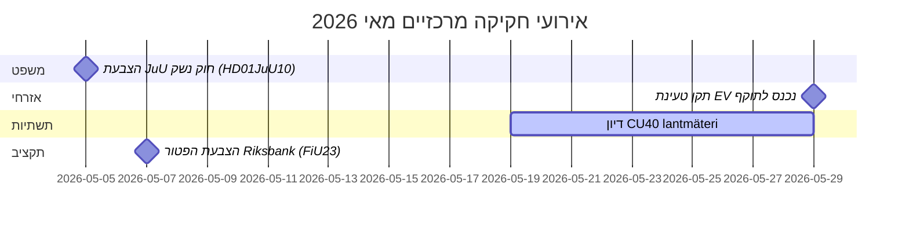

# מאי 2026 – סקירה חודשית של הריקסדאג השוודי: ביטחון, משפט ותשתיות במוקד

**מחבר**: James Pether Sörling  
**תאריך**: 2026-04-27  
**סיווג**: לא מסווג // ציבורי  
**ביטחון**: גבוה [B2]  
**עומק ניתוח**: סטנדרטי (Tier-C Month-Ahead)

## 🎯 תקציר מנהלים

הריקסדאג השוודי נכנס למאי 2026 עם סדר יום חקיקתי שהוא שולט בהרחבת מערכת המשפט הפלילי, מחלוקות השקעה בתשתיות ולחץ לרפורמות ביטוח סוציאלי. ממשלת קריסטרסון עומדת בו-זמנית בפני לחצים מהשאילתות הסוציאל-דמוקרטיות על פערי השקעה ברכבת ורפורמת דמי המחלה, בעוד מספר דוחות ועדות בנושא חקיקה פלילית, רגולציית נשק וקיבולת בתי-סוהר מתקרבים להצבעות סופיות בריקסדאג. הממד הגיאו-פוליטי הביטחוני מתגבר עם חקיקת אחריות אוקראינית והצעות מדיניות חוץ הקשורות לרוסיה.

## 🧭 החלטות שהסיקור הזה תומך בהן

1. **מעקב אחר הצבעת JuU על חוק הנשק** (HD01JuU10): חוק הנשק החדש (vapenlag) נכנס לתוקף ב-1 ביוני 2026 — צרכני מודיעין העוקבים אחר חקיקת ענף הביטחון צריכים לנטר את לוח הזמנים של ההצבעה הסופית ושינויים אפשריים ברגע האחרון (ביטחון: גבוה [A2]).

2. **ניטור רפורמת SfU להגירת חוקרים** (HD01SfU23): כללים לחוקרים זרים ולדוקטורנטים נכנסים לתוקף ב-11 ביוני 2026 ומשפיעים על תחרותיות שוק העבודה בחדשנות — רלוונטי לגורמים בהשכלה גבוהה ו-R&D (ביטחון: גבוה [A2]).

3. **הערכת אותות פערי השקעה בתשתיות**: השאילתה HD10449 בנושא Södra stambanan חושפת מתח מבני בין תוכנית תשתיות התחבורה של הממשלה ובין סדרי עדיפויות פיתוח אזוריים — מדדים לחיכוך קואליציוני אפשרי עם KD (ביטחון: בינוני [B2]).

## ⚡ דוח מצב ב-60 שניות

- **משפט פלילי**: חוק נשק חדש (HD01JuU10, JuU), בנייה מואצת של בתי-סוהר (HD01CU25, CU), כללים מחמירים לעבריינים צעירים (HD03246) — הנרטיב הביטחוני של הממשלה שולט במאי.
- **ביטוח מחלה**: השאילתות של S על פטור יום 180 בביטוח המחלה (HD10450) מסמנות מיצוב טרום-בחירות על מדינת הרווחה; תגובת שר Anna Tenje (M) צפויה.
- **תשתיות**: המסלול הכפול של Södra stambanan בין Alvesta לVäxjö נעדר מהתוכנית הלאומית לתשתיות — S מפעיל לחץ על Andreas Carlson (KD) להתחייב; רגישות קואליציונית אזורית.
- **ענייני חוץ/ביטחון**: הצעה להגבלת ויזות רוסיות (HD11753), ביטול זכויות מעבר (HD11752), אשרור בית-הדין לפשעי מלחמה באוקראינה (HD03231/232) — הקונצנזוס הפרלמנטרי הביטחוני מוחזק אך S לוחץ לעמדות נחרצות יותר.
- **אנרגיה**: הצעה בנושא עמודי קווי חשמל (עמודי עץ), דיון על מידע מוטעה בנושא אנרגיית רוח (HD10448, SD) — מעבר האנרגיה הופך לשדה קרב תרבותי לקראת בחירות 2026.

## 🏛️ אירועי חקיקה מרכזיים: מאי 2026

## 🔭 מניע מרכזי לעתיד

**אשכול הצבעות שיפוטיות (מאי 2026)**: שילוב HD01JuU10 (חוק נשק), HD01JuU31 (הערכת רפורמת משטרה), HD01CU25 (בנייה בתי-סוהר) ו-HD03237 (הצעת הכשרת משטרה בתשלום) יוצר רגע חקיקתי ממוקד לענף השיפוטי שיבחן את ההיישור בין הממשלה ל-SD ויעניק ל-S נראות אופוזיציה מירבית. לעקוב: תיקוני SD, הצעות-נגד של S, מסגור תקשורתי סביב שיעורי פשיעה.

## הערכת ביטחון

ביטחון אנליטי כולל: **גבוה** — מבוסס על מסמכים פרלמנטריים מאומתים על בסיס MCP ו-betänkanden עדכניים. נתוני IMF הכלכליים לא זמינים בריצה זו (שגיאת רשת); ההקשר הכלכלי שאוב מ-WEO אפריל 2026 הקודם (NGDP_RPCH: SWE ~2.1%).

<!-- source-sha: 0d5ca67103600cd49fb8373d7e028558be2d04d5 -->
