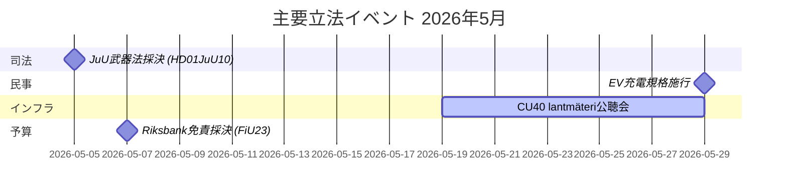

# 2026年5月 スウェーデン議会月間展望：安全保障、司法、インフラが焦点に

**著者**: James Pether Sörling  
**日付**: 2026-04-27  
**分類**: 非機密 // 公開  
**信頼度**: 高 [B2]  
**分析深度**: 標準 (Tier-C Month-Ahead)

## 🎯 要旨

スウェーデン議会（Riksdag）は2026年5月を迎え、刑事司法制度の拡充、インフラ投資をめぐる対立、社会保険改革への圧力が立法課題を支配している。クリステション政権は同時に、鉄道投資ギャップと疾病保険改革に関する社会民主党の質問主意書（interpellation）から圧力を受けており、刑事立法・武器規制・刑務所収容力に関する複数の委員会報告が議会最終採決に近づいている。ウクライナ責任立法とロシア関連外交政策動議により、地政学的安全保障の側面が強まっている。

## 🧭 このブリーフィングが支援する意思決定

1. **JuUの武器法採決を追跡する**（HD01JuU10）：新たなvapenlagは2026年6月1日に施行される——安全保障セクター立法を追う情報消費者は最終採決のスケジュールと土壇場の修正案を監視する必要がある（信頼度：高 [A2]）。

2. **SfUの研究者移民改革を監視する**（HD01SfU23）：外国人研究者・博士課程生向けの規則が2026年6月11日に発効し、イノベーション労働市場の競争力に影響する——高等教育・研究開発関係者に関連（信頼度：高 [A2]）。

3. **インフラ投資ギャップのシグナルを評価する**：HD10449 Södra stambanan質問主意書は政府の交通インフラ計画と地域開発優先事項の間の構造的緊張を明らかにしている——KDとの連立内摩擦の可能性の指標（信頼度：中 [B2]）。

## ⚡ 60秒状況報告

- **刑事司法**：新武器法（HD01JuU10、JuU）、刑務所建設加速（HD01CU25、CU）、若年犯罪者に対する厳格化規則（HD03246）——政府の安全保障ナレーティブが5月は支配的。
- **疾病保険**：疾病保険180日目例外に関するSの質問主意書（HD10450）は、福祉国家をめぐる選挙前の布石を示す；Anna Tenje大臣（M）の回答が待たれる。
- **インフラ**：Södra stambanan Alvesta–Växjö間の複線化が国家インフラ計画に欠如——SはAndreas Carlson大臣（KD）にコミットメントを求めて圧力；地域連立感応度。
- **外交・安全保障**：ロシアビザ制限動議（HD11753）、上空飛行取消（HD11752）、ウクライナ戦争犯罪法廷批准（HD03231/232）——議会安全保障コンセンサスは維持されているがSはより強い立場を求めて圧力。
- **エネルギー**：送電線柱（木製柱）に関する動議、風力エネルギー偽情報議論（HD10448、SD）——エネルギー転換が2026年選挙前の文化戦争の場となっている。

## 🏛️ 主要立法イベント：2026年5月

## 🔭 主要な将来トリガー

**司法採決クラスター（2026年5月）**：HD01JuU10（武器法）、HD01JuU31（警察改革評価）、HD01CU25（刑務所建設）、HD03237（有給警察訓練提案）の組み合わせが司法セクターにとって集中した立法的瞬間を生み出し、政府とSDの連携をテストし、Sに最大限の野党露出を与える。注目点：SDの修正案、Sの対抗動議、犯罪率をめぐるメディアの組み立て方。

## 信頼度評価

総合分析信頼度：**高**——MCP準拠の確認済み議会文書と最近のbetänkandenに基づく。IMF経済データはこの実行では利用不可（ネットワークエラー）；経済的文脈は前回のWEO2026年4月ビンテージから取得（NGDP_RPCH：SWE ~2.1%）。

<!-- source-sha: 0d5ca67103600cd49fb8373d7e028558be2d04d5 -->
