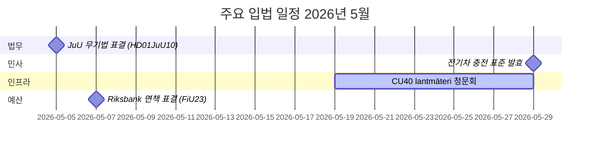

# 2026년 5월 스웨덴 의회 월간 전망: 안보, 법무, 인프라가 핵심 의제

**저자**: James Pether Sörling  
**날짜**: 2026-04-27  
**분류**: 비기밀 // 공개  
**신뢰도**: 높음 [B2]  
**분석 심도**: 표준 (Tier-C Month-Ahead)

## 🎯 핵심 요약

스웨덴 의회(Riksdag)는 2026년 5월에 형사사법제도 확대, 인프라 투자 갈등, 사회보험 개혁 압박이 입법 의제를 지배하는 가운데 들어선다. 크리스터손 정부는 동시에 철도 투자 격차와 병가 보험 개혁에 관한 사회민주당의 서면 질의(interpellation) 압박을 받고 있으며, 형사 입법, 무기 규제, 교도소 수용 능력에 관한 여러 위원회 보고서가 의회 최종 표결에 가까워지고 있다. 우크라이나 책임법과 러시아 관련 외교정책 동의안으로 지정학적 안보 차원이 심화되고 있다.

## 🧭 이 브리핑이 지원하는 결정

1. **JuU 무기법 표결 추적** (HD01JuU10): 새로운 vapenlag는 2026년 6월 1일에 발효된다 — 안보 분야 입법을 추적하는 정보 소비자들은 최종 표결 일정과 마지막 순간의 수정안을 모니터링해야 한다(신뢰도: 높음 [A2]).

2. **SfU 연구자 이민 개혁 모니터링** (HD01SfU23): 외국인 연구자 및 박사과정 학생 규정이 2026년 6월 11일에 발효되어 혁신 노동시장 경쟁력에 영향을 미친다 — 고등교육 및 R&D 관계자들과 관련(신뢰도: 높음 [A2]).

3. **인프라 투자 격차 신호 평가**: HD10449 Södra stambanan 질의서는 정부 교통 인프라 계획과 지역 발전 우선순위 간의 구조적 긴장을 드러낸다 — KD와의 연립 내 마찰 가능성 지표(신뢰도: 중간 [B2]).

## ⚡ 60초 상황 보고

- **형사사법**: 새 무기법(HD01JuU10, JuU), 교도소 건설 가속(HD01CU25, CU), 청소년 범죄자 규정 강화(HD03246) — 정부의 안보 서사가 5월을 주도.
- **병가 보험**: 병가 보험 180일 예외에 관한 S의 질의서(HD10450)는 복지국가를 둘러싼 선거 전 포지셔닝을 신호한다; Anna Tenje 장관(M)의 답변 예상.
- **인프라**: Södra stambanan Alvesta–Växjö 복선화가 국가 인프라 계획에서 누락 — S가 Andreas Carlson 장관(KD)에게 약속을 촉구; 지역 연립 민감성.
- **외교/안보**: 러시아 비자 제한 동의안(HD11753), 영공 통과권 취소(HD11752), 우크라이나 전쟁범죄 재판소 비준(HD03231/232) — 의회 안보 컨센서스 유지 중이나 S는 더 강한 입장 요구.
- **에너지**: 전선 기둥(목재 기둥) 동의안, 풍력에너지 허위정보 논쟁(HD10448, SD) — 에너지 전환이 2026년 선거를 앞두고 문화전쟁터로 변화.

## 🏛️ 주요 입법 일정: 2026년 5월

## 🔭 주요 미래 촉발 요인

**사법 표결 클러스터 (2026년 5월)**: HD01JuU10(무기법), HD01JuU31(경찰 개혁 평가), HD01CU25(교도소 건설), HD03237(유급 경찰 훈련 제안)의 조합이 사법 분야에 집중된 입법적 순간을 만들어 정부-SD 연합을 테스트하고 S에게 최대한의 야당 가시성을 제공한다. 주목 사항: SD 수정안, S 반대 동의안, 범죄율을 둘러싼 언론 프레이밍.

## 신뢰도 평가

전반적 분석 신뢰도: **높음** — MCP 기반 확인된 의회 문서 및 최근 betänkanden에 근거. IMF 경제 데이터는 이번 실행에서 사용 불가(네트워크 오류); 경제 맥락은 이전 WEO 2026년 4월 빈티지에서 추출(NGDP_RPCH: SWE ~2.1%).

<!-- source-sha: 0d5ca67103600cd49fb8373d7e028558be2d04d5 -->
