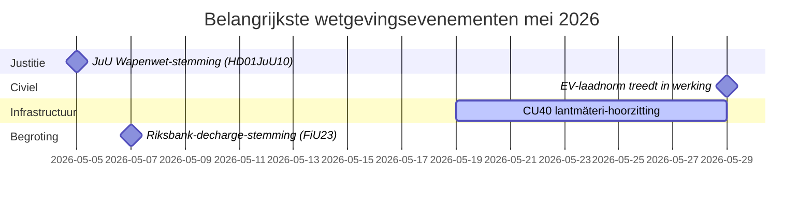

# Mei 2026 – Maandelijks overzicht van het Zweedse Riksdag: Veiligheid, justitie en infrastructuur op de voorgrond

**Author**: James Pether Sörling  
**Date**: 2026-04-27  
**Classification**: UNCLASSIFIED // PUBLIC  
**Confidence**: HIGH [B2]  
**Analysis Depth**: Standard (Tier-C Month-Ahead)

## 🎯 BLUF

Zweden's Riksdag treedt mei 2026 in met een wetgevingsagenda gedomineerd door uitbreiding van het strafrechtssysteem, investeringsconflicten in infrastructuur en druk op sociale verzekeringshervormen. De regering-Kristersson staat tegelijkertijd onder druk van interpellaties van de sociaaldemocraten over spoorweginvesteringstekorten en hervorming van het ziektegeld, terwijl meerdere commissierapporten over strafwetgeving, wapenregulering en gevangeniscapaciteit op weg zijn naar definitieve Riksdag-stemmingen. De beveiligingsgeopolitische dimensie intensiveert met Oekraïense verantwoordingswetgeving en Rusland-gerelateerde buitenlandse beleidsmotions.

## 🧭 Beslissingen die dit briefing ondersteunt

1. **JuU-stemming over de Wapenwet bijhouden** (HD01JuU10): De nieuwe vapenlag treedt op 1 juni 2026 in werking — inlichtingenconsumenten die veiligheidssectorwetgeving volgen, moeten het tijdstip van de definitieve stemming en eventuele wijzigingen in de laatste minuten monitoren (betrouwbaarheid: HOOG [A2]).

2. **SfU-migratiehervormingen voor onderzoekers monitoren** (HD01SfU23): Regels voor buitenlandse onderzoekers en promovendi treden in werking op 11 juni 2026 en beïnvloeden de concurrentiekracht van de innovatiearbeidsmarkt — relevant voor actoren in hoger onderwijs en O&O (betrouwbaarheid: HOOG [A2]).

3. **Infrastructuurinvesteringstekortssignalen beoordelen**: De HD10449-interpellatie over Södra stambanan onthult een structurele spanning tussen het transportinfrastructuurplan van de regering en regionale ontwikkelingsprioriteiten — indicatoren voor potentiële coalitiewrijving met KD (betrouwbaarheid: MIDDEL [B2]).

## ⚡ 60-secondensituatierapport

- **Strafrecht**: Nieuwe wapenwet (HD01JuU10, JuU), versnelde gevangenisbouw (HD01CU25, CU), aangescherpte regels voor jonge overtreders (HD03246) — het veiligheidsverhaal van de regering domineert in mei.
- **Ziekteverzekering**: De S-interpellaties over de dag-180-uitzondering van de ziekteverzekering (HD10450) signaleren pre-electorale positionering over de verzorgingsstaat; ministerieel antwoord van Anna Tenje (M) verwacht.
- **Infrastructuur**: Södra stambanans dubbelspoor Alvesta–Växjö ontbreekt in het nationaal infrastructuurplan — S dringt bij Andreas Carlson (KD) aan op een toezegging; regionale coalitiegevoeligheid.
- **Buitenland/Veiligheid**: Russische visumrestrictiesmotion (HD11753), intrekking van overvluchten (HD11752), ratificatie van het Oekraïense oorlogsmisdadentribunaal (HD03231/232) — parlementaire veiligheidsconsensus houdt stand maar S dringt aan op sterkere posities.
- **Energie**: Motion over stroommasten (houten masten), debat over windenergie-desinformatie (HD10448, SD) — de energietransitie wordt cultureel-oorlogsterrein voor de verkiezingen 2026.

## 🏛️ Belangrijkste wetgevingsevenementen: Mei 2026

## 🔭 Belangrijkste voorwaartse trigger

**Strafrechtelijk stemcluster (mei 2026)**: De combinatie van HD01JuU10 (wapenwet), HD01JuU31 (evaluatie politiehervorming), HD01CU25 (gevangenisbouw) en HD03237 (bezaalde politieopleiding-propositie) creëert een geconcentreerd wetgevingsmoment voor de rechtssector dat de afstemming van de regering en SD zal testen en S maximale oppositiezichtbaarheid geeft. Volg: SD-amendementen, S-tegenmotions, mediacoverage rondom criminaliteitscijfers.

## Betrouwbaarheidsanalyse

Algehele analytische betrouwbaarheid: **HOOG** — gebaseerd op bevestigde MCP-gebaseerde parlementaire documenten en recente betänkanden. IMF-economische gegevens niet beschikbaar in deze run (netwerkfout); economische context ontleend aan eerdere WEO apr-2026-vintage (NGDP_RPCH: SWE ~2,1%).

<!-- source-sha: 0d5ca67103600cd49fb8373d7e028558be2d04d5 -->
