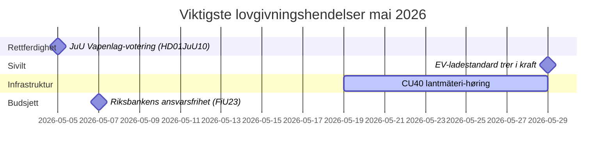

# Mai 2026 – Norsk oversikt over det svenske Riksdag: Sikkerhet, rettferdighet og infrastruktur i fokus

**Author**: James Pether Sörling  
**Date**: 2026-04-27  
**Classification**: UNCLASSIFIED // PUBLIC  
**Confidence**: HIGH [B2]  
**Analysis Depth**: Standard (Tier-C Month-Ahead)

## 🎯 BLUF

Sveriges Riksdag går inn i mai 2026 med en lovgivningsagenda dominert av utvidelse av strafferettspleien, investeringskonflikter innen infrastruktur og press for trygdereformer. Kristersson-regjeringen møter samtidige presser fra Sosialdemokratenes interpellasjoner om jernbaneinvesteringsgap og sykelønnsreform, mens flere komiterapporter om strafferettslovgivning, våpenregulering og fengselskapasitet nærmer seg endelige riksdagsavstemninger. Den sikkerhetspolitisk-geopolitiske dimensjonen intensiveres med ukrainsk ansvarliggjøringslovgivning og Russland-relaterte utenrikspolitiske motioner.

## 🧭 Beslutninger dette briefet støtter

1. **Følg JuU-voteringen om våpenloven** (HD01JuU10): Den nye vapenlag trer i kraft 1. juni 2026 — etterretningskonsumenter som sporer sikkerhetssektorlovgivning, må overvåke tidspunktet for den endelige avstemningen og eventuelle siste-øyeblikk-endringer (konfidens: HØY [A2]).

2. **Overvåk SfU-migrasjonsreform for forskere** (HD01SfU23): Regler for utenlandske forskere og doktorgradsstudenter trer i kraft 11. juni 2026 og påvirker innovasjonsarbeidsmarkedets konkurranseevne — relevant for aktører innen høyere utdanning og FoU (konfidens: HØY [A2]).

3. **Vurder infrastrukturinvesteringsgapsignaler**: HD10449-interpellasjonen om Södra stambanan avslører en strukturell spenning mellom regjeringens transportinfrastrukturplan og regionale utviklingsprioriteringer — indikatorer for potensielle koalisjonsgnisninger med KD (konfidens: MIDDELS [B2]).

## ⚡ 60-sekunders situasjonsrapport

- **Strafferett**: Ny våpenlov (HD01JuU10, JuU), akselerert fengselsbygging (HD01CU25, CU), skjerpede regler for unge lovbrytere (HD03246) — regjeringens sikkerhetsnarrativ dominerer i mai.
- **Sykeforsikring**: S-partiets interpellasjoner om sykeforsikringsdag-180-unntaket (HD10450) signaliserer forvalgposisjonering om velferdsstaten; forvent ministersvar fra Anna Tenje (M).
- **Infrastruktur**: Södra stambanans dobbelspor Alvesta–Växjö mangler i den nasjonale infrastrukturplanen — S-partiet presser Andreas Carlson (KD) for forpliktelse; regional koalisjonssensitivitet.
- **Utenriks/Sikkerhet**: Russisk visumsrestriksjonsmosjon (HD11753), tilbakekalling av overflyvning (HD11752), ratifisering av Ukrainas krigsforbrytelsestribunal (HD03231/232) — parlamentarisk sikkerhetskonsensus holder, men S presser for sterkere posisjoner.
- **Energi**: Elnettsstolper (trebaserte kraftledningsstolper) mosjon, vindenergi-desinformasjonsdebatt (HD10448, SD) — energiomstillingen er i ferd med å bli kulturkrigsterritorium foran valget 2026.

## 🏛️ Viktigste lovgivningshendelser: mai 2026

## 🔭 Viktigste fremadrettede trigger

**Strafferettsvoteringsklyng (mai 2026)**: Kombinasjonen av HD01JuU10 (våpenlov), HD01JuU31 (politireformevaluering), HD01CU25 (fengselsbygging) og HD03237 (lønnet politiutdanningsproposis jon) skaper et konsentrert lovgivningsøyeblikk for rettsektoren som vil teste regjeringens og SDs tilpasning og gi S maksimal opposisjonssynlighet. Overvåk: SD-endringsforslag, S-motmotioner, medieinnramming rundt kriminalitetsrater.

## Konfidensanalyse

Overordnet analytisk konfidens: **HØY** — basert på bekreftede MCP-baserte parlamentariske dokumenter og nylige betenkninger. IMF-økonomiske data ikke tilgjengelige i dette kjøringen (nettverksproblem); økonomisk kontekst hentet fra tidligere WEO apr-2026-vintage (NGDP_RPCH: SWE ~2,1%).

<!-- source-sha: 0d5ca67103600cd49fb8373d7e028558be2d04d5 -->
