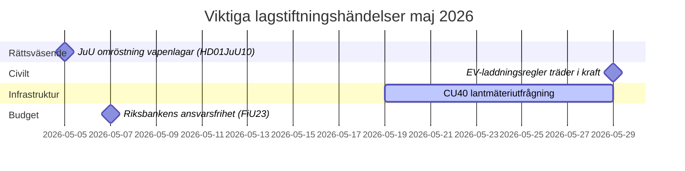

# Maj 2026 – Sveriges riksdag månadsöversikt: Säkerhet, rättvisa och infrastruktur i fokus

**Author**: James Pether Sörling  
**Date**: 2026-04-27  
**Classification**: UNCLASSIFIED // PUBLIC  
**Confidence**: HIGH [B2]  
**Analysis Depth**: Standard (Tier-C Month-Ahead)

## 🎯 BLUF

Riksdagen går in i maj 2026 med en lagstiftningsagenda dominerad av utvidgning av straffrättsväsendet, investeringskonflikter inom infrastruktur och trycket på social­försäkringsreformer. Kristerssons regering möter samtidiga påtryckningar från Socialdemokraternas interpellationer om järnvägsinvesteringsluckor och sjuklönereform, medan flera utskottsbetänkanden om straffrättslig lagstiftning, vapenreglering och fängelsekapacitet närmar sig slutliga riksdagsomröstningar. Den säkerhetspolitisk-geopolitiska dimensionen intensifieras med ukrainsk ansvarighetslagstiftning och Rysslandsrelaterade utrikespolitiska motioner.

## 🧭 Beslut som denna briefing stöder

1. **Följ omröstningen om JuU vapenlagar** (HD01JuU10): Den nya vapenlagen träder i kraft 1 juni 2026 — underrättelsebevakning av säkerhetssektorns lagstiftning måste följa tidpunkten för slutomröstning och eventuella sista-minuten-ändringar (konfidens: HÖG [A2]).

2. **Bevaka SfU-reformen för migrationsforskare** (HD01SfU23): Regler för utländska forskare och doktorander träder i kraft 11 juni 2026 och påverkar innovationsarbetsmarknadens konkurrenskraft — relevant för aktörer inom högre utbildning och FoU (konfidens: HÖG [A2]).

3. **Bedöm infrastrukturinvesteringsgapets signaler**: HD10449-interpellationen om Södra stambanan avslöjar en strukturell spänning mellan regeringens transportinfrastrukturplan och regionala utvecklingsprioriteringar — indikatorer på potentiell koalitionsfriktioner med KD (konfidens: MEDEL [B2]).

## ⚡ 60-sekunders lägesrapport

- **Straffrätt**: Ny vapenlags (HD01JuU10, JuU), påskyndad fängelsebyggnation (HD01CU25, CU), skärpta regler för unga lagöverträdare (HD03246) — regeringens säkerhetsberättelse dominerar i maj.
- **Sjukförsäkring**: S-partiets interpellationer om sjukförsäkringens dag-180-undantag (HD10450) signalerar valförberedande positionering kring välfärdsstaten; vänta på ministersvar från Anna Tenje (M).
- **Infrastruktur**: Södra stambanans dubbelspår Alvesta–Växjö saknas i nationell infrastrukturplan — S-partiet pressar Andreas Carlson (KD) om åtaganden; regional koalitionskänslighet.
- **Utrikes/Säkerhet**: Motion om ryska visumrestriktioner (HD11753), återkallelse av överflygningstillstånd (HD11752), ratificering av Ukrainas krigsförbrytartribunal (HD03231/232) — parlamentarisk säkerhetskonsensus håller men S pressar för starkare positioner.
- **Energi**: Motion om elnätsstolpar (träpålar i elnätet), debatt om energidesinformation (HD10448, SD) — energiomställningen håller på att bli kulturkrigsterritorium inför 2026 års val.

## 🏛️ Viktiga lagstiftningshändelser: maj 2026

## 🔭 Viktigaste framåtblickande trigger

**Straffrättsligt omröstningskluster (maj 2026)**: Kombinationen av HD01JuU10 (vapenlagar), HD01JuU31 (utvärdering av polisreform), HD01CU25 (fängelsebyggnation) och HD03237 (proposition om betald polisutbildning) skapar ett koncentrerat lagstiftningstillfälle för rättsväsendet som kommer att testa regeringens och SDs anpassning och ge S maximal oppositionssynlighet. Bevaka: SD-ändringsförslag, S-motmotioner, medieinramning kring brottslighetsstatistik.

## Konfidensanalys

Övergripande analytisk konfidens: **HÖG** — baserad på bekräftade MCP-baserade riksdagsdokument och aktuella betänkanden. IMF-ekonomiska data inte tillgängliga i denna körning (nätverksproblem); ekonomisk kontext hämtad från tidigare WEO apr-2026-årgång (NGDP_RPCH: SWE ~2,1%).

<!-- source-sha: 0d5ca67103600cd49fb8373d7e028558be2d04d5 -->
