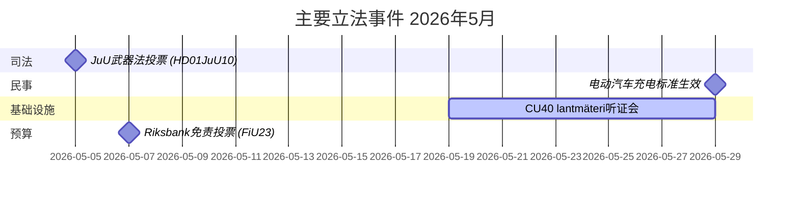

# 2026年5月 瑞典议会月度前瞻：安全、司法与基础设施

**作者**: James Pether Sörling  
**日期**: 2026-04-27  
**分类**: 非机密 // 公开  
**置信度**: 高 [B2]  
**分析深度**: 标准 (Tier-C Month-Ahead)

## 🎯 核心摘要

瑞典议会（Riksdag）进入2026年5月，立法议程由刑事司法制度扩展、基础设施投资冲突以及社会保险改革压力主导。克里斯特松政府同时面临社会民主党就铁路投资缺口和病假保险改革提出的质询（interpellation）压力，而多份关于刑事立法、武器监管和监狱容量的委员会报告正接近议会最终投票。随着乌克兰问责立法和与俄罗斯相关的外交政策议案，地缘政治安全维度持续升温。

## 🧭 本简报支持的决策

1. **跟踪JuU武器法投票**（HD01JuU10）：新vapenlag于2026年6月1日生效——追踪安全部门立法的情报消费者需监测最终投票时间表和最后时刻的修正案（置信度：高 [A2]）。

2. **监测SfU研究人员移民改革**（HD01SfU23）：外国研究人员和博士生规则于2026年6月11日生效，影响创新劳动力市场竞争力——与高等教育和研发领域相关（置信度：高 [A2]）。

3. **评估基础设施投资缺口信号**：HD10449关于Södra stambanan的质询揭示了政府交通基础设施计划与地区发展优先事项之间的结构性张力——联合政府内与KD潜在摩擦的指标（置信度：中 [B2]）。

## ⚡ 60秒态势报告

- **刑事司法**：新武器法（HD01JuU10，JuU）、监狱建设加速（HD01CU25，CU）、青少年犯罪者规则强化（HD03246）——政府安全叙事在五月占主导。
- **病假保险**：S关于病假保险第180天豁免的质询（HD10450）预示着福利国家问题上的选前定位；预计Anna Tenje部长（M）做出答复。
- **基础设施**：Södra stambanan Alvesta–Växjö段复线化在国家基础设施计划中缺失——S向Andreas Carlson部长（KD）施压要求承诺；地区联合政治敏感性。
- **外交/安全**：俄罗斯签证限制议案（HD11753）、取消过境飞行权（HD11752）、批准乌克兰战争罪法庭（HD03231/232）——议会安全共识维持，但S施压寻求更强硬立场。
- **能源**：输电线路电线杆（木制电线杆）议案、风能虚假信息辩论（HD10448，SD）——能源转型在2026年选举前成为文化战争战场。

## 🏛️ 主要立法事件：2026年5月

## 🔭 主要前瞻触发因素

**司法投票集群（2026年5月）**：HD01JuU10（武器法）、HD01JuU31（警察改革评估）、HD01CU25（监狱建设）和HD03237（带薪警察培训提案）的组合为司法部门创造了一个集中的立法时刻，将测试政府与SD的协调，并为S提供最大反对党曝光度。关注：SD修正案、S反对议案、犯罪率相关媒体框架。

## 置信度评估

总体分析置信度：**高**——基于MCP确认的议会文件和近期betänkanden。本次运行IMF经济数据不可用（网络错误）；经济背景取自此前WEO 2026年4月数据（NGDP_RPCH：SWE ~2.1%）。

<!-- source-sha: 0d5ca67103600cd49fb8373d7e028558be2d04d5 -->
