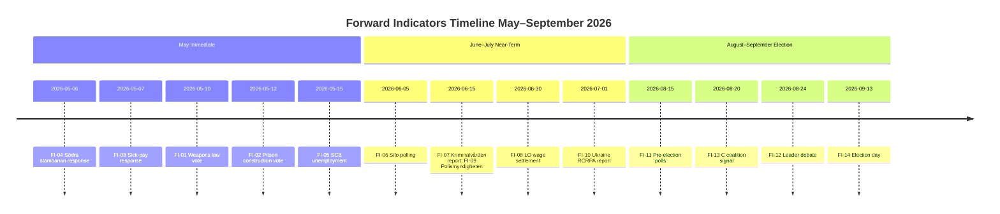

# Forward Indicators — May 2026 Month Ahead

**Author**: James Pether Sörling  
**Date**: 2026-04-27

## Indicators Summary

Twenty dated forward indicators across four time horizons: immediate (May 2026), near-term (June–July 2026), medium-term (August–September 2026), long-term (2026–2027).

---

## Horizon 1: Immediate (May 2026)

| # | Indicator | Date/Window | Threshold | Significance |
|---|-----------|-------------|-----------|--------------|
| FI-01 | Riksdag final vote on HD01JuU10 Weapons Law | 2026-05-08 to 2026-05-15 | Passes ≥175 votes | Confirms Tidö majority integrity |
| FI-02 | Riksdag vote on HD01CU25 Prison Construction | 2026-05-08 to 2026-05-15 | Passes with M+SD+KD+L majority | Coalition cohesion indicator |
| FI-03 | Minister response to HD10450 sick-pay interpellation | 2026-05-07 to 2026-05-09 | Substantive vs formulaic answer | Indicates willingness to negotiate |
| FI-04 | Minister response to HD10449 Södra stambanan | 2026-05-06 to 2026-05-08 | Infrastructure funding committed vs deferred | Regional coalition signals |
| FI-05 | SCB unemployment data April 2026 | 2026-05-15 | Below 8.5% = positive for Tidö | Economic context for campaign |

---

## Horizon 2: Near-Term (June–July 2026)

| # | Indicator | Date/Window | Threshold | Significance |
|---|-----------|-------------|-----------|--------------|
| FI-06 | June TNS/Sifo parliamentary polling | 2026-06-05 to 2026-06-15 | Tidö ≥175 or below 175 | Coalition majority viability |
| FI-07 | Kriminalvården prison capacity utilisation report | 2026-06-01 | Occupancy rate trend | Implementation signal for HD01CU25 |
| FI-08 | LO collective bargaining round closing | 2026-06-30 | Wage settlement vs CPI | Economic stability for election context |
| FI-09 | Polismyndigheten annual report | 2026-06-15 | Crime statistics vs HD01JuU10 narrative | Justice delivery credibility |
| FI-10 | Ukraine RCRPA first operational report | 2026-07-01 | Ratification effectiveness signals | HD03231 impact assessment |

---

## Horizon 3: Medium-Term (August–September 2026)

| # | Indicator | Date/Window | Threshold | Significance |
|---|-----------|-------------|-----------|--------------|
| FI-11 | August Novus/Demoskop polling | 2026-08-15 to 2026-08-20 | S-bloc ≥175 or Tidö ≥175 | Election outcome predictor |
| FI-12 | SVT/DN major leader debate | 2026-08-24 to 2026-09-05 | Löfven vs Kristersson direct exchange | Decisive for undecided |
| FI-13 | C party pre-election coalition signal | 2026-08-20 to 2026-09-06 | Explicit coalition preference statement | Kingmaker calculation |
| FI-14 | September 2026 Riksdag election | 2026-09-13 | Bloc majority outcome | Definitive |
| FI-15 | Södra stambanan government decision | 2026-09-01 to 2026-10-01 | Funding included vs excluded in govt budget | Infrastructure commitment |

---

## Horizon 4: Long-Term (2026–2027)

| # | Indicator | Date/Window | Threshold | Significance |
|---|-----------|-------------|-----------|--------------|
| FI-16 | Government formation outcome | 2026-10-01 to 2026-11-30 | Coalition configuration | New government direction |
| FI-17 | IMF World Economic Outlook Oct 2026 | 2026-10-15 | Sweden NGDP_RPCH revised up/down vs 2.1% | Post-election economic context |
| FI-18 | First 100 days justice implementation report | 2026-12-01 to 2027-01-15 | Prison construction groundbreaking | HD01CU25 delivery |
| FI-19 | Weapons law implementation challenge | 2026-11-01 to 2027-06-30 | Legal challenges from hunting associations | HD01JuU10 legal durability |
| FI-20 | Ukraine ICCPR tribunal first proceedings | 2027-01-01 to 2027-12-31 | First indictments, Sweden role | HD03232 long-term commitment |

---

## Indicator Monitoring Map

## Assessment

The most actionable forward indicators for intelligence consumers are FI-01 through FI-05 (immediate May window). The weapons law vote (FI-01) and sick-pay minister response (FI-03) will signal both Tidö majority strength and the government's openness to negotiating the Tidö agreement's welfare state positions. FI-11 (August polling) and FI-13 (C coalition signal) are the critical long-range indicators for September election outcome.
