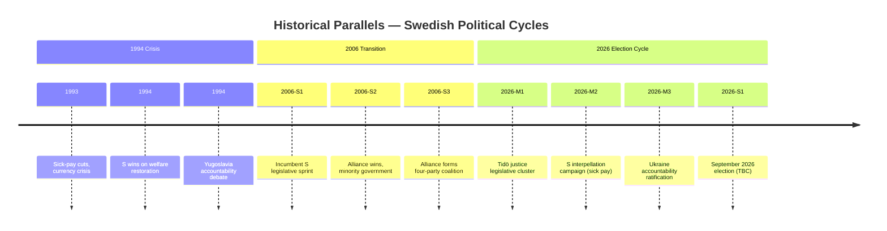

# Historical Parallels — May 2026 Month Ahead

**Author**: James Pether Sörling  
**Date**: 2026-04-27

## Parallel 1: The 2006 Alliance Pre-Election Legislative Sprint

**Then**: In spring 2006, Sweden's four-party Alliance (M, C, KD, FP) developed a coordinated "jobs and welfare" platform in opposition before the September 2006 election. The incumbent S government produced a late legislative sprint of social reform legislation that was ultimately judged by voters as insufficient.

**Now**: Tidö's May 2026 justice and security legislative cluster mirrors this pattern — a government using the final legislative session before an election to crystallize its delivery narrative. The parallel is instructive: in 2006, the incumbent S failed to counter-program effectively; in 2026, it remains to be seen if S's interpellation campaign is more effective than the 2006 S strategy.

**Confidence in parallel**: MEDIUM — structural similarity high, but Tidö's majority is thinner than S's in 2006.

## Parallel 2: The 1994 Security-Economy Election

**Then**: In 1994, Sweden was emerging from the 1992–93 financial crisis with high unemployment and currency devaluation. The election turned heavily on economic credibility and social insurance — the sick-pay system had been cut by the Bildt government and S campaigned to restore it.

**Now**: The sick-pay day-180 interpellation (HD10450) activates the same emotional register as the 1994 debate. Swedish voters have a deep institutional memory of the sick-pay cuts debate. S is deliberately triggering this memory frame.

**Confidence in parallel**: MEDIUM-HIGH — the sick-pay issue has a demonstrated resonance that transcends specific policy details in Swedish electoral politics.

## Parallel 3: Sweden's 1994 Ukraine Solidarity (Croatia/Bosnia)

**Then**: Sweden's 1994 parliament debated Sweden's role in peacekeeping and international accountability mechanisms for the Yugoslav wars — an early test of post-Cold War Swedish foreign policy.

**Now**: HD03231/HD03232 (Ukraine tribunal and reparations commission) represent a more mature version of the same question: how far should Sweden commit to international accountability mechanisms for state aggression? Sweden's 2026 position — NATO member supporting criminal tribunals — is a substantially more committed stance than 1994, reflecting 30 years of Swedish foreign policy evolution.

**Confidence in parallel**: LOW-MEDIUM — structural similarity but dramatically different geopolitical context.

## Assessment

The strongest historical parallel is **2006**: an incumbent using pre-election legislative productivity to claim a delivery mandate, with an opposition struggling to produce a compelling counter-narrative before the election. Sweden's 2026 trajectory will diverge from 2006 if (a) economic conditions worsen for incumbents or (b) S's sick-pay/infrastructure messaging breaks through to swing voters more effectively than the 2006 S party managed.
