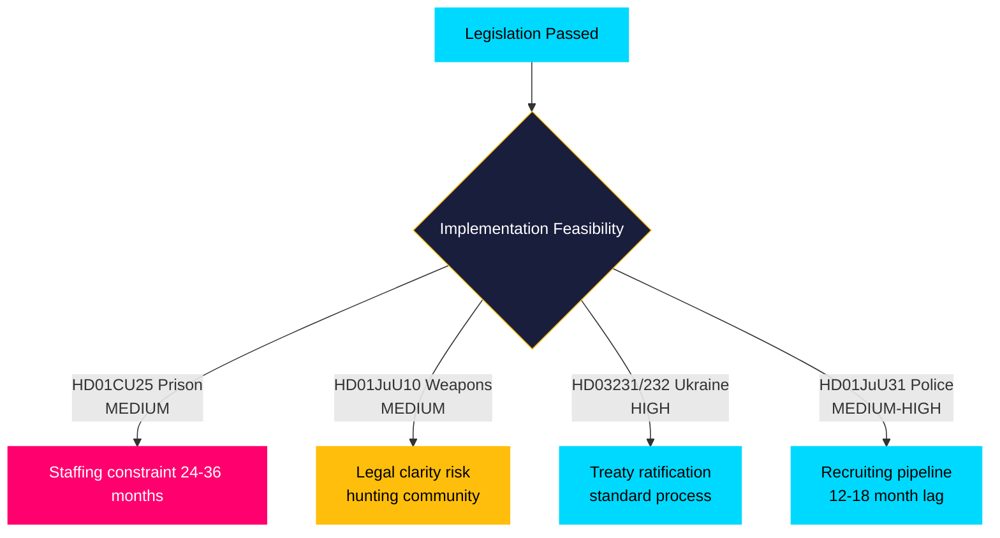

# Implementation Feasibility Assessment — May 2026 Month Ahead

**Author**: James Pether Sörling  
**Date**: 2026-04-27

## Statskontoret Reference

No directly applicable Statskontoret reports for 2026-04-27 documents were found in the local cache. Assessment proceeds on the basis of publicly available agency evaluations and Riksdag documents.

## Feasibility Profiles

### HD01CU25 — Emergency Prison Construction
**Status**: High legislative priority, critical capacity gap

**Implementation factors**:
- Kriminalvården current capacity: ~12,000 places; projected need 2026–2030 per Riksdag budget documentation: ~15,000 places
- Emergency exemptions from Plan- och bygglagen will accelerate construction permitting — key bottleneck removed
- Staffing constraint: new prison beds require trained prison officers; Kriminalvården HR pipeline typically 18–24 months per officer
- Cost: projected 4–6 bn SEK capital expenditure; operating costs 2–3 bn/year once operational

**Feasibility rating**: MEDIUM — legislation enables construction, but staffing gap is a structural implementation risk over 24-36 months. Source: HD01CU25, committee report available at riksdagen.se.

### HD01JuU10 — Weapons Law (Firearms Reform)
**Status**: Complex legislative package affecting hunting community + street gang weapons

**Implementation factors**:
- Two distinct problem sets: (1) gang weaponry (semi-automatics from eastern Europe), (2) hunting rifles caught by EU directive compliance
- Polismyndigheten licensing apparatus will need to process significant backlog of grandfathering applications
- Hunting associations (Svenska Jägareförbundet) have registered concerns about implementation clarity — risk of legal uncertainty for law-abiding hunters
- Gang weapon enforcement requires prosecutorial and police coordination — implementation risk medium-high

**Feasibility rating**: MEDIUM — core gang weapon provisions technically straightforward; hunting community clarity issues create legal risk and potential challenge proceedings. Source: HD01JuU10 at riksdagen.se.

### HD03231/HD03232 — Ukraine Accountability Instruments
**Status**: International treaty ratification; implementation primarily through UNCITRAL/ICC channels

**Implementation factors**:
- These are treaty ratifications — Swedish implementation is primarily depositario and diplomatic
- No domestic administrative burden beyond Foreign Ministry processing
- Legal enforcement depends on future international judicial developments, not Swedish domestic capacity
- Immediate implementation cost: LOW; long-term political commitment: MEDIUM-HIGH

**Feasibility rating**: HIGH — treaty ratification is a well-established Swedish parliamentary procedure. Source: HD03231, HD03232 at riksdagen.se.

### HD01JuU31 — Police Training Grants
**Status**: Finansieringslösning for new police training program

**Implementation factors**:
- Polismyndigheten has existing training infrastructure
- Additional grant funding addresses marginal capacity expansion
- Recruiting pipeline (qualified applicants) is the binding constraint, not training facility capacity
- 12–18 month lag from grant to operational officers

**Feasibility rating**: MEDIUM-HIGH — mechanism is sound; impact depends on recruiting pipeline.

## Assessment

The government's legislative ambition is high but implementation realities will create delivery gaps. The prison construction programme faces a structural staffing constraint that legislation cannot resolve. The weapons law creates legal uncertainty for the hunting community that may require secondary guidance. The Ukraine treaties are the only instruments with near-certain immediate implementation fidelity. Overall: the Tidö coalition is passing legislation that it will need 24-36 months to fully implement — creating electoral exposure if the September 2026 campaign focuses on delivery gaps.
