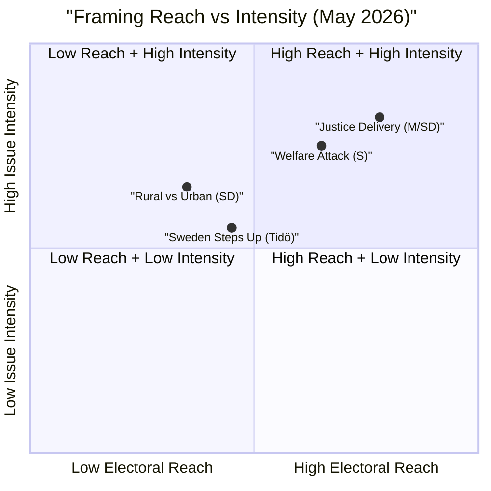

# Media Framing Analysis — May 2026 Month Ahead

**Author**: James Pether Sörling  
**Date**: 2026-04-27

## Dominant Frames Identified

### Frame 1: "Law and Order Delivery" (Government/M/SD narrative)
**Sources**: Tidö coalition press releases, M parliamentary group communications
**Frame**: Sweden's justice reforms are historic — toughest criminal legislation in decades. Government is delivering on 2022 election promises. Specific hooks: weapons law (HD01JuU10), prison expansion (HD01CU25), police training grants (HD01JuU31).
**Target audience**: Justice-priority voters (S1), suburban M/KD/SD voters
**Weakness**: Relies on future implementation success; implementation failures before September would puncture the frame.

### Frame 2: "Welfare State Under Attack" (S narrative)
**Sources**: S parliamentary group, LO trade union communications, Aftonbladet editorial line
**Frame**: Tidö coalition is quietly dismantling the Swedish welfare state — sick pay cuts (HD10450), infrastructure neglect (Södra stambanan, HD10449). Six simultaneous interpellations aimed at exposing breadth of damage.
**Target audience**: Welfare-state defenders (S2), regional workers (S4)
**Weakness**: Lacks a single dominant story — too many simultaneous targets may fragment the narrative.

### Frame 3: "Sweden Steps Up" (Security establishment)
**Sources**: Government foreign affairs communications, NATO/Nordic press
**Frame**: Ukraine tribunal and reparations commission ratification (HD03231/HD03232) prove Sweden is a serious NATO partner and international rule-of-law champion.
**Target audience**: Security-internationalists (S3), educated urban voters
**Impact**: Low electoral differentiation — bipartisan support reduces electoral advantage for any single party.

### Frame 4: "Urban Elites vs Rural Sweden" (SD narrative)
**Sources**: SD communications, Aftonbladet/Expressen comment pieces from SD-aligned voices
**Frame**: Wind energy "disinformation" interpellation (HD10448) and rural community interests framed as under attack from urban environmental consensus.
**Target audience**: Cultural nationalist voters (S5), rural SD base
**Effectiveness**: Moderate — resonant in specific regions but unlikely to broaden SD's urban appeal.

## Framing Competition Map

## Media Outlet Alignment (Structural)

| Outlet | Structural Lean | Expected Frame |
|--------|----------------|----------------|
| SVT | Neutral/PSB | Balanced, policy substance |
| SR | Neutral/PSB | Balanced, accountability focus |
| Expressen | Center-right | Frame 1 (Law and Order) |
| Aftonbladet | Center-left | Frame 2 (Welfare Attack) |
| DN | Liberal-moderate | Frame 3 (Sweden Steps Up) |
| SvD | Conservative | Frame 1 (Law and Order) |
| Göteborgs-Posten | Liberal-regional | Frame 4 (regional infrastructure) |

## Assessment

The dominant media framing contest is Frame 1 (M/SD) vs Frame 2 (S). Frame 3 will have momentary elevation around the Ukraine vote. Frame 4 is a niche but sticky frame for SD's base. The sick-pay interpellation (HD10450) has the highest potential to elevate Frame 2 if LO activates its communications infrastructure. The challenge for S is competing with the justice cluster's emotional salience — crime and punishment typically generates higher public engagement than social insurance policy details.
