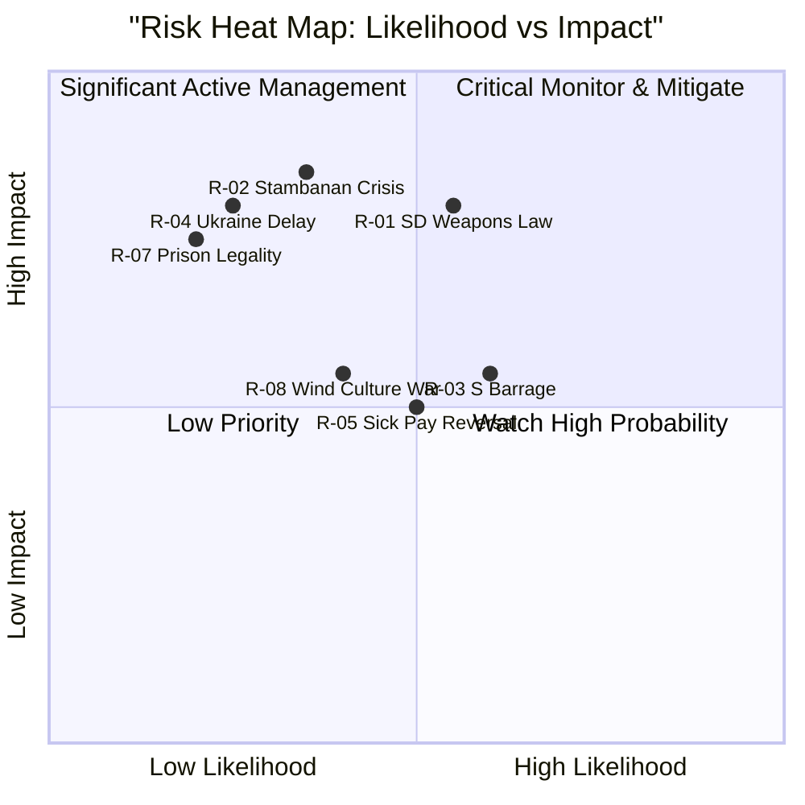

# Risk Assessment — May 2026 Month Ahead

**Author**: James Pether Sörling  
**Date**: 2026-04-27  
**Framework**: Political Risk Methodology (Likelihood × Impact × Velocity)

## Risk Register

| Risk ID | Risk | Likelihood | Impact | Velocity | Score | Owner |
|---------|------|-----------|--------|----------|-------|-------|
| R-01 | SD amendments derail weapons law timeline (HD01JuU10) | MEDIUM | HIGH | HIGH | 8/10 | JuU |
| R-02 | Infrastructure plan rejection crisis — Södra stambanan absent forces KD-M confrontation (HD10449) | LOW-MEDIUM | HIGH | MEDIUM | 6/10 | Infrastruktur |
| R-03 | S interpellation barrage damages government approval ahead of election | MEDIUM | MEDIUM | MEDIUM | 6/10 | Government |
| R-04 | Ukraine tribunal ratification delayed by procedural disagreements (HD03231/232) | LOW | HIGH | LOW | 5/10 | UU |
| R-05 | Sick-pay reform reversal pressure escalates (HD10450) | MEDIUM | MEDIUM | LOW-MEDIUM | 5/10 | SoU |
| R-06 | Corporate crime gap (HD10451) becomes media narrative blocking justice ministry agenda | LOW-MEDIUM | MEDIUM | MEDIUM | 5/10 | JuU |
| R-07 | Prison construction emergency legislation challenged on rule-of-law grounds (HD01CU25) | LOW | HIGH | LOW | 4/10 | CU |
| R-08 | Wind energy culture war (HD10448) fragments M-KD energy consensus | LOW-MEDIUM | MEDIUM | HIGH | 5/10 | Energi |

## Top Three Risks Narrative

### R-01: SD Weapons Law Timeline Risk (MEDIUM-HIGH)
Source: HD01JuU10 (riksdagen.se), JuU committee report 2026-04-24. The new weapons law enters force 1 June 2026 — any parliamentary procedural delay or SD-sponsored amendment to expand the hunting rifle exception could push the implementation date. Probability: MEDIUM given SD's prior pushback on hunting restrictions. Mitigation: Government should secure firm SD commitment before committee stage closes.

### R-02: Infrastructure Plan Confrontation (LOW-MEDIUM)
Source: HD10449 (riksdagen.se), interpellation by Robert Olesen (S) to Andreas Carlson (KD). Absence of Södra stambanan from the national infrastructure plan is a documented fact that forces the minister to defend a negative — unusual political position. Risk: KD's infrastructure programme becomes a coalition liability if M disagrees on public investment levels. Velocity: MEDIUM (minister's reply pending).

### R-03: S Interpellation Barrage (MEDIUM)
S-party has filed coordinated interpellations (HD10449, HD10450, HD10451, HD10447, HD10443–HD10446) targeting four ministers (Carlson, Tenje, Strömmer, Svantesson, Britz). This systematic targeting of multiple departments simultaneously depletes ministerial bandwidth and maximises media opportunity. Risk of government appearing on the defensive across multiple policy areas simultaneously. Score elevated by proximity to election.

## Risk Heat Map

## Institutional Risk Assessment

- **Kriminalvården**: Prison capacity shortfall (HD01CU25) confirmed — emergency legislation signals systemic failure of capacity planning. Statskontoret relevance: no directly relevant source found for this date. General reference: www.statskontoret.se (capacity audits of government agencies).
- **Polismyndigheten**: Police reform 2015 evaluation (HD01JuU31) — Riksrevisionen found insufficient reform effectiveness. Paid police training proposition (HD03237) is the government's response. Combined risk: reform credibility gap.

## Economic Risk Overlay

IMF WEO Apr-2026 vintage context (caveat: retrieved from prior run, not this run):
- Sweden GDP growth ~2.1% — positive but slowing in EU context
- Export exposure to EU demand remains a latent risk in justice/infrastructure spending debates
- Labour market impacts of sick-pay reform (HD10450) are contested in economic modelling
