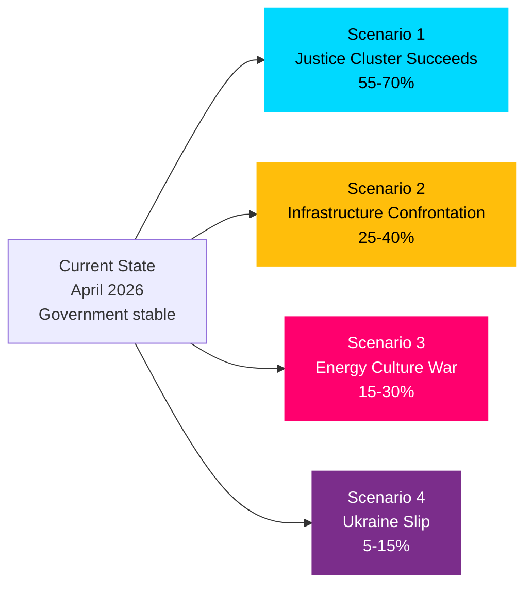

# Scenario Analysis — May 2026 Swedish Parliamentary Month Ahead

**Author**: James Pether Sörling  
**Date**: 2026-04-27  
**Framework**: WEP/Kent Scale Scenario Planning

## Scenario 1: Government Justice Narrative Succeeds (Base Case)
**Probability: LIKELY (55–70%)**  
**Confidence: HIGH [B2]**

The full justice legislative cluster (HD01JuU10, HD01CU25, HD03237, HD03246) passes Riksdag votes in May-June 2026 on schedule. New weapons law enters force 1 June. Prison construction legislation enters force 1 July. Government enters pre-election phase with a dominant security narrative. S interpellations receive standard ministerial replies that satisfy media cycle but do not fundamentally shift public opinion. SD maintains support.

**Key Indicators**: JuU committee vote date confirmed; no SD amendments filed on hunting exceptions; Riksdag schedule uninterrupted.

**Source**: HD01JuU10 (riksdagen.se), HD01CU25 (riksdagen.se)

## Scenario 2: Infrastructure Confrontation Escalates
**Probability: POSSIBLE (25–40%)**  
**Confidence: MEDIUM [B3]**

S's interpellation on Södra stambanan (HD10449) forces a media confrontation where Andreas Carlson (KD) must publicly defend the absence of a key rail investment from the national plan. Regional parties and rural newspapers amplify the story. M and KD show visible tension on infrastructure spending levels. This becomes a template for S's broader campaign narrative: "government neglects Swedish infrastructure." The scenario weakens government's rural/regional voter base.

**Key Indicators**: Major Swedish newspapers editorial coverage of Södra stambanan; Carlson reply widely quoted; opinion polling movement in southern Sweden constituencies.

**Source**: HD10449 (riksdagen.se) — Robert Olesen (S) interpellation to Andreas Carlson (KD)

## Scenario 3: Energy Culture War Disrupts SD Alignment
**Probability: POSSIBLE (15–30%)**  
**Confidence: MEDIUM [C3]**

SD's wind energy disinformation interpellation (HD10448) is the opening move in a more sustained campaign to make energy policy a dividing line. SD positions itself as sceptical of renewable energy expansion, forcing KD's Ebba Busch to either defend wind energy (risking SD friction) or distance herself from pro-wind policy (risking EU energy transition commitments). Coalition tension becomes visible before the election, opening space for V/MP to attack both parties.

**Key Indicators**: SD table of further energy sector interpellations; Busch response tone; parliamentary energy committee vote splits.

**Source**: HD10448 (riksdagen.se) — Josef Fransson (SD) interpellation to Ebba Busch (KD)

## Scenario 4: Ukraine Ratification Slip (Low Probability)
**Probability: UNLIKELY (5–15%)**  
**Confidence: LOW [C3]**

Procedural delays or late-breaking amendments to HD03231/232 (Ukraine tribunal and reparations commission instruments) push ratification past June 2026. This would represent an embarrassment in Sweden's multilateral commitments but is unlikely given all-party consensus. Trigger: unexpected legal opinion on constitutional compatibility.

**Key Indicators**: Lagrådsremiss complications; unexpected opposition from any party caucus.

**Source**: HD03231, HD03232 (riksdagen.se)

## Scenario Comparison

