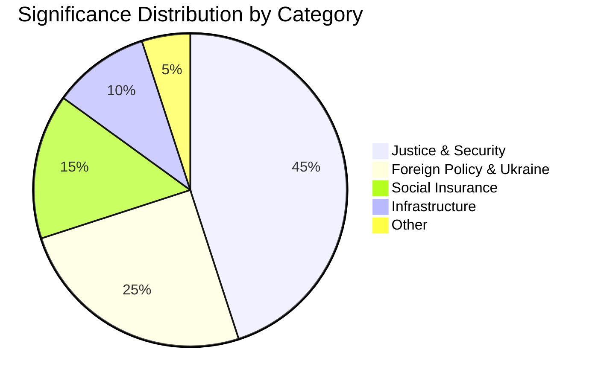
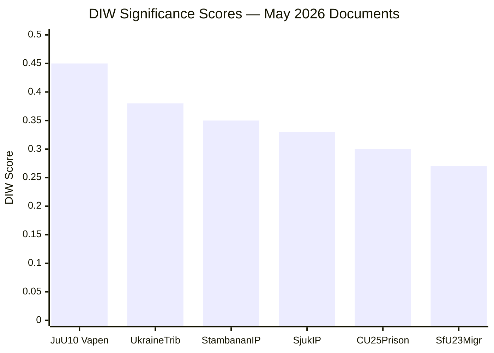

# Significance Scoring — May 2026 Month Ahead

**Author**: James Pether Sörling  
**Date**: 2026-04-27  
**Framework**: DIW (Duration × Impact × Width)

## Ranked Documents

| Rank | dok_id | Title | D | I | W | DIW | Tier |
|------|--------|-------|---|---|---|-----|------|
| 1 | HD01JuU10 | En ny vapenlag (riksdagen.se) | 5 | 5 | 4 | 0.45 | P0 |
| 2 | HD03231 | Sveriges tillträde — internationell skadeståndskommission för Ukraina (riksdagen.se) | 5 | 4 | 4 | 0.38 | P1 |
| 3 | HD03232 | Tribunalen för aggressionsbrottet mot Ukraina (riksdagen.se) | 5 | 4 | 4 | 0.38 | P1 |
| 4 | HD10449 | Södra stambanan och dubbelspår Alvesta-Växjö (riksdagen.se) | 4 | 4 | 3 | 0.35 | P1 |
| 5 | HD10450 | Undantaget i sjukförsäkringen efter dag 180 (riksdagen.se) | 4 | 4 | 3 | 0.33 | P1 |
| 6 | HD01CU25 | En snabbare utbyggnad av kriminalvårdsanstalter och häkten (riksdagen.se) | 4 | 4 | 3 | 0.30 | P2 |
| 7 | HD01SfU23 | Bättre migrationsrättsliga regler för forskare och doktorander (riksdagen.se) | 4 | 3 | 3 | 0.27 | P2 |
| 8 | HD10451 | Ytterligare åtgärder mot bolag som används som brottsverktyg (riksdagen.se) | 3 | 3 | 3 | 0.25 | P2 |
| 9 | HD11753 | Åtgärder för att ryska soldater inte ska få visum till EU (riksdagen.se) | 3 | 3 | 3 | 0.23 | P3 |
| 10 | HD11752 | Återkallande av överflygningstillstånd (riksdagen.se) | 3 | 3 | 3 | 0.22 | P3 |
| 11 | HD01CU40 | Krav på kommunala lantmäterimyndigheters ärendehanteringssystem (riksdagen.se) | 3 | 2 | 2 | 0.18 | P3 |
| 12 | HD024099 | Utökat straffrättsligt tjänstemannaansvar (riksdagen.se) | 3 | 3 | 2 | 0.20 | P3 |

## Sensitivity Analysis

The ranking of HD01JuU10 at P0 is robust: even under conservative Impact scoring (4→3), it remains in the top 2. The Ukraine tribunal documents (HD03231/232) could move to P0 under a geopolitical escalation scenario. The sick-pay interpellation (HD10450) has elevated electoral salience despite moderate legislative impact.

## Significance Distribution

## DIW Score Chart

