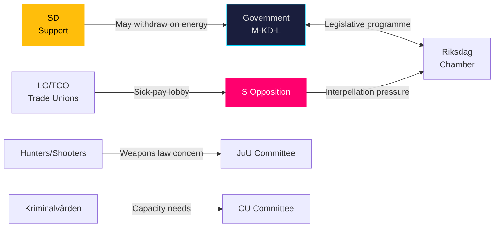

# Stakeholder Perspectives — May 2026 Month Ahead

**Author**: James Pether Sörling  
**Date**: 2026-04-27

## Stakeholder Map

### Government Coalition (M-KD-L with SD support)
- **Moderaterna (M)**: Pushing justice cluster (HD01JuU10, HD03237, HD03246), defending Riksbank discharge (HD01FiU23). Finance Minister Svantesson faces interrogation on sick-pay reform.
- **Kristdemokraterna (KD)**: Infrastructure Minister Carlson under pressure on Södra stambanan (HD10449). Energy Minister Busch faces SD's wind energy challenge (HD10448).
- **Liberalerna (L)**: Labour Minister Britz targeted on corporate doctor training (HD10440). Low-profile in May legislative cluster.
- **SD** (support party): Benefits from justice cluster visibility. Friction point: wind energy policy (HD10448 by Josef Fransson).

### Opposition
- **Socialdemokraterna (S)**: Executing coordinated interpellation strategy (HD10449, HD10450, HD10451, HD10447). Key MPs: Robert Olesen (infrastructure), Jessica Rodén (social insurance), Ingela Nylund Watz (corporate crime) [riksdagen.se].
- **Miljöpartiet (MP)**: Likely aligned with S on infrastructure investment and sick-pay protection. Also supportive on Ukraine legislation.
- **Vänsterpartiet (V)**: Expected to back S interpellations on sick-pay and corporate crime; more aggressive on Russian sanctions.

### Civil Society & Interest Groups
- **Jägarförbundet / Sportskytteförbund**: Directly affected by HD01JuU10 (new weapons law). The semi-automatic hunting rifle ban will generate lobbying.
- **Facken (Trade Unions)**: Sick-pay reform (HD10450) is a union-priority issue. LO and TCO expected to mobilise.
- **Kriminalvården**: Receiving emergency construction authority (HD01CU25) — capacity crisis finally being addressed.
- **Research universities / SUHF**: Researcher migration reform (HD01SfU23) directly beneficial for recruitment.

### International Stakeholders
- **Ukraine / EU**: Watching HD03231/232 Ukraine tribunal ratification — Sweden's signal of multilateral accountability commitment.
- **NATO partners**: Swedish foreign policy consensus on Russia (HD11752, HD11753) monitored.

## Stakeholder Interaction Map

