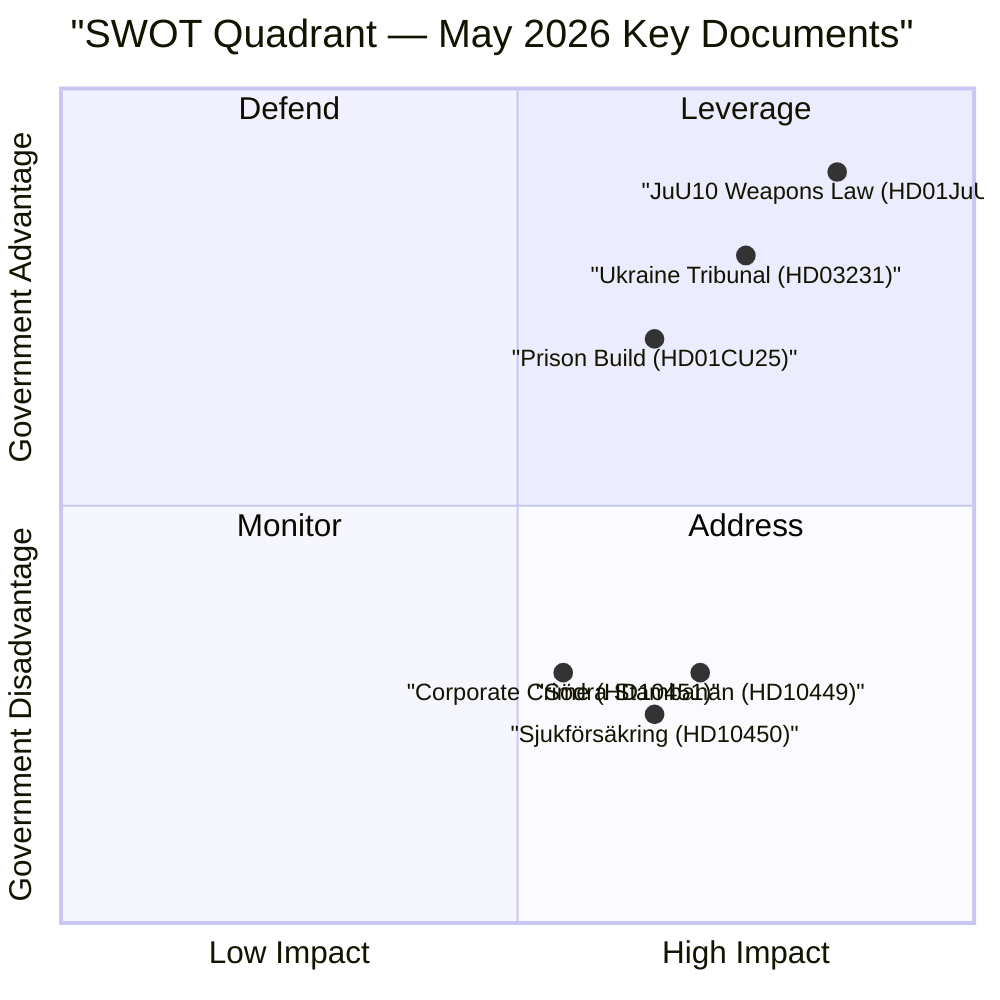

# SWOT Analysis — Swedish Parliament May 2026

**Author**: James Pether Sörling  
**Date**: 2026-04-27  
**Framework**: Political SWOT with TOWS Matrix

## SWOT Matrix

### Strengths

- **Coherent justice programme**: Government has assembled a full justice-sector legislative cluster (HD01JuU10, HD01CU25, HD03237, HD03246) entering votes simultaneously — demonstrates policy coherence [A2] [riksdagen.se]
- **Parliamentary security consensus**: All-party agreement on Ukraine accountability (HD03231/232) and Russia restrictions (HD11752, HD11753) insulates foreign policy from partisan conflict [B2] [riksdagen.se]
- **Riksbank stability**: FiU23 (HD01FiU23) confirms Riksbank director and fullmäktige receive clean discharge for 2025, 5 297 MSEK profit retained — monetary credibility maintained [A1] [riksdagen.se]

### Weaknesses

- **Infrastructure investment gap**: HD10449 exposes absence of Södra stambanan double-track Alvesta–Växjö from national plan — signals KD-M tension on public investment levels [B2] [riksdagen.se]
- **Sick-pay reform vulnerable**: The day-180 exception (HD10450) is a policy legacy contested across party lines; government's work-line narrative creates political vulnerability on welfare protection [B2] [riksdagen.se]
- **Prison capacity crisis**: HD01CU25 requires emergency building legislation — signals Kriminalvården capacity shortfall, which Riksrevisionen has previously flagged as a systemic constraint [B2] [riksdagen.se]

### Opportunities

- **Security electoral narrative**: The justice cluster (weapons law, police training, youth offenders) positions government favourably on crime/security ahead of election — polling consistently shows SD-M coalition strongest on crime [B3]
- **Ukraine multilateral leadership**: Ratification of international reparations commission and aggression tribunal (HD03231/232) positions Sweden as engaged multilateral actor in post-NATO foreign policy [B2] [riksdagen.se]
- **Researcher migration reform**: HD01SfU23 (entering force 11 June) may strengthen Sweden's competitive position in attracting international research talent — innovation economy upside [B2] [riksdagen.se]

### Threats

- **S narrative effectiveness**: S-party's synchronized interpellations (HD10449, HD10450, HD10451, HD10447) across infrastructure, social insurance, and corporate crime signal a coherent electoral contrast strategy — could crystallise public opinion against the government on welfare and investment [C2]
- **SD energy culture war**: Josef Fransson (SD) interpellation HD10448 on wind energy disinformation signals SD's intent to weaponise energy transition against Ebba Busch (KD) — potential coalition strain [B3]
- **Corporate crime accountability gap**: HD10451 (Ingela Nylund Watz, S → Gunnar Strömmer, M) highlights gap in action against shell companies used for crime despite December 2025 Brå report — government reactive posture exposed [B2] [riksdagen.se]
- **Swedish manufacturing competitiveness**: Without IMF fetch confirmation, relying on prior WEO Apr-2026 context: Swedish export exposure to EU demand slowdown remains a latent risk (NGDP_RPCH ~2.1% projection — vintage caveat applies) [C3]

## TOWS Matrix

| | Strengths | Weaknesses |
|---|---|---|
| **Opportunities** | SO: Leverage justice narrative into electoral dominance on crime — coordinate weapons law, police training, and prison expansion as single "safe Sweden" message | WO: Use researcher migration reform to reframe infrastructure debate — shift from physical to human capital investment narrative |
| **Threats** | ST: Counter S interpellations with detailed ministerial responses on Södra stambanan timeline and Riksbank stability figures from FiU23 | WT: Address corporate crime gap proactively — commission justice ministry update on shell company legislation before HD10451 debate |

## Cross-SWOT Intersections

- HD01JuU10 (Strength) × HD10448 (Threat): The weapons law reinforces government security credibility, but SD's wind energy attacks risk fragmenting coalition energy messaging — requires separate government response strategy.
- HD10450 (Weakness) × S narrative (Threat): Sick-pay day-180 debate is the most electorally sensitive intersection — government should prepare evidence-based response quantifying work-line reform outcomes.

