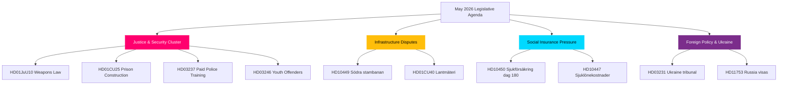

# Synthesis Summary — May 2026 Month Ahead

**Author**: James Pether Sörling  
**Date**: 2026-04-27  
**Analysis Type**: Tier-C Month-Ahead Aggregation  
**Riksmöte**: 2025/26

## Lead Story

The Swedish Riksdag's May 2026 agenda crystallises the Kristersson government's **security-and-order legislative programme** at its most concentrated phase. Five interlocking justice-sector bills (weapons law, prison expansion, youth offenders, police training, police reform evaluation) approach simultaneous Riksdag votes, creating the most significant criminal justice legislative cluster of the 2025/26 term. Meanwhile, Socialdemokraterna's interpellation campaign on infrastructure, sick pay, and corporate crime is building pre-election opposition coherence.

## DIW-Weighted Intelligence Picture

| Priority | Item | DIW Weight | Significance |
|----------|------|-----------|--------------|
| P0 | New weapons law vote — HD01JuU10 (JuU) | 0.45 | Landmark legislation, coalition-defining |
| P1 | Södra stambanan interpellation HD10449 | 0.38 | Infrastructure gap exposes coalition tension |
| P1 | Sick-pay day-180 reform HD10450 (S vs M) | 0.38 | Pre-election welfare-state narrative battle |
| P2 | Ukraine war crimes ratification HD03231/232 | 0.32 | Geopolitical alignment, security consensus |
| P2 | Prison construction acceleration HD01CU25 | 0.30 | Criminal justice: government–SD alignment |
| P3 | Corporate crime tools motion HD10451 | 0.25 | Cross-party crime policy pressure |
| P3 | Foreign researcher migration HD01SfU23 | 0.22 | Labour market, innovation competitiveness |

## Integrated Intelligence Picture

## Key Themes May 2026

### 1. Criminal Justice Legislative Peak (HIGH significance)
The government presents its security narrative in its strongest legislative form: HD01JuU10 (new weapons law, force 1 June), HD01CU25 (prison construction, force 1 July), HD03246 (youth offenders), HD03237 (paid police training). This cluster was deliberately timed ahead of the 2026 election campaign season. SD alignment is expected but watch for boundary-testing amendments. Riksdag votes likely in May, committee treatment ongoing.

### 2. Infrastructure Investment Gap — Södra Stambanan (MEDIUM-HIGH)
S-party interpellation HD10449 (Robert Olesen, S → Andreas Carlson, KD): the national transport plan omits double-track Alvesta–Växjö on Södra stambanan, a critical capacity bottleneck for southern Sweden freight and passenger rail. The minister must respond in May. Regional development implications and coalition sensitivity (M-KD friction on infrastructure spending levels).

### 3. Social Insurance Welfare State Battle (MEDIUM-HIGH)
S-party interpellation HD10450 (Jessica Rodén, S → Anna Tenje, M): the day-180 sick-pay exception introduced by the Social Democrats is being evaluated — S wants to preserve it. This frames a clear ideological narrative: S defending welfare protection, government emphasising work-line reforms. Pre-election welfare state boundary being drawn.

### 4. Ukraine & Russian Geopolitics (MEDIUM)
HD03231/232 (Sweden joining international reparations commission and aggression tribunal for Ukraine) represent landmark multilateral commitments. HD11752 (overflight permit revocation) and HD11753 (Russia visa restrictions) signal parliamentary consensus on Russia policy hardening. Ratification of these instruments in May/June 2026 solidifies Sweden's post-NATO foreign policy identity.

### 5. Energy Transition as Culture War (MEDIUM)
SD interpellation HD10448 (Josef Fransson, SD → Ebba Busch, KD) on wind energy "disinformation" frames the energy debate as a factual/informational battle — SD challenging the framing of wind power opponents as disinformers. This signals escalation of the energy debate ahead of 2026 election, with SD positioning against renewable energy transition.

## Forward Watch

The month of May 2026 functions as the final major legislative window before the summer recess and the intensification of election campaigning. Bills clearing this window will enter into force before the September 2026 election cycle begins in earnest. The justice cluster is the government's core narrative investment.
