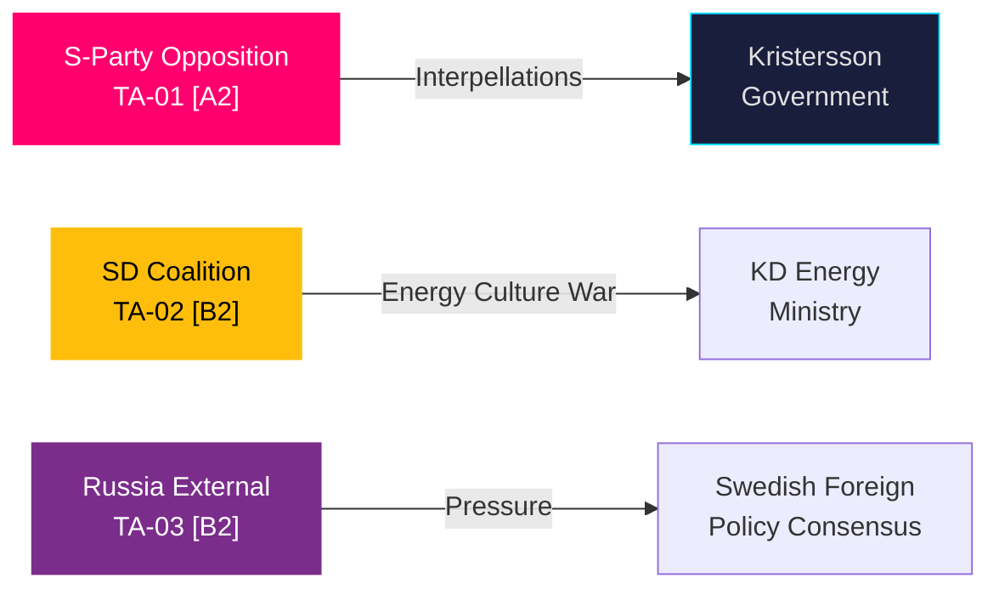

# Threat Analysis — May 2026 Swedish Parliamentary Month Ahead

**Author**: James Pether Sörling  
**Date**: 2026-04-27  
**Framework**: Political Threat Framework (Actor × Capability × Intent × Opportunity)

## Threat Actors

### TA-01: Socialdemokraterna (S) — Opposition Campaign
- **Actor**: S party leadership, parliamentary group (61 seats, opposition)
- **Capability**: HIGH — systematic interpellation campaign, four ministers targeted simultaneously, parliamentary procedural expertise
- **Intent**: CONFIRMED — HD10449, HD10450, HD10451, HD10447, HD10443-HD10446 filed in coordinated burst
- **Opportunity**: HIGH — May 2026 is last major legislative window before election; government most exposed
- **Assessment**: S is executing a well-coordinated pre-election opposition strategy. The simultaneous targeting of Carlson (KD), Tenje (M), Strömmer (M), Svantesson (M), and Britz (L) depletes coalition response capacity [riksdagen.se/HD10449, HD10450, HD10451] [A2]

### TA-02: Sverigedemokraterna (SD) — Coalition Friction
- **Actor**: SD parliamentary group (73 seats, government support party)
- **Capability**: MEDIUM — can delay or modify legislation through committee; wind energy narrative has media traction
- **Intent**: PROBABLE — HD10448 (Josef Fransson, SD) frames wind energy debate as disinformation battle [riksdagen.se/HD10448] [B2]
- **Opportunity**: MEDIUM — energy debate intensifies ahead of election; SD can position as truth-teller vs establishment
- **Assessment**: SD poses a fractional threat to KD's energy ministry agenda. Ebba Busch (KD) must calibrate response to HD10448 without alienating SD or reinforcing SD's anti-wind narrative.

### TA-03: External — Russia (Geopolitical Threat Context)
- **Actor**: Russian Federation
- **Capability**: HIGH (regional military capability, disinformation capacity)
- **Intent**: PROBABLE — overflight permit violations context (HD11752), military pressure on Nordic region
- **Opportunity**: MEDIUM — NATO membership changes deterrence calculus
- **Assessment**: The parliamentary motions HD11752 (overflight revocation), HD11753 (Russia visa restrictions), and HD03231/232 (Ukraine tribunal) respond to confirmed Russian aggressive behaviour. Parliamentary threat is reactive to external geopolitical reality [riksdagen.se/HD11752, HD11753] [B2]

## Threat Matrix

## STRIDE Political Assessment

- **S**poofing: S party's interpellation on corporate crime (HD10451) leverages Brå's December 2025 report — factual grounding limits government's ability to dismiss
- **T**ampering: SD's wind energy framing (HD10448) attempts to reframe the regulatory/informational landscape on energy transition
- **R**epudiation: Government's non-inclusion of Södra stambanan in infrastructure plan creates documented accountability gap (HD10449)
- **I**nformation: Russia disinformation capacity is the external STRIDE-I threat; Swedish parliament responds with HD11753 visa restrictions
- **D**enial: Prison capacity crisis (HD01CU25) reflects systemic denial of Kriminalvårdens earlier capacity warnings
- **E**scalation: Ukraine tribunal ratification (HD03231/232) manages escalation risk by embedding Sweden in multilateral accountability frameworks

## Statskontoret Agency Capacity Threat Note

Multiple of the May 2026 bills place significant new demands on implementing agencies: Kriminalvården (HD01CU25 prison construction), Polismyndigheten (HD03237, HD01JuU31), Migrationsverket (HD01SfU23). Agency capacity constraints could delay implementation timelines. **Statskontoret relevance: none found** for these specific documents on this date; general governance capacity risk noted.
