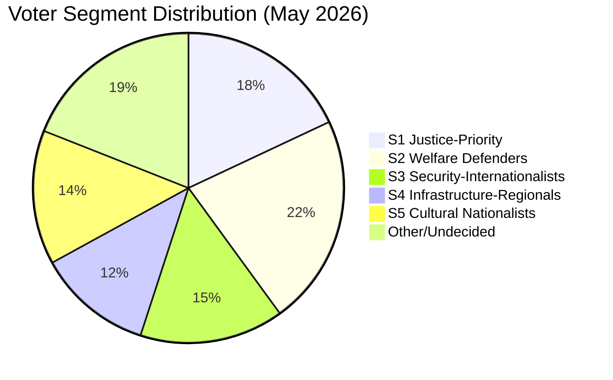

# Voter Segmentation Analysis — May 2026 Month Ahead

**Author**: James Pether Sörling  
**Date**: 2026-04-27

## Segmentation Framework

Five primary voter segments identified for May 2026 parliamentary context analysis.

## Segment Profiles

| Segment | Size | Key Issue May 2026 | Party Affiliation |
|---------|------|-------------------|-------------------|
| S1: Justice-Priority Voters | ~18% | Weapons law, prison construction | M, KD, SD |
| S2: Welfare-State Defenders | ~22% | Sick-pay day-180, social insurance | S, V |
| S3: Security-Internationalists | ~15% | Ukraine ratification, NATO solidarity | M, L, C |
| S4: Infrastructure-Regionals | ~12% | Södra stambanan, regional investment | S, C |
| S5: Cultural Nationalists | ~14% | Wind energy, immigration | SD |

## Segment Analysis by Key Document

**S1 (Justice-Priority)**: HD01JuU10 weapons ban + HD01CU25 prison construction are high-resonance. This segment rewards Tidö's legislative delivery. Risk: perceived inconsistency if weapons law restricts lawful hunters (rural S1 defection possible).

**S2 (Welfare-State Defenders)**: HD10450 sick-pay day-180 dispute directly mobilises this segment. The interpellation by S frames Tidö as attacking social insurance fundamentals. V amplifies with trade union support. High-activation segment for S in the September election.

**S3 (Security-Internationalists)**: HD03231/HD03232 Ukraine ratifications are unambiguous positives. This segment is already satisfied — low activation value for HD03231/HD03232 in isolation.

**S4 (Infrastructure-Regionals)**: HD10449 Södra stambanan interpellation is specifically designed to activate this segment. S's regional MPs in Skåne, Blekinge, Kronoberg face constituents experiencing direct infrastructure deficits. C also competes in this segment.

**S5 (Cultural Nationalists)**: HD10448 (wind energy disinformation interpellation) allows SD to position itself as defender of rural communities against urban "green elite" — segment activation for SD.

## Segment Shift Dynamics

The sick-pay day-180 issue (S2) and Södra stambanan (S4) are the most volatile segments for May 2026. Both activate opposition campaigns and have concrete, verifiable policy stakes. The justice cluster (S1) reinforces Tidö's existing base but has limited persuasion potential among undecided voters.

## Assessment

S's May 2026 interpellation strategy is optimally targeted: HD10450 (sick pay) activates S2, HD10449 (infrastructure) activates S4 — both are swing segments where S is competitive. The Tidö coalition's legislative delivery is strongest with S1 and S3 (already leaning coalition), with limited crossover appeal.
