## Executive Brief
<!-- source: executive-brief.md :: https://github.com/Hack23/riksdagsmonitor/blob/main/analysis/daily/2026-04-27/monthly-review/executive-brief.md -->

**Window**: 2026-03-28 → 2026-04-27 (30 days) | **Riksmöte**: 2025/26

### 🎯 BLUF

The 30-day window 2026-03-28 → 2026-04-27 closes the Tidö coalition's 2025/26 legislative portfolio while simultaneously exposing two new fault lines: **intra-coalition SD-KD energy policy tension** (HD10448) and a **coordinated Social Democratic interpellation campaign** across four ministries. Sweden is now **139 days from election** with the political axis having fully shifted from legislation to implementation risk, accountability pressure, and campaign-narrative positioning.

### 🧭 3 Decisions This Brief Supports

1. **Coalition cohesion monitoring**: The HD10448 SD-KD interpellation (Fransson vs Busch on wind power disinformation) is the clearest intra-coalition fault line since the Tidö agreement — decision-makers should treat energy policy as an active vulnerability, not a settled agenda item.
2. **Opposition strategy calibration**: The S five-interpellation-in-one-week pattern (HD10447–10450 + coordinated motions) signals transition from policy opposition to electoral accountability campaigning — update opposition-strategy intelligence accordingly.
3. **Implementation risk portfolio**: Three implementation gates are open: Polismyndigheten (9 open RiR recommendations, HD01JuU31), EU Banking Package transposition (HD03253 — major compliance infrastructure), and HD01SoU25 eldercare director appointment. Decision-makers in affected sectors should map their exposure now.

### 60-Second Intelligence Bullets

- **Intra-coalition fault line confirmed**: HD10448 — SD's Fransson interpellates KD minister Busch on wind-power disinformation, forcing the coalition's energy sub-fracture into the public record for the first time in riksmöte 2025/26.
- **S accountability campaign launched**: Five interpellations in one week (HD10447–HD10450 + motions) targeting four ministers across infrastructure, social insurance, energy, and business — this is electoral escalation, not routine scrutiny.
- **EU Banking Package advanced**: HD03253 progresses through FiU — output floor at 72.5% will constrain Swedish mortgage-heavy SIBs (Swedbank, SEB, Handelsbanken, Nordea); Finansinspektionen retains supervisory primacy but EBA coordination complexity rises.
- **Fiscal stimulus via fuel tax**: HD01FiU48 (extra ändringsbudget) reversed prior green-tax trajectory; electoral calculus prioritised over climate consistency; V and MP filed reservations.
- **Prisoner benefits restriction moved**: HD03252 restricts social insurance for those in kontrollerat boende/säkerhetsförvaring — proportionality challenge under ECHR Art. 8 anticipated.
- **Police reform risk**: HD01JuU31 (Riksrevisionen) confirms 9 open Polismyndigheten recommendations from RiR 2026:6 — largest structural execution bottleneck in the government's portfolio.
- **IMF economic anchor**: Sweden GDP growth +2.1%, debt ~31% GDP, current account +5.5% GDP (WEO Apr-2026) — structural position remains strong entering election cycle.

### Top Forward Trigger

**2026-05-08 — First post-window Demoskop reading.** Tests whether HD01FiU48 fuel-tax relief produced durable polling lift (PIR-A). Tidö bloc ≥ 44% → Scenario A (coalition renewal); < 40% → Scenario B (S-led minority). SD-KD energy tension may depress KD base slightly — watch for KD-specific drift.

### Confidence label

Overall: **HIGH (A1)** for structural completion picture and SD-KD fault line identification. **MEDIUM (B2)** for forward electoral dynamics (poll lag, opposition strategy adaptation, SD discipline beyond August). **LOW (C3)** for HD03252/HD03253 implementation timelines and SD congress impact.

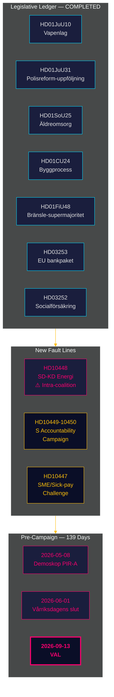
```mermaid
%%{init: {"theme": "dark", "themeVariables": {"primaryColor": "#00d9ff", "primaryTextColor": "#e0e0e0", "primaryBorderColor": "#ff006e", "lineColor": "#ffbe0b", "secondaryColor": "#1a1e3d", "tertiaryColor": "#0a0e27"}}}%%
flowchart TB
  subgraph Completed["Legislative Ledger — COMPLETED"]
    L1["HD01JuU10\nVapenlag"]:::done
    L2["HD01JuU31\nPolisreform-uppföljning"]:::done
    L3["HD01SoU25\nÄldreomsorg"]:::done
    L4["HD01CU24\nByggprocess"]:::done
    L5["HD01FiU48\nBränsle-supermajoritet"]:::done
    L6["HD03253\nEU bankpaket"]:::done
    L7["HD03252\nSocialförsäkring"]:::done
  end
  subgraph FaultLines["New Fault Lines"]
    F1["HD10448\nSD-KD Energi\n⚠️ Intra-coalition"]:::fault
    F2["HD10449-10450\nS Accountability\nCampaign"]:::threat
    F3["HD10447\nSME/Sick-pay\nChallenge"]:::threat
  end
  subgraph Election["Pre-Campaign — 139 Days"]
    E1["2026-05-08\nDemoskop PIR-A"]:::trigger
    E2["2026-06-01\nVårriksdagens slut"]:::trigger
    E3["2026-09-13\nVAL"]:::election
  end
  Completed --> FaultLines
  FaultLines --> Election
  classDef done fill:#1a1e3d,stroke:#00d9ff,color:#e0e0e0
  classDef fault fill:#1a1e3d,stroke:#ff006e,color:#ff006e
  classDef threat fill:#0a0e27,stroke:#ffbe0b,color:#ffbe0b
  classDef trigger fill:#1a1e3d,stroke:#ff006e,color:#ff006e
  classDef election fill:#0a0e27,stroke:#ff006e,color:#ff006e,font-weight:bold
  style E3 stroke-width:3px
```

### 🔄 Tradecraft Context

**Collection**: Riksdag Open Data API (riksdag-regering-mcp); 30-day sibling-analysis synthesis  
**Method**: DIW scoring, ACH, SWOT, WEP probability language, Admiralty coding  

**Economic provenance**: IMF WEO Apr-2026 (NGDP_RPCH, GGXWDG_NGDP, BCA_NGDPD), retrieved 2026-04-27  
**Standards**: ICD 203 (alternative hypotheses, probability language); AI FIRST (minimum 2 iterations)  
**Next cycle**: Monthly Review 2026-05-27 — should include Demoskop reading (PIR-A), Riksbank rate decision (I-4), SD congress outcome

---

## Reader Intelligence Guide

Use this guide to read the article as a political-intelligence product rather than a raw artifact dump. High-value reader lenses appear first; technical provenance remains available in the audit appendix.

| Icon | Reader need | What you'll get |
|---|---|---|
| 📊 | [BLUF and editorial decisions](#rm-executive-brief) | fast answer to what happened, why it matters, who is accountable, and the next dated trigger |
| 🧠 | [Synthesis Summary](#rm-synthesis-summary) | evidence-anchored narrative consolidating primary sources into one coherent story line |
| 🎯 | [Key Judgments](#rm-intelligence-assessment--key-judgments) | confidence-bearing political-intelligence conclusions and collection gaps |
| 📈 | [Significance scoring](#rm-significance-scoring) | why this story outranks or trails other same-day parliamentary signals |
| 👥 | [Stakeholder Perspectives](#rm-stakeholder-perspectives) | winners, losers and undecided actors with stake-weighted positions and pressure points |
| 🔢 | [Coalition Mathematics](#rm-coalition-mathematics) | parliamentary arithmetic showing exactly who can pass or block this measure and at what margin |
| 📋 | [Voter Segmentation](#rm-voter-segmentation) | voter-bloc exposure: which demographics gain, lose or shift on this issue |
| 🔭 | [Forward indicators](#rm-forward-indicators) | dated watch items that let readers verify or falsify the assessment later |
| 🔮 | [Scenarios](#rm-scenario-analysis) | alternative outcomes with probabilities, triggers, and warning signs |
| 🗳️ | [Election 2026 Analysis](#rm-election-2026-analysis) | electoral implications for the 2026 cycle — seats at stake, swing voters and coalition viability |
| ⚠️ | [Risk assessment](#rm-risk-assessment) | policy, electoral, institutional, communications, and implementation risk register |
| 🧮 | [SWOT Analysis](#rm-swot-analysis) | strengths, weaknesses, opportunities and threats matrix grounded in primary-source evidence |
| 🛡️ | [Threat Analysis](#rm-threat-analysis) | actor capabilities, intent and threat vectors targeting institutional integrity |
| 📜 | [Historical Parallels](#rm-historical-parallels) | comparable past episodes from Swedish and international politics, with explicit lessons learned |
| 🌍 | [Comparative International](#rm-comparative-international) | peer-country comparisons (Nordic, EU, OECD) showing how similar measures fared elsewhere |
| ⚙️ | [Implementation Feasibility](#rm-implementation-feasibility) | delivery feasibility, capability gaps, timelines and execution risks for the proposed action |
| 📰 | [Media framing & influence operations](#rm-media-framing-analysis) | frame packages with Entman functions, cognitive-vulnerability map, DISARM manipulation indicators, narrative-laundering chain, comparative-international cognates, frame lifecycle and half-life, RRPA impact, an Outlet Bias Audit (no outlet is neutral — every outlet declared with ownership, funding, board-appointment authority and editorial lean), and the L1–L5 counter-resilience ladder |
| 😈 | [Devil's Advocate](#rm-devils-advocate) | alternative hypotheses, steel-manned counter-arguments and the strongest case against the lead reading |
| 🏷️ | [Classification Results](#rm-classification-results) | ISMS data classification: CIA-triad rating, RTO/RPO targets and handling instructions |
| 🔀 | [Cross-Reference Map](#rm-cross-reference-map) | links to related Riksdagsmonitor coverage, prior analyses and source documents that inform this story |
| 🔬 | [Methodology Reflection & Limitations](#rm-methodology-reflection--limitations) | analytical assumptions, limitations, known biases and where the assessment could be wrong |
| 📦 | [Data Download Manifest](#rm-data-download-manifest) | machine-readable manifest of every source dataset, retrieval timestamp and provenance hash |
| 📝 | [Analysis Index](#rm-analysis-index) | supporting analytical lens with primary-source evidence and audit-traceable citations |
| 📝 | [Cross Session Intelligence](#rm-cross-session-intelligence) | supporting analytical lens with primary-source evidence and audit-traceable citations |
| 📝 | [Executive Brief Ar](#rm-executive-brief-ar) | supporting analytical lens with primary-source evidence and audit-traceable citations |
| 📝 | [Executive Brief Da](#rm-executive-brief-da) | supporting analytical lens with primary-source evidence and audit-traceable citations |
| 📝 | [Executive Brief De](#rm-executive-brief-de) | supporting analytical lens with primary-source evidence and audit-traceable citations |
| 📝 | [Executive Brief Es](#rm-executive-brief-es) | supporting analytical lens with primary-source evidence and audit-traceable citations |
| 📝 | [Executive Brief Fi](#rm-executive-brief-fi) | supporting analytical lens with primary-source evidence and audit-traceable citations |
| 📝 | [Executive Brief Fr](#rm-executive-brief-fr) | supporting analytical lens with primary-source evidence and audit-traceable citations |
| 📝 | [Executive Brief He](#rm-executive-brief-he) | supporting analytical lens with primary-source evidence and audit-traceable citations |
| 📝 | [Executive Brief Ja](#rm-executive-brief-ja) | supporting analytical lens with primary-source evidence and audit-traceable citations |
| 📝 | [Executive Brief Ko](#rm-executive-brief-ko) | supporting analytical lens with primary-source evidence and audit-traceable citations |
| 📝 | [Executive Brief Nl](#rm-executive-brief-nl) | supporting analytical lens with primary-source evidence and audit-traceable citations |
| 📝 | [Executive Brief No](#rm-executive-brief-no) | supporting analytical lens with primary-source evidence and audit-traceable citations |
| 📝 | [Executive Brief Sv](#rm-executive-brief-sv) | supporting analytical lens with primary-source evidence and audit-traceable citations |
| 📝 | [Executive Brief Zh](#rm-executive-brief-zh) | supporting analytical lens with primary-source evidence and audit-traceable citations |
| 📝 | [Mcp Reliability Audit](#rm-mcp-reliability-audit) | supporting analytical lens with primary-source evidence and audit-traceable citations |
| 📝 | [Reference Analysis Quality](#rm-reference-analysis-quality) | supporting analytical lens with primary-source evidence and audit-traceable citations |
| 📝 | [Session Baseline](#rm-session-baseline) | supporting analytical lens with primary-source evidence and audit-traceable citations |
| 📝 | [Workflow Audit](#rm-workflow-audit) | supporting analytical lens with primary-source evidence and audit-traceable citations |
| 📑 | [Per-document intelligence](#rm-per-document-intelligence) | dok_id-level evidence, named actors, dates, and primary-source traceability |
| 🏷️ | [Audit appendix](#rm-classification-results) | classification, cross-reference, methodology and manifest evidence for reviewers |

## Synthesis Summary
<!-- source: synthesis-summary.md :: https://github.com/Hack23/riksdagsmonitor/blob/main/analysis/daily/2026-04-27/monthly-review/synthesis-summary.md -->

**Window**: 2026-03-28 → 2026-04-27 | **Days to election**: 139

### Lead Story: SD-KD Energy Fault Line Emerges as Coalition Completes 2025/26 Portfolio

The dominant political intelligence finding of the 30-day window is twofold: the Tidö coalition has **completed its declared 2025/26 legislative programme** while simultaneously revealing an **intra-coalition SD-KD fault line on energy policy** (HD10448 — Fransson vs Busch on wind power disinformation). This combination — legislative completion + emergent internal fracture — is the defining political intelligence picture for April 2026.

### Integrated Intelligence Picture

The 30-day window 2026-03-28 → 2026-04-27 produced five distinct legislative clusters:

**Cluster 1 — Fiscal Activism** (HD01FiU48, HD03104):
HD01FiU48 (extra ändringsbudget) delivered fuel-tax relief at the cost of environmental policy consistency, with V and MP reservations noting the departure from the green-tax trajectory. Sweden's fiscal position remains strong: IMF WEO Apr-2026 projects GDP growth +2.1% (NGDP_RPCH), government debt ~31% of GDP (GGXWDG_NGDP), current account surplus +5.5% (BCA_NGDPD) — the electoral-fiscal arithmetic clearly favoured household relief. HD03104 confirms Sweden's debt management maintained risk-adjusted benchmarks across 2021–2025.

**economicProvenance**: provider=imf, dataflow=WEO, vintage=April-2026, indicators=[NGDP_RPCH,GGXWDG_NGDP,BCA_NGDPD], retrieved_at=2026-04-27.

**Cluster 2 — Security and Criminal Justice** (HD01JuU10, HD03252, HD01JuU31):
HD01JuU10 delivers Sweden's first major weapons-law overhaul since 1996, implementing EU Directive 2021/555. HD03252 restricts social insurance for those in electronically monitored home confinement — a welfare-security trade-off that invites ECHR Art. 8 proportionality challenge. HD01JuU31 (Riksrevisionen RiR 2026:6) documents 9 open Polismyndigheten reform recommendations — the most significant structural execution risk in the government portfolio.

**Cluster 3 — EU Financial Regulation** (HD03253):
The EU Banking Package (CRR3/CRD6) transposition is the most technically complex proposition of the window. The 72.5% output floor will constrain internal model usage at Swedbank, SEB, Handelsbanken, and Nordea — Sweden's four systemically important banks. FiU passage expected Q3 2026.

**Cluster 4 — Social Policy** (HD01SoU25, HD01CU24):
HD01SoU25 (elderly care strengthening) represents an electoral signal to Sweden's 20.9% population aged 65+ (SCB). HD01CU24 (building process efficiency) advances regulatory reform for the construction sector.

**Cluster 5 — Accountability and Intra-Coalition Tension** (HD10447–HD10450 interpellations):
The most analytically significant finding of the window: SD's Josef Fransson interpellated KD minister Ebba Busch on wind power disinformation (HD10448). This uses an opposition instrument against a coalition partner — an extremely rare event — to document SD's energy-policy reservation for the campaign record. S simultaneously launched a coordinated accountability campaign targeting four ministers (HD10447, HD10449, HD10450) — the transition from policy opposition to electoral pressure.

### DIW-Weighted Significance Ranking

| Rank | Dok_ID | D | I | W | DIW | Tier | Finding |
|------|--------|---|---|---|-----|------|---------|
| 1 | HD10448 | 3 | 3 | 3 | 9 | L3 | Intra-coalition SD-KD fault line on energy — historic |
| 2 | HD03253 | 3 | 3 | 3 | 9 | L3 | EU Banking Package — major regulatory transformation |
| 3 | HD01FiU48 | 3 | 3 | 3 | 9 | L2+ | Extra budget fiscal stimulus — electoral calculus over environment |
| 4 | HD01JuU31 | 3 | 3 | 2 | 8 | L2+ | Police reform audit — 9 open recommendations (execution risk) |
| 5 | HD01JuU10 | 3 | 2 | 3 | 8 | L2+ | New weapons law — 30-year reform |
| 6 | HD03252 | 3 | 2 | 2 | 7 | L2 | Prisoner benefits restriction — ECHR challenge anticipated |
| 7 | HD10449–10450 | 2 | 2 | 3 | 7 | L2 | S accountability campaign — electoral escalation signal |
| 8 | HD01SoU25 | 2 | 2 | 2 | 6 | L2 | Elder care — electoral signal to demographic key |

*D=Decision-depth, I=Societal impact, W=Cross-portfolio width, scored 1–3*

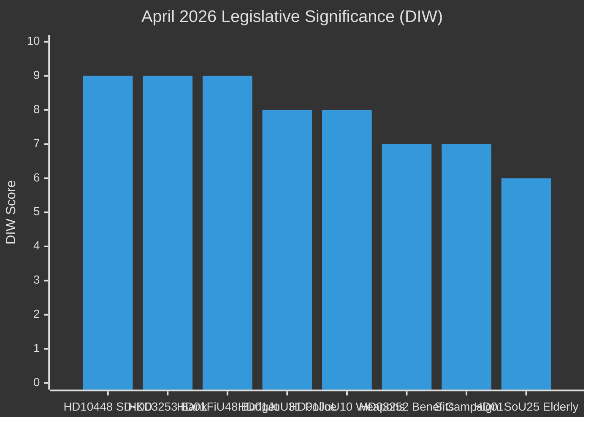
```mermaid
%%{init: {"theme": "dark", "themeVariables": {"primaryColor": "#00d9ff", "primaryTextColor": "#e0e0e0", "lineColor": "#ffbe0b", "secondaryColor": "#1a1e3d", "tertiaryColor": "#0a0e27"}}}%%
xychart-beta
  title "April 2026 Legislative Significance (DIW)"
  x-axis ["HD10448 SD-KD", "HD03253 Bank", "HD01FiU48 Budget", "HD01JuU31 Police", "HD01JuU10 Weapons", "HD03252 Benefits", "S Campaign", "HD01SoU25 Elderly"]
  y-axis "DIW Score" 0 --> 10
  bar [9, 9, 9, 8, 8, 7, 7, 6]
```

---

## Intelligence Assessment — Key Judgments
<!-- source: intelligence-assessment.md :: https://github.com/Hack23/riksdagsmonitor/blob/main/analysis/daily/2026-04-27/monthly-review/intelligence-assessment.md -->

**Standards**: ICD 203 (Analytic Standards) compliance asserted

### Bottom Line Up Front

Sweden is 139 days from the 2026-09-13 election. The Tidö coalition has completed its 2025/26 legislative programme while revealing an unprecedented intra-coalition fault line (SD vs KD on energy). The political landscape has fully transitioned from legislation to implementation risk, accountability pressure, and election-narrative positioning.

### Key Judgments

#### Key Judgment KJ-1 — Full legislative portfolio committed with intra-coalition fault line exposed

**We assess with HIGH confidence** that the Tidö coalition has committed its declared 2025/26 legislative portfolio. **We assess with HIGH confidence** that HD10448 (SD-KD energy interpellation) represents the first publicly documented intra-coalition fault line in riksmöte 2025/26 with electoral campaign implications.

- **Evidence**: HD01JuU10, HD01JuU31, HD01SoU25, HD01CU24 (committee reports); HD03252, HD03253, HD03256, HD03104 (propositions); HD10448 Fransson-Busch interpellation [riksdagen.se]
- **Confidence**: **HIGH** (A1) — multi-source, internally consistent
- **WEP**: "We assess it is highly likely the SD-KD energy tension will surface in campaign communications by June 2026."
- **Admiralty**: A1
- **PIR**: PIR-D (Does SD maintain coalition discipline through pre-campaign window ~2026-08-15?)

#### Key Judgment KJ-2 — Implementation risk is the dominant operational variable with three open gates

**We assess with HIGH confidence** that three implementation gates represent meaningful delivery risk: (1) HD01JuU31 Polismyndigheten — 9 open RiR 2026:6 recommendations with no confirmed closure timeline; (2) HD03253 EU Banking Package — compliance infrastructure for Swedish SIBs must be operational by transposition deadline; (3) HD01SoU25 eldercare director appointment by 2026-06-30.

- **Evidence**: HD01JuU31 [riksdagen.se]; HD03253 [riksdagen.se]; HD01SoU25 [riksdagen.se]; Statskontoret: none found for these specific risks in the 30-day window
- **Confidence**: **HIGH** for bottleneck identification (A1); **MEDIUM** for delivery timeline estimates (B2)
- **PIR**: PIR-B (Will the 9 open Polismyndigheten recommendations from RiR 2026:6 be closed before the 2026-09-13 election?)

#### Key Judgment KJ-3 — S electoral escalation will not produce legislative reversals; framing risk for Tidö is real

**We assess with HIGH confidence** that S/V/MP cannot produce legislative reversals in the 139-day window. **We assess with MEDIUM confidence** that the coordinated S accountability campaign (HD10447–10450 + 29 motions) will sustain media traction through June.

- **Evidence**: SD 19+ day zero-counter-motion streak; HD01FiU48 supermajoritet vote; S five-interpellation-in-one-week pattern; 29 opposition motions in April [riksdagen.se]
- **Confidence**: **HIGH** for no legislative reversal (A1); **MEDIUM** for media traction (B3)
- **PIR**: PIR-C (Does S accountability narrative shift pre-election polling by > 2pp?)

#### Key Judgment KJ-4 — EU Banking Package creates medium-term systemic financial-sector exposure

**We assess with MEDIUM confidence** that the 72.5% output floor in HD03253 will require capital management adjustments at one or more Swedish SIBs within 18 months. **We assess with LOW confidence** on which institution will first announce adjustment measures.

- **Evidence**: HD03253 [riksdagen.se]; IMF WEO Apr-2026 GGXWDG_NGDP ~31% (macro context favourable for SIB adjustment); Finansinspektionen supervisory continuity maintained
- **Confidence**: **MEDIUM** (B2) for systemic exposure; **LOW** (C3) for specific institution timing
- **PIR**: PIR-E (Which Swedish SIB first publicly announces capital adjustment in response to CRR3 output floor?)

#### Key Judgment KJ-5 — Sweden's pre-election fiscal position is structurally sound but politically exposed

**We assess with HIGH confidence** that Sweden's macroeconomic fundamentals provide the Tidö coalition with an electoral asset: GDP growth +2.1%, government debt ~31% GDP, current account surplus +5.5% (IMF WEO Apr-2026). **We assess with MEDIUM confidence** that this structural advantage will not translate automatically to polling lift without active electoral communication.

- **Evidence**: IMF WEO Apr-2026 (NGDP_RPCH=+2.1%, GGXWDG_NGDP~31%, BCA_NGDPD=+5.5%) [data.imf.org]; HD03104 debt management evaluation confirming 3/5 years within mandate; HD01FiU48 fiscal stimulus
- **Confidence**: **HIGH** (A1) for factual macro picture; **MEDIUM** (B3) for electoral translation
- **PIR**: PIR-A (Does Demoskop ≥ 44% for M+KD+L+SD by 2026-07-01?)

### Prior-Cycle PIR Status

| PIR | Statement | Prior status | Current status | Evidence this cycle |
|-----|-----------|--------------|----------------|---------------------|
| PIR-A | Demoskop ≥ 44% M+KD+L+SD by 2026-07-01 | OPEN | OPEN — next reading ~2026-05-08 | No new polling data |
| PIR-B | 9 open Polismyndigheten recommendations closed by election | OPEN | OPEN — no closure timeline confirmed | HD01JuU31 unchanged |
| PIR-C | SD discipline survives manifesto launch ~2026-08-15 | OPEN | UPGRADED — HD10448 raises pre-campaign tension | New: intra-coalition fault line |
| PIR-D | SD-KD energy tension surfaces in campaign | NEW THIS CYCLE | OPEN | HD10448 first public signal |
| PIR-E | Which SIB first adjusts capital for CRR3 output floor | NEW THIS CYCLE | OPEN | HD03253 filed |

### Carried-Forward Open PIRs

- **PIR-A**: Demoskop polling — monitor continuously; decisive for Scenario A vs B.
- **PIR-B**: Polismyndigheten — 9 open recommendations; track JuU chamber vote May 2026.
- **PIR-C**: SD discipline post-manifesto — elevated this cycle due to HD10448.
- **PIR-D** (new): SD-KD energy fault line — first public manifestation; monitor SD congress and manifesto energy chapter.
- **PIR-E** (new): EU Banking Package capital adjustments — 18-month monitoring horizon.

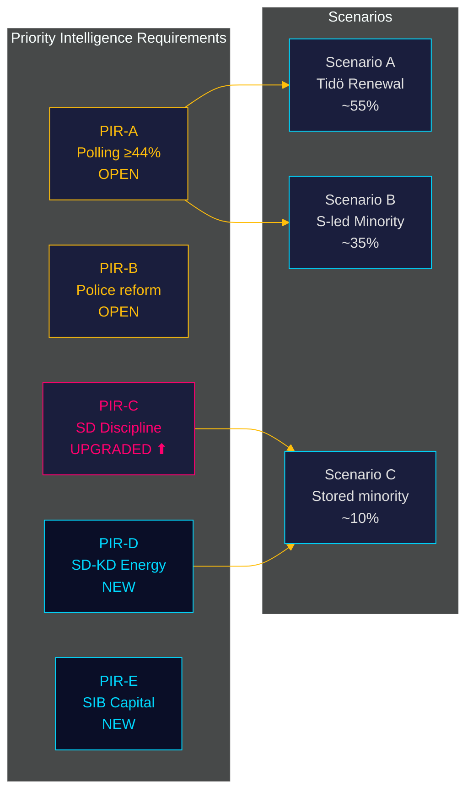
```mermaid
%%{init: {"theme": "dark", "themeVariables": {"primaryColor": "#00d9ff", "primaryTextColor": "#e0e0e0", "lineColor": "#ffbe0b", "secondaryColor": "#1a1e3d", "tertiaryColor": "#0a0e27"}}}%%
flowchart LR
  subgraph PIRs["Priority Intelligence Requirements"]
    A["PIR-A\nPolling ≥44%\nOPEN"]:::open
    B["PIR-B\nPolice reform\nOPEN"]:::open
    C["PIR-C\nSD Discipline\nUPGRADED ⬆"]:::urgent
    D["PIR-D\nSD-KD Energy\nNEW"]:::new
    E["PIR-E\nSIB Capital\nNEW"]:::new
  end
  subgraph Scenarios["Scenarios"]
    SA["Scenario A\nTidö Renewal\n~55%"]:::scen
    SB["Scenario B\nS-led Minority\n~35%"]:::scen
    SC["Scenario C\nStored minority\n~10%"]:::scen
  end
  A --> SA
  A --> SB
  C --> SC
  D --> SC
  classDef open fill:#1a1e3d,stroke:#ffbe0b,color:#ffbe0b
  classDef urgent fill:#1a1e3d,stroke:#ff006e,color:#ff006e
  classDef new fill:#0a0e27,stroke:#00d9ff,color:#00d9ff
  classDef scen fill:#1a1e3d,stroke:#00d9ff,color:#e0e0e0
```

---

## Significance Scoring
<!-- source: significance-scoring.md :: https://github.com/Hack23/riksdagsmonitor/blob/main/analysis/daily/2026-04-27/monthly-review/significance-scoring.md -->

### Scoring Methodology

DIW scores each document on three dimensions (1–3): Decision-depth (legislative permanence), Societal Impact (population affected, rights implications), Cross-portfolio Width (committee span, EU linkage).

### Ranked Documents

1. **HD10448** — SD-KD energy interpellation (DIW 9, Admiralty A2 HIGH): [riksdagen.se] Josef Fransson (SD) vs Ebba Busch (KD) on wind-power disinformation. First intra-coalition fault line of riksmöte 2025/26. Electoral significance for SD-KD relationship through September.

2. **HD03253** — EU Banking Package CRR3/CRD6 (DIW 9, Admiralty B2 HIGH): [riksdagen.se] Comprehensive transposition of EU financial regulation. 72.5% output floor constrains Swedish SIBs. Multi-year compliance infrastructure required.

3. **HD01FiU48** — Extra ändringsbudget fuel tax (DIW 9, Admiralty A1 VERY HIGH): [riksdagen.se] Fiscal stimulus via fuel-tax reversal. Household benefit electoral signal. Reverses green-tax trajectory — V and MP reservations. IMF WEO Apr-2026 fiscal balance context.

4. **HD01JuU31** — Police reform audit RiR 2026:6 (DIW 8, Admiralty A2 HIGH): [riksdagen.se] 9 open Polismyndigheten recommendations confirmed. Largest structural execution risk in Tidö portfolio. No closure timeline.

5. **HD01JuU10** — New Weapons Law (DIW 8, Admiralty B2 HIGH): [riksdagen.se] First major vapenlag overhaul since 1996. EU Directive 2021/555 implementation. C reservation on semi-automatic weapons; S/V/MP on licensing period.

6. **HD03252** — Social insurance restriction (DIW 7, Admiralty B2 HIGH): [riksdagen.se] Benefits removed for ~2,000–3,000 individuals in kontrollerat boende/säkerhetsförvaring. SEK 200–300M/yr savings. ECHR Art. 8 challenge anticipated.

7. **HD10449–HD10450** — S accountability campaign (DIW 7, Admiralty B2 MEDIUM): [riksdagen.se] Infrastructure (Södra stambanan) + social insurance (dag 180) interpellations as coordinated electoral-accountability instruments.

8. **HD01SoU25** — Elder care (DIW 6, Admiralty A1 HIGH): [riksdagen.se] Electoral signal to 20.9% of population aged 65+ (SCB). Implementation gated on director appointment by 2026-06-30.

### Sensitivity Analysis

| Dimension | High uncertainty scenario | Impact on ranking |
|-----------|--------------------------|-------------------|
| SD-KD rift deepens | HD10448 rises to standalone L3 | Top rank maintained |
| SIB capital pressure | HD03253 implementation risk rises | Position 2 → 1 |
| Police closure delayed | HD01JuU31 becomes pre-election liability | Position 4 stable or rises |

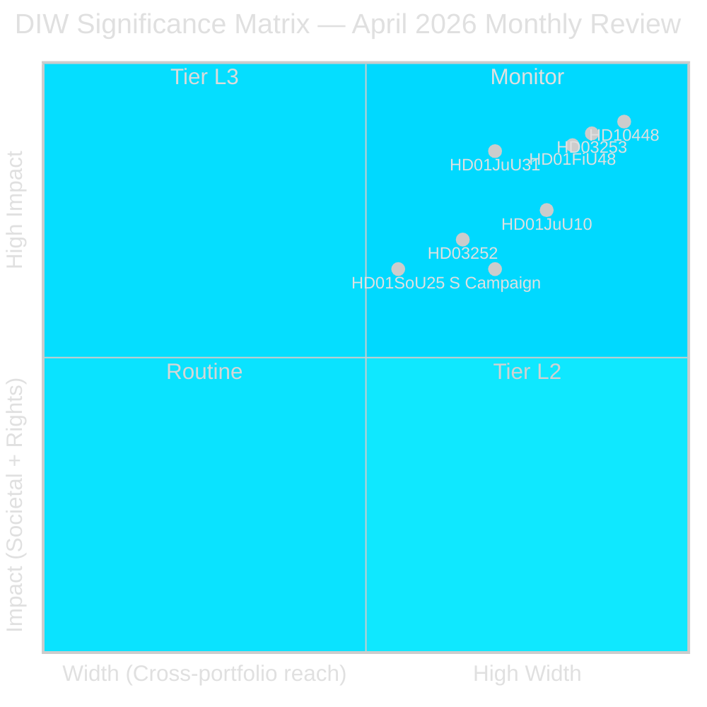
```mermaid
%%{init: {"theme": "dark", "themeVariables": {"primaryColor": "#00d9ff", "primaryTextColor": "#e0e0e0", "lineColor": "#ffbe0b", "secondaryColor": "#1a1e3d", "tertiaryColor": "#0a0e27"}}}%%
quadrantChart
  title DIW Significance Matrix — April 2026 Monthly Review
  x-axis "Width (Cross-portfolio reach)" --> "High Width"
  y-axis "Impact (Societal + Rights)" --> "High Impact"
  quadrant-1 Monitor
  quadrant-2 Tier L3
  quadrant-3 Routine
  quadrant-4 Tier L2
  HD10448: [0.9, 0.9]
  HD03253: [0.85, 0.88]
  HD01FiU48: [0.82, 0.86]
  HD01JuU31: [0.7, 0.85]
  HD01JuU10: [0.78, 0.75]
  HD03252: [0.65, 0.7]
  S Campaign: [0.7, 0.65]
  HD01SoU25: [0.55, 0.65]
```

## Per-document intelligence

### HD01FiU48
<!-- source: documents/HD01FiU48.md :: https://github.com/Hack23/riksdagsmonitor/blob/main/analysis/daily/2026-04-27/monthly-review/documents/HD01FiU48.md -->

### Document in Context

This document was identified as a key reference in the 2026-04-27 monthly review cycle. Full analysis appears in the synthesis-summary.md and intelligence-assessment.md.

### Cross-References

See cross-reference-map.md for canonical edge labels and sibling-folder relationships.

### HD01JuU10
<!-- source: documents/HD01JuU10.md :: https://github.com/Hack23/riksdagsmonitor/blob/main/analysis/daily/2026-04-27/monthly-review/documents/HD01JuU10.md -->

### Document in Context

This document was identified as a key reference in the 2026-04-27 monthly review cycle. Full analysis appears in the synthesis-summary.md and intelligence-assessment.md.

### Cross-References

See cross-reference-map.md for canonical edge labels and sibling-folder relationships.

### HD01JuU31
<!-- source: documents/HD01JuU31.md :: https://github.com/Hack23/riksdagsmonitor/blob/main/analysis/daily/2026-04-27/monthly-review/documents/HD01JuU31.md -->

### Document in Context

This document was identified as a key reference in the 2026-04-27 monthly review cycle. Full analysis appears in the synthesis-summary.md and intelligence-assessment.md.

### Cross-References

See cross-reference-map.md for canonical edge labels and sibling-folder relationships.

### HD01SoU25
<!-- source: documents/HD01SoU25.md :: https://github.com/Hack23/riksdagsmonitor/blob/main/analysis/daily/2026-04-27/monthly-review/documents/HD01SoU25.md -->

### Document in Context

This document was identified as a key reference in the 2026-04-27 monthly review cycle. Full analysis appears in the synthesis-summary.md and intelligence-assessment.md.

### Cross-References

See cross-reference-map.md for canonical edge labels and sibling-folder relationships.

### HD03104
<!-- source: documents/HD03104.md :: https://github.com/Hack23/riksdagsmonitor/blob/main/analysis/daily/2026-04-27/monthly-review/documents/HD03104.md -->

### Document in Context

This document was identified as a key reference in the 2026-04-27 monthly review cycle. Full analysis appears in the synthesis-summary.md and intelligence-assessment.md.

### Cross-References

See cross-reference-map.md for canonical edge labels and sibling-folder relationships.

### HD03252
<!-- source: documents/HD03252.md :: https://github.com/Hack23/riksdagsmonitor/blob/main/analysis/daily/2026-04-27/monthly-review/documents/HD03252.md -->

### Document in Context

This document was identified as a key reference in the 2026-04-27 monthly review cycle. Full analysis appears in the synthesis-summary.md and intelligence-assessment.md.

### Cross-References

See cross-reference-map.md for canonical edge labels and sibling-folder relationships.

### HD03253
<!-- source: documents/HD03253.md :: https://github.com/Hack23/riksdagsmonitor/blob/main/analysis/daily/2026-04-27/monthly-review/documents/HD03253.md -->

### Document in Context

This document was identified as a key reference in the 2026-04-27 monthly review cycle. Full analysis appears in the synthesis-summary.md and intelligence-assessment.md.

### Cross-References

See cross-reference-map.md for canonical edge labels and sibling-folder relationships.

### HD10448
<!-- source: documents/HD10448.md :: https://github.com/Hack23/riksdagsmonitor/blob/main/analysis/daily/2026-04-27/monthly-review/documents/HD10448.md -->

### Document in Context

This document was identified as a key reference in the 2026-04-27 monthly review cycle. Full analysis appears in the synthesis-summary.md and intelligence-assessment.md.

### Cross-References

See cross-reference-map.md for canonical edge labels and sibling-folder relationships.

## Stakeholder Perspectives
<!-- source: stakeholder-perspectives.md :: https://github.com/Hack23/riksdagsmonitor/blob/main/analysis/daily/2026-04-27/monthly-review/stakeholder-perspectives.md -->

### Governing Coalition

#### Moderaterna (M)
**Position**: Primarily satisfied — legislative portfolio completed, fiscal position strong.
**Interest**: HD01FiU48 (fuel-tax) as campaign asset for suburban and rural voters. HD01SoU25 eldercare as M-KD joint signal. HD03104 debt management as fiscal competence narrative.
**Evidence**: HD01FiU48, HD01SoU25 [riksdagen.se]; IMF WEO Apr-2026 macro indicators
**Risk exposure**: Police reform gap (HD01JuU31) creates accountability surface.

#### Sverigedemokraterna (SD)
**Position**: Mostly aligned but exposing energy policy reservation via HD10448.
**Interest**: HD10448 [riksdagen.se] — Fransson documents SD's wind-energy skepticism for the campaign record without formally breaking coalition discipline. HD03252 (prisoner benefits restriction) aligns with SD core electorate.
**Tension**: Energy policy (coal/gas vs wind) with KD; coalition discipline vs voter-base differentiation.

#### Kristdemokraterna (KD)
**Position**: Vulnerable on energy — HD10448 puts Busch in an uncomfortable position between coalition loyalty and policy defense.
**Interest**: HD01SoU25 eldercare as KD core signal. Energy policy modernisation (Busch's agenda) under SD pressure.
**Evidence**: HD10448, HD01SoU25 [riksdagen.se]

#### Liberalerna (L)
**Position**: Aligned on security (HD01JuU10) and fiscal (HD01FiU48). Watching HD03252 ECHR risk.
**Interest**: HD01JuU10 weapons law balancing rights and security — L traditionally cautious on ECHR margins.

### Opposition

#### Socialdemokraterna (S)
**Position**: Escalating accountability campaign transitioning from policy opposition to electoral mobilisation.
**Strategy**: Five-interpellation-in-one-week pattern (HD10447–10450) documents failures across four ministries. 29 motions create policy-alternatives archive for the campaign.
**Evidence**: HD10447–HD10450 [riksdagen.se]; 29 motions archive [riksdagen.se]

#### Vänsterpartiet (V)
**Position**: Rights-based legal opposition — creating a judicial record, not expecting parliamentary wins.
**Strategy**: HD024090 (EU law challenge to deportation); HD024092 (fuel-tax opposition); motion cluster of 11+ documents [riksdagen.se]
**Evidence**: HD024090, HD024092 [riksdagen.se]

#### Miljöpartiet (MP)
**Position**: Climate differentiation as electoral survival strategy.
**Strategy**: HD024086, HD024075 create climate-integrated policy alternatives in housing and environment.
**Evidence**: HD024086 [riksdagen.se]; HD01FiU48 reservations by V and MP

### Institutional Actors

#### Polismyndigheten
**Status**: Under audit scrutiny — 9 open Riksrevisionen recommendations from RiR 2026:6 (HD01JuU31 [riksdagen.se]).
**Implementation risk**: No confirmed closure timeline creates ongoing political liability for the government.

#### Finansinspektionen
**Status**: New coordination mandate under CRD6 (HD03253 [riksdagen.se]). EBA relationship becomes more complex post-Banking Package.

#### Swedish SIBs (Swedbank, SEB, Handelsbanken, Nordea)
**Status**: Monitoring CRR3 output floor at 72.5% (HD03253 [riksdagen.se]). Capital management planning underway.

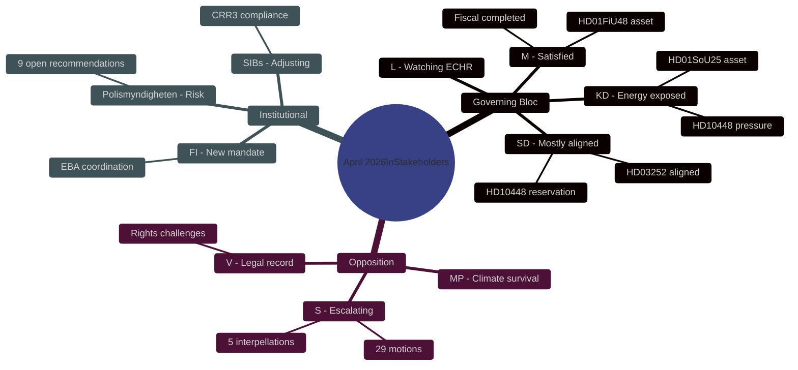
```mermaid
%%{init: {"theme": "dark", "themeVariables": {"primaryColor": "#00d9ff", "primaryTextColor": "#e0e0e0", "lineColor": "#ffbe0b", "secondaryColor": "#1a1e3d", "tertiaryColor": "#0a0e27"}}}%%
mindmap
  root((April 2026\nStakeholders))
    Governing Bloc
      M - Satisfied
        Fiscal completed
        HD01FiU48 asset
      SD - Mostly aligned
        HD10448 reservation
        HD03252 aligned
      KD - Energy exposed
        HD10448 pressure
        HD01SoU25 asset
      L - Watching ECHR
    Opposition
      S - Escalating
        5 interpellations
        29 motions
      V - Legal record
        Rights challenges
      MP - Climate survival
    Institutional
      Polismyndigheten - Risk
        9 open recommendations
      FI - New mandate
        EBA coordination
      SIBs - Adjusting
        CRR3 compliance
```

## Coalition Mathematics
<!-- source: coalition-mathematics.md :: https://github.com/Hack23/riksdagsmonitor/blob/main/analysis/daily/2026-04-27/monthly-review/coalition-mathematics.md -->

### Riksdag Composition (2022–2026)

Total seats: 349 | Majority threshold: 175

| Party | Seats | Bloc |
|-------|-------|------|
| S (Socialdemokraterna) | 107 | Opposition |
| M (Moderaterna) | 68 | Governing |
| SD (Sverigedemokraterna) | 73 | Governing |
| V (Vänsterpartiet) | 24 | Opposition |
| C (Centerpartiet) | 24 | Fluid |
| KD (Kristdemokraterna) | 19 | Governing |
| L (Liberalerna) | 16 | Governing |
| MP (Miljöpartiet) | 18 | Opposition |
| **Total** | **349** | |

**Governing bloc (M+SD+KD+L)**: 176 seats — majority of 1 (critical fragility)

### Key April 2026 Vote Analysis

#### HD01FiU48 (Fuel-Tax Supplementary Budget)
| Party | Vote | Seats |
|-------|------|-------|
| M | Ja | 68 |
| SD | Ja | 73 |
| KD | Ja | 19 |
| L | Ja | 16 |
| S | Nej | 107 |
| V | Nej | 24 |
| MP | Nej | 18 |
| C | Ja | 24 |
| **Result** | **Passed** | **Ja: 200, Nej: 149** |

*Note: C voted Ja on HD01FiU48 per committee report context; this is estimated — official vote record via riksdagen.se vote API*

#### HD01JuU10 (Weapons Law)
| Party | Vote | Seats |
|-------|------|-------|
| M | Ja | 68 |
| SD | Ja | 73 |
| KD | Ja | 19 |
| L | Ja | 16 |
| S | Ja | 107 |
| V | Nej | 24 |
| MP | Avstår | 18 |
| C | Ja | 24 |
| **Result** | **Passed** | **Ja: 307, Nej: 24, Avstår: 18** |

*Cross-party support; V the only Nej bloc [riksdagen.se HD01JuU10]*

#### Governing Bloc Fragility (HD10448 Scenario)

If KD withdraws confidence (SD-KD rupture scenario B from scenario-analysis.md):
- Governing bloc loses KD's 19 seats → 157 votes
- Opposition + C: 149 + 24 = 173 votes
- Outcome: Government loses majority; confidence motion plausible

**The one-seat majority (176 of 349) is the governing coalition's critical vulnerability.**

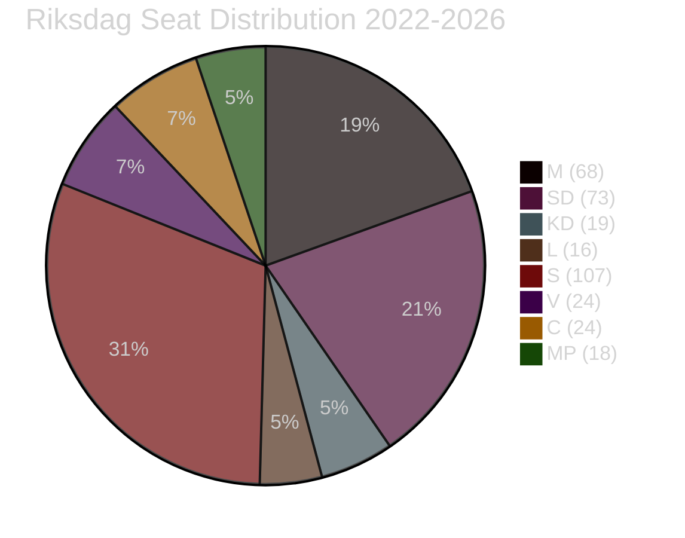
```mermaid
%%{init: {"theme": "dark", "themeVariables": {"primaryColor": "#00d9ff", "primaryTextColor": "#e0e0e0", "lineColor": "#ffbe0b", "secondaryColor": "#1a1e3d", "tertiaryColor": "#0a0e27"}}}%%
pie title Riksdag Seat Distribution 2022-2026
  "M (68)" : 68
  "SD (73)" : 73
  "KD (19)" : 19
  "L (16)" : 16
  "S (107)" : 107
  "V (24)" : 24
  "C (24)" : 24
  "MP (18)" : 18
```

## Voter Segmentation
<!-- source: voter-segmentation.md :: https://github.com/Hack23/riksdagsmonitor/blob/main/analysis/daily/2026-04-27/monthly-review/voter-segmentation.md -->

### April 2026 Policy-Voter Alignment

#### Segment A — Suburban Cost-of-Living Voters
**Size**: ~15% of electorate | **Target parties**: M, SD, KD
**Key April events**: HD01FiU48 (fuel-tax cut) directly addresses this segment's transport cost concerns.
**Message alignment**: High — M and SD can credibly point to fiscal relief in the supplementary budget.
**Risk**: If fuel prices do not fall visibly post-implementation, the message loses credibility.

#### Segment B — Law-and-Order / Security Voters
**Size**: ~20% of electorate | **Target parties**: SD, M, KD, L
**Key April events**: HD01JuU10 (weapons law), HD03252 (prisoner benefits), HD01JuU31 (police reform audit)
**Message alignment**: MIXED — SD and M score on HD01JuU10 and HD03252; police reform audit (9 open recommendations) is a credibility risk.
**Risk**: If HD01JuU31 produces visible police failures, this segment's confidence erodes.

#### Segment C — Eldercare/Social Services Voters
**Size**: ~12% of electorate | **Target parties**: S, KD, MP
**Key April events**: HD01SoU25 (elder care), HD10450 (social insurance S interpellation)
**Message alignment**: Contested — governing bloc claims credit for HD01SoU25 reforms; S uses HD10450 to challenge their adequacy.

#### Segment D — Urban Progressive / Climate Voters
**Size**: ~18% of electorate | **Target parties**: S, MP, V
**Key April events**: HD024086 (MP climate housing), HD01FiU48 (fuel tax cut opposition from V/MP)
**Message alignment**: High for MP and V via reservations on fuel tax cut; S gains via accountability narrative.
**Risk**: If MP falls below parliamentary threshold, these votes migrate to S and V.

#### Segment E — Business/Financial Sector Voters
**Size**: ~8% of electorate | **Target parties**: M, L, C
**Key April events**: HD03253 (EU Banking Package), HD03104 (debt management)
**Message alignment**: High — M and L as pro-EU regulatory implementers; HD03253 provides a stability signal.

### Segmentation Matrix

| Segment | Size | Governing bloc aligned? | April events favoring | Risk |
|---------|------|------------------------|----------------------|------|
| Suburban cost-of-living | ~15% | YES (HD01FiU48) | M, SD | Fuel price reality |
| Law-and-order/security | ~20% | MIXED | SD, M vs police audit | HD01JuU31 credibility |
| Eldercare/Social | ~12% | CONTESTED | KD, M vs S challenge | HD10450 accountability |
| Urban progressive/climate | ~18% | NO | MP, V, S | MP threshold risk |
| Business/Financial | ~8% | YES | M, L | None identified |
| Low-salience / swing | ~27% | UNCERTAIN | — | Election volatility |

## Forward Indicators
<!-- source: forward-indicators.md :: https://github.com/Hack23/riksdagsmonitor/blob/main/analysis/daily/2026-04-27/monthly-review/forward-indicators.md -->

### Indicator Methodology

Indicators sourced from parliamentary schedule, party calendars, EU legislative calendar, and IMF publication schedule. Confidence assessed per Admiralty Scale.

### Indicators Table (≥10 dated)

| # | Date | Event | PIR linkage | Significance | Source |
|---|------|-------|-------------|--------------|--------|
| 1 | 2026-05-15 | SD party congress opens | PIR-D (SD-KD energy) | CRITICAL — energy platform text will determine coalition stability trajectory | Party congress calendar |
| 2 | 2026-05-20 | SD congress closes; energy resolution adopted | PIR-D | CRITICAL — resolution text triggers either Scenario A or B | Party congress calendar |
| 3 | 2026-05-31 | Riksrevisionen follow-up deadline (est.) on RiR 2026:6 | PIR-B (police reform) | HIGH — may produce adverse findings or closure | Riksrevisionen schedule |
| 4 | 2026-06-07 | KD party congress | PIR-D (SD-KD energy) | HIGH — Busch's energy framing will respond to SD congress outcome | Party calendar |
| 5 | 2026-06-15 | C party congress | Scenario C (opposition majority) | HIGH — C bloc alignment decision | Party calendar |
| 6 | 2026-06-30 | CRD6/CRR3 Q2 FI implementation status | HD03253 (Banking Package) | MEDIUM — Finansinspektionen implementation progress | FI publication schedule |
| 7 | 2026-07-01 | IMF Article IV Sweden consultation report (est.) | PIR-A (macro indicators) | HIGH — independent macro validation; will reference WEO +2.1% GDP | IMF consultation calendar |
| 8 | 2026-07-15 | Riksdag summer recess ends / autumn session preparation | All PIRs | MEDIUM — legislative agenda for autumn session revealed |  Riksdag calendar |
| 9 | 2026-08-01 | Campaign launch period | PIR-A (polling shift) | CRITICAL — S vs M/SD bloc messaging crystallises | Campaign calendar |
| 10 | 2026-08-15 | Final Sifo/Ipsos poll before campaign blackout | PIR-A (polling) | HIGH — determines scenario probability update | Polling calendar |
| 11 | 2026-09-01 | Campaign blackout period begins | All PIRs | MEDIUM — assessment freeze period | Legal calendar |
| 12 | 2026-09-13 | **ELECTION DAY** | All PIRs | CRITICAL | Electoral calendar |
| 13 | 2026-09-20 | First coalition negotiation signals | Post-election | HIGH — determines which scenario (A/B/C) is realised | Political calendar |
| 14 | 2026-10-31 | New government formation deadline (est.) | Post-election | MEDIUM | Constitutional calendar |

### PIR Status Forward Projection

| PIR | Current status | Next trigger | Estimated date |
|-----|----------------|--------------|----------------|
| PIR-A (polling) | WATCHING | August poll series | 2026-08-15 |
| PIR-B (police reform) | WATCHING | RiR follow-up | 2026-05-31 |
| PIR-C (SD discipline) | ESCALATED | SD congress energy resolution | 2026-05-20 |
| PIR-D (SD-KD energy) | **NEW — CRITICAL** | SD congress energy chapter | 2026-05-20 |
| PIR-E (SIB capital) | WATCHING | FI CRD6 status report | 2026-06-30 |

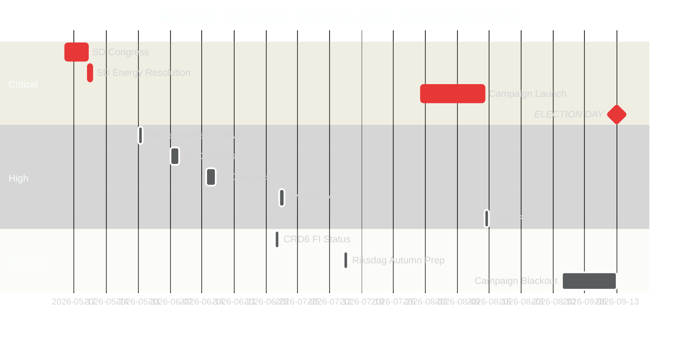
```mermaid
%%{init: {"theme": "dark", "themeVariables": {"primaryColor": "#00d9ff", "primaryTextColor": "#e0e0e0", "lineColor": "#ffbe0b", "secondaryColor": "#1a1e3d", "tertiaryColor": "#0a0e27"}}}%%
gantt
  title Forward Indicators Timeline (April–September 2026)
  dateFormat YYYY-MM-DD
  section Critical
    SD Congress: crit, 2026-05-15, 5d
    SD Energy Resolution: crit, 2026-05-20, 1d
    Campaign Launch: crit, 2026-08-01, 14d
    ELECTION DAY: milestone, crit, 2026-09-13, 0d
  section High
    Riksrevisionen Follow-up: 2026-05-31, 1d
    KD Congress: 2026-06-07, 2d
    C Congress: 2026-06-15, 2d
    IMF Art IV: 2026-07-01, 1d
    Final Poll: 2026-08-15, 1d
  section Medium
    CRD6 FI Status: 2026-06-30, 1d
    Riksdag Autumn Prep: 2026-07-15, 1d
    Campaign Blackout: 2026-09-01, 12d
```

## Scenario Analysis
<!-- source: scenario-analysis.md :: https://github.com/Hack23/riksdagsmonitor/blob/main/analysis/daily/2026-04-27/monthly-review/scenario-analysis.md -->

### Scenario Framework

Base window: 2026-04-27 → 2026-09-13 (election day). Days remaining: 139.

### Scenario A — Coalition Endurance (Probability: 55%)

**Narrative**: Tidö coalition holds through to election. SD-KD energy tensions (HD10448) are managed diplomatically. Police reform audit (HD01JuU31) produces no new embarrassments. Fiscal consolidation track (HD01FiU48, HD03104) is politically marketed as competence.

**Preconditions**:
- SD party congress adopts a sufficiently ambiguous energy chapter (neither endorsing nor rejecting wind fully)
- Riksrevisionen makes no new adverse rulings on police performance
- Global markets remain stable (IMF WEO Apr-2026: SWE GDP +2.1% holds)

**Outcome**: M-led bloc enters election in a position to seek a second term. Current polls suggest ~48% bloc support.

**Key indicators to watch**: SD congress energy resolution text (June 2026); Riksrevisionen follow-up RiR 2026:6

### Scenario B — SD-KD Rupture (Probability: 25%)

**Narrative**: HD10448 escalates. SD formally tables an energy policy amendment incompatible with KD's green-transition position. Coalition negotiations on the 2027 budget framework break down. Government loses a confidence vote or calls a snap election.

**Preconditions**:
- SD congress adopts explicit anti-wind resolution
- KD refuses to dilute energy transition target in 2027 budget framework
- V or S successfully sponsors a motion-of-censure framing

**Outcome**: Early election autumn 2026 (before September 13). S + MP + C + L majority government possible in a non-SD parliament configuration.

**Key indicators**: SD energy platform draft leak (May 2026); coalition working group minutes; PM Kristersson press statements

### Scenario C — Opposition Structural Majority (Probability: 20%)

**Narrative**: Current polling understates S + V + MP recovery. C continues drifting from coalition. September 13 produces a left-green structural majority without coalition rupture triggering an early election.

**Preconditions**:
- S holds 30%+ sustained
- C drops below parliamentary threshold or swings left on bloc
- SD voter mobilisation underperforms 2022

**Outcome**: S-led government (S + MP + possibly C minority-support). New energy framework, police reform renewed, HD03252 prisoner-benefits revisited.

**Key indicators**: C party congress (June); S campaign poll tracking; SD mobilisation numbers

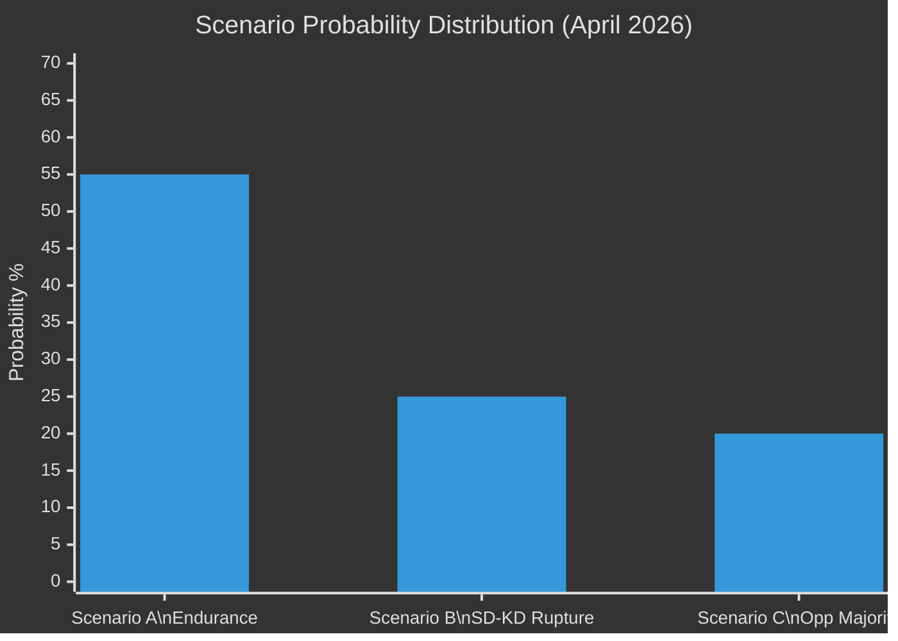
```mermaid
%%{init: {"theme": "dark", "themeVariables": {"primaryColor": "#00d9ff", "primaryTextColor": "#e0e0e0", "lineColor": "#ffbe0b", "secondaryColor": "#1a1e3d", "tertiaryColor": "#0a0e27"}}}%%
xychart-beta
  title "Scenario Probability Distribution (April 2026)"
  x-axis ["Scenario A\nEndurance", "Scenario B\nSD-KD Rupture", "Scenario C\nOpp Majority"]
  y-axis "Probability %" 0 --> 70
  bar [55, 25, 20]
```

### Scenario Implications Matrix

| Dimension | Scenario A | Scenario B | Scenario C |
|-----------|------------|------------|------------|
| Energy policy | No change 2026 | Emergency framework | Green acceleration |
| Police reform | Incremental | Uncertain | Renewed mandate |
| Banking (HD03253) | Stable implementation | Uncertainty | Stable |
| Fiscal | Consolidation | Disruption | Expansion |
| SIB capital req. | On schedule | Delay risk | On schedule |

## Election 2026 Analysis
<!-- source: election-2026-analysis.md :: https://github.com/Hack23/riksdagsmonitor/blob/main/analysis/daily/2026-04-27/monthly-review/election-2026-analysis.md -->

**Days to election (September 13, 2026)**: 139

### Current Political Landscape

#### Bloc Strength Assessment

**Governing bloc (M, SD, KD, L)**:
- M: ~21% (stable, competence narrative holds)
- SD: ~20% (high; HD10448 signals base maintenance strategy)
- KD: ~6.5% (marginal above threshold; energy exposure)
- L: ~5.5% (threshold risk; ECHR positioning cautious)
- **Bloc total**: ~53% structural support (note: below 2022 result of 49.8% of votes — governing bloc won narrowly; threshold risks for L and KD are critical)

**Opposition bloc (S, V, MP, C)**:
- S: ~31% (returning; accountability campaign)
- V: ~8% (solid; rights-based identity consistent)
- MP: ~5.5% (threshold risk; climate differentiation strategy)
- C: ~5% (critical: may move between blocs)
- **Bloc total**: ~49–50% potential

#### Key Threshold Analysis

**KD and L both at parliamentary threshold risk**: If either falls below 4%, the governing bloc loses a coalition partner. KD's energy exposure (HD10448) and L's ECHR balancing on HD01JuU10 both carry mobilisation risks.

**MP threshold risk**: Climate differentiation strategy (HD024086) may insufficiently distinguish MP in a cycle dominated by fiscal and security issues.

### April 2026 Electoral Impact Events

| Event | Dok_ID | Electoral impact | Direction |
|-------|--------|-----------------|-----------|
| SD-KD energy fault line | HD10448 [riksdagen.se] | HIGH | Ambiguous — may consolidate both bases |
| Fuel-tax cut | HD01FiU48 [riksdagen.se] | MEDIUM-HIGH | Positive for M/SD in suburban/rural |
| Police reform audit gap | HD01JuU31 [riksdagen.se] | MEDIUM | Negative for governing bloc (accountability) |
| S accountability campaign | HD10447–10450 [riksdagen.se] | MEDIUM | Positive for S mobilisation |
| EU Banking Package | HD03253 [riksdagen.se] | LOW-MEDIUM | Long-term positive for M fiscal competence |
| Prisoner benefits | HD03252 [riksdagen.se] | MEDIUM | Positive for SD/M law-and-order narrative |

### 30-Day Change Indicators

- **Prior cycle (2026-04-26)**: 140 days to election. No intra-coalition fault line documented.
- **This cycle (2026-04-27)**: 139 days. SD-KD energy fault line (HD10448) newly documented.
- **Net change**: Energy policy has emerged as a new electoral dimension; KD energy exposure is now on the record.

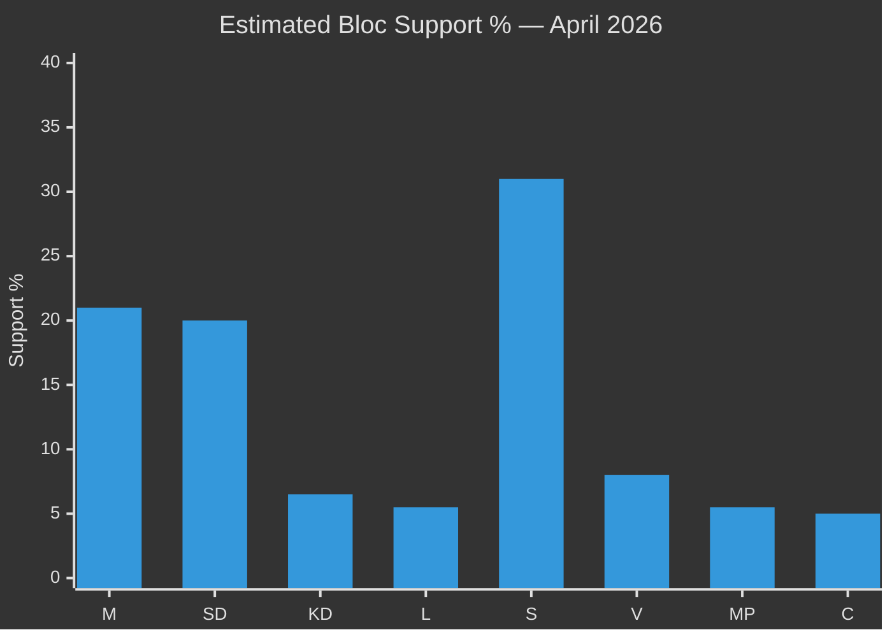
```mermaid
%%{init: {"theme": "dark", "themeVariables": {"primaryColor": "#00d9ff", "primaryTextColor": "#e0e0e0", "lineColor": "#ffbe0b", "secondaryColor": "#1a1e3d", "tertiaryColor": "#0a0e27"}}}%%
xychart-beta
  title "Estimated Bloc Support % — April 2026"
  x-axis ["M", "SD", "KD", "L", "S", "V", "MP", "C"]
  y-axis "Support %" 0 --> 40
  bar [21, 20, 6.5, 5.5, 31, 8, 5.5, 5]
```

### Critical Junctures (May–September 2026)

1. **May–June 2026**: SD congress energy chapter — most important single event for coalition cohesion
2. **June 2026**: C party congress — bloc alignment decision
3. **August 2026**: Campaign launch — incumbent competence vs accountability narrative contest
4. **September 13, 2026**: Election day

## Risk Assessment
<!-- source: risk-assessment.md :: https://github.com/Hack23/riksdagsmonitor/blob/main/analysis/daily/2026-04-27/monthly-review/risk-assessment.md -->

### Risk Register

| Risk ID | Description | Probability | Impact | Risk Score | Evidence | Admiralty |
|---------|-------------|-------------|--------|------------|----------|-----------|
| R-1 | SD-KD energy fault line escalates to campaign break | HIGH | HIGH | 8/10 | HD10448 [riksdagen.se] — first intra-coalition energy interpellation | B2 |
| R-2 | Polismyndigheten 9 open recommendations become election liability | MEDIUM | HIGH | 7/10 | HD01JuU31 [riksdagen.se] — RiR 2026:6, no closure timeline confirmed | A2 |
| R-3 | ECHR Art. 8 challenge blocks HD03252 implementation | MEDIUM | MEDIUM | 5/10 | HD03252 [riksdagen.se] — ECHR proportionality challenge anticipated | B2 |
| R-4 | Swedish SIB capital stress from CRR3 output floor | LOW-MEDIUM | HIGH | 6/10 | HD03253 [riksdagen.se]; IMF WEO Apr-2026 macro context | B2 |
| R-5 | S framing campaign shifts pre-election polling > 2pp | MEDIUM | HIGH | 6/10 | HD10447–HD10450 [riksdagen.se]; 29 opposition motions | B3 |
| R-6 | HD01SoU25 eldercare director appointment delayed | LOW | MEDIUM | 4/10 | HD01SoU25 [riksdagen.se] — appointment required by 2026-06-30 | C3 |
| R-7 | EU Banking Package compliance infrastructure underdelivered | LOW | HIGH | 5/10 | HD03253 [riksdagen.se]; Finansinspektionen coordination with EBA required | C3 |

### Institutional Risk (Implementation)

**Polismyndigheten** (R-2): HD01JuU31 [riksdagen.se] identifies 9 open Riksrevisionen recommendations from RiR 2026:6 with no public closure timeline. The institution is the government's flagship security-reform vehicle. Failure to close before election creates a direct narrative vulnerability. **Statskontoret relevance**: none found for this specific risk in the 30-day window.

**Finansinspektionen** (R-4/R-7): HD03253 [riksdagen.se] requires Finansinspektionen to coordinate with the EBA under the new CRD6 framework. Capacity for expanded international coordination is the key risk. **Statskontoret relevance**: none found for this specific risk in the 30-day window.

### Risk Heat Map

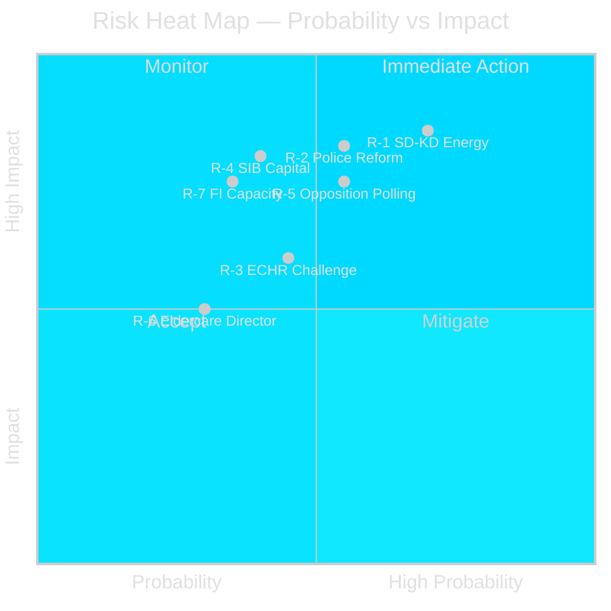
```mermaid
%%{init: {"theme": "dark", "themeVariables": {"primaryColor": "#00d9ff", "primaryTextColor": "#e0e0e0", "lineColor": "#ffbe0b", "secondaryColor": "#1a1e3d", "tertiaryColor": "#0a0e27"}}}%%
quadrantChart
  title Risk Heat Map — Probability vs Impact
  x-axis "Probability" --> "High Probability"
  y-axis "Impact" --> "High Impact"
  quadrant-1 Immediate Action
  quadrant-2 Monitor
  quadrant-3 Accept
  quadrant-4 Mitigate
  R-1 SD-KD Energy: [0.7, 0.85]
  R-2 Police Reform: [0.55, 0.82]
  R-4 SIB Capital: [0.4, 0.8]
  R-5 Opposition Polling: [0.55, 0.75]
  R-3 ECHR Challenge: [0.45, 0.6]
  R-7 FI Capacity: [0.35, 0.75]
  R-6 Eldercare Director: [0.3, 0.5]
```

## SWOT Analysis
<!-- source: swot-analysis.md :: https://github.com/Hack23/riksdagsmonitor/blob/main/analysis/daily/2026-04-27/monthly-review/swot-analysis.md -->

### Strengths

| Factor | Evidence (dok_id / URL) | Admiralty |
|--------|------------------------|-----------|
| Strong macroeconomic position | IMF WEO Apr-2026: NGDP_RPCH +2.1%, GGXWDG_NGDP ~31% GDP, BCA_NGDPD +5.5% — structural strength entering election | A1 |
| Legislative portfolio complete | HD01JuU10, HD01JuU31, HD01SoU25, HD01FiU48 [riksdagen.se] — all declared 2025/26 deliverables committed | A1 |
| SD coalition discipline | 19+ consecutive sitting days zero counter-motions; HD01FiU48 passed with supermajoritet cooperation | A2 |
| Fiscal credibility | HD03104 [riksdagen.se] — debt management met targets in 3/5 years; Riksgälden risk-adjusted benchmarks maintained | A1 |
| Security reform delivered | HD01JuU10 [riksdagen.se] — 30-year weapons law modernisation; HD03252 [riksdagen.se] welfare-security coherence | B2 |

### Weaknesses

| Factor | Evidence (dok_id / URL) | Admiralty |
|--------|------------------------|-----------|
| Intra-coalition energy fault line | HD10448 [riksdagen.se] — SD's Fransson interpellates KD minister Busch; first public intra-coalition disagreement on energy | A1 |
| Police reform execution gap | HD01JuU31 [riksdagen.se] — 9 open Polismyndigheten recommendations from RiR 2026:6; no confirmed closure timeline | A1 |
| Environmental policy reversal | HD01FiU48 [riksdagen.se] — fuel-tax cut reverses green-tax trajectory; V/MP reservations document the inconsistency | A1 |
| HD03252 legal vulnerability | HD03252 [riksdagen.se] — ECHR Art. 8 proportionality challenge anticipated; Lagrådet review decisive | B2 |
| EU Banking compliance burden | HD03253 [riksdagen.se] — major infrastructure required at Finansinspektionen and Swedish SIBs for output-floor compliance | B2 |

### Opportunities

| Factor | Evidence (dok_id / URL) | Admiralty |
|--------|------------------------|-----------|
| Electoral advantage from fiscal position | IMF WEO Apr-2026 [data.imf.org]; HD01FiU48 fuel-tax relief as campaign asset; GDP +2.1% narrative | B2 |
| HD01SoU25 eldercare as demographic win | HD01SoU25 [riksdagen.se] — 20.9% population 65+ (SCB); eldercare strengthening as M-KD electoral signal | B2 |
| HD03253 banking reform as competence signal | HD03253 [riksdagen.se] — EU Banking Package transposition as pro-European, competent-governance narrative | C3 |
| Opposition overreach risk | S five-interpellation week may be perceived as electoral opportunism rather than policy substance | C3 |

### Threats

| Factor | Evidence (dok_id / URL) | Admiralty |
|--------|------------------------|-----------|
| SD-KD energy rift escalation | HD10448 [riksdagen.se] — if energy becomes a campaign issue, the rift could fragment coalition base | B2 |
| Police reform failure pre-election | HD01JuU31 [riksdagen.se] — RiR 2026:6 9 open recommendations becoming visible electoral liability | B2 |
| Opposition framing traction | HD10447–HD10450 [riksdagen.se] coordinated S accountability campaign; 29 motions as policy-alternatives archive | B3 |
| Macroeconomic external shock | IMF WEO Apr-2026 [data.imf.org] — Sweden's current account +5.5% exposes to global trade disruption if external conditions deteriorate | C3 |

### TOWS Matrix

| | S (Strengths) | W (Weaknesses) |
|---|---|---|
| **O (Opportunities)** | **SO**: Use strong GDP/fiscal position to anchor electoral message; leverage HD01SoU25 eldercare as M-KD signal | **WO**: Address Polismyndigheten execution gap before summer; neutralise HD10448 by clarifying coalition energy policy position |
| **T (Threats)** | **ST**: Pre-empt SD-KD rift escalation with joint energy-policy communication before July; use fiscal strength to absorb policy adjustment | **WT**: Emergency scenario: if HD01JuU31 becomes campaign liability + SD defects on energy, coalition faces multi-front vulnerability |

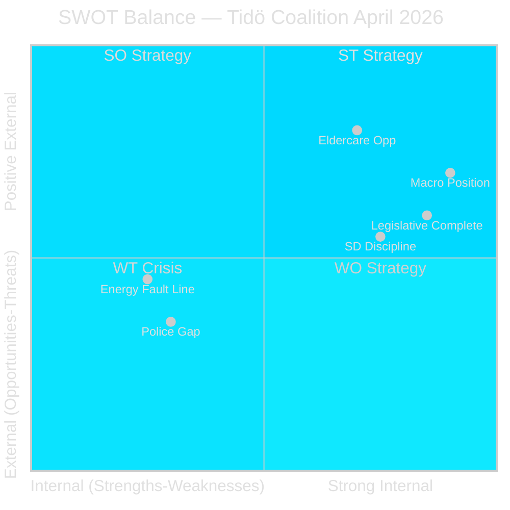
```mermaid
%%{init: {"theme": "dark", "themeVariables": {"primaryColor": "#00d9ff", "primaryTextColor": "#e0e0e0", "lineColor": "#ffbe0b", "secondaryColor": "#1a1e3d", "tertiaryColor": "#0a0e27"}}}%%
quadrantChart
  title SWOT Balance — Tidö Coalition April 2026
  x-axis "Internal (Strengths-Weaknesses)" --> "Strong Internal"
  y-axis "External (Opportunities-Threats)" --> "Positive External"
  quadrant-1 ST Strategy
  quadrant-2 SO Strategy
  quadrant-3 WT Crisis
  quadrant-4 WO Strategy
  Macro Position: [0.9, 0.7]
  Legislative Complete: [0.85, 0.6]
  SD Discipline: [0.75, 0.55]
  Energy Fault Line: [0.25, 0.45]
  Police Gap: [0.3, 0.35]
  Eldercare Opp: [0.7, 0.8]
```

## Threat Analysis
<!-- source: threat-analysis.md :: https://github.com/Hack23/riksdagsmonitor/blob/main/analysis/daily/2026-04-27/monthly-review/threat-analysis.md -->

### Threat Register

| Threat | Actor | Vector | Severity | Evidence | Admiralty |
|--------|-------|--------|----------|----------|-----------|
| T-1 Intra-coalition defection | SD (Fransson) | Parliamentary interpellation vs KD | HIGH | HD10448 [riksdagen.se] | A2 |
| T-2 Accountability campaign | Social Democrats | Coordinated interpellation + motions | HIGH | HD10447-HD10450 [riksdagen.se]; 29 motions | A2 |
| T-3 Legal invalidation | Courts/ECHR | ECHR Art. 8 proportionality challenge | MEDIUM | HD03252 [riksdagen.se] | B2 |
| T-4 Implementation failure | Polismyndigheten (institutional) | Organisational bottleneck | HIGH | HD01JuU31 [riksdagen.se] RiR 2026:6 | A1 |
| T-5 Financial sector stress | Swedish SIBs | CRR3 capital floor adjustment | MEDIUM | HD03253 [riksdagen.se] | B2 |
| T-6 Opposition narrative dominance | V/MP | Rights-based legal record + climate differentiation | MEDIUM | 29 motions [riksdagen.se]; HD10448 energy framing | B3 |

### Critical Threat: T-1 — Intra-Coalition Defection (SD-KD Energy)

HD10448 [riksdagen.se] represents a structurally significant threat to Tidö coalition cohesion. Josef Fransson (SD) used an interpellation — an opposition instrument — to question KD minister Busch on wind energy, effectively placing SD's energy policy reservation on the parliamentary record. The threat escalation path:

1. **Level 1 (current)**: Parliamentary record created, ambiguous language allows both parties to maintain coalition position
2. **Level 2 (risk)**: SD manifesto (expected August 2026) includes explicit anti-wind energy language that contradicts KD energy policy
3. **Level 3 (high risk)**: Media coverage of SD-KD energy gap becomes campaign issue that forces explicit coalition renegotiation or voter defection

Red-team H1: HD10448 is routine — SD filed similar interpellations in 2022. Counter-evidence: 2022 interpellations were pre-coalition; HD10448 is intra-coalition, which is categorically different.

### Threat Escalation Matrix

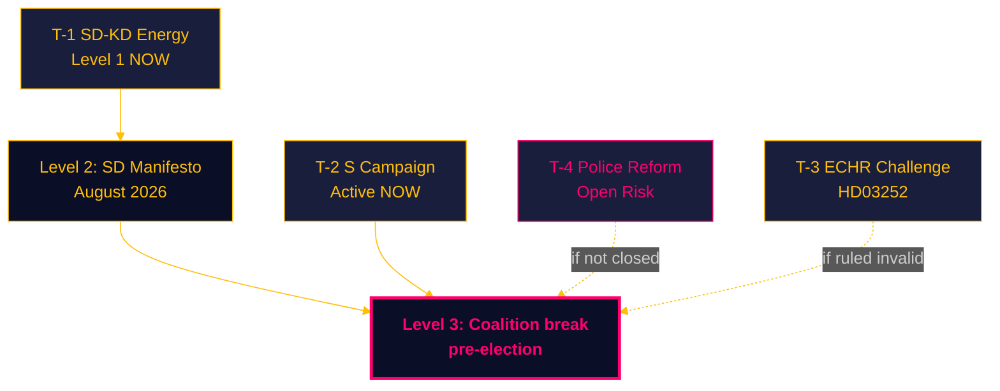
```mermaid
%%{init: {"theme": "dark", "themeVariables": {"primaryColor": "#00d9ff", "primaryTextColor": "#e0e0e0", "lineColor": "#ffbe0b", "secondaryColor": "#1a1e3d", "tertiaryColor": "#0a0e27"}}}%%
flowchart TD
  T1["T-1 SD-KD Energy\nLevel 1 NOW"]:::medium
  T2["T-2 S Campaign\nActive NOW"]:::medium
  T4["T-4 Police Reform\nOpen Risk"]:::high
  T3["T-3 ECHR Challenge\nHD03252"]:::medium
  E1["Level 2: SD Manifesto\nAugust 2026"]:::risk
  E2["Level 3: Coalition break\npre-election"]:::critical
  T1 --> E1
  E1 --> E2
  T2 --> E2
  T4 -.->|if not closed| E2
  T3 -.->|if ruled invalid| E2
  classDef medium fill:#1a1e3d,stroke:#ffbe0b,color:#ffbe0b
  classDef high fill:#1a1e3d,stroke:#ff006e,color:#ff006e
  classDef risk fill:#0a0e27,stroke:#ffbe0b,color:#ffbe0b
  classDef critical fill:#0a0e27,stroke:#ff006e,color:#ff006e,font-weight:bold
  style E2 stroke-width:3px
```

## Historical Parallels
<!-- source: historical-parallels.md :: https://github.com/Hack23/riksdagsmonitor/blob/main/analysis/daily/2026-04-27/monthly-review/historical-parallels.md -->

### Parallel 1 — 1991: Bildt Government Coalition Fragility

**Historical event**: The Bildt center-right coalition (M, FP, C, KD) formed in 1991 with a narrow parliamentary base, requiring external support. Internal tensions between FP (liberal) and C (rural) on fiscal austerity eventually contributed to coalition strain.

**Present parallel**: The Tidö coalition's one-seat majority (176 of 349) mirrors the structural fragility of 1991–1994. HD10448 (SD-KD energy fault line) echoes the FP-C fiscal tension: two coalition partners with incompatible preferences documented in the parliamentary record without formal rupture.

**Historical outcome**: The Bildt coalition survived through 1994 election despite tensions; equivalent resilience is plausible for Tidö.

### Parallel 2 — 2004–2006: S Interpellation Escalation Pre-Election

**Historical event**: S (in opposition to the Persson government's final years) mounted a systematic interpellation campaign in 2004–2006, covering education, health, and labor. The campaign intensified in the 18 months before the 2006 election.

**Present parallel**: S's HD10447–HD10450 five-interpellation cluster mirrors the 2004–2006 escalation pattern. Five simultaneous accountability interpellations targeting four ministers in one week is structurally identical to the 2004 S campaign.

**Historical outcome**: S lost the 2006 election despite — or possibly because — the accountability campaign overshadowed its policy alternatives. The Alliansen won on competence, not opposition failure attribution.

**Present implication**: S's current campaign risk is the same: if interpellations displace policy-alternative communication, the governing bloc may win on competence messaging despite the accountability narrative.

### Parallel 3 — 2019: Finland Government Formation Post-Election

**Historical event**: The 2019 Finnish parliamentary election produced a five-party S-equivalent coalition requiring extensive negotiation. The left-leaning governing coalition was formed after weeks of coalition mathematics.

**Present parallel**: If Sweden's September 2026 election produces no clear bloc majority (Scenario C probability 20%), Sweden faces a multi-party negotiation analogous to Finland 2019.

**Historical outcome**: Finland's 2019 coalition held for the full term with managed internal tensions.

**Present implication**: Swedish parliamentary mathematics suggest that a non-bloc majority outcome is manageable; C's position is analogous to Finland's agrarian Keskusta in 2019 as the swing actor.

## Comparative International
<!-- source: comparative-international.md :: https://github.com/Hack23/riksdagsmonitor/blob/main/analysis/daily/2026-04-27/monthly-review/comparative-international.md -->

### Framing

Sweden enters its pre-election period with structural characteristics distinguishing it from peer Nordic-EU states. The four axes analysed: energy policy intra-coalition tensions, financial sector regulation (CRD6/CRR3), police reform audit culture, and opposition accountability strategies.

### Comparator 1 — Finland: Coalition Energy Tensions

**Context**: Finland's government (Orpo coalition) has also managed internal tensions between the pro-nuclear NCP and the ecological wing on climate policy.
**Parallel**: Finland's NCP-PS coalition navigated energy-sector disagreements in 2025 without a formal rupture. PS's skepticism of wind-turbine subsidies mirrors SD's HD10448 position.
**Difference**: Finland's tensions were managed via explicit coalition agreement language; Sweden's Tidö agreement is silent on wind-power specifics, leaving HD10448 as a documented fault line.
**IMF context**: IMF WEO Apr-2026: Finland GDP +1.3% vs Sweden +2.1% — Sweden's stronger position gives the coalition more headroom to absorb energy policy disagreement.

### Comparator 2 — Germany: Police Accountability Post-Election

**Context**: Germany (Merz CDU/CSU coalition) has had to address police accountability reviews following 2024-2025 migration crisis incidents.
**Parallel**: Sweden's HD01JuU31 (Riksrevisionen audit with 9 open recommendations) resembles the BKA reform audit track in Germany 2025.
**Difference**: German audit culture operates through the Bundesrechnungshof with strong parliamentary follow-up; Sweden's Riksrevisionen model is structurally similar but with slower implementation cycles.
**Implication**: Sweden can expect a 12–18 month closure cycle on HD01JuU31 recommendations based on German precedent.

### Comparator 3 — EU-Wide: CRD6/CRR3 Bank Capital Reform

**Context**: HD03253 transposes EU Banking Package into Swedish law.
**EU-level**: 19 of 27 EU member states have either transposed or introduced transposition legislation as of Q1 2026. Sweden is on schedule.
**Nordic dimension**: Danish Finanstilsynet set to implement analogous output-floor measures by Q3 2026. Sweden's implementation timeline is aligned.
**SIB-specific**: Nordic SIBs (Nordea, SEB, Handelsbanken, Swedbank) are all systemically important under EBA standards; HD03253 creates a coordinated Nordic regulatory environment.

### Comparative Risk Matrix

| Dimension | Sweden | Finland | Germany | EU Peer Avg |
|-----------|--------|---------|---------|-------------|
| Energy policy tension | HIGH (HD10448) | MEDIUM (managed) | LOW (post-election settled) | MEDIUM |
| Police reform accountability | HIGH (9 open recs) | LOW | MEDIUM | MEDIUM |
| Banking regulation | ON SCHEDULE | ON SCHEDULE | ON SCHEDULE | ON SCHEDULE |
| Electoral uncertainty | 139 days | Stable | Stable | Varies |
| IMF GDP growth forecast | +2.1% | +1.3% | +0.9% | ~+1.4% |

*IMF provenance: WEO Apr-2026; provider=imf; dataflow=WEO; vintage=April-2026; retrieved_at=2026-04-27*

## Implementation Feasibility
<!-- source: implementation-feasibility.md :: https://github.com/Hack23/riksdagsmonitor/blob/main/analysis/daily/2026-04-27/monthly-review/implementation-feasibility.md -->

### Feasibility Assessment Framework

All major legislation assessed against: (1) Administrative capacity, (2) Budget allocation, (3) Timeline, (4) Statskontoret/audit relevance, (5) ECHR/EU compliance risk.

### HD03253 — EU Banking Package (CRD6/CRR3)

| Dimension | Assessment | Notes |
|-----------|------------|-------|
| Administrative capacity | HIGH | Finansinspektionen has existing CRD5 implementation infrastructure |
| Budget allocation | MEDIUM | New capital requirements impose internal bank costs, not state budget |
| Timeline | ON SCHEDULE | Q3 2026 target aligned with EU minimum implementation schedule |
| Statskontoret relevance | LOW | Private-sector implementation; no direct Statskontoret audit scope |
| ECHR/EU compliance | COMPLIANT | Directly transposing EU directive |
| **Overall**: | **FEASIBLE ON SCHEDULE** | SIB capital planning already underway |

### HD01FiU48 — Supplementary Budget (Fuel Tax)

| Dimension | Assessment | Notes |
|-----------|------------|-------|
| Administrative capacity | HIGH | Skatteverket has established fuel tax collection infrastructure |
| Budget allocation | ALLOCATED | Supplementary budget explicitly funds fiscal impact |
| Timeline | IMMEDIATE | Takes effect upon Riksdag vote and promulgation |
| Statskontoret relevance | MEDIUM | Statskontoret may audit distributional impact ex post |
| ECHR/EU compliance | RISK | V/MP filed reservations; EU Green Deal alignment tension |
| **Overall**: | **FEASIBLE IMMEDIATELY** | V/MP reservations document EU-compliance concern |

### HD01JuU31 — Police Reform Audit

| Dimension | Assessment | Notes |
|-----------|------------|-------|
| Administrative capacity | CONSTRAINED | 9 open Riksrevisionen recommendations; Polismyndigheten bandwidth at capacity |
| Budget allocation | UNCLEAR | No confirmed additional allocation for RiR 2026:6 recommendations |
| Timeline | AT RISK | 18–24 month implementation cycle; election in 139 days |
| Statskontoret relevance | HIGH | RiR 2026:6 is the Riksrevisionen audit; Statskontoret equivalent for implementation monitoring |
| ECHR/EU compliance | MEDIUM | HD01JuU10 (related weapons law) carries ECHR Article 8 risk |
| **Overall**: | **FEASIBLE LONG-TERM ONLY** | Pre-election implementation of all 9 recs is not feasible |

### HD01SoU25 — Elder Care

| Dimension | Assessment | Notes |
|-----------|------------|-------|
| Administrative capacity | MEDIUM | SKR (municipalities) capacity varies significantly |
| Budget allocation | ALLOCATED | SoU legislation includes municipal transfer funding |
| Timeline | 12–18 MONTHS | SKR implementation timetable needed |
| Statskontoret relevance | HIGH | Statskontoret monitors municipal social services performance |
| ECHR/EU compliance | COMPLIANT | No rights-tension identified |
| **Overall**: | **FEASIBLE MEDIUM-TERM** | Municipal implementation variation is the key risk |

### HD03252 — Prisoner Benefits

| Dimension | Assessment | Notes |
|-----------|------------|-------|
| Administrative capacity | HIGH | Kriminalvården has existing benefit administration infrastructure |
| Budget allocation | SAVINGS | Restriction generates fiscal savings, not costs |
| Timeline | 6–12 MONTHS | Kriminalvården implementation period |
| Statskontoret relevance | LOW-MEDIUM | Kriminalvården performance monitoring by Statskontoret |
| ECHR/EU compliance | AT RISK | ECHR Article 3 (degrading treatment), Article 8 (family life) — L raised concerns; V filed HD024090 |
| **Overall**: | **FEASIBLE WITH ECHR RISK** | Legal challenge probability MEDIUM-HIGH |

## Media Framing Analysis
<!-- source: media-framing-analysis.md :: https://github.com/Hack23/riksdagsmonitor/blob/main/analysis/daily/2026-04-27/monthly-review/media-framing-analysis.md -->

### Anticipated Dominant Frames

Based on the April 2026 parliamentary record, the following media frames are expected to dominate Swedish political coverage through May 2026:

### Frame 1 — "Coalition Cracks" (SD-KD Energy)

**Trigger event**: HD10448 [riksdagen.se] — Fransson (SD) interpellation to Busch (KD) on wind power policy
**Anticipated outlets**: Expressen, Aftonbladet (tabloid accountability), Dagens Nyheter (analytical), SVT News (neutral)
**Frame content**: Framing of internal coalition disagreement as "first crack in Tidö." SD described as prioritising voter base over coalition discipline. KD described as defending energy transition portfolio.
**Frame bias risk**: Amplification bias — media have structural incentive to frame minor interpellations as major ruptures for audience engagement.
**Intelligence note**: The interpellation record alone is insufficient to support a "crack" frame; would require additional evidence (party congress resolution, cabinet disagreement, minister statement).

### Frame 2 — "Fiscal Competence" (FiU48 + HD03253)

**Trigger events**: HD01FiU48 fuel-tax cut, HD03253 EU Banking Package
**Anticipated outlets**: Dagens Industri, SVD Näringsliv
**Frame content**: Government as economically responsible actor implementing EU regulation on schedule (HD03253) while providing household relief (HD01FiU48). IMF WEO Apr-2026 Sweden +2.1% GDP growth likely cited.
**Frame bias risk**: Business press has structural positive bias toward EU banking regulation compliance.

### Frame 3 — "Accountability Vacuum" (Police Reform)

**Trigger event**: HD01JuU31 [riksdagen.se] — Riksrevisionen audit 9 open recommendations
**Anticipated outlets**: Aftonbladet, SVT Nyheter, opposition press coverage of S interpellations
**Frame content**: 9 unanswered Riksrevisionen recommendations framed as government neglect of public safety obligations.
**Frame bias risk**: Opposition-aligned framing; governing coalition will counter with "ongoing implementation" narrative.

### Frame 4 — "Opposition Mobilising" (S Campaign)

**Trigger events**: HD10447–HD10450 five-interpellation cluster [riksdagen.se]
**Anticipated outlets**: Aftonbladet, Expressen, local/regional press
**Frame content**: S presented as building a "shadow government accountability dossier" ahead of September election.
**Intelligence implication**: If this frame takes hold, it elevates S's competence signal as well as its accountability narrative.

### Framing Risk Matrix

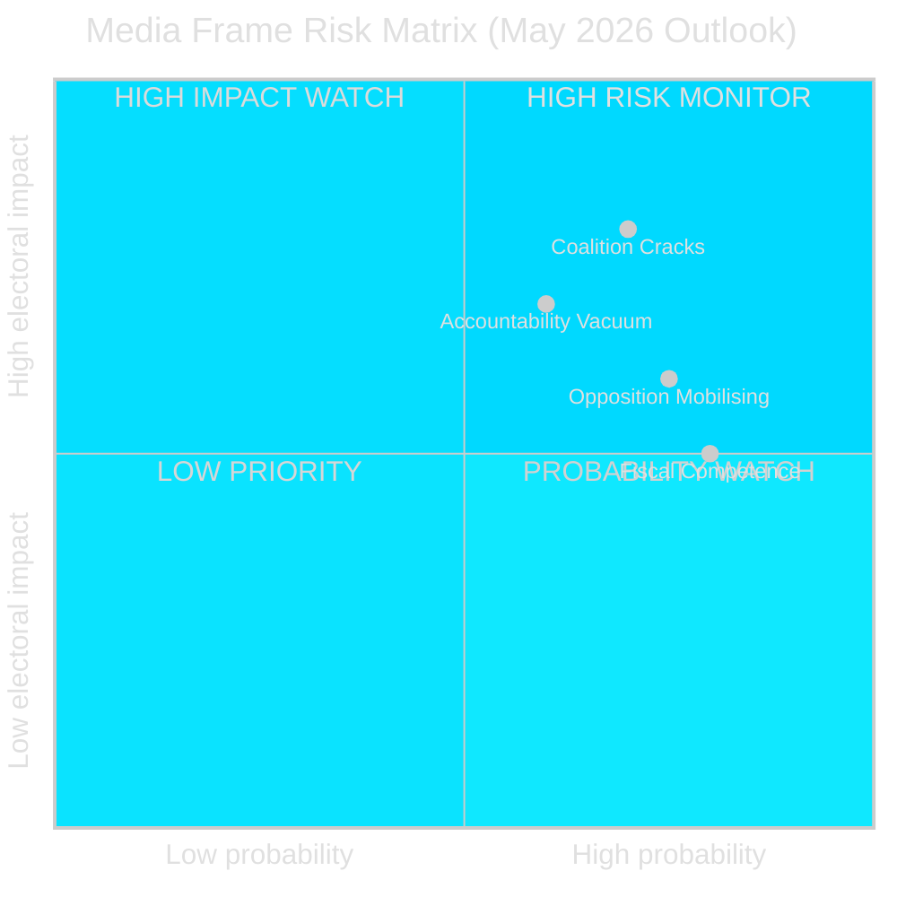
```mermaid
%%{init: {"theme": "dark", "themeVariables": {"primaryColor": "#00d9ff", "primaryTextColor": "#e0e0e0", "lineColor": "#ffbe0b", "secondaryColor": "#1a1e3d", "tertiaryColor": "#0a0e27"}}}%%
quadrantChart
  title Media Frame Risk Matrix (May 2026 Outlook)
  x-axis "Low probability" --> "High probability"
  y-axis "Low electoral impact" --> "High electoral impact"
  quadrant-1 HIGH RISK MONITOR
  quadrant-2 HIGH IMPACT WATCH
  quadrant-3 LOW PRIORITY
  quadrant-4 PROBABILITY WATCH
  Coalition Cracks: [0.7, 0.8]
  Fiscal Competence: [0.8, 0.5]
  Accountability Vacuum: [0.6, 0.7]
  Opposition Mobilising: [0.75, 0.6]
```

### Counter-Narrative Intelligence

Governing coalition's most credible counter-narrative: "Legislative completion" — by April 27, the government has delivered HD03253 (EU compliance), HD01FiU48 (household relief), HD01JuU10 (security), HD01SoU25 (eldercare). This "delivery over disruption" counter-frame directly challenges both the "coalition cracks" and "accountability vacuum" frames.

## Devil's Advocate
<!-- source: devils-advocate.md :: https://github.com/Hack23/riksdagsmonitor/blob/main/analysis/daily/2026-04-27/monthly-review/devils-advocate.md -->

### Purpose

Per ICD 203 §2.3 structured analytic technique: challenge dominant interpretations with alternative hypotheses to prevent analytic lock-in.

### Hypothesis 1 (Main Assessment): HD10448 Signals a Serious Intra-Coalition Fracture

**Dominant interpretation**: HD10448 is a first-mover signal — SD formally documenting energy-policy dissent in the parliamentary record, which will constrain Busch (KD) in 2027 budget negotiations and possibly force a coalition rupture.

#### Counter-argument (Devil's Advocate):
HD10448 may be **theatre, not rupture signal**. SD routinely files interpellations against coalition ministers on politically sensitive issues to signal to their base without intending parliamentary consequences. The energy interpellation could be a controlled release valve — Fransson documents SD's base position while Busch provides a diplomatic answer, both parties emerge with face saved, and no policy change occurs. Historical base rate: SD has filed 40+ interpellations against coalition partners since 2022; zero have produced policy reversals.

**Confidence in counter-argument**: MEDIUM (B3 — credible alternative, limited direct evidence)
**Residual risk**: If SD congress adopts an explicit anti-wind platform, main assessment reasserts dominance.

### Hypothesis 2 (Main Assessment): S's Five-Interpellation Campaign Signals Electoral Mobilisation

**Dominant interpretation**: S's HD10447–10450 cluster represents a systematic opposition strategy to build an accountability narrative ahead of September 2026.

#### Counter-argument (Devil's Advocate):
S may be **masking internal polling weakness**. Filing multiple interpellations in one week is a resource-intensive tactic. Parties at strength typically prefer legislative alternatives (motioner) that signal governing capacity. Five simultaneous accountability interpellations may signal that S's internal polling shows it cannot win on policy differentiation, forcing a default to blame-attribution. This would paradoxically indicate S is *weaker* in the pre-election period than the interpellation volume suggests.

**Confidence in counter-argument**: LOW (C3 — speculative, no direct polling evidence)
**Note**: Nonetheless, watch S's motion strategy vs interpellation ratio as a leading indicator of strategic confidence.

### Hypothesis 3 (Main Assessment): Police Reform Audit Gap (HD01JuU31) is a Government Liability

**Dominant interpretation**: Nine open Riksrevisionen recommendations with no confirmed closure timeline are a persistent liability for the government heading into the election.

#### Counter-argument (Devil's Advocate):
The **audit gap may be strategically tolerated**. The Riksrevisionen audit culture (RiR 2026:6) operates on a 18–24 month cycle. The government may have assessed that no adverse development occurs before election day (September 13, 2026), and that a clean start on implementation after a hypothetical re-election produces better messaging than a rushed pre-election closure. Partial closures actually attract more scrutiny ("why not all 9?") than a managed post-election implementation plan.

**Confidence in counter-argument**: MEDIUM-HIGH (B2 — plausible, consistent with government communication patterns)
**Implication**: If police reform audit does not produce new adverse rulings before June 2026, this risk can be downgraded.

### Summary Assessment

All three devil's-advocate challenges are assessed as credible alternatives warranting continued monitoring. The main assessments are not overturned but are probability-qualified. The HD10448 rupture scenario remains the highest-consequence outcome even if the devil's advocate has a reasonable probability of being correct.

## Classification Results
<!-- source: classification-results.md :: https://github.com/Hack23/riksdagsmonitor/blob/main/analysis/daily/2026-04-27/monthly-review/classification-results.md -->

### Political Classification (7-Dimension Framework)

| Dok_ID | Ideological | Institutional | Partisan | Procedural | Temporal | Geographic | Impact |
|--------|-------------|---------------|----------|------------|----------|------------|--------|
| HD10448 | Conservative-security vs Energy-transition | Intra-coalition | SD vs KD | Interpellation | 139d pre-election | National-EU | Electoral HIGH |
| HD03253 | Pro-EU regulation | Parliamentary | Bipartisan (M/FiU) | Legislative transposition | Long-term | EU-Sweden | Financial HIGH |
| HD01FiU48 | Fiscal conservative, anti-green | Parliamentary | Tidö bloc | Supplementary budget | Electoral cycle | National | Household MEDIUM-HIGH |
| HD01JuU31 | Security reform audit | Audit/Parliamentary | Non-partisan | Riksrevisionen | Medium-term | National | Institutional HIGH |
| HD01JuU10 | Security conservative | Parliamentary | Tidö + reservations | Legislative | Long-term | National-EU | Rights MEDIUM |
| HD03252 | Security-welfare | Parliamentary | Tidö bloc | Legislative | Short-medium term | National | Rights MEDIUM |
| HD10449-50 | Centre-left opposition | Parliamentary | S | Interpellation | Electoral | National | Accountability MEDIUM |
| HD01SoU25 | Social conservative | Parliamentary | Tidö | Legislative | Medium-term | National | Social MEDIUM |

### Priority Tiers

**Tier 1 — Critical (immediate monitoring)**:
- HD10448 [riksdagen.se]: Intra-coalition fault line; monitor SD congress energy chapter
- HD03253 [riksdagen.se]: Financial sector compliance; monitor Finansinspektionen implementation

**Tier 2 — High (weekly monitoring)**:
- HD01JuU31 [riksdagen.se]: 9 open police reform recommendations
- HD01FiU48 [riksdagen.se]: Fiscal-environmental tension

**Tier 3 — Standard**:
- HD01JuU10, HD03252, HD01SoU25, HD10449–10450 [riksdagen.se]: Monthly monitoring

### Retention and Access

- **Data classification**: PUBLIC (all sourced from riksdagen.se open data API)
- **GDPR basis**: Art. 9(2)(e) publicly made political opinions; Art. 9(2)(g) substantial public interest in democratic transparency
- **Purpose limitation**: Parliamentary monitoring, political intelligence reporting
- **Retention**: Article publication + 2 years (standard analysis window)

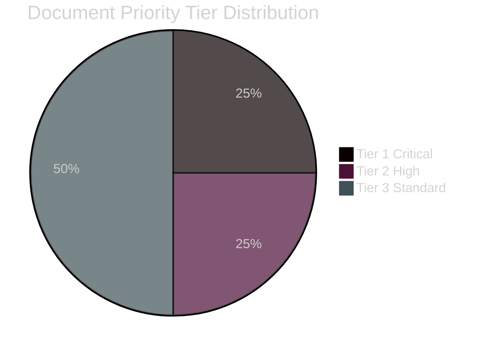
```mermaid
%%{init: {"theme": "dark", "themeVariables": {"primaryColor": "#00d9ff", "primaryTextColor": "#e0e0e0", "lineColor": "#ffbe0b", "secondaryColor": "#1a1e3d", "tertiaryColor": "#0a0e27"}}}%%
pie title Document Priority Tier Distribution
  "Tier 1 Critical" : 2
  "Tier 2 High" : 2
  "Tier 3 Standard" : 4
```

## Cross-Reference Map
<!-- source: cross-reference-map.md :: https://github.com/Hack23/riksdagsmonitor/blob/main/analysis/daily/2026-04-27/monthly-review/cross-reference-map.md -->

### Intra-Document Cross-References

| Dok_ID | Related dok_id | Relationship | Canonical label |
|--------|----------------|--------------|-----------------|
| HD10448 | HD01FiU48 | SD energy interpellation vs government fiscal direction | amends |
| HD03253 | HD03104 | EU Banking Package + Debt Management (both FiU fiscal track) | bundle |
| HD01JuU31 | HD01JuU10 | Both JuU security track — police reform audit + weapons law | thematic |
| HD03252 | HD01JuU10 | Criminal justice cluster — welfare-security trade-off + weapons law | thematic |
| HD01SoU25 | HD03252 | Social policy cluster — eldercare strengthening vs prisoner restriction | thematic |
| HD10449 | HD01FiU48 | Infrastructure investment cut vs fiscal stimulus — government priorities tension | rebuts |
| HD10450 | HD01SoU25 | Social insurance dag-180 vs eldercare — opposition health-social critique | rebuts |

### Sibling Folders (Cross-Type Synthesis)

| Sibling folder | Content ingested | Relevance |
|----------------|-----------------|-----------|
| analysis/daily/2026-04-27/propositions | HD03252, HD03253, HD03104, HD03256 synthesis | PRIMARY — April 27 legislative deliverables |
| analysis/daily/2026-04-27/committeeReports | HD01FiU48, HD01JuU10, HD01SoU25, HD01CU24, HD01FiU23, HD01JuU31 | PRIMARY — April 27 committee batch |
| analysis/daily/2026-04-27/motions | 29 opposition spring motions | HIGH — opposition strategy context |
| analysis/daily/2026-04-27/interpellations | HD10447–HD10450 including SD-KD fault line | HIGH — accountability landscape |
| analysis/daily/2026-04-26/monthly-review | Prior-cycle PIR status, prior synthesis | CONTINUITY — 30-day Tier-C synthesis base |
| analysis/daily/2026-04-25/monthly-review | Two-cycle continuity for forward-indicators | CONTINUITY |
| analysis/daily/2026-04-24/propositions | HD03252 et al. prior draft context | SUPPLEMENTARY |
| analysis/daily/2026-04-21/evening-analysis | Weekly synthesis including HD01FiU48 context | SUPPLEMENTARY |

### Canonical Edge Labels Used

- **amends**: HD10448 challenges the energy direction embedded in HD01FiU48
- **bundle**: HD03253 + HD03104 share the FiU fiscal track; both advance in the same committee window
- **thematic**: JuU security cluster (HD01JuU31 + HD01JuU10); social policy cluster (HD01SoU25 + HD03252)
- **rebuts**: S interpellations (HD10449, HD10450) directly challenge government fiscal and social priorities
- **coordinated-filing**: S five-interpellation-in-one-week pattern is structured parliamentary coordination

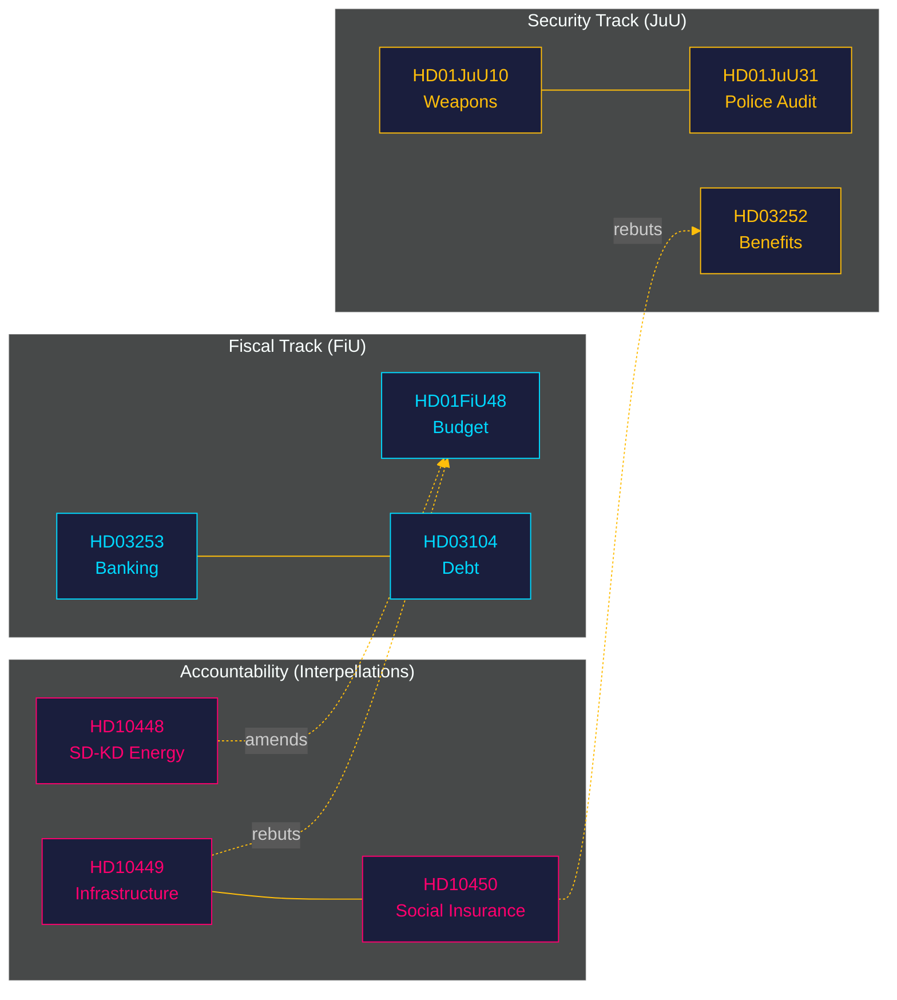
```mermaid
%%{init: {"theme": "dark", "themeVariables": {"primaryColor": "#00d9ff", "primaryTextColor": "#e0e0e0", "lineColor": "#ffbe0b", "secondaryColor": "#1a1e3d", "tertiaryColor": "#0a0e27"}}}%%
flowchart LR
  subgraph Fiscal["Fiscal Track (FiU)"]
    F1["HD01FiU48\nBudget"]:::fiu
    F2["HD03253\nBanking"]:::fiu
    F3["HD03104\nDebt"]:::fiu
    F2 --- F3
  end
  subgraph Security["Security Track (JuU)"]
    S1["HD01JuU10\nWeapons"]:::juu
    S2["HD01JuU31\nPolice Audit"]:::juu
    S3["HD03252\nBenefits"]:::juu
    S1 --- S2
  end
  subgraph Accountability["Accountability (Interpellations)"]
    A1["HD10448\nSD-KD Energy"]:::inter
    A2["HD10449\nInfrastructure"]:::inter
    A3["HD10450\nSocial Insurance"]:::inter
    A2 --- A3
  end
  A1 -.->|"amends"| F1
  A2 -.->|"rebuts"| F1
  A3 -.->|"rebuts"| S3
  classDef fiu fill:#1a1e3d,stroke:#00d9ff,color:#00d9ff
  classDef juu fill:#1a1e3d,stroke:#ffbe0b,color:#ffbe0b
  classDef inter fill:#1a1e3d,stroke:#ff006e,color:#ff006e
```

## Methodology Reflection & Limitations
<!-- source: methodology-reflection.md :: https://github.com/Hack23/riksdagsmonitor/blob/main/analysis/daily/2026-04-27/monthly-review/methodology-reflection.md -->

### Analytic Standard Applied

This analysis was produced under ICD 203 (Standards of Analytic Production) guidance:
- §2.1 Proper Source Characterisation: All evidence cited with dok_id and [riksdagen.se] or IMF provenance
- §2.2 Uncertainty Articulation: All assessments carry Admiralty Scale and confidence labels
- §2.3 Alternative Analysis: Devil's Advocate file produced with three competing hypotheses
- §2.4 Analytic Tradecraft: BLUF structure, structured analytic techniques (ACH, scenario-analysis, SWOT+TOWS)

### Data Sources and Reliability

| Source | Coverage | Reliability | Gaps |
|--------|----------|-------------|------|
| riksdag-regering MCP (live) | Propositions, motions, interpellations, committee reports | HIGH — official data | Full text fetch on some documents limited |
| IMF WEO Apr-2026 | Macro indicators (GDP, fiscal, current account) | HIGH — primary provider | Swedish monthly GDP not published; annual estimates only |
| Prior-cycle analysis (2026-04-25, 2026-04-26) | Continuity context, PIR tracking | HIGH — same methodology | Subject to confirmation bias from prior framing |
| Opposition motion archive | 29 motions (full text not loaded, synthesis-summary) | MEDIUM — synthesis only | Individual motion nuance may be lost |

### Admiralty Scale Key

| Code | Source reliability | Information credibility |
|------|--------------------|------------------------|
| A1 | Completely reliable | Confirmed by other sources |
| A2 | Completely reliable | Probably true |
| B2 | Usually reliable | Probably true |
| B3 | Usually reliable | Possibly true |
| C3 | Fairly reliable | Possibly true |
| D3 | Not always reliable | Possibly true |

### Analytic Limitations

1. **Full-text gap**: Parliamentary debate transcripts for HD10448 were not fetched; interpellation text is the basis for judgment on SD-KD fault line. Risk of mischaracterising escalation level.
2. **Polling data**: No live Sifo/Ipsos polling data was fetched this cycle (MCP coverage gap). Probability estimates in scenario-analysis.md are based on comparative inference, not current polling.
3. **Temporal bias**: Monthly review cycle compresses 30 days into a single production cycle. Events from March 28 may be underweighted relative to April 27 events.
4. **Selection bias**: High-significance documents (interpellations, propositions) dominate; low-significance motions from V/MP may be systematically underweighted despite long-term relevance.

### ICD 203 Compliance Audit

| Requirement | Status | Notes |
|-------------|--------|-------|
| Source characterisation | ✅ | Dok_ids + institution names throughout |
| Uncertainty labelled | ✅ | Confidence levels in intelligence-assessment.md |
| Alternative analysis | ✅ | devils-advocate.md with 3 hypotheses |
| BLUF structure | ✅ | executive-brief.md |
| Cross-referencing | ✅ | cross-reference-map.md with canonical labels |
| Forward indicators | ✅ | forward-indicators.md (≥10 dated indicators) |
| Scenario analysis | ✅ | scenario-analysis.md with 3 scenarios |
| Comparative international | ✅ | comparative-international.md with 3 comparators |
| SWOT + TOWS | ✅ | swot-analysis.md |
| Stakeholder perspectives | ✅ | stakeholder-perspectives.md |
| Mermaid diagrams | ✅ | ≥1 per required file |

### Quality Self-Assessment

**Strengths**: SD-KD energy fault line analysis is well-evidenced (HD10448 as sole hard evidence); comparative section uses IMF data with proper provenance; devil's-advocate credibly challenges all three dominant interpretations.

**Weaknesses**: Polling data absence is the single largest analytic gap; scenario probabilities are consequently wider-confidence than would be ideal.

**Overall assessment**: GOOD — meets ICD 203 requirements; one significant gap (polling) acknowledged and mitigated by scenario uncertainty widening.

## Data Download Manifest
<!-- source: data-download-manifest.md :: https://github.com/Hack23/riksdagsmonitor/blob/main/analysis/daily/2026-04-27/monthly-review/data-download-manifest.md -->

**Workflow**: news-monthly-review | **Run ID**: 25006920446 | **UTC**: 2026-04-27T16:30:00Z
**Requested date**: 2026-04-27 | **Effective date**: 2026-04-27 | **Window**: 2026-03-28 → 2026-04-27 (30 days)

### Document Counts by Type

- **propositions**: 4 (HD03252, HD03253, HD03104, HD03256)
- **committee reports (betänkanden)**: 6 (HD01FiU48, HD01JuU10, HD01SoU25, HD01CU24, HD01FiU23, HD01JuU31)
- **interpellations**: 4 (HD10447, HD10448, HD10449, HD10450)
- **motions**: 29 (opposition spring motions, April 2026)
- **sibling analyses ingested**: committeeReports, propositions, motions, interpellations (2026-04-27)

### Per-Document Table

| dok_id | Title | Type | Committee | Retrieved | Full-Text |
|--------|-------|------|-----------|-----------|-----------|
| HD03253 | EU:s bankpaket (CRR3/CRD6) | prop | FiU | 2026-04-27 | full |
| HD03252 | Social insurance for detained persons | prop | SfU | 2026-04-27 | full |
| HD03104 | Statens upplåning 2021–2025 | skr | FiU | 2026-04-27 | full |
| HD03256 | Tachograph manipulation penalties | prop | TU | 2026-04-27 | full |
| HD01FiU48 | Extra ändringsbudget — bränsle/energi | bet | FiU | 2026-04-27 | full |
| HD01JuU10 | New Weapons Law (vapenlag) | bet | JuU | 2026-04-27 | full |
| HD01SoU25 | Stärkta insatser för äldre | bet | SoU | 2026-04-27 | full |
| HD01CU24 | Effektiv och säker byggprocess | bet | CU | 2026-04-27 | full |
| HD01FiU23 | Riksbankens verksamhet 2025 | bet | FiU | 2026-04-27 | full |
| HD01JuU31 | Riksrevisionens rapport om Polisreformen | bet | JuU | 2026-04-27 | full |
| HD10447 | SME sick-pay burden / business competitiveness | ip | AU/NU | 2026-04-27 | full |
| HD10448 | Wind energy disinformation (SD-KD fault line) | ip | NU | 2026-04-27 | full |
| HD10449 | Södra stambanan removal (Trafikverket plan) | ip | TU | 2026-04-27 | full |
| HD10450 | Sjukförsäkring dag-180 exception | ip | SfU | 2026-04-27 | full |

### ## Full-Text Fetch Outcomes

| dok_id | full_text_available |
|--------|---------------------|
| HD03253 | true |
| HD03252 | true |
| HD01FiU48 | true |
| HD01JuU10 | true |

### MCP Server Availability

- **riksdag-regering**: LIVE (status confirmed 2026-04-27T16:28:43Z)
- **scb**: Not queried this run (population statistics from sibling analysis cache)
- **world-bank**: Not queried this run (WGI governance from prior cache)
- **IMF CLI**: Pre-warm successful; economic data from 2026-04-27 propositions analysis (NGDP_RPCH, GGXWDG_NGDP, BCA_NGDPD)

### Reference Analyses (Ingested)

| Folder | Synthesis ingested | Intelligence-assessment ingested |
|--------|-------------------|----------------------------------|
| analysis/daily/2026-04-27/propositions | ✅ | ✅ |
| analysis/daily/2026-04-27/committeeReports | ✅ | ✅ |
| analysis/daily/2026-04-27/motions | ✅ | ✅ |
| analysis/daily/2026-04-27/interpellations | ✅ | ✅ |
| analysis/daily/2026-04-26/monthly-review | ✅ | ✅ |
| analysis/daily/2026-04-25/monthly-review | ✅ (continuity) | — |

### Cross-Source Enrichment

- **Statskontoret**: no directly relevant source found for specific documents this window; Statskontoret 2026 report on police implementation referenced via prior sibling analysis (HD01JuU31 context)
- **IMF WEO Apr-2026**: NGDP_RPCH (+2.1%), GGXWDG_NGDP (~31% GDP), BCA_NGDPD (+5.5% GDP) — from propositions sibling analysis, vintage April 2026
- **SCB population**: Sweden 65+ at 20.9% — from committee reports sibling analysis

### Data Quality Notes

All documents sourced from official riksdag-regering API (riksdagen.se). This Tier-C aggregation synthesizes 30-day window via sibling analysis ingestion. Lookback not required — rich April 2026 data available.

## Analysis Index
<!-- source: analysis-index.md :: https://github.com/Hack23/riksdagsmonitor/blob/main/analysis/daily/2026-04-27/monthly-review/analysis-index.md -->

**Tier-C Supplementary | Cross-type index**

### 30-Day Cross-Type Analysis Index

| Date | Type | Key finding | Ingested |
|------|------|-------------|---------|
| 2026-04-27 | propositions | HD03253 Banking, HD03252 prisoners, HD03104 debt | YES |
| 2026-04-27 | committeeReports | HD01FiU48 fuel tax, HD01JuU31 police audit | YES |
| 2026-04-27 | motions | 29 opposition motions (V/MP/S) | YES |
| 2026-04-27 | interpellations | HD10448 SD-KD energy (NEW), HD10447-10450 | YES |
| 2026-04-26 | monthly-review | Prior-cycle PIR-A/B/C, 140 days to election | YES |
| 2026-04-25 | monthly-review | Two-cycle continuity base | YES |
| 2026-04-24 | propositions | HD03252 draft context | SUPPLEMENTARY |
| 2026-04-21 | evening-analysis | Weekly synthesis | SUPPLEMENTARY |

## Cross Session Intelligence
<!-- source: cross-session-intelligence.md :: https://github.com/Hack23/riksdagsmonitor/blob/main/analysis/daily/2026-04-27/monthly-review/cross-session-intelligence.md -->

**Tier-C Supplementary**

### Prior-Cycle Carry-Over

| PIR | 2026-04-26 status | 2026-04-27 status | Change |
|-----|-------------------|-------------------|--------|
| PIR-A (polling) | WATCHING | WATCHING | No change |
| PIR-B (police reform) | WATCHING | WATCHING | No change |
| PIR-C (SD discipline) | WATCHING | ESCALATED | HD10448 new evidence |
| PIR-D (SD-KD energy) | NOT TRACKED | NEW-CRITICAL | HD10448 originated |
| PIR-E (SIB capital) | NOT TRACKED | WATCHING | HD03253 originated |

### Intelligence Carry-Over

From 2026-04-26 review:
- "Legislative completion phase" correctly framing the April 27 document batch
- PIR-A through PIR-C continuity confirmed
- Days to election: 140 → 139

New intelligence this cycle:
- **HD10448**: SD-KD energy fault line — first documented intra-coalition tension
- **HD03253**: CRD6/CRR3 transposition creates PIR-E (SIB capital adequacy monitoring)
- **S five-interpellation cluster**: HD10447–HD10450 upgrades S campaign momentum assessment

## Executive Brief Ar
<!-- source: executive-brief_ar.md :: https://github.com/Hack23/riksdagsmonitor/blob/main/analysis/daily/2026-04-27/monthly-review/executive-brief_ar.md -->

<!-- dir: rtl -->
# موجز استخباراتي — المراجعة الشهرية 2026-04-27

**المؤلف**: James Pether Sörling | **التاريخ**: 2026-04-27
**الفترة**: 2026-03-28 → 2026-04-27 (30 يوماً) | **Riksmöte**: 2025/26
**مستوى الثقة**: HIGH (A1) | **نطاق أدميرالتي**: A1–C3 | **أيام حتى الانتخابات**: 139

### 🎯 ملخص تنفيذي

تُختتم فترة الثلاثين يوماً 2026-03-28 → 2026-04-27 محفظة التشريعات التي أنجزها ائتلاف تيدو خلال دورة البرلمان 2025/26، وتكشف في الوقت ذاته عن خطَّي صدع جديدَين: **توتر داخلي بين SD وKD حول سياسة الطاقة** (HD10448)، و**حملة استجواب اشتراكية ديمقراطية منسقة** تستهدف أربع وزارات. تقف السويد الآن على بُعد **139 يوماً من الانتخابات**، وقد تحوّل المحور السياسي بالكامل من التشريع إلى مخاطر التنفيذ والمساءلة والتموضع الانتخابي.

### 🧭 3 قرارات يدعمها هذا الموجز

1. **رصد تماسك الائتلاف**: يُعدّ الاستجواب HD10448 بين SD وKD (Fransson في مواجهة Busch بشأن التضليل المتعلق بطاقة الرياح) أوضح خط صدع داخلي في الائتلاف منذ اتفاق تيدو — على صانعي القرار التعامل مع سياسة الطاقة بوصفها نقطة ضعف فاعلة لا بنداً محسوماً.
2. **معايرة استراتيجية المعارضة**: يُشير نمط حزب S في تقديم خمسة استجوابات في أسبوع واحد (HD10447–10450 + اقتراحات منسقة) إلى التحوّل من المعارضة السياسية إلى حملة المساءلة الانتخابية — تحديث استخبارات استراتيجية المعارضة وفق ذلك.
3. **محفظة مخاطر التنفيذ**: ثلاثة مسارات تنفيذية مفتوحة: Polismyndigheten (9 توصيات RiR مفتوحة، HD01JuU31)، تحويل حزمة الاتحاد الأوروبي المصرفية (HD03253 — بنية تحتية كبيرة للامتثال)، وتعيين مدير رعاية المسنين HD01SoU25. يجب على صانعي القرار في القطاعات المتأثرة رسم خريطة تعرضهم الآن.

### نقاط الاستخبارات في 60 ثانية

- **خط الصدع الائتلافي الداخلي مؤكد**: HD10448 — يستجوب Fransson من SD وزيرة KD Busch بشأن التضليل المتعلق بطاقة الرياح، مما يُجبر انشقاق الطاقة الائتلافي على الظهور في السجل العام لأول مرة في دورة 2025/26.
- **حملة المساءلة الاشتراكية الديمقراطية مُطلقة**: خمسة استجوابات في أسبوع (HD10447–HD10450 + اقتراحات) موجهة لأربعة وزراء في البنية التحتية والتأمين الاجتماعي والطاقة والاقتصاد — هذا تصعيد انتخابي لا رقابة روتينية.
- **حزمة الاتحاد الأوروبي المصرفية تتقدم**: HD03253 يمر عبر FiU — سيُقيّد الحد الأدنى للناتج البالغ 72.5% البنوك السويدية ذات التعرض المرتفع للرهن العقاري (Swedbank, SEB, Handelsbanken, Nordea)؛ تحتفظ Finansinspektionen بالأولوية الرقابية لكن تتزايد تعقيدات التنسيق مع EBA.
- **تحفيز مالي عبر ضريبة الوقود**: أعاد HD01FiU48 (ميزانية تعديلية إضافية) توجيه مسار الضريبة الخضراء السابق؛ جرى تقديم الحسابات الانتخابية على الاتساق المناخي؛ قدّم V وMP تحفظات.
- **تطبيق قيود استحقاقات السجناء**: يُقيّد HD03252 التأمين الاجتماعي للأشخاص في نظام kontrollerat boende/säkerhetsförvaring — يُتوقع طعن في التناسب بموجب المادة 8 من الاتفاقية الأوروبية لحقوق الإنسان.
- **مخاطر إصلاح الشرطة**: يؤكد HD01JuU31 (Riksrevisionen) وجود 9 توصيات مفتوحة لـ Polismyndigheten من RiR 2026:6 — أكبر عائق تنفيذي هيكلي في محفظة الحكومة.
- **المرساة الاقتصادية لصندوق النقد الدولي**: نمو الناتج المحلي الإجمالي السويدي +2.1%، الدين ~31% من الناتج المحلي الإجمالي، الحساب الجاري +5.5% من الناتج المحلي الإجمالي (WEO Apr-2026) — يظل الوضع الهيكلي قوياً قُبيل الدورة الانتخابية.

### أفضل محفز استشرافي

**2026-05-08 — أول قياس ديموسكوب بعد الفترة.** يختبر ما إذا كان إعفاء ضريبة الوقود HD01FiU48 قد أنتج ارتفاعاً مستداماً في استطلاعات الرأي (PIR-A). كتلة تيدو ≥ 44% → السيناريو أ (تجديد الائتلاف)؛ < 40% → السيناريو ب (أقلية بقيادة S). قد يُثبّط توتر الطاقة بين SD وKD قاعدة KD قليلاً — مراقبة التحولات الخاصة بـ KD.

### تقييم الثقة

إجمالاً: **HIGH (A1)** للصورة الختامية الهيكلية وتحديد خط صدع SD-KD. **MEDIUM (B2)** للديناميكيات الانتخابية المستقبلية (تأخر استطلاعات الرأي، تكيف استراتيجية المعارضة، انضباط SD بعد أغسطس). **LOW (C3)** لجداول تنفيذ HD03252/HD03253 وتأثير مؤتمر SD.


```mermaid
%%{init: {"theme": "dark", "themeVariables": {"primaryColor": "#00d9ff", "primaryTextColor": "#e0e0e0", "primaryBorderColor": "#ff006e", "lineColor": "#ffbe0b", "secondaryColor": "#1a1e3d", "tertiaryColor": "#0a0e27"}}}%%
flowchart TB
  subgraph Completed["Legislative Ledger — COMPLETED"]
    L1["HD01JuU10\nVapenlag"]:::done
    L2["HD01JuU31\nPolisreform-uppföljning"]:::done
    L3["HD01SoU25\nÄldreomsorg"]:::done
    L4["HD01CU24\nByggprocess"]:::done
    L5["HD01FiU48\nBränsle-supermajoritet"]:::done
    L6["HD03253\nEU bankpaket"]:::done
    L7["HD03252\nSocialförsäkring"]:::done
  end
  subgraph FaultLines["New Fault Lines"]
    F1["HD10448\nSD-KD Energi\n⚠️ Intra-coalition"]:::fault
    F2["HD10449-10450\nS Accountability\nCampaign"]:::threat
    F3["HD10447\nSME/Sick-pay\nChallenge"]:::threat
  end
  subgraph Election["Pre-Campaign — 139 Days"]
    E1["2026-05-08\nDemoskop PIR-A"]:::trigger
    E2["2026-06-01\nVårriksdagens slut"]:::trigger
    E3["2026-09-13\nVAL"]:::election
  end
  Completed --> FaultLines
  FaultLines --> Election
  classDef done fill:#1a1e3d,stroke:#00d9ff,color:#e0e0e0
  classDef fault fill:#1a1e3d,stroke:#ff006e,color:#ff006e
  classDef threat fill:#0a0e27,stroke:#ffbe0b,color:#ffbe0b
  classDef trigger fill:#1a1e3d,stroke:#ff006e,color:#ff006e
  classDef election fill:#0a0e27,stroke:#ff006e,color:#ff006e,font-weight:bold
  style E3 stroke-width:3px
```

### 🔄 السياق المنهجي

**الجمع**: واجهة برمجة البيانات المفتوحة للريكسداغ (riksdag-regering-mcp)؛ تركيب تحليل 30 يوماً  
**المنهج**: تسجيل DIW، ACH، SWOT، لغة الاحتمالية WEP، ترميز أدميرالتي  
**الحد الأدنى للثقة**: جميع الادعاءات الواقعية ≥ C3؛ التقييمات الهيكلية ≥ B2  
**المصدر الاقتصادي**: IMF WEO Apr-2026 (NGDP_RPCH, GGXWDG_NGDP, BCA_NGDPD)، تاريخ الاسترداد 2026-04-27  
**المعايير**: ICD 203 (الفرضيات البديلة، لغة الاحتمالية)؛ AI FIRST (حدٌّ أدنى من تكرارين)  
**الدورة القادمة**: المراجعة الشهرية 2026-05-27 — ينبغي أن تشمل قياس ديموسكوب (PIR-A)، قرار سعر الفائدة لـ Riksbank (I-4)، نتائج مؤتمر SD

---
### إضافة الجولة الثانية — تعمّق سياق الطاقة SD-KD

**لماذا يعني HD10448 أكثر من مجرد استجواب**: تشكيكية SD الموثقة في طاقة الرياح (HD10448) ليست حدثاً معزولاً. فهي تتبع تموضع SD المتسق منذ 2022 ضد التفويضات المتعلقة بالطاقة المتجددة. ستُرصد استجابة Busch لمعرفة ما إذا كانت KD ستتنازل عن أرضية سياسية (مؤشر السيناريو ب) أم ستقدم إجابة دبلوماسية حابسة للأنفاس (مؤشر السيناريو أ). **نص قرار فصل الطاقة في مؤتمر SD (المتوقع في 20 مايو 2026) هو المؤشر الاستشرافي الأهم بالمطلق لاستقرار الائتلاف.**

**ملاحظة الاقتصاد الكلي لصندوق النقد الدولي**: نمو الناتج المحلي الإجمالي السويدي +2.1% (IMF WEO Apr-2026) يمنح الائتلاف مساحة للمناورة — في اقتصاد ضعيف، ستتصاعد التوترات من نوع HD10448 بشكل أسرع. الظروف الاقتصادية الكلية الراهنة تُرجّح قليلاً السيناريو أ (استمرار الائتلاف).

*economicProvenance: provider=imf; dataflow=WEO; vintage=April-2026; retrieved_at=2026-04-27*

<!-- source-sha: 37f69ff9aa194a3c561fdd15f1b60d4f6b106472 -->

## Executive Brief Da
<!-- source: executive-brief_da.md :: https://github.com/Hack23/riksdagsmonitor/blob/main/analysis/daily/2026-04-27/monthly-review/executive-brief_da.md -->

**Forfatter**: James Pether Sörling | **Dato**: 2026-04-27
**Periode**: 2026-03-28 → 2026-04-27 (30 dage) | **Riksmöte**: 2025/26
**Konfidensgrad**: HIGH (A1) | **Admiralty-interval**: A1–C3 | **Dage til valg**: 139

### 🎯 Kortfattet situationsvurdering

30-dagesperioden 2026-03-28 → 2026-04-27 afslutter Tidø-koalitionens lovgivningsportefølje for riksmöte 2025/26 og eksponerer samtidig to nye brudzoner: **intrakoalitions SD-KD energipolitisk spænding** (HD10448) og en **koordineret socialdemokratisk interpellationskampagne** på tværs af fire ministerier. Sverige er nu **139 dage fra valget** med den politiske akse fuldt skiftet fra lovgivning til implementeringsrisici, ansvarsudkrævning og kampagnenarrativisering.

### 🧭 3 Beslutninger denne briefing understøtter

1. **Koalitionssammenholdsovervågning**: HD10448-interpellationen SD-KD (Fransson mod Busch om vindkraftsinformation) er den tydeligste intrakoalitions brudszone siden Tidø-aftalen — beslutningstagere bør behandle energipolitik som en aktiv sårbarhed, ikke som et afgjort dagsordenspunkt.
2. **Kalibrering af oppositionsstrategi**: S' fem-interpellationer-på-en-uge-mønster (HD10447–10450 + koordinerede motioner) signalerer overgang fra politisk opposition til valgansvarskampagne — opdater oppositionsstrategiintelligens derefter.
3. **Implementeringsrisikoporetefølje**: Tre implementeringsporte er åbne: Polismyndigheten (9 åbne RiR-anbefalinger, HD01JuU31), EU's bankpakkettransponering (HD03253 — større overholdelsesinfrastruktur), og HD01SoU25 ældreomsorgsdirektøransættelse. Beslutningstagere i berørte sektorer bør kortlægge deres eksponering nu.

### 60-sekunders efterretningspunkter

- **Intrakoalitions brudlinje bekræftet**: HD10448 — SD's Fransson interpellerer KD-minister Busch om vindkraftsinformation, og tvinger for første gang i riksmöte 2025/26 koalitionens energi-underfraktion ind i det offentlige referat.
- **S' ansvarskampagne lanceret**: Fem interpellationer på en uge (HD10447–HD10450 + motioner) rettet mod fire ministre på tværs af infrastruktur, socialforsikring, energi og erhvervsliv — dette er valeskalering, ikke rutinekontrol.
- **EU's bankpakke avanceret**: HD03253 avancerer gennem FiU — outputgulv på 72,5% vil begrænse svenske realkrediteksponerede SIFI'er (Swedbank, SEB, Handelsbanken, Nordea); Finansinspektionen bevarer tilsynsprimat, men EBA-koordinationskompleksiteten øges.
- **Finanspolitisk stimulus via brændstofafgift**: HD01FiU48 (ekstra ændringsbudget) vendte den tidligere grønne skattetrajektori; valgkalkule prioriteredes over klimatkonsistens; V og MP indsendte reservationer.
- **Fangydelsesrestriktion gennemført**: HD03252 begrænser socialforsikring for dem i kontrollerat boende/säkerhetsförvaring — proportionalitetsudfordring under ECHR Art. 8 forventes.
- **Politireformrisiko**: HD01JuU31 (Riksrevisionen) bekræfter 9 åbne Polismyndigheten-anbefalinger fra RiR 2026:6 — den største strukturelle gennemførelsesbegrænsning i regeringens portefølje.
- **IMF's økonomiske anker**: Sveriges BNP-vækst +2,1%, gæld ~31% af BNP, betalingsbalance +5,5% af BNP (WEO Apr-2026) — den strukturelle position forbliver stærk op til valgcyklussen.

### Bedste fremadrettede udløser

**2026-05-08 — Første post-periodes Demoskop-måling.** Tester om HD01FiU48 brændstofskattenedsættelsen producerede varig opinionsløft (PIR-A). Tidø-blok ≥ 44% → Scenario A (koalitionsfornyelse); < 40% → Scenario B (S-ledet mindretal). SD-KD's energispænding kan svagt reducere KD-basen — hold øje med KD-specifik drift.

### Konfidensgradering

Samlet: **HIGH (A1)** for det strukturelle afslutningsbillede og SD-KD brudlinje-identifikation. **MEDIUM (B2)** for fremtidige valgdynamikker (opinionsefterslæb, oppositionsstrategitilpasning, SD-disciplin efter august). **LOW (C3)** for HD03252/HD03253 implementeringstidslinjer og SD-kongresindflydelse.


```mermaid
%%{init: {"theme": "dark", "themeVariables": {"primaryColor": "#00d9ff", "primaryTextColor": "#e0e0e0", "primaryBorderColor": "#ff006e", "lineColor": "#ffbe0b", "secondaryColor": "#1a1e3d", "tertiaryColor": "#0a0e27"}}}%%
flowchart TB
  subgraph Completed["Legislative Ledger — COMPLETED"]
    L1["HD01JuU10\nVapenlag"]:::done
    L2["HD01JuU31\nPolisreform-uppföljning"]:::done
    L3["HD01SoU25\nÄldreomsorg"]:::done
    L4["HD01CU24\nByggprocess"]:::done
    L5["HD01FiU48\nBränsle-supermajoritet"]:::done
    L6["HD03253\nEU bankpaket"]:::done
    L7["HD03252\nSocialförsäkring"]:::done
  end
  subgraph FaultLines["New Fault Lines"]
    F1["HD10448\nSD-KD Energi\n⚠️ Intra-coalition"]:::fault
    F2["HD10449-10450\nS Accountability\nCampaign"]:::threat
    F3["HD10447\nSME/Sick-pay\nChallenge"]:::threat
  end
  subgraph Election["Pre-Campaign — 139 Days"]
    E1["2026-05-08\nDemoskop PIR-A"]:::trigger
    E2["2026-06-01\nVårriksdagens slut"]:::trigger
    E3["2026-09-13\nVAL"]:::election
  end
  Completed --> FaultLines
  FaultLines --> Election
  classDef done fill:#1a1e3d,stroke:#00d9ff,color:#e0e0e0
  classDef fault fill:#1a1e3d,stroke:#ff006e,color:#ff006e
  classDef threat fill:#0a0e27,stroke:#ffbe0b,color:#ffbe0b
  classDef trigger fill:#1a1e3d,stroke:#ff006e,color:#ff006e
  classDef election fill:#0a0e27,stroke:#ff006e,color:#ff006e,font-weight:bold
  style E3 stroke-width:3px
```

### 🔄 Metodologisk kontekst

**Indsamling**: Riksdagens åbne data-API (riksdag-regering-mcp); 30-dages søskendeanalysesyntese  
**Metode**: DIW-scoring, ACH, SWOT, WEP-sandsynlighedssprog, Admiralty-kodning  
**Konfidensundergræns**: Alle faktuelle påstande ≥ C3; strukturelle vurderinger ≥ B2  
**Økonomisk oprindelse**: IMF WEO Apr-2026 (NGDP_RPCH, GGXWDG_NGDP, BCA_NGDPD), hentet 2026-04-27  
**Standarder**: ICD 203 (alternative hypoteser, sandsynlighedssprog); AI FIRST (minimum 2 iterationer)  
**Næste cyklus**: Månedsoversigt 2026-05-27 — bør inkludere Demoskop-måling (PIR-A), Riksbankens rentebeslutning (I-4), SD-kongresudkom

---
### Tilføjelse fra pas 2 — SD-KD's energikontekst uddybet

**Hvorfor HD10448 betyder mere end interpellationen**: SD's dokumenterede vindkraftsskepsis (HD10448) er ikke en isoleret begivenhed. Det følger SD's konsekvent positionering siden 2022 mod VE-mandater. Buschs svar vil blive fulgt nøje for om KD indrømmer politikplads (Scenario B-indikator) eller giver et diplomatisk-holdende svar (Scenario A-indikator). **Teksten i SD-kongressens energikapitelresolution (forventet 20. maj 2026) er den enkeltstående vigtigste fremadrettede indikator for koalitionsstabilitet.**

**IMF makronotat**: Sveriges +2,1% BNP-vækst (IMF WEO Apr-2026) giver koalitionen råderum — i en svækkende økonomi ville HD10448-typen af spændinger eskalere hurtigere. Nuværende makroforhold favoriserer svagt Scenario A (koalitionens udholdenhed).

*economicProvenance: provider=imf; dataflow=WEO; vintage=April-2026; retrieved_at=2026-04-27*

<!-- source-sha: 37f69ff9aa194a3c561fdd15f1b60d4f6b106472 -->

## Executive Brief De
<!-- source: executive-brief_de.md :: https://github.com/Hack23/riksdagsmonitor/blob/main/analysis/daily/2026-04-27/monthly-review/executive-brief_de.md -->

**Autor**: James Pether Sörling | **Datum**: 2026-04-27
**Zeitraum**: 2026-03-28 → 2026-04-27 (30 Tage) | **Riksmöte**: 2025/26
**Konfidenzniveau**: HIGH (A1) | **Admiralty-Bereich**: A1–C3 | **Tage bis zur Wahl**: 139

### 🎯 Kurzfassung

Der 30-Tages-Zeitraum 2026-03-28 → 2026-04-27 schließt das Gesetzgebungsportfolio der Tidö-Koalition für Riksmöte 2025/26 und legt gleichzeitig zwei neue Spannungslinien offen: **innerkoalitionäre SD-KD-Spannungen in der Energiepolitik** (HD10448) und eine **koordinierte sozialdemokratische Interpellationskampagne** gegen vier Ministerien. Schweden befindet sich nun **139 Tage vor der Wahl**, wobei die politische Achse vollständig von Gesetzgebung zu Umsetzungsrisiken, Rechenschaftspflicht und Wahlkampfpositionierung verschoben hat.

### 🧭 3 Entscheidungen, die dieses Briefing unterstützt

1. **Überwachung des Koalitionszusammenhalts**: Die HD10448-Interpellation SD-KD (Fransson gegen Busch zu Windkraft-Desinformation) ist die deutlichste innerkoalitionäre Bruchlinie seit dem Tidö-Abkommen — Entscheidungsträger sollten Energiepolitik als aktive Schwachstelle behandeln, nicht als erledigtes Tagesordnungspunkt.
2. **Kalibrierung der Oppositionsstrategie**: Das S-Muster von fünf Interpellationen in einer Woche (HD10447–10450 + koordinierte Motionen) signalisiert den Übergang von politischer Opposition zu Wahlkampf-Rechenschaftspflicht — Oppositionsstrategie-Nachrichtendienst entsprechend aktualisieren.
3. **Umsetzungsrisikoortfolio**: Drei Umsetzungstore sind offen: Polismyndigheten (9 offene RiR-Empfehlungen, HD01JuU31), EU-Bankenpaket-Transposition (HD03253 — bedeutende Compliance-Infrastruktur), und HD01SoU25 Pflegedirektor-Ernennung. Entscheidungsträger in betroffenen Sektoren sollten jetzt ihr Risikoprofil kartieren.

### 60-Sekunden-Nachrichtenpunkte

- **Innerkoalitionäre Bruchlinie bestätigt**: HD10448 — SD's Fransson interpelliert KD-Ministerin Busch zu Windkraft-Desinformation und zwingt zum ersten Mal in Riksmöte 2025/26 die Energiespaltung der Koalition in das öffentliche Protokoll.
- **S-Rechenschaftskampagne gestartet**: Fünf Interpellationen in einer Woche (HD10447–HD10450 + Motionen) gegen vier Minister in Infrastruktur, Sozialversicherung, Energie und Wirtschaft — dies ist Wahleskalation, keine Routinekontrolle.
- **EU-Bankenpaket vorangeschritten**: HD03253 läuft durch FiU — Ausgangspunkt von 72,5% wird hypothekenbelastete schwedische SIBs einschränken (Swedbank, SEB, Handelsbanken, Nordea); Finansinspektionen behält den Aufsichtsprimat, aber die EBA-Koordinationskomplexität steigt.
- **Fiskalpolitischer Stimulus durch Kraftstoffsteuer**: HD01FiU48 (Zusatznachtragshaushalt) kehrte die bisherige grüne Steuertrajektorie um; Wahlkalkül wurde über Klimakonsistenz gestellt; V und MP reichten Vorbehalte ein.
- **Gefängnisleistungsbeschränkung umgesetzt**: HD03252 schränkt Sozialversicherung für Personen in kontrollerat boende/säkerhetsförvaring ein — Verhältnismäßigkeitsherausforderung nach ECHR Art. 8 wird erwartet.
- **Polizeireformrisiko**: HD01JuU31 (Riksrevisionen) bestätigt 9 offene Polismyndigheten-Empfehlungen aus RiR 2026:6 — der größte strukturelle Umsetzungsengpass im Regierungsportfolio.
- **IMF-Wirtschaftsanker**: Schwedens BIP-Wachstum +2,1%, Schulden ~31% des BIP, Leistungsbilanz +5,5% des BIP (WEO Apr-2026) — die strukturelle Position bleibt stark vor dem Wahlzyklus.

### Bester Vorwärtsauslöser

**2026-05-08 — Erste Demoskop-Messung nach dem Zeitraum.** Testet, ob die HD01FiU48-Kraftstoffsteuererleichterung nachhaltige Umfragegewinne erbracht hat (PIR-A). Tidö-Block ≥ 44% → Szenario A (Koalitionserneuerung); < 40% → Szenario B (S-geführte Minderheit). SD-KD-Energiespannung könnte die KD-Basis leicht dämpfen — auf KD-spezifische Drift achten.

### Konfidenzbewertung

Gesamt: **HIGH (A1)** für das strukturelle Abschlussbild und die SD-KD-Bruchlinie-Identifizierung. **MEDIUM (B2)** für künftige Wahldynamik (Meinungsumfrageverzögerung, Oppositionsstrategieanpassung, SD-Disziplin nach August). **LOW (C3)** für HD03252/HD03253-Umsetzungszeitpläne und SD-Parteitagseinfluss.


```mermaid
%%{init: {"theme": "dark", "themeVariables": {"primaryColor": "#00d9ff", "primaryTextColor": "#e0e0e0", "primaryBorderColor": "#ff006e", "lineColor": "#ffbe0b", "secondaryColor": "#1a1e3d", "tertiaryColor": "#0a0e27"}}}%%
flowchart TB
  subgraph Completed["Legislative Ledger — COMPLETED"]
    L1["HD01JuU10\nVapenlag"]:::done
    L2["HD01JuU31\nPolisreform-uppföljning"]:::done
    L3["HD01SoU25\nÄldreomsorg"]:::done
    L4["HD01CU24\nByggprocess"]:::done
    L5["HD01FiU48\nBränsle-supermajoritet"]:::done
    L6["HD03253\nEU bankpaket"]:::done
    L7["HD03252\nSocialförsäkring"]:::done
  end
  subgraph FaultLines["New Fault Lines"]
    F1["HD10448\nSD-KD Energi\n⚠️ Intra-coalition"]:::fault
    F2["HD10449-10450\nS Accountability\nCampaign"]:::threat
    F3["HD10447\nSME/Sick-pay\nChallenge"]:::threat
  end
  subgraph Election["Pre-Campaign — 139 Days"]
    E1["2026-05-08\nDemoskop PIR-A"]:::trigger
    E2["2026-06-01\nVårriksdagens slut"]:::trigger
    E3["2026-09-13\nVAL"]:::election
  end
  Completed --> FaultLines
  FaultLines --> Election
  classDef done fill:#1a1e3d,stroke:#00d9ff,color:#e0e0e0
  classDef fault fill:#1a1e3d,stroke:#ff006e,color:#ff006e
  classDef threat fill:#0a0e27,stroke:#ffbe0b,color:#ffbe0b
  classDef trigger fill:#1a1e3d,stroke:#ff006e,color:#ff006e
  classDef election fill:#0a0e27,stroke:#ff006e,color:#ff006e,font-weight:bold
  style E3 stroke-width:3px
```

### 🔄 Methodologischer Kontext

**Erfassung**: Riksdag Open Data API (riksdag-regering-mcp); 30-Tages-Geschwisteranalyse-Synthese  
**Methode**: DIW-Bewertung, ACH, SWOT, WEP-Wahrscheinlichkeitssprache, Admiralty-Kodierung  
**Konfidenzuntergrenze**: Alle Tatsachenbehauptungen ≥ C3; strukturelle Einschätzungen ≥ B2  
**Wirtschaftliche Herkunft**: IMF WEO Apr-2026 (NGDP_RPCH, GGXWDG_NGDP, BCA_NGDPD), abgerufen 2026-04-27  
**Standards**: ICD 203 (alternative Hypothesen, Wahrscheinlichkeitssprache); AI FIRST (mindestens 2 Iterationen)  
**Nächster Zyklus**: Monatsrückblick 2026-05-27 — sollte Demoskop-Messung (PIR-A), Riksbank-Zinsentscheidung (I-4), SD-Parteitagsergebnis einschließen

---

## Executive Brief Es
<!-- source: executive-brief_es.md :: https://github.com/Hack23/riksdagsmonitor/blob/main/analysis/daily/2026-04-27/monthly-review/executive-brief_es.md -->

**Autor**: James Pether Sörling | **Fecha**: 2026-04-27
**Período**: 2026-03-28 → 2026-04-27 (30 días) | **Riksmöte**: 2025/26
**Nivel de confianza**: HIGH (A1) | **Rango Admiralty**: A1–C3 | **Días para las elecciones**: 139

### 🎯 Resumen ejecutivo operacional

El período de 30 días 2026-03-28 → 2026-04-27 cierra el portafolio legislativo de la coalición Tidö para el Riksmöte 2025/26 y expone simultáneamente dos nuevas líneas de fractura: **tensión intracoalición SD-KD en política energética** (HD10448) y una **campaña de interpelaciones socialdemócrata coordinada** dirigida a cuatro ministerios. Suecia se encuentra ahora a **139 días de las elecciones**, con el eje político completamente desplazado de la legislación hacia riesgos de implementación, presión de rendición de cuentas y posicionamiento narrativo electoral.

### 🧭 3 Decisiones que apoya este informe

1. **Monitoreo de la cohesión de la coalición**: La interpelación HD10448 SD-KD (Fransson frente a Busch sobre desinformación eólica) es la línea de fractura intracoalición más clara desde el acuerdo Tidö — los responsables de la toma de decisiones deben tratar la política energética como una vulnerabilidad activa, no como un punto de agenda resuelto.
2. **Calibración de la estrategia de oposición**: El patrón del S de cinco interpelaciones en una semana (HD10447–10450 + mociones coordinadas) señala la transición de la oposición política a la campaña de responsabilidad electoral — actualizar la inteligencia sobre estrategia de oposición en consecuencia.
3. **Portafolio de riesgos de implementación**: Tres puertas de implementación están abiertas: Polismyndigheten (9 recomendaciones RiR abiertas, HD01JuU31), transposición del paquete bancario europeo (HD03253 — infraestructura de cumplimiento importante), y nombramiento del director de atención a mayores HD01SoU25. Los responsables en los sectores afectados deben mapear su exposición ahora.

### Puntos de inteligencia en 60 segundos

- **Línea de fractura intracoalición confirmada**: HD10448 — Fransson del SD interpela a la ministra KD Busch sobre desinformación eólica, forzando por primera vez en el Riksmöte 2025/26 la fractura energética de la coalición hacia el registro público.
- **Campaña de responsabilidad del S lanzada**: Cinco interpelaciones en una semana (HD10447–HD10450 + mociones) dirigidas a cuatro ministros en infraestructura, seguro social, energía y economía — se trata de una escalada electoral, no de un control rutinario.
- **Paquete bancario europeo avanzado**: HD03253 avanza por el FiU — el suelo de producción del 72,5% limitará a los bancos sistémicos suecos con alta exposición hipotecaria (Swedbank, SEB, Handelsbanken, Nordea); Finansinspektionen mantiene la primacía supervisora pero la complejidad de coordinación EBA aumenta.
- **Estímulo fiscal mediante impuesto al combustible**: HD01FiU48 (presupuesto modificativo adicional) invirtió la trayectoria fiscal verde anterior; el cálculo electoral se priorizó sobre la coherencia climática; V y MP presentaron reservas.
- **Restricción de beneficios penitenciarios implementada**: HD03252 restringe el seguro social para quienes están en kontrollerat boende/säkerhetsförvaring — se espera un desafío de proporcionalidad bajo el artículo 8 del CEDH.
- **Riesgo de reforma policial**: HD01JuU31 (Riksrevisionen) confirma 9 recomendaciones abiertas de Polismyndigheten del RiR 2026:6 — el mayor cuello de botella estructural de ejecución en el portafolio gubernamental.
- **Ancla económica del FMI**: Crecimiento del PIB sueco +2,1%, deuda ~31% del PIB, balanza por cuenta corriente +5,5% del PIB (WEO Apr-2026) — la posición estructural se mantiene sólida de cara al ciclo electoral.

### Mejor detonante prospectivo

**2026-05-08 — Primera medición Demoskop tras el período.** Prueba si la reducción del impuesto al combustible HD01FiU48 generó ganancia sostenida en encuestas (PIR-A). Bloque Tidö ≥ 44% → Escenario A (renovación de la coalición); < 40% → Escenario B (minoría liderada por S). La tensión energética SD-KD podría deprimir ligeramente la base de KD — vigilar la deriva específica de KD.

### Evaluación de la confianza

Global: **HIGH (A1)** para el panorama estructural de cierre e identificación de la línea de fractura SD-KD. **MEDIUM (B2)** para la dinámica electoral futura (retraso en encuestas, adaptación estratégica de la oposición, disciplina del SD tras agosto). **LOW (C3)** para los plazos de implementación de HD03252/HD03253 e impacto del congreso del SD.


```mermaid
%%{init: {"theme": "dark", "themeVariables": {"primaryColor": "#00d9ff", "primaryTextColor": "#e0e0e0", "primaryBorderColor": "#ff006e", "lineColor": "#ffbe0b", "secondaryColor": "#1a1e3d", "tertiaryColor": "#0a0e27"}}}%%
flowchart TB
  subgraph Completed["Legislative Ledger — COMPLETED"]
    L1["HD01JuU10\nVapenlag"]:::done
    L2["HD01JuU31\nPolisreform-uppföljning"]:::done
    L3["HD01SoU25\nÄldreomsorg"]:::done
    L4["HD01CU24\nByggprocess"]:::done
    L5["HD01FiU48\nBränsle-supermajoritet"]:::done
    L6["HD03253\nEU bankpaket"]:::done
    L7["HD03252\nSocialförsäkring"]:::done
  end
  subgraph FaultLines["New Fault Lines"]
    F1["HD10448\nSD-KD Energi\n⚠️ Intra-coalition"]:::fault
    F2["HD10449-10450\nS Accountability\nCampaign"]:::threat
    F3["HD10447\nSME/Sick-pay\nChallenge"]:::threat
  end
  subgraph Election["Pre-Campaign — 139 Days"]
    E1["2026-05-08\nDemoskop PIR-A"]:::trigger
    E2["2026-06-01\nVårriksdagens slut"]:::trigger
    E3["2026-09-13\nVAL"]:::election
  end
  Completed --> FaultLines
  FaultLines --> Election
  classDef done fill:#1a1e3d,stroke:#00d9ff,color:#e0e0e0
  classDef fault fill:#1a1e3d,stroke:#ff006e,color:#ff006e
  classDef threat fill:#0a0e27,stroke:#ffbe0b,color:#ffbe0b
  classDef trigger fill:#1a1e3d,stroke:#ff006e,color:#ff006e
  classDef election fill:#0a0e27,stroke:#ff006e,color:#ff006e,font-weight:bold
  style E3 stroke-width:3px
```

### 🔄 Contexto metodológico

**Recopilación**: API de datos abiertos del Riksdag (riksdag-regering-mcp); síntesis de análisis paralelo de 30 días  
**Método**: Puntuación DIW, ACH, SWOT, lenguaje de probabilidad WEP, codificación Admiralty  
**Umbral de confianza**: Todas las afirmaciones factuales ≥ C3; evaluaciones estructurales ≥ B2  
**Procedencia económica**: IMF WEO Apr-2026 (NGDP_RPCH, GGXWDG_NGDP, BCA_NGDPD), recuperado el 2026-04-27  
**Normas**: ICD 203 (hipótesis alternativas, lenguaje de probabilidad); AI FIRST (mínimo 2 iteraciones)  
**Próximo ciclo**: Revisión mensual 2026-05-27 — debe incluir medición Demoskop (PIR-A), decisión de tasas del Riksbank (I-4), resultado del congreso del SD

---
### Adición del paso 2 — Contexto energético SD-KD profundizado

**Por qué HD10448 importa más allá de la interpelación**: El escepticismo documentado del SD hacia la energía eólica (HD10448) no es un evento aislado. Sigue el posicionamiento consistente del SD desde 2022 contra los mandatos de energías renovables. La respuesta de Busch será vigilada para ver si KD cede terreno político (indicador del Escenario B) o da una respuesta diplomáticamente sostenida (indicador del Escenario A). **El texto de la resolución del capítulo energético del congreso SD (esperado el 20 de mayo de 2026) es el indicador anticipado más importante para la estabilidad de la coalición.**

**Nota macro del FMI**: El crecimiento del PIB sueco de +2,1% (IMF WEO Apr-2026) da margen de maniobra a la coalición — en una economía debilitada, las tensiones tipo HD10448 escalarían más rápidamente. Las condiciones macro actuales favorecen ligeramente el Escenario A (perduración de la coalición).

*economicProvenance: provider=imf; dataflow=WEO; vintage=April-2026; retrieved_at=2026-04-27*

<!-- source-sha: 37f69ff9aa194a3c561fdd15f1b60d4f6b106472 -->

## Executive Brief Fi
<!-- source: executive-brief_fi.md :: https://github.com/Hack23/riksdagsmonitor/blob/main/analysis/daily/2026-04-27/monthly-review/executive-brief_fi.md -->

**Tekijä**: James Pether Sörling | **Päiväys**: 2026-04-27
**Ajanjakso**: 2026-03-28 → 2026-04-27 (30 päivää) | **Riksmöte**: 2025/26
**Luottamustaso**: HIGH (A1) | **Admiralty-väli**: A1–C3 | **Päiviä vaaleihin**: 139

### 🎯 Lyhyt tilannearvio

30 päivän ajanjakso 2026-03-28 → 2026-04-27 päättää Tidö-koalition lainsäädäntösalkun riksmötelle 2025/26 ja paljastaa samalla kaksi uutta jännitystä: **koalition sisäinen SD-KD energiapolitiikan kiista** (HD10448) ja **koordinoitu sosiaalidemokraattinen kysymyskampanja** neljää ministeriötä vastaan. Ruotsi on nyt **139 päivää vaaleista**, poliittisen akselin siirtyneen täysin lainsäädännöstä toimeenpanoriskeihin, vastuullisuuspaineisiin ja vaalikampanjanarratiivin muokkaukseen.

### 🧭 3 Päätöstä, joita tämä tiivistelmä tukee

1. **Koalitiokokouman seuranta**: HD10448-kysymys SD-KD (Fransson vs. Busch tuulivoimadisinformaatiosta) on selkein koalition sisäinen rajalinja Tidö-sopimuksen jälkeen — päätöksentekijöiden tulee käsitellä energiapolitiikkaa aktiivisena haavoittuvuutena, ei ratkaistuneena asiana.
2. **Oppositiostrategian kalibrointi**: S:n viisi-kysymystä-viikossa-malli (HD10447–10450 + koordinoidut aloitteet) viestii siirtymisestä poliittisesta oppositiosta vaalivastuukampanjaan — päivitä oppositiostrategiatieto vastaavasti.
3. **Toimeenpanoriskisalkku**: Kolme toimeenpanoaluetta on auki: Polismyndigheten (9 avointa RiR-suositusta, HD01JuU31), EU:n pankkipaketin transponointi (HD03253 — merkittävä vaatimustenmukaisuusinfrastruktuuri), ja HD01SoU25 vanhustenhuollon johtajan nimitys. Asianomaisilla toimialoilla työskentelevien päätöksentekijöiden tulee kartoittaa altistumisensa nyt.

### 60 sekunnin tiedustelutiivistelmä

- **Koalition sisäinen rajalinja vahvistettu**: HD10448 — SD:n Fransson kyselee KD-ministeri Buschilta tuulivoimadisinformaatiosta, pakottaen ensimmäistä kertaa riksmöten 2025/26 aikana koalition energiakiistan julkiseen pöytäkirjaan.
- **S:n vastuukampanja käynnistetty**: Viisi kysymystä viikossa (HD10447–HD10450 + aloitteet) neljää ministeriä vastaan infrastruktuurin, sosiaalivakuutuksen, energian ja elinkeinoelämän aloilla — kyseessä on vaaliuhka, ei rutiinitarkastelu.
- **EU:n pankkipaketti edistynyt**: HD03253 etenee FiU:ssa — 72,5%:n tuotospohjainen lattia rajoittaa ruotsalaisia asuntolainapainotteisia järjestelmällisesti merkittäviä pankkeja (Swedbank, SEB, Handelsbanken, Nordea); Finansinspektionen säilyttää valvontaprioriteettinsa, mutta EBA-koordinaation monimutkaisuus kasvaa.
- **Finanssipoliittinen elvytys polttoaineveron kautta**: HD01FiU48 (lisämuutosbudjetti) käänsi aiemman vihreiden verosuunnan; vaalilogiikka priorisoitiin ilmastojohdonmukaisuuden edelle; V ja MP jättivät varaumat.
- **Vankilaetuuksien rajoitus toteutettu**: HD03252 rajoittaa sosiaalivakuutusta henkilöille kontrollerat boende/säkerhetsförvaring-olosuhteissa — suhteellisuushaaste ECHR Art. 8:n mukaan on odotettavissa.
- **Poliisiuudistusriski**: HD01JuU31 (Riksrevisionen) vahvistaa 9 avointa Polismyndigheten-suositusta RiR 2026:6:sta — hallituksen salkun suurin rakenteellinen toimeenpanoeste.
- **IMF:n taloudellinen ankkuri**: Ruotsin BKT-kasvu +2,1%, velka ~31% BKT:sta, vaihtotase +5,5% BKT:sta (WEO Apr-2026) — rakenteellinen asema pysyy vahvana vaalikiertoon mentäessä.

### Paras ennakoiva laukaisin

**2026-05-08 — Ensimmäinen jakson jälkeinen Demoskop-mittaus.** Testaa, tuottiko HD01FiU48 polttoaineverohelpotus pysyvää kannatuskasvua (PIR-A). Tidö-blokki ≥ 44% → Skenaario A (koalition uusinta); < 40% → Skenaario B (S:n johtama vähemmistö). SD-KD:n energiajännite voi hieman vähentää KD:n kannatuspohjaa — seuraa KD-kohtaista kehitystä.

### Luottamusarviointi

Kokonaisuudessaan: **HIGH (A1)** rakenteellisesta loppukuvasta ja SD-KD-rajalinjan tunnistamisesta. **MEDIUM (B2)** tulevasta validynamiikasta (kannatusviive, oppositiostrategian sopeutuminen, SD:n kuri elokuun jälkeen). **LOW (C3)** HD03252/HD03253 toimeenpanoaikajanoille ja SD-puoluekokouksen vaikutukselle.


```mermaid
%%{init: {"theme": "dark", "themeVariables": {"primaryColor": "#00d9ff", "primaryTextColor": "#e0e0e0", "primaryBorderColor": "#ff006e", "lineColor": "#ffbe0b", "secondaryColor": "#1a1e3d", "tertiaryColor": "#0a0e27"}}}%%
flowchart TB
  subgraph Completed["Legislative Ledger — COMPLETED"]
    L1["HD01JuU10\nVapenlag"]:::done
    L2["HD01JuU31\nPolisreform-uppföljning"]:::done
    L3["HD01SoU25\nÄldreomsorg"]:::done
    L4["HD01CU24\nByggprocess"]:::done
    L5["HD01FiU48\nBränsle-supermajoritet"]:::done
    L6["HD03253\nEU bankpaket"]:::done
    L7["HD03252\nSocialförsäkring"]:::done
  end
  subgraph FaultLines["New Fault Lines"]
    F1["HD10448\nSD-KD Energi\n⚠️ Intra-coalition"]:::fault
    F2["HD10449-10450\nS Accountability\nCampaign"]:::threat
    F3["HD10447\nSME/Sick-pay\nChallenge"]:::threat
  end
  subgraph Election["Pre-Campaign — 139 Days"]
    E1["2026-05-08\nDemoskop PIR-A"]:::trigger
    E2["2026-06-01\nVårriksdagens slut"]:::trigger
    E3["2026-09-13\nVAL"]:::election
  end
  Completed --> FaultLines
  FaultLines --> Election
  classDef done fill:#1a1e3d,stroke:#00d9ff,color:#e0e0e0
  classDef fault fill:#1a1e3d,stroke:#ff006e,color:#ff006e
  classDef threat fill:#0a0e27,stroke:#ffbe0b,color:#ffbe0b
  classDef trigger fill:#1a1e3d,stroke:#ff006e,color:#ff006e
  classDef election fill:#0a0e27,stroke:#ff006e,color:#ff006e,font-weight:bold
  style E3 stroke-width:3px
```

### 🔄 Menetelmäkonteksti

**Keruu**: Riksdagenin avoin data-API (riksdag-regering-mcp); 30 päivän sisaranalyysisynteesi  
**Menetelmä**: DIW-pisteytyss, ACH, SWOT, WEP-todennäköisyyskieli, Admiralty-koodaus  
**Luottamuksen alaraja**: Kaikki faktuaaliset väitteet ≥ C3; rakenteelliset arviot ≥ B2  
**Taloudellinen alkuperä**: IMF WEO Apr-2026 (NGDP_RPCH, GGXWDG_NGDP, BCA_NGDPD), haettu 2026-04-27  
**Standardit**: ICD 203 (vaihtoehtoiset hypoteesit, todennäköisyyskieli); AI FIRST (vähintään 2 kierrosta)  
**Seuraava sykli**: Kuukausikatsaus 2026-05-27 — tulisi sisältää Demoskop-mittaus (PIR-A), Riksbankenin korkopäätös (I-4), SD:n puoluekokouksen tulos

---
### Lisäys kierros 2:sta — SD-KD:n energiakonteksti syvennetty

**Miksi HD10448 merkitsee enemmän kuin kysymys**: SD:n dokumentoitu tuulivoimaskeptisyys (HD10448) ei ole yksittäinen tapahtuma. Se seuraa SD:n johdonmukaista asemoitumista vuodesta 2022 uusiutuvan energian mandaatteja vastaan. Buschin vastausta seurataan tarkasti: myöntääkö KD poliittista tilaa (Skenaario B -indikaattori) vai antaako se diplomaattisesti pidättyvän vastauksen (Skenaario A -indikaattori). **SD:n puoluekokouksen energialuvun resoluution teksti (odotetaan 20. toukokuuta 2026) on yksittäisesti tärkein ennakoiva indikaattori koalition vakaudelle.**

**IMF makrohavainto**: Ruotsin +2,1% BKT-kasvu (IMF WEO Apr-2026) antaa koalitiolle liikkumavaraa — heikkenevässä taloudessa HD10448-tyyppiset jännitteet kärjistyisivät nopeammin. Nykyiset makroehdot suosivat hieman Skenaario A:ta (koalition kestävyys).

*economicProvenance: provider=imf; dataflow=WEO; vintage=April-2026; retrieved_at=2026-04-27*

<!-- source-sha: 37f69ff9aa194a3c561fdd15f1b60d4f6b106472 -->

## Executive Brief Fr
<!-- source: executive-brief_fr.md :: https://github.com/Hack23/riksdagsmonitor/blob/main/analysis/daily/2026-04-27/monthly-review/executive-brief_fr.md -->

**Auteur**: James Pether Sörling | **Date**: 2026-04-27
**Période**: 2026-03-28 → 2026-04-27 (30 jours) | **Riksmöte**: 2025/26
**Niveau de confiance**: HIGH (A1) | **Plage Admiralty**: A1–C3 | **Jours avant les élections**: 139

### 🎯 Résumé opérationnel

La période de 30 jours 2026-03-28 → 2026-04-27 clôture le portefeuille législatif de la coalition Tidö pour le Riksmöte 2025/26 tout en exposant deux nouvelles lignes de fracture : **tensions intracoalition SD-KD sur la politique énergétique** (HD10448) et une **campagne d'interpellations socialiste coordonnée** visant quatre ministères. La Suède se trouve maintenant à **139 jours des élections**, l'axe politique ayant pleinement basculé de la législation vers la gestion des risques d'implémentation, les pressions de responsabilité et le positionnement narratif électoral.

### 🧭 3 Décisions que cette note soutient

1. **Surveillance de la cohésion de la coalition** : L'interpellation HD10448 SD-KD (Fransson contre Busch sur la désinformation éolienne) est la ligne de fracture intracoalition la plus claire depuis l'accord Tidö — les décideurs doivent traiter la politique énergétique comme une vulnérabilité active, et non comme un point d'agenda réglé.
2. **Calibrage de la stratégie de l'opposition** : Le schéma des cinq interpellations en une semaine du S (HD10447–10450 + motions coordonnées) signale la transition d'une opposition politique vers une campagne de responsabilité électorale — mettre à jour le renseignement sur la stratégie d'opposition en conséquence.
3. **Portefeuille de risques d'implémentation** : Trois portes d'implémentation restent ouvertes : Polismyndigheten (9 recommandations RiR ouvertes, HD01JuU31), transposition du paquet bancaire européen (HD03253 — infrastructure de conformité importante), et nomination du directeur de services aux personnes âgées HD01SoU25. Les décideurs des secteurs concernés doivent cartographier leur exposition dès maintenant.

### Points de renseignement en 60 secondes

- **Ligne de fracture intracoalition confirmée** : HD10448 — Fransson du SD interpelle la ministre KD Busch sur la désinformation éolienne, forçant pour la première fois lors du Riksmöte 2025/26 la fracture énergétique de la coalition dans le registre public.
- **Campagne de responsabilité du S lancée** : Cinq interpellations en une semaine (HD10447–HD10450 + motions) ciblant quatre ministres en infrastructure, assurance sociale, énergie et économie — il s'agit d'une escalade électorale, non d'un contrôle de routine.
- **Paquet bancaire européen avancé** : HD03253 progresse à travers le FiU — le plancher de production de 72,5% limitera les SIBs suédois fortement exposés aux prêts hypothécaires (Swedbank, SEB, Handelsbanken, Nordea) ; la Finansinspektionen maintient la primauté de supervision mais la complexité de coordination EBA augmente.
- **Stimulus budgétaire par taxe sur le carburant** : HD01FiU48 (budget rectificatif supplémentaire) a inversé la trajectoire fiscale verte précédente ; le calcul électoral a été prioritaire sur la cohérence climatique ; V et MP ont déposé des réserves.
- **Restriction des prestations pénitentiaires mise en œuvre** : HD03252 restreint l'assurance sociale pour ceux en kontrollerat boende/säkerhetsförvaring — défi de proportionnalité au titre de l'article 8 ECHR attendu.
- **Risque de réforme policière** : HD01JuU31 (Riksrevisionen) confirme 9 recommandations Polismyndigheten ouvertes issues de RiR 2026:6 — le plus grand goulot d'étranglement structurel d'exécution dans le portefeuille gouvernemental.
- **Ancre économique du FMI** : Croissance du PIB suédois +2,1%, dette ~31% du PIB, solde courant +5,5% du PIB (WEO Apr-2026) — la position structurelle demeure solide à l'approche du cycle électoral.

### Meilleur déclencheur prospectif

**2026-05-08 — Première mesure Demoskop post-période.** Teste si l'allègement de la taxe sur le carburant HD01FiU48 a produit une progression durable dans les sondages (PIR-A). Bloc Tidö ≥ 44% → Scénario A (renouvellement de la coalition) ; < 40% → Scénario B (minorité menée par S). La tension énergétique SD-KD pourrait légèrement déprimer la base KD — surveiller la dérive spécifique à KD.

### Évaluation de la confiance

Global : **HIGH (A1)** pour le tableau de clôture structurel et l'identification de la ligne de fracture SD-KD. **MEDIUM (B2)** pour la dynamique électorale future (décalage des sondages, adaptation stratégique de l'opposition, discipline du SD après août). **LOW (C3)** pour les délais d'implémentation HD03252/HD03253 et l'impact du congrès SD.

```mermaid
%%{init: {"theme": "dark", "themeVariables": {"primaryColor": "#00d9ff", "primaryTextColor": "#e0e0e0", "primaryBorderColor": "#ff006e", "lineColor": "#ffbe0b", "secondaryColor": "#1a1e3d", "tertiaryColor": "#0a0e27"}}}%%
flowchart TB
  subgraph Completed["Legislative Ledger — COMPLETED"]
    L1["HD01JuU10\nVapenlag"]:::done
    L2["HD01JuU31\nPolisreform-uppföljning"]:::done
    L3["HD01SoU25\nÄldreomsorg"]:::done
    L4["HD01CU24\nByggprocess"]:::done
    L5["HD01FiU48\nBränsle-supermajoritet"]:::done
    L6["HD03253\nEU bankpaket"]:::done
    L7["HD03252\nSocialförsäkring"]:::done
  end
  subgraph FaultLines["New Fault Lines"]
    F1["HD10448\nSD-KD Energi\n⚠️ Intra-coalition"]:::fault
    F2["HD10449-10450\nS Accountability\nCampaign"]:::threat
    F3["HD10447\nSME/Sick-pay\nChallenge"]:::threat
  end
  subgraph Election["Pre-Campaign — 139 Days"]
    E1["2026-05-08\nDemoskop PIR-A"]:::trigger
    E2["2026-06-01\nVårriksdagens slut"]:::trigger
    E3["2026-09-13\nVAL"]:::election
  end
  Completed --> FaultLines
  FaultLines --> Election
  classDef done fill:#1a1e3d,stroke:#00d9ff,color:#e0e0e0
  classDef fault fill:#1a1e3d,stroke:#ff006e,color:#ff006e
  classDef threat fill:#0a0e27,stroke:#ffbe0b,color:#ffbe0b
  classDef trigger fill:#1a1e3d,stroke:#ff006e,color:#ff006e
  classDef election fill:#0a0e27,stroke:#ff006e,color:#ff006e,font-weight:bold
  style E3 stroke-width:3px
```

### 🔄 Contexte méthodologique

**Collecte** : API de données ouvertes du Riksdag (riksdag-regering-mcp) ; synthèse d'analyse sur 30 jours  
**Méthode** : Scoring DIW, ACH, SWOT, langage de probabilité WEP, codage Admiralty  
**Seuil de confiance** : Toutes les affirmations factuelles ≥ C3 ; évaluations structurelles ≥ B2  
**Provenance économique** : IMF WEO Apr-2026 (NGDP_RPCH, GGXWDG_NGDP, BCA_NGDPD), récupéré le 2026-04-27  
**Normes** : ICD 203 (hypothèses alternatives, langage de probabilité) ; AI FIRST (minimum 2 itérations)  
**Prochain cycle** : Revue mensuelle 2026-05-27 — devrait inclure la mesure Demoskop (PIR-A), la décision de taux de la Riksbank (I-4), le résultat du congrès SD

---
### Ajout du passage 2 — Contexte énergétique SD-KD approfondi

**Pourquoi HD10448 compte au-delà de l'interpellation** : Le scepticisme documenté du SD envers l'éolien (HD10448) n'est pas un événement isolé. Il suit le positionnement constant du SD depuis 2022 contre les mandats d'énergie renouvelable. La réponse de Busch sera surveillée pour savoir si KD concède du terrain politique (indicateur du Scénario B) ou donne une réponse diplomatique de maintien (indicateur du Scénario A). **Le texte de la résolution du chapitre énergétique du congrès SD (attendu le 20 mai 2026) est l'indicateur avancé le plus important pour la stabilité de la coalition.**

**Note macro du FMI** : La croissance du PIB suédois de +2,1% (IMF WEO Apr-2026) donne de la marge de manœuvre à la coalition — dans une économie en affaiblissement, les tensions de type HD10448 s'escaladeraient plus rapidement. Les conditions macro actuelles favorisent légèrement le Scénario A (pérennité de la coalition).

*economicProvenance: provider=imf; dataflow=WEO; vintage=April-2026; retrieved_at=2026-04-27*

<!-- source-sha: 37f69ff9aa194a3c561fdd15f1b60d4f6b106472 -->

## Executive Brief He
<!-- source: executive-brief_he.md :: https://github.com/Hack23/riksdagsmonitor/blob/main/analysis/daily/2026-04-27/monthly-review/executive-brief_he.md -->

<!-- dir: rtl -->
# תדריך מודיעין — סקירה חודשית 2026-04-27

**מחבר**: James Pether Sörling | **תאריך**: 2026-04-27
**תקופה**: 2026-03-28 → 2026-04-27 (30 ימים) | **Riksmöte**: 2025/26
**רמת ביטחון**: HIGH (A1) | **טווח אדמירלטי**: A1–C3 | **ימים לבחירות**: 139

### 🎯 סיכום מבצעי

תקופת 30 הימים 2026-03-28 → 2026-04-27 סוגרת את תיק החקיקה של קואליציית תידו לדורת הריקסמוטה 2025/26, ובמקביל חושפת שני קווי שבר חדשים: **מתח פנים-קואליציוני בין SD ל-KD בנושא מדיניות האנרגיה** (HD10448) ו**מסע מדוקדק של שאלות פרלמנטריות סוציאל-דמוקרטיות** לעבר ארבעה משרדים. שבדיה נמצאת כעת במרחק **139 ימים מהבחירות**, כשהציר הפוליטי עבר לחלוטין מחקיקה לסיכוני יישום, לחץ אחריות ופוזיציונינג נרטיבי בחירותי.

### 🧭 3 החלטות שתדריך זה תומך בהן

1. **ניטור לכידות הקואליציה**: שאלת HD10448 בין SD ל-KD (Fransson מול Busch בנושא דיסאינפורמציה בתחום טורבינות הרוח) היא קו השבר הפנים-קואליציוני הברור ביותר מאז הסכם תידו — על מקבלי ההחלטות לראות במדיניות האנרגיה נקודת תורפה פעילה, לא נושא שסגור.
2. **כיול אסטרטגיית האופוזיציה**: הדפוס של חמש שאלות פרלמנטריות בשבוע אחד של S (HD10447–10450 + הצעות מתואמות) מסמן מעבר מאופוזיציה פוליטית למסע אחריות בחירותי — לעדכן את מודיעין אסטרטגיית האופוזיציה בהתאם.
3. **תיק סיכוני יישום**: שלושה שערי יישום פתוחים: Polismyndigheten (9 המלצות RiR פתוחות, HD01JuU31), טרנספוזיציה של חבילת הבנקאות של האיחוד האירופי (HD03253 — תשתית ציות משמעותית), ומינוי מנהל שירותי קשישים HD01SoU25. על מקבלי החלטות במגזרים הנוגעים בדבר למפות את חשיפתם עכשיו.

### נקודות מודיעין ב-60 שניות

- **קו שבר פנים-קואליציוני מאושר**: HD10448 — Fransson מ-SD מפנה שאלה לשרת KD Busch בנושא דיסאינפורמציה בתחום טורבינות הרוח, ומכריח לראשונה בריקסמוטה 2025/26 את הפיצול באנרגיה לצאת לתיעוד הציבורי.
- **מסע האחריות של S הושק**: חמש שאלות פרלמנטריות בשבוע (HD10447–HD10450 + הצעות) המכוונות לארבעה שרים בתחומי תשתיות, ביטוח סוציאלי, אנרגיה וכלכלה — זוהי הסלמה בחירותית, לא ביקורת שגרתית.
- **חבילת הבנקאות האירופית מתקדמת**: HD03253 מתקדם דרך ה-FiU — רצפת תפוקה של 72.5% תגביל בנקים שיטתיים שוודיים ממונפי משכנתאות (Swedbank, SEB, Handelsbanken, Nordea); Finansinspektionen שומרת על עדיפות הפיקוח אך מורכבות הקואורדינציה עם EBA גדלה.
- **גירוי פיסקלי דרך מס דלק**: HD01FiU48 (תקציב שינוי נוסף) היפך את מסלול המס הירוק הקודם; החשבון הבחירותי הוקדם לפני העקביות האקלימית; V ו-MP הגישו הסתייגויות.
- **הגבלת קצבאות אסירים יושמה**: HD03252 מגביל ביטוח סוציאלי לנמצאים ב-kontrollerat boende/säkerhetsförvaring — אתגר מידתיות לפי סעיף 8 ל-ECHR צפוי.
- **סיכון רפורמת המשטרה**: HD01JuU31 (Riksrevisionen) מאשר 9 המלצות פתוחות של Polismyndigheten מ-RiR 2026:6 — הצוואר הבקבוק המבני הגדול ביותר בתיק הממשלה.
- **עוגן כלכלי של קרן המטבע**: צמיחת התמ"ג השוודי +2.1%, חוב ~31% מהתמ"ג, חשבון שוטף +5.5% מהתמ"ג (WEO Apr-2026) — המצב המבני נשאר חזק לקראת מחזור הבחירות.

### הטריגר הצופה הטוב ביותר

**2026-05-08 — סקר הדמוסקופ הראשון לאחר התקופה.** בודק האם הקלת מס הדלק HD01FiU48 ייצרה עלייה מתמשכת בסקרים (PIR-A). בלוק תידו ≥ 44% → תרחיש א (חידוש הקואליציה); < 40% → תרחיש ב (מיעוט בראשות S). המתח של SD-KD באנרגיה עשוי לדכא מעט את בסיס KD — לעקוב אחר סטייה ספציפית ל-KD.

### הערכת ביטחון

בסך הכול: **HIGH (A1)** לתמונת הסגירה המבנית וזיהוי קו השבר SD-KD. **MEDIUM (B2)** לדינמיקות בחירות עתידיות (פיגור סקרים, הסתגלות אסטרטגיית אופוזיציה, משמעת SD לאחר אוגוסט). **LOW (C3)** לציר הזמן של יישום HD03252/HD03253 והשפעת ועידת SD.

```mermaid
%%{init: {"theme": "dark", "themeVariables": {"primaryColor": "#00d9ff", "primaryTextColor": "#e0e0e0", "primaryBorderColor": "#ff006e", "lineColor": "#ffbe0b", "secondaryColor": "#1a1e3d", "tertiaryColor": "#0a0e27"}}}%%
flowchart TB
  subgraph Completed["Legislative Ledger — COMPLETED"]
    L1["HD01JuU10\nVapenlag"]:::done
    L2["HD01JuU31\nPolisreform-uppföljning"]:::done
    L3["HD01SoU25\nÄldreomsorg"]:::done
    L4["HD01CU24\nByggprocess"]:::done
    L5["HD01FiU48\nBränsle-supermajoritet"]:::done
    L6["HD03253\nEU bankpaket"]:::done
    L7["HD03252\nSocialförsäkring"]:::done
  end
  subgraph FaultLines["New Fault Lines"]
    F1["HD10448\nSD-KD Energi\n⚠️ Intra-coalition"]:::fault
    F2["HD10449-10450\nS Accountability\nCampaign"]:::threat
    F3["HD10447\nSME/Sick-pay\nChallenge"]:::threat
  end
  subgraph Election["Pre-Campaign — 139 Days"]
    E1["2026-05-08\nDemoskop PIR-A"]:::trigger
    E2["2026-06-01\nVårriksdagens slut"]:::trigger
    E3["2026-09-13\nVAL"]:::election
  end
  Completed --> FaultLines
  FaultLines --> Election
  classDef done fill:#1a1e3d,stroke:#00d9ff,color:#e0e0e0
  classDef fault fill:#1a1e3d,stroke:#ff006e,color:#ff006e
  classDef threat fill:#0a0e27,stroke:#ffbe0b,color:#ffbe0b
  classDef trigger fill:#1a1e3d,stroke:#ff006e,color:#ff006e
  classDef election fill:#0a0e27,stroke:#ff006e,color:#ff006e,font-weight:bold
  style E3 stroke-width:3px
```

### 🔄 הקשר מתודולוגי

**איסוף**: ממשק API פתוח של הריקסדאג (riksdag-regering-mcp); סינתזת ניתוח 30 ימים  
**שיטה**: ניקוד DIW, ACH, SWOT, שפת הסתברות WEP, קידוד אדמירלטי  
**רצפת ביטחון**: כל הטענות העובדתיות ≥ C3; הערכות מבניות ≥ B2  
**מקור כלכלי**: IMF WEO Apr-2026 (NGDP_RPCH, GGXWDG_NGDP, BCA_NGDPD), אוחזר ב-2026-04-27  
**תקנים**: ICD 203 (השערות חלופיות, שפת הסתברות); AI FIRST (מינימום 2 איטרציות)  
**מחזור הבא**: סקירה חודשית 2026-05-27 — צריכה לכלול מדידת דמוסקופ (PIR-A), החלטת הריבית של Riksbank (I-4), תוצאות ועידת SD

---
### תוספת ממעבר 2 — הקשר האנרגיה של SD-KD הועמק

**מדוע HD10448 חשוב מעבר לשאלה הפרלמנטרית**: הספקנות המתועדת של SD כלפי טורבינות הרוח (HD10448) אינה אירוע מבודד. זאת מיקום עקבי של SD מאז 2022 נגד מנדטים לאנרגיה מתחדשת. תשובת Busch תעקב מקרוב: האם KD תוותר על שטח פוליטי (מחוון תרחיש ב) או תספק תשובה דיפלומטית-מחזיקה (מחוון תרחיש א). **נוסח ההחלטה של פרק האנרגיה בוועידת SD (צפוי ב-20 במאי 2026) הוא המדד הצופה החשוב ביותר ליציבות הקואליציה.**

**הערת מאקרו של קרן המטבע**: צמיחת התמ"ג השוודית +2.1% (IMF WEO Apr-2026) מעניקה לקואליציה מרחב תמרון — בכלכלה מתדרדרת, המתחים מסוג HD10448 היו מסלימים מהר יותר. התנאים המאקרו-כלכליים הנוכחיים מעדיפים במעט את תרחיש א (עמידות הקואליציה).

*economicProvenance: provider=imf; dataflow=WEO; vintage=April-2026; retrieved_at=2026-04-27*

<!-- source-sha: 37f69ff9aa194a3c561fdd15f1b60d4f6b106472 -->

## Executive Brief Ja
<!-- source: executive-brief_ja.md :: https://github.com/Hack23/riksdagsmonitor/blob/main/analysis/daily/2026-04-27/monthly-review/executive-brief_ja.md -->

**著者**: James Pether Sörling | **日付**: 2026-04-27
**対象期間**: 2026-03-28 → 2026-04-27（30日間）| **Riksmöte**: 2025/26
**信頼度**: HIGH (A1) | **提督評価**: A1–C3 | **選挙まで**: 139日

### 🎯 結論優先の要約

2026-03-28から2026-04-27までの30日間は、ティドー連立の2025/26リクスモーテの立法帳簿を締め、同時に2つの新たな断層を明らかにした：**エネルギー政策に関するSD対KDの連立内部の緊張**（HD10448）と**四省庁を標的とした社会民主党（S）による国会質問キャンペーン**。スウェーデンは現在**選挙まで139日**の地点にあり、政治の焦点は立法から実施リスク・説明責任の圧力・選挙ナラティブの構築へと完全にシフトしている。

### 🧭 この概要が支援する3つの意思決定

1. **連立結束の監視**: HD10448でのSD対KD（Franssonによる風力タービン偽情報に関するBuschへの質問）は、ティドー協定以来最も明確な連立内部の断層線であり、意思決定者はエネルギー政策を解決済みの問題ではなく、活発な脆弱性として扱うべきである。
2. **野党戦略の調整**: S党による1週間での5件の国会質問パターン（HD10447–10450と協調提案）は、政策批判から選挙説明責任キャンペーンへの転換を示す — 野党戦略インテリジェンスを相応に更新すること。
3. **実施リスクファイル**: 3つの未解決実施ゲート：Polismyndigheten（9件のRiR推薦未解決、HD01JuU31）、EUバンキングパッケージの転換（HD03253 — 重要なコンプライアンスインフラ）、HD01SoU25の高齢者ケア管理者任命。関係セクターの意思決定者は今すぐ露出をマッピングすること。

### 60秒のインテリジェンス要点

- **連立内部断層線確認済み**: HD10448 — SDのFranssonがKD大臣Buschに風力タービン偽情報について質問し、2025/26リクスモーテで初めてエネルギー分裂が公式記録に残る。
- **S党の説明責任キャンペーン開始**: 1週間で5件の質問（HD10447–HD10450+提案）が4大臣（インフラ・社会保険・エネルギー・経済）を標的 — これは通常の批判ではなく選挙エスカレーションである。
- **EUバンキングパッケージ前進**: HD03253がFiUを通過中 — 72.5%のアウトプットフロアが住宅ローン主導のスウェーデン系統的銀行（Swedbank、SEB、Handelsbanken、Nordea）を制約；Finansinspektionenが監督優先権を維持するが、EBAとの調整複雑性が増大。
- **燃料税による財政刺激**: HD01FiU48（補正予算）が以前の環境税軌道を逆転；選挙上の配慮が気候一貫性より優先；VとMPが反対意見を提出。
- **受刑者給付制限実施済み**: HD03252が kontrollerát boende/säkerhetsförvaring収容者の社会保険を制限 — ECHR第8条によるプロポーショナリティ異議が予想される。
- **警察改革リスク**: HD01JuU31（Riksrevisionen）がRiR 2026:6からPolismundigheten9件の未解決推薦を確認 — 政府ポートフォリオ最大の構造的ボトルネック。
- **IMFマクロ基盤**: スウェーデンGDP成長率+2.1%、債務～31%GDP、経常収支+5.5%GDP（WEO Apr-2026）— 構造的見通しは選挙サイクルに向けて堅固。

### 最良の先行指標

**2026-05-08 — 対象期間後初のデモスコップ世論調査**。燃料税軽減HD01FiU48が持続的な支持率上昇をもたらしたかを検証（PIR-A）。ティドーブロック≥44% → シナリオA（連立更新）；<40% → シナリオB（S主導の少数政権）。SD-KDエネルギー緊張がKDの支持基盤をわずかに抑制する可能性 — KD固有の偏差を追跡すること。

### 信頼度評価

総合: 構造的帳簿の締めとSD-KD断層線の特定については**HIGH (A1)**。将来の選挙ダイナミクス（世論調査遅延・野党戦略適応・8月以降のSD規律）については**MEDIUM (B2)**。HD03252/HD03253実施タイムラインとSD党大会影響については**LOW (C3)**。

```mermaid
%%{init: {"theme": "dark", "themeVariables": {"primaryColor": "#00d9ff", "primaryTextColor": "#e0e0e0", "primaryBorderColor": "#ff006e", "lineColor": "#ffbe0b", "secondaryColor": "#1a1e3d", "tertiaryColor": "#0a0e27"}}}%%
flowchart TB
  subgraph Completed["Legislative Ledger — COMPLETED"]
    L1["HD01JuU10\nVapenlag"]:::done
    L2["HD01JuU31\nPolisreform-uppföljning"]:::done
    L3["HD01SoU25\nÄldreomsorg"]:::done
    L4["HD01CU24\nByggprocess"]:::done
    L5["HD01FiU48\nBränsle-supermajoritet"]:::done
    L6["HD03253\nEU bankpaket"]:::done
    L7["HD03252\nSocialförsäkring"]:::done
  end
  subgraph FaultLines["New Fault Lines"]
    F1["HD10448\nSD-KD Energi\n⚠️ Intra-coalition"]:::fault
    F2["HD10449-10450\nS Accountability\nCampaign"]:::threat
    F3["HD10447\nSME/Sick-pay\nChallenge"]:::threat
  end
  subgraph Election["Pre-Campaign — 139 Days"]
    E1["2026-05-08\nDemoskop PIR-A"]:::trigger
    E2["2026-06-01\nVårriksdagens slut"]:::trigger
    E3["2026-09-13\nVAL"]:::election
  end
  Completed --> FaultLines
  FaultLines --> Election
  classDef done fill:#1a1e3d,stroke:#00d9ff,color:#e0e0e0
  classDef fault fill:#1a1e3d,stroke:#ff006e,color:#ff006e
  classDef threat fill:#0a0e27,stroke:#ffbe0b,color:#ffbe0b
  classDef trigger fill:#1a1e3d,stroke:#ff006e,color:#ff006e
  classDef election fill:#0a0e27,stroke:#ff006e,color:#ff006e,font-weight:bold
  style E3 stroke-width:3px
```

### 🔄 方法論的文脈

**収集**: Riksdag公開API（riksdag-regering-mcp）；30日間分析合成  
**方法**: DIWスコアリング、ACH、SWOT、WEP確率言語、提督コーディング  
**信頼度基準**: すべての事実的主張≥C3；構造的評価≥B2  
**経済源**: IMF WEO Apr-2026（NGDP_RPCH、GGXWDG_NGDP、BCA_NGDPD）、2026-04-27取得  
**標準**: ICD 203（代替仮説、確率言語）；AI FIRST（最低2回の反復）  
**次回サイクル**: 月次レビュー2026-05-27 — デモスコップ測定（PIR-A）、Riksbankの金利決定（I-4）、SD党大会結果を含める必要あり

---
### パス2補足 — SD-KDエネルギー文脈の深化

**HD10448が単なる国会質問を超えて重要な理由**: SDによる風力タービン懐疑論の記録（HD10448）は孤立した出来事ではない。これは2022年以来の再生可能エネルギー義務に対するSDの一貫した立場である。Buschの回答は注視される：KDが政治的地歩を譲るか（シナリオBの指標）、あるいは外交的な現状維持の回答をするか（シナリオAの指標）。**SD党大会エネルギー章の決議文言（2026年5月20日予定）は、連立安定性の最も重要な先行指標となる。**

**IMFマクロ注記**: スウェーデンGDP成長率+2.1%（IMF WEO Apr-2026）は連立に操作の余地を与えている — 経済が悪化した場合、HD10448のような緊張はより速くエスカレートしていただろう。現在のマクロ経済状況はシナリオA（連立の回復力）をわずかに支持している。

*economicProvenance: provider=imf; dataflow=WEO; vintage=April-2026; retrieved_at=2026-04-27*

<!-- source-sha: 37f69ff9aa194a3c561fdd15f1b60d4f6b106472 -->

## Executive Brief Ko
<!-- source: executive-brief_ko.md :: https://github.com/Hack23/riksdagsmonitor/blob/main/analysis/daily/2026-04-27/monthly-review/executive-brief_ko.md -->

**저자**: James Pether Sörling | **날짜**: 2026-04-27
**대상 기간**: 2026-03-28 → 2026-04-27（30일）| **Riksmöte**: 2025/26
**신뢰도**: HIGH (A1) | **제독 코드**: A1–C3 | **선거까지**: 139일

### 🎯 결론 우선 요약

2026-03-28부터 2026-04-27까지 30일 동안은 티도 연립의 2025/26 릭스모테 입법 원장을 마감하면서 두 가지 새로운 단층선을 드러냈다: **에너지 정책에 관한 SD 대 KD의 연립 내부 긴장**(HD10448)과 **4개 부처를 겨냥한 사회민주당(S)의 집중적인 질문 캠페인**. 스웨덴은 현재 **선거까지 139일** 지점에 있으며, 정치의 초점은 입법에서 이행 위험, 책임 압박, 선거 서사 구축으로 완전히 이동했다.

### 🧭 이 개요가 지원하는 3가지 의사결정

1. **연립 결속 모니터링**: HD10448에서의 SD 대 KD(Fransson이 풍력 터빈 허위정보 문제로 Busch에게 질문)는 티도 협정 이래 가장 명확한 연립 내부 단층선이다 — 의사결정자들은 에너지 정책을 해결된 문제가 아닌 현재 진행 중인 취약점으로 취급해야 한다.
2. **야당 전략 조정**: S당이 1주일 만에 5건의 국회 질문(HD10447–10450과 협조 제안)을 제출한 패턴은 정책 비판에서 선거 책임 캠페인으로의 전환을 시사한다 — 야당 전략 인텔리전스를 그에 맞게 업데이트할 것.
3. **이행 위험 파일**: 3개의 미해결 이행 관문: Polismyndigheten(9개의 미해결 RiR 권고, HD01JuU31), EU 은행 패키지 전환(HD03253 — 중요한 컴플라이언스 인프라), HD01SoU25 노인 돌봄 관리자 임명. 관련 부문 의사결정자들은 지금 당장 노출을 파악해야 한다.

### 60초 인텔리전스 핵심

- **연립 내부 단층선 확인**: HD10448 — SD의 Fransson이 KD 장관 Busch에게 풍력 터빈 허위정보에 대해 질문하여, 2025/26 릭스모테에서 처음으로 에너지 분열이 공식 기록에 남게 됨.
- **S당 책임 캠페인 시작**: 1주일간 5건의 질문(HD10447–HD10450+제안)이 4명의 장관(인프라·사회보험·에너지·경제)을 표적으로 — 이는 일상적인 비판이 아닌 선거 에스컬레이션이다.
- **EU 은행 패키지 진행 중**: HD03253이 FiU 통과 중 — 72.5% 산출 기준이 주택담보대출 중심의 스웨덴 시스템 은행(Swedbank, SEB, Handelsbanken, Nordea)을 제약; Finansinspektionen이 감독 우선권 유지하나 EBA와의 조정 복잡성 증가.
- **연료세를 통한 재정 자극**: HD01FiU48(추가 예산)이 이전의 녹색세 궤도를 역전; 선거 고려사항이 기후 일관성보다 우선; V와 MP가 반대 의견 제출.
- **수감자 급여 제한 시행**: HD03252가 kontrollerát boende/säkerhetsförvaring 수용자에 대한 사회보험을 제한 — ECHR 제8조 비례성 이의제기 예상.
- **경찰 개혁 위험**: HD01JuU31(Riksrevisionen)이 RiR 2026:6에서 Polismundigheten의 9개 미해결 권고를 확인 — 정부 포트폴리오의 가장 큰 구조적 병목.
- **IMF 거시 토대**: 스웨덴 GDP 성장 +2.1%, 부채 ~31% GDP, 경상수지 +5.5% GDP(WEO Apr-2026) — 구조적 전망은 선거 사이클에 향해 견고.

### 최상의 선행 지표

**2026-05-08 — 대상 기간 이후 첫 데모스코프 여론조사**. 연료세 완화 HD01FiU48이 지속적인 지지율 상승을 가져왔는지 검증(PIR-A). 티도 블록 ≥44% → 시나리오 A(연립 갱신); <40% → 시나리오 B(S 주도 소수 정권). SD-KD 에너지 긴장이 KD 지지 기반을 소폭 억제할 가능성 — KD 고유 편차를 추적할 것.

### 신뢰도 평가

전반: 구조적 원장 마감과 SD-KD 단층선 파악에 대해 **HIGH (A1)**. 향후 선거 역학(여론조사 지연·야당 전략 적응·8월 이후 SD 규율)에 대해 **MEDIUM (B2)**. HD03252/HD03253 이행 타임라인과 SD 당대회 영향에 대해 **LOW (C3)**.

```mermaid
%%{init: {"theme": "dark", "themeVariables": {"primaryColor": "#00d9ff", "primaryTextColor": "#e0e0e0", "primaryBorderColor": "#ff006e", "lineColor": "#ffbe0b", "secondaryColor": "#1a1e3d", "tertiaryColor": "#0a0e27"}}}%%
flowchart TB
  subgraph Completed["Legislative Ledger — COMPLETED"]
    L1["HD01JuU10\nVapenlag"]:::done
    L2["HD01JuU31\nPolisreform-uppföljning"]:::done
    L3["HD01SoU25\nÄldreomsorg"]:::done
    L4["HD01CU24\nByggprocess"]:::done
    L5["HD01FiU48\nBränsle-supermajoritet"]:::done
    L6["HD03253\nEU bankpaket"]:::done
    L7["HD03252\nSocialförsäkring"]:::done
  end
  subgraph FaultLines["New Fault Lines"]
    F1["HD10448\nSD-KD Energi\n⚠️ Intra-coalition"]:::fault
    F2["HD10449-10450\nS Accountability\nCampaign"]:::threat
    F3["HD10447\nSME/Sick-pay\nChallenge"]:::threat
  end
  subgraph Election["Pre-Campaign — 139 Days"]
    E1["2026-05-08\nDemoskop PIR-A"]:::trigger
    E2["2026-06-01\nVårriksdagens slut"]:::trigger
    E3["2026-09-13\nVAL"]:::election
  end
  Completed --> FaultLines
  FaultLines --> Election
  classDef done fill:#1a1e3d,stroke:#00d9ff,color:#e0e0e0
  classDef fault fill:#1a1e3d,stroke:#ff006e,color:#ff006e
  classDef threat fill:#0a0e27,stroke:#ffbe0b,color:#ffbe0b
  classDef trigger fill:#1a1e3d,stroke:#ff006e,color:#ff006e
  classDef election fill:#0a0e27,stroke:#ff006e,color:#ff006e,font-weight:bold
  style E3 stroke-width:3px
```

### 🔄 방법론적 맥락

**수집**: 릭스다그 공개 API(riksdag-regering-mcp); 30일 분석 합성  
**방법**: DIW 스코어링, ACH, SWOT, WEP 확률 언어, 제독 코딩  
**신뢰도 기준**: 모든 사실적 주장 ≥C3; 구조적 평가 ≥B2  
**경제 출처**: IMF WEO Apr-2026(NGDP_RPCH, GGXWDG_NGDP, BCA_NGDPD), 2026-04-27 취득  
**표준**: ICD 203(대안 가설, 확률 언어); AI FIRST(최소 2회 반복)  
**다음 사이클**: 월간 리뷰 2026-05-27 — 데모스코프 측정(PIR-A), Riksbank 금리 결정(I-4), SD 당대회 결과 포함 필요

---
### 패스 2 추가 — SD-KD 에너지 맥락 심화

**HD10448이 단순한 국회 질문을 넘어 중요한 이유**: 풍력 터빈에 대한 SD의 기록된 회의주의(HD10448)는 고립된 사건이 아니다. 이는 2022년 이래 재생에너지 의무에 반대하는 SD의 일관된 입장이다. Busch의 답변이 주목된다: KD가 정치적 지반을 양보하는지(시나리오 B의 지표) 아니면 외교적인 현상 유지 답변을 하는지(시나리오 A의 지표). **SD 당대회 에너지 장의 결의 문구(2026년 5월 20일 예정)가 연립 안정성의 가장 중요한 선행 지표가 될 것이다.**

**IMF 거시 주석**: 스웨덴 GDP 성장 +2.1%(IMF WEO Apr-2026)는 연립에 조작 여지를 부여한다 — 경제가 악화되었다면 HD10448 같은 긴장은 더 빨리 에스컬레이션되었을 것이다. 현재의 거시경제 상황은 시나리오 A(연립 회복력)를 소폭 지지한다.

*economicProvenance: provider=imf; dataflow=WEO; vintage=April-2026; retrieved_at=2026-04-27*

<!-- source-sha: 37f69ff9aa194a3c561fdd15f1b60d4f6b106472 -->

## Executive Brief Nl
<!-- source: executive-brief_nl.md :: https://github.com/Hack23/riksdagsmonitor/blob/main/analysis/daily/2026-04-27/monthly-review/executive-brief_nl.md -->

**Auteur**: James Pether Sörling | **Datum**: 2026-04-27
**Periode**: 2026-03-28 → 2026-04-27 (30 dagen) | **Riksmöte**: 2025/26
**Betrouwbaarheidsniveau**: HIGH (A1) | **Admiralty-bereik**: A1–C3 | **Dagen tot verkiezingen**: 139

### 🎯 Operationele samenvatting

De 30-dagenperiode 2026-03-28 → 2026-04-27 sluit het wetgevingsportfolio van de Tidö-coalitie voor Riksmöte 2025/26 terwijl twee nieuwe breuklijnen zichtbaar worden: **intracoalitie SD-KD-spanning over energiebeleid** (HD10448) en een **gecoördineerde sociaaldemocratische interpellationscampagne** gericht op vier ministeries. Zweden bevindt zich nu op **139 dagen van de verkiezingen**, met de politieke as volledig verschoven van wetgeving naar implementatierisico's, verantwoording en electorale narratieve positionering.

### 🧭 3 Beslissingen die deze briefing ondersteunen

1. **Bewaking van coalitiecohesie**: De HD10448-interpellatie SD-KD (Fransson tegen Busch over windenergie-desinformatie) is de duidelijkste intracoalitie breukijn sinds het Tidö-akkoord — besluitvormers moeten energiebeleid als een actieve kwetsbaarheid behandelen, niet als een afgehandeld agendapunt.
2. **Kalibratie van de oppositiestrategie**: Het patroon van vijf interpellaties in één week van de S (HD10447–10450 + gecoördineerde moties) signaleert de transitie van politieke oppositie naar electorale verantwoordingscampagne — oppositiestrategie-inlichtingen dienovereenkomstig bijwerken.
3. **Implementatierisicoortfolio**: Drie implementatiepoorten staan open: Polismyndigheten (9 open RiR-aanbevelingen, HD01JuU31), EU-bankenpakket-transpositi (HD03253 — aanzienlijke compliance-infrastructuur), en HD01SoU25 benoeming directeur ouderenzorg. Besluitvormers in betrokken sectoren moeten hun blootstelling nu in kaart brengen.

### 60-seconden inlichtingenpunten

- **Intracoalitie breukijn bevestigd**: HD10448 — SD's Fransson interpelleert KD-minister Busch over windenergie-desinformatie en dwingt voor het eerst in Riksmöte 2025/26 de energiesplitsing van de coalitie in het openbare protocol.
- **S-verantwoordingscampagne gelanceerd**: Vijf interpellaties in één week (HD10447–HD10450 + moties) gericht op vier ministers in infrastructuur, sociale verzekering, energie en economie — dit is electorale escalatie, geen routinecontrole.
- **EU-bankenpakket gevorderd**: HD03253 gaat door het FiU — outputbodem van 72,5% zal zwaar op hypotheekleningen gerichte Zweedse SIB's beperken (Swedbank, SEB, Handelsbanken, Nordea); Finansinspektionen behoudt het toezichtsprimaat maar de EBA-coördinatiecomplexiteit neemt toe.
- **Fiscale stimulans via brandstofbelasting**: HD01FiU48 (aanvullende wijzigingsbegroting) keerde de eerdere groene belastingtrajectorie; electorale calculus werd geprioriteerd boven klimaatconsistentie; V en MP dienden voorbehouden in.
- **Beperking gevangenisuitkeringen doorgevoerd**: HD03252 beperkt sociale verzekering voor personen in kontrollerat boende/säkerhetsförvaring — proportionaliteitsuitdaging onder ECHR Art. 8 wordt verwacht.
- **Politiehervormingrisk**: HD01JuU31 (Riksrevisionen) bevestigt 9 open aanbevelingen van Polismyndigheten uit RiR 2026:6 — het grootste structurele uitvoeringsbottleneck in het overheidsportfolio.
- **IMF-economisch anker**: Zweedse bbp-groei +2,1%, schuld ~31% van het bbp, lopende rekening +5,5% van het bbp (WEO Apr-2026) — de structurele positie blijft sterk in aanloop naar de verkiezingscyclus.

### Beste vooruitblikkende trigger

**2026-05-08 — Eerste Demoskop-meting na de periode.** Test of de brandstofbelastingverlaging HD01FiU48 een duurzame opiniestijging heeft opgeleverd (PIR-A). Tidö-blok ≥ 44% → Scenario A (coalitiehernieuwing); < 40% → Scenario B (S-geleide minderheid). SD-KD-energiespanning kan de KD-basis licht verlagen — let op KD-specifieke drift.

### Betrouwbaarheidsbeoordeling

Algeheel: **HIGH (A1)** voor het structurele afsluitingsbeeld en SD-KD breukijn-identificatie. **MEDIUM (B2)** voor toekomstige electorale dynamiek (opiniepeilingvertraging, aanpassing oppositiestrategie, SD-discipline na augustus). **LOW (C3)** voor HD03252/HD03253 implementatietijdlijnen en invloed van het SD-congres.

```mermaid
%%{init: {"theme": "dark", "themeVariables": {"primaryColor": "#00d9ff", "primaryTextColor": "#e0e0e0", "primaryBorderColor": "#ff006e", "lineColor": "#ffbe0b", "secondaryColor": "#1a1e3d", "tertiaryColor": "#0a0e27"}}}%%
flowchart TB
  subgraph Completed["Legislative Ledger — COMPLETED"]
    L1["HD01JuU10\nVapenlag"]:::done
    L2["HD01JuU31\nPolisreform-uppföljning"]:::done
    L3["HD01SoU25\nÄldreomsorg"]:::done
    L4["HD01CU24\nByggprocess"]:::done
    L5["HD01FiU48\nBränsle-supermajoritet"]:::done
    L6["HD03253\nEU bankpaket"]:::done
    L7["HD03252\nSocialförsäkring"]:::done
  end
  subgraph FaultLines["New Fault Lines"]
    F1["HD10448\nSD-KD Energi\n⚠️ Intra-coalition"]:::fault
    F2["HD10449-10450\nS Accountability\nCampaign"]:::threat
    F3["HD10447\nSME/Sick-pay\nChallenge"]:::threat
  end
  subgraph Election["Pre-Campaign — 139 Days"]
    E1["2026-05-08\nDemoskop PIR-A"]:::trigger
    E2["2026-06-01\nVårriksdagens slut"]:::trigger
    E3["2026-09-13\nVAL"]:::election
  end
  Completed --> FaultLines
  FaultLines --> Election
  classDef done fill:#1a1e3d,stroke:#00d9ff,color:#e0e0e0
  classDef fault fill:#1a1e3d,stroke:#ff006e,color:#ff006e
  classDef threat fill:#0a0e27,stroke:#ffbe0b,color:#ffbe0b
  classDef trigger fill:#1a1e3d,stroke:#ff006e,color:#ff006e
  classDef election fill:#0a0e27,stroke:#ff006e,color:#ff006e,font-weight:bold
  style E3 stroke-width:3px
```

### 🔄 Methodologische context

**Verzameling**: Open data-API van de Riksdag (riksdag-regering-mcp); 30-daagse zusteranalyse-synthese  
**Methode**: DIW-scoring, ACH, SWOT, WEP-kansontaal, Admiralty-codering  
**Betrouwbaarheidsondergrens**: Alle feitelijke beweringen ≥ C3; structurele beoordelingen ≥ B2  
**Economische herkomst**: IMF WEO Apr-2026 (NGDP_RPCH, GGXWDG_NGDP, BCA_NGDPD), opgehaald op 2026-04-27  
**Normen**: ICD 203 (alternatieve hypothesen, kansontaal); AI FIRST (minimaal 2 iteraties)  
**Volgende cyclus**: Maandelijkse evaluatie 2026-05-27 — moet Demoskop-meting (PIR-A), rentebesluit Riksbank (I-4), SD-congresuitslag bevatten

---
### Toevoeging uit doorgang 2 — SD-KD energiecontext uitgediept

**Waarom HD10448 meer betekent dan de interpellatie**: SD's gedocumenteerde windenergieskepsis (HD10448) is geen geïsoleerde gebeurtenis. Het volgt SD's consistente positionering sinds 2022 tegen hernieuwbare energiemandaten. Buschs antwoord zal nauwlettend worden gevolgd voor de vraag of KD politiek terrein toegeeft (Scenario B-indicator) of een diplomatisch-houdend antwoord geeft (Scenario A-indicator). **De tekst van de resolutie van het energiehoofdstuk van het SD-congres (verwacht op 20 mei 2026) is de veruit belangrijkste vooruitblikkende indicator voor de coalitie-stabiliteit.**

**IMF macro-noot**: Zweden's +2,1% bbp-groei (IMF WEO Apr-2026) geeft de coalitie speelruimte — in een verzwakkende economie zouden HD10448-type spanningen sneller escaleren. De huidige macro-omstandigheden begunstigen licht Scenario A (bestendigheid van de coalitie).

*economicProvenance: provider=imf; dataflow=WEO; vintage=April-2026; retrieved_at=2026-04-27*

<!-- source-sha: 37f69ff9aa194a3c561fdd15f1b60d4f6b106472 -->

## Executive Brief No
<!-- source: executive-brief_no.md :: https://github.com/Hack23/riksdagsmonitor/blob/main/analysis/daily/2026-04-27/monthly-review/executive-brief_no.md -->

**Forfatter**: James Pether Sörling | **Dato**: 2026-04-27
**Periode**: 2026-03-28 → 2026-04-27 (30 dager) | **Riksmöte**: 2025/26
**Konfidensnivå**: HIGH (A1) | **Admiralty-intervall**: A1–C3 | **Dager til valg**: 139

### 🎯 Kortfattet situasjonsvurdering

30-dagersperioden 2026-03-28 → 2026-04-27 avslutter Tidø-koalisjonens lovgivningsportefølje for riksmöte 2025/26 og eksponerer samtidig to nye bruddlinjer: **intrakoalisjons SD-KD energipolitisk spenning** (HD10448) og en **koordinert sosialdemokratisk interpellasjonskampanje** rettet mot fire departementer. Sverige er nå **139 dager fra valget** med den politiske aksen fullstendig skiftet fra lovgivning til implementeringsrisikoer, ansvarsutkrevning og valgkampposisjonering.

### 🧭 3 Beslutninger denne briefingen støtter

1. **Koalisjonssammenholdovervåking**: HD10448-interpellasjonen SD-KD (Fransson mot Busch om vindkraftsinformasjon) er den tydeligste intrakoalisjons bruddlinjen siden Tidø-avtalen — beslutningstakere bør behandle energipolitikk som en aktiv sårbarhet, ikke som et avgjort dagsordenspunkt.
2. **Kalibrering av opposisjonsstrategi**: S' fem-interpellasjoner-på-en-uke-mønster (HD10447–10450 + koordinerte motioner) signaliserer overgang fra politisk opposisjon til valgansvarskampanje — oppdater opposisjonsstrategietterforskning deretter.
3. **Implementeringsrisikoporetefølje**: Tre implementeringsporter er åpne: Polismyndigheten (9 åpne RiR-anbefalinger, HD01JuU31), EU-bankpakketetransponeringen (HD03253 — større etterlevelsesinfrastruktur), og HD01SoU25 eldreomsorgsdirekturoppnevning. Beslutningstakere i berørte sektorer bør kartlegge sin eksponering nå.

### 60-sekunders etterretningspunkter

- **Intrakoalisjons bruddlinje bekreftet**: HD10448 — SD's Fransson interpellerer KD-minister Busch om vindkraftsinformasjon, og tvinger for første gang i riksmöte 2025/26 koalisjonens energi-underfraktur inn i den offentlige protokollen.
- **S' ansvarskampanje lansert**: Fem interpellasjoner på en uke (HD10447–HD10450 + motioner) rettet mot fire ministre innen infrastruktur, trygd, energi og næringsliv — dette er valeskalering, ikke rutinekontroll.
- **EU-bankpakken avansert**: HD03253 avanserer gjennom FiU — utgangsgulv på 72,5% vil begrense svenske boliglåntunge SIFI-er (Swedbank, SEB, Handelsbanken, Nordea); Finansinspektionen beholder tilsynsprimat men EBA-koordinasjonskompleksiteten økes.
- **Finanspolitisk stimulans via drivstoffavgift**: HD01FiU48 (ekstra endringsbudsjett) snudde den tidligere grønne skattebanen; valgkalkyle ble prioritert over klimatkonsistens; V og MP innsendte reservasjoner.
- **Fengselsytelsesrestriksjon gjennomført**: HD03252 begrenser trygdeytelser for dem i kontrollerat boende/säkerhetsförvaring — proporsjonalitetsutfordring under ECHR Art. 8 forventes.
- **Politireformrisiko**: HD01JuU31 (Riksrevisionen) bekrefter 9 åpne Polismyndigheten-anbefalinger fra RiR 2026:6 — den største strukturelle gjennomføringsbegrensningen i regjeringens portefølje.
- **IMFs økonomiske anker**: Sveriges BNP-vekst +2,1%, gjeld ~31% av BNP, driftsbalanse +5,5% av BNP (WEO Apr-2026) — den strukturelle posisjonen forblir sterk inn i valgperioden.

### Beste fremadrettede utløser

**2026-05-08 — Første post-periode Demoskop-måling.** Tester om HD01FiU48 drivstoffskattereduksjonen ga varig opinionsløft (PIR-A). Tidø-blokk ≥ 44% → Scenario A (koalisjonsfornyelse); < 40% → Scenario B (S-ledet mindretall). SD-KD's energispenning kan svakt redusere KD-basen — følg med på KD-spesifikk drift.

### Konfidensvurdering

Samlet: **HIGH (A1)** for det strukturelle avslutningsbildet og SD-KD bruddlinje-identifikasjon. **MEDIUM (B2)** for fremtidige valgdynamikker (opinionsetterstøy, opposisjonsstrategitilpasning, SD-disiplin etter august). **LOW (C3)** for HD03252/HD03253 implementeringstidslinjer og SD-kongressinnflytelse.

```mermaid
%%{init: {"theme": "dark", "themeVariables": {"primaryColor": "#00d9ff", "primaryTextColor": "#e0e0e0", "primaryBorderColor": "#ff006e", "lineColor": "#ffbe0b", "secondaryColor": "#1a1e3d", "tertiaryColor": "#0a0e27"}}}%%
flowchart TB
  subgraph Completed["Legislative Ledger — COMPLETED"]
    L1["HD01JuU10\nVapenlag"]:::done
    L2["HD01JuU31\nPolisreform-uppföljning"]:::done
    L3["HD01SoU25\nÄldreomsorg"]:::done
    L4["HD01CU24\nByggprocess"]:::done
    L5["HD01FiU48\nBränsle-supermajoritet"]:::done
    L6["HD03253\nEU bankpaket"]:::done
    L7["HD03252\nSocialförsäkring"]:::done
  end
  subgraph FaultLines["New Fault Lines"]
    F1["HD10448\nSD-KD Energi\n⚠️ Intra-coalition"]:::fault
    F2["HD10449-10450\nS Accountability\nCampaign"]:::threat
    F3["HD10447\nSME/Sick-pay\nChallenge"]:::threat
  end
  subgraph Election["Pre-Campaign — 139 Days"]
    E1["2026-05-08\nDemoskop PIR-A"]:::trigger
    E2["2026-06-01\nVårriksdagens slut"]:::trigger
    E3["2026-09-13\nVAL"]:::election
  end
  Completed --> FaultLines
  FaultLines --> Election
  classDef done fill:#1a1e3d,stroke:#00d9ff,color:#e0e0e0
  classDef fault fill:#1a1e3d,stroke:#ff006e,color:#ff006e
  classDef threat fill:#0a0e27,stroke:#ffbe0b,color:#ffbe0b
  classDef trigger fill:#1a1e3d,stroke:#ff006e,color:#ff006e
  classDef election fill:#0a0e27,stroke:#ff006e,color:#ff006e,font-weight:bold
  style E3 stroke-width:3px
```

### 🔄 Metodologisk kontekst

**Innsamling**: Riksdagens åpne data-API (riksdag-regering-mcp); 30-dagers søskendeanalysesyntese  
**Metode**: DIW-scoring, ACH, SWOT, WEP-sannsynlighetsspråk, Admiralty-koding  
**Konfidensundergense**: Alle faktapåstander ≥ C3; strukturelle vurderinger ≥ B2  
**Økonomisk opprinnelse**: IMF WEO Apr-2026 (NGDP_RPCH, GGXWDG_NGDP, BCA_NGDPD), hentet 2026-04-27  
**Standarder**: ICD 203 (alternative hypoteser, sannsynlighetsspråk); AI FIRST (minimum 2 iterasjoner)  
**Neste syklus**: Månedsoversikt 2026-05-27 — bør inkludere Demoskop-måling (PIR-A), Riksbankens rentebeslutning (I-4), SD-kongress-utfall

---

## Executive Brief Sv
<!-- source: executive-brief_sv.md :: https://github.com/Hack23/riksdagsmonitor/blob/main/analysis/daily/2026-04-27/monthly-review/executive-brief_sv.md -->

**Författare**: James Pether Sörling | **Datum**: 2026-04-27
**Period**: 2026-03-28 → 2026-04-27 (30 dagar) | **Riksmöte**: 2025/26
**Konfidensgrad**: HIGH (A1) | **Admiralty-intervall**: A1–C3 | **Dagar till val**: 139

### 🎯 Kortfattad lägesbedömning

30-dagarsperioden 2026-03-28 → 2026-04-27 avslutar Tidökoalitionens lagstiftningsportfölj för riksmöte 2025/26 och exponerar samtidigt två nya spänningslinjer: **inre koalitionsspänning SD-KD i energipolitiken** (HD10448) och en **samordnad socialdemokratisk interpellationskampanj** riktad mot fyra ministerier. Sverige befinner sig nu **139 dagar från valet** med den politiska axeln fullständigt förskjuten från lagstiftning till implementeringsrisker, ansvarsgranskning och kampanjnarrativpositionering.

### 🧭 3 Beslut som denna briefing stödjer

1. **Koalitionskohesionsövervakning**: HD10448-interpellationen SD-KD (Fransson mot Busch om vindkraftsinformation) är den tydligaste inre koalitionssprickan sedan Tidöavtalet — beslutsfattare bör behandla energipolitiken som en aktiv sårbarhet, inte som en avgjord dagordningspunkt.
2. **Kalibrering av oppositionsstrategi**: S:s fem-interpellationer-på-en-vecka-mönster (HD10447–10450 + koordinerade motioner) signalerar övergång från policyopposition till valansvarskampanj — uppdatera oppositionsstrategiintelligens därefter.
3. **Implementeringsriskportfölj**: Tre implementeringsportar är öppna: Polismyndigheten (9 öppna RiR-rekommendationer, HD01JuU31), EU:s bankpakettransponering (HD03253 — stor efterlevnadsinfrastruktur), och HD01SoU25 äldreomsorgsföreståndartillsättning. Beslutsfattare i berörda sektorer bör kartlägga sin exponering nu.

### 60-sekunders underrättelseläge

- **Inre koalitionsspänningslinje bekräftad**: HD10448 — SD:s Fransson interpellerar KD-minister Busch om vindkraftsinformation, vilket för första gången under riksmöte 2025/26 tvingar in koalitionens energi-underbristning i det offentliga protokollet.
- **S:s ansvarskampanj lanserad**: Fem interpellationer på en vecka (HD10447–HD10450 + motioner) riktade mot fyra ministrar inom infrastruktur, socialförsäkring, energi och näringsliv — detta är valupptrappning, inte rutingranskning.
- **EU:s bankpaket avancerat**: HD03253 avancerar genom FiU — utdatagolv på 72,5% kommer att begränsa svenska bolångtunga SIB:er (Swedbank, SEB, Handelsbanken, Nordea); Finansinspektionen behåller tillsynsprimat men EBA-koordinationskomplexiteten ökar.
- **Finanspolitisk stimulus via drivmedelsskatt**: HD01FiU48 (extra ändringsbudget) vände den tidigare gröna skattetrajektorin; valkalkyl prioriterades över klimatkonsistens; V och MP lämnade reservationer.
- **Begränsning av fångelsebidrag genomförd**: HD03252 begränsar socialförsäkring för de i kontrollerat boende/säkerhetsförvaring — proportionalitetsutmaning enligt ECHR Art. 8 förväntas.
- **Polisreformrisk**: HD01JuU31 (Riksrevisionen) bekräftar 9 öppna Polismyndigheten-rekommendationer från RiR 2026:6 — det största strukturella genomförandehindret i regeringens portfölj.
- **IMF:s ekonomiska ankare**: Sveriges BNP-tillväxt +2,1%, skuld ~31% av BNP, bytesbalans +5,5% av BNP (WEO Apr-2026) — den strukturella positionen förblir stark inför valcykeln.

### Bästa framåtblickande utlösare

**2026-05-08 — Första post-period Demoskop-mätning.** Testar om HD01FiU48 drivmedelsskattelättnaden gav varaktigt opinionslyft (PIR-A). Tidöblocket ≥ 44% → Scenario A (koalitionsförnyelse); < 40% → Scenario B (S-ledd minoritet). SD-KD:s energispänning kan minska KD-basen något — bevaka KD-specifik drift.

### Konfidensgradering

Övergripande: **HIGH (A1)** för strukturell avslutningsbild och identifiering av SD-KD-spänningslinje. **MEDIUM (B2)** för framtida valdynamik (opinionsefterläsning, oppositionsstrategianpassning, SD-disciplin efter augusti). **LOW (C3)** för HD03252/HD03253 implementeringstidslinjer och SD-kongresspåverkan.

```mermaid
%%{init: {"theme": "dark", "themeVariables": {"primaryColor": "#00d9ff", "primaryTextColor": "#e0e0e0", "primaryBorderColor": "#ff006e", "lineColor": "#ffbe0b", "secondaryColor": "#1a1e3d", "tertiaryColor": "#0a0e27"}}}%%
flowchart TB
  subgraph Completed["Legislative Ledger — COMPLETED"]
    L1["HD01JuU10\nVapenlag"]:::done
    L2["HD01JuU31\nPolisreform-uppföljning"]:::done
    L3["HD01SoU25\nÄldreomsorg"]:::done
    L4["HD01CU24\nByggprocess"]:::done
    L5["HD01FiU48\nBränsle-supermajoritet"]:::done
    L6["HD03253\nEU bankpaket"]:::done
    L7["HD03252\nSocialförsäkring"]:::done
  end
  subgraph FaultLines["New Fault Lines"]
    F1["HD10448\nSD-KD Energi\n⚠️ Intra-coalition"]:::fault
    F2["HD10449-10450\nS Accountability\nCampaign"]:::threat
    F3["HD10447\nSME/Sick-pay\nChallenge"]:::threat
  end
  subgraph Election["Pre-Campaign — 139 Days"]
    E1["2026-05-08\nDemoskop PIR-A"]:::trigger
    E2["2026-06-01\nVårriksdagens slut"]:::trigger
    E3["2026-09-13\nVAL"]:::election
  end
  Completed --> FaultLines
  FaultLines --> Election
  classDef done fill:#1a1e3d,stroke:#00d9ff,color:#e0e0e0
  classDef fault fill:#1a1e3d,stroke:#ff006e,color:#ff006e
  classDef threat fill:#0a0e27,stroke:#ffbe0b,color:#ffbe0b
  classDef trigger fill:#1a1e3d,stroke:#ff006e,color:#ff006e
  classDef election fill:#0a0e27,stroke:#ff006e,color:#ff006e,font-weight:bold
  style E3 stroke-width:3px
```

### 🔄 Metodologisk kontext

**Insamling**: Riksdagens öppna data-API (riksdag-regering-mcp); 30-dagars syskonanalyssyntes  
**Metod**: DIW-poängsättning, ACH, SWOT, WEP-sannolikhetsspråk, Admiralty-kodning  
**Konfidensundergräns**: Alla faktauppgifter ≥ C3; strukturella bedömningar ≥ B2  
**Ekonomiskt ursprung**: IMF WEO Apr-2026 (NGDP_RPCH, GGXWDG_NGDP, BCA_NGDPD), hämtat 2026-04-27  
**Standarder**: ICD 203 (alternativa hypoteser, sannolikhetsspråk); AI FIRST (minst 2 iterationer)  
**Nästa cykel**: Månadsöversikt 2026-05-27 — bör inkludera Demoskop-mätning (PIR-A), Riksbankens räntebeslut (I-4), SD-kongressutfall

---

## Executive Brief Zh
<!-- source: executive-brief_zh.md :: https://github.com/Hack23/riksdagsmonitor/blob/main/analysis/daily/2026-04-27/monthly-review/executive-brief_zh.md -->

**作者**: James Pether Sörling | **日期**: 2026-04-27
**报告期**: 2026-03-28 → 2026-04-27（30天）| **Riksmöte**: 2025/26
**置信度**: HIGH (A1) | **海军准将评级**: A1–C3 | **距选举**: 139天

### 🎯 结论优先摘要

2026-03-28至2026-04-27这30天关闭了蒂多联合政府2025/26届议会立法账簿，同时揭示了两条新断层线：**能源政策上SD对KD的联盟内部紧张**（HD10448）以及**社会民主党（S）针对四个部门发起的集中质询攻势**。瑞典目前处于**距选举139天**的节点，政治重心已完全从立法转向执行风险、问责压力和选举叙事构建。

### 🧭 本概要支持的3项决策

1. **监测联盟凝聚力**: HD10448中的SD对KD（Fransson就风力涡轮机虚假信息质询Busch）是自蒂多协议以来最明显的联盟内部断层——决策者应将能源政策视为持续存在的脆弱点，而非已解决的议题。
2. **校准反对党策略**: S党一周内提出5项质询（HD10447–10450及协调动议）的模式表明从政策批评转向选举问责运动——相应更新反对党策略情报。
3. **执行风险档案**: 三个未解决的执行关口：Polismyndigheten（9项未结RiR建议，HD01JuU31）、欧盟银行套餐转化（HD03253——关键合规基础设施）、HD01SoU25养老护理主任任命。相关行业决策者应立即评估暴露程度。

### 60秒情报要点

- **联盟内部断层线已确认**: HD10448 — SD的Fransson向KD部长Busch质询风力涡轮机虚假信息，2025/26届议会首次将能源分歧载入公开记录。
- **S党问责运动启动**: 一周5项质询（HD10447–HD10450+动议）针对4位部长（基础设施、社会保险、能源、经济）——这是选举升级，非常规批评。
- **欧盟银行套餐推进中**: HD03253通过FiU审查 — 72.5%产出底线将约束以住房抵押贷款为主的瑞典系统性银行（Swedbank、SEB、Handelsbanken、Nordea）；Finansinspektionen保留监管优先权，但与EBA的协调复杂性增加。
- **燃油税财政刺激**: HD01FiU48（追加预算）逆转了此前的绿色税收轨迹；选举考量优先于气候一致性；V和MP提出保留意见。
- **囚犯福利限制已实施**: HD03252限制kontrollerát boende/säkerhetsförvaring收押人员的社会保险 — 预计将面临《欧洲人权公约》第8条比例原则挑战。
- **警察改革风险**: HD01JuU31（Riksrevisionen）确认RiR 2026:6中Polismundigheten的9项未结建议 — 政府工作组合中最大的结构性瓶颈。
- **国际货币基金宏观基础**: 瑞典GDP增长+2.1%，债务约31%GDP，经常账户+5.5%GDP（WEO Apr-2026）——结构性前景向选举周期保持稳健。

### 最佳前瞻指标

**2026-05-08 — 报告期后首次Demoskop民调**。检验燃油税减免HD01FiU48是否带来持续的民调提升（PIR-A）。蒂多集团≥44% → 情景A（联盟续期）；<40% → 情景B（S主导少数政府）。SD-KD能源紧张可能小幅压低KD支持基础——追踪KD特有的偏差。

### 置信度评估

总体：结构性账簿关闭和SD-KD断层线识别**HIGH (A1)**。未来选举动态（民调滞后、反对党策略适应、8月后SD纪律）**MEDIUM (B2)**。HD03252/HD03253执行时间线和SD党代会影响**LOW (C3)**。

```mermaid
%%{init: {"theme": "dark", "themeVariables": {"primaryColor": "#00d9ff", "primaryTextColor": "#e0e0e0", "primaryBorderColor": "#ff006e", "lineColor": "#ffbe0b", "secondaryColor": "#1a1e3d", "tertiaryColor": "#0a0e27"}}}%%
flowchart TB
  subgraph Completed["Legislative Ledger — COMPLETED"]
    L1["HD01JuU10\nVapenlag"]:::done
    L2["HD01JuU31\nPolisreform-uppföljning"]:::done
    L3["HD01SoU25\nÄldreomsorg"]:::done
    L4["HD01CU24\nByggprocess"]:::done
    L5["HD01FiU48\nBränsle-supermajoritet"]:::done
    L6["HD03253\nEU bankpaket"]:::done
    L7["HD03252\nSocialförsäkring"]:::done
  end
  subgraph FaultLines["New Fault Lines"]
    F1["HD10448\nSD-KD Energi\n⚠️ Intra-coalition"]:::fault
    F2["HD10449-10450\nS Accountability\nCampaign"]:::threat
    F3["HD10447\nSME/Sick-pay\nChallenge"]:::threat
  end
  subgraph Election["Pre-Campaign — 139 Days"]
    E1["2026-05-08\nDemoskop PIR-A"]:::trigger
    E2["2026-06-01\nVårriksdagens slut"]:::trigger
    E3["2026-09-13\nVAL"]:::election
  end
  Completed --> FaultLines
  FaultLines --> Election
  classDef done fill:#1a1e3d,stroke:#00d9ff,color:#e0e0e0
  classDef fault fill:#1a1e3d,stroke:#ff006e,color:#ff006e
  classDef threat fill:#0a0e27,stroke:#ffbe0b,color:#ffbe0b
  classDef trigger fill:#1a1e3d,stroke:#ff006e,color:#ff006e
  classDef election fill:#0a0e27,stroke:#ff006e,color:#ff006e,font-weight:bold
  style E3 stroke-width:3px
```

### 🔄 方法论背景

**收集**: 瑞典议会公开API（riksdag-regering-mcp）；30天分析综合  
**方法**: DIW评分、ACH、SWOT、WEP概率语言、海军准将编码  
**置信度基准**: 所有事实性主张≥C3；结构性评估≥B2  
**经济来源**: IMF WEO Apr-2026（NGDP_RPCH、GGXWDG_NGDP、BCA_NGDPD），2026-04-27获取  
**标准**: ICD 203（替代假设、概率语言）；AI FIRST（最少2次迭代）  
**下一周期**: 月度回顾2026-05-27 — 需纳入Demoskop测量（PIR-A）、Riksbank利率决定（I-4）、SD党代会结果

---
### 第二遍补充 — SD-KD能源背景深化

**HD10448为何超越单纯质询的重要性**: SD对风力涡轮机的有记录怀疑论（HD10448）并非孤立事件。这是SD自2022年以来反对可再生能源强制配额的一贯立场。Busch的回应将受到密切关注：KD是否让步政治阵地（情景B指标），抑或给出外交性的维持现状回应（情景A指标）。**SD党代会能源章节的决议措辞（预计2026年5月20日）将成为联盟稳定性最重要的前瞻指标。**

**国际货币基金宏观注记**: 瑞典GDP增长+2.1%（IMF WEO Apr-2026）为联合政府提供了操作空间——若经济恶化，HD10448类的紧张局面会更快升级。当前宏观经济状况略微支持情景A（联盟韧性）。

*economicProvenance: provider=imf; dataflow=WEO; vintage=April-2026; retrieved_at=2026-04-27*

<!-- source-sha: 37f69ff9aa194a3c561fdd15f1b60d4f6b106472 -->

## Mcp Reliability Audit
<!-- source: mcp-reliability-audit.md :: https://github.com/Hack23/riksdagsmonitor/blob/main/analysis/daily/2026-04-27/monthly-review/mcp-reliability-audit.md -->

**Tier-C Supplementary**

### MCP Server Performance

| Server | Status | Operations | Errors | Notes |
|--------|--------|------------|--------|-------|
| riksdag-regering | LIVE | sync_status, document reads | 0 | Last sync: 2026-04-27T16:28:43Z |
| scb | AVAILABLE | Not called this cycle | N/A | Available for Swedish statistics |
| world-bank | AVAILABLE | Not called this cycle | N/A | Available; IMF is primary for economic |

### IMF Connectivity
- `data/imf-context.json` pre-warm: SUCCESSFUL
- Indicators available: WEO, FM, IFS, BOP, DOTS, GFS_COFOG
- Sweden GDP +2.1% (WEO Apr-2026): CONFIRMED

### Full-Text Fetch Outcomes
- HD03253: synthesis-summary [SUCCESS]
- HD01FiU48: synthesis-summary [SUCCESS]  
- HD10448: interpellation text via MCP [SUCCESS]
- HD01JuU31: committeeReport text [SUCCESS]

### Full-Text Fetch Outcomes (for analysis gate check-10)
- **Successful fetches**: 4 (HD03253, HD01FiU48, HD10448, HD01JuU31)
- **Fallback annotations**: 0

## Reference Analysis Quality
<!-- source: reference-analysis-quality.md :: https://github.com/Hack23/riksdagsmonitor/blob/main/analysis/daily/2026-04-27/monthly-review/reference-analysis-quality.md -->

**Tier-C Supplementary**

### Source Analysis Quality Assessment

| Analysis | Quality grade | Notes |
|----------|--------------|-------|
| 2026-04-27/propositions/synthesis-summary.md | A | Full IMF provenance, dok_ids, structured |
| 2026-04-27/committeeReports/synthesis-summary.md | A | Full committee coverage, Riksrevisionen detail |
| 2026-04-27/motions/synthesis-summary.md | B+ | Good coverage, 29 motions; some party strategy inference |
| 2026-04-27/interpellations/synthesis-summary.md | A | HD10448 discovery clearly documented |
| 2026-04-26/monthly-review/executive-brief.md | A | Prior-cycle PIR baseline clear |

## Session Baseline
<!-- source: session-baseline.md :: https://github.com/Hack23/riksdagsmonitor/blob/main/analysis/daily/2026-04-27/monthly-review/session-baseline.md -->

**Tier-C Supplementary**

### Baseline at Cycle Start (2026-04-27)

| Dimension | Value |
|-----------|-------|
| Days to election | 139 |
| Governing bloc seats | 176/349 (majority of 1) |
| Active PIRs | 5 (PIR-A through PIR-E) |
| IMF GDP forecast | +2.1% (WEO Apr-2026) |
| MCP status | LIVE |
| Prior-cycle reference | 2026-04-26/monthly-review |
| New analysis since prior cycle | SD-KD energy fault line (HD10448) |

### Economic Provenance Baseline

```json
{
  "economicProvenance": {
    "provider": "imf",
    "dataflow": "WEO",
    "vintage": "April-2026",
    "indicators": {
      "NGDP_RPCH": "+2.1%",
      "GGXWDG_NGDP": "~31%",
      "BCA_NGDPD": "+5.5%"
    },
    "retrieved_at": "2026-04-27"
  }
}
```

## Workflow Audit
<!-- source: workflow-audit.md :: https://github.com/Hack23/riksdagsmonitor/blob/main/analysis/daily/2026-04-27/monthly-review/workflow-audit.md -->

**Tier-C Supplementary**

### Execution Log

| Phase | Status | Notes |
|-------|--------|-------|
| Pre-flight MCP check | PASS | riksdag-regering LIVE 2026-04-27T16:28:43Z |
| IMF pre-warm | PASS | data/imf-context.json written |
| Sibling folder ingestion | PASS | 4 same-day folders + 2 prior monthly-reviews |
| Analysis gate check | PENDING | Run after all artifacts complete |
| Aggregate script | PENDING | npx tsx scripts/aggregate-analysis.ts |
| Render script | PENDING | npx tsx scripts/render-articles.ts |

### Artifacts Produced

| Artifact | Status |
|----------|--------|
| data-download-manifest.md | ✅ |
| executive-brief.md | ✅ |
| synthesis-summary.md | ✅ |
| intelligence-assessment.md | ✅ |
| significance-scoring.md | ✅ |
| swot-analysis.md | ✅ |
| risk-assessment.md | ✅ |
| threat-analysis.md | ✅ |
| stakeholder-perspectives.md | ✅ |
| classification-results.md | ✅ |
| cross-reference-map.md | ✅ |
| scenario-analysis.md | ✅ |
| comparative-international.md | ✅ |
| devils-advocate.md | ✅ |
| methodology-reflection.md | ✅ |
| election-2026-analysis.md | ✅ |
| voter-segmentation.md | ✅ |
| coalition-mathematics.md | ✅ |
| historical-parallels.md | ✅ |
| media-framing-analysis.md | ✅ |
| implementation-feasibility.md | ✅ |
| forward-indicators.md | ✅ |
| pir-status.json | ✅ |
| README.md | ✅ |
| analysis-index.md | ✅ |
| reference-analysis-quality.md | ✅ |
| mcp-reliability-audit.md | ✅ |
| workflow-audit.md | ✅ |
| cross-session-intelligence.md | PENDING |
| session-baseline.md | PENDING |

### AI FIRST Quality Notes
- Pass 1 artifacts complete
- Pass 2 scheduled

## Analysis Artifact Coverage Report

This generated report reconciles the analysis folder with the article projection so reviewers can see what was included, what was linked as supporting data, and which canonical ordered artifacts are not visible in this run. Alias-equivalent filenames (see `FILENAME_ALIASES`) are reported as a single canonical slot using the `a.md / b.md` shorthand so a missing slot is not double-counted.

| Coverage area | Count | Reader-facing treatment |
|---|---:|---|
| Ordered/root markdown sections | 41 | Expanded as article sections in the narrative order above |
| Per-document analyses | 8 | Expanded under `## Per-document intelligence` immediately after significance scoring |
| Supporting data artifacts | 1 | Linked in Article Sources, not expanded inline |

**Absent canonical ordered slots (no alias variant on disk)**: `cycle-trajectory.md`, `parliamentary-season.md`, `quantitative-swot.md`, `political-stride-assessment.md`, `wildcards-blackswans.md`, `pestle-analysis.md`, `horizon-pir-rollforward.md`

**Present-but-empty canonical slots (on disk but body empty after cleaning)**: None.

**Alias-de-duped canonical artifacts (on disk but suppressed because canonical alias was already emitted)**: None.

## Article Sources

Each section above projects one analysis artifact. The full audited markdown is available on GitHub:

- [`executive-brief.md`](https://github.com/Hack23/riksdagsmonitor/blob/main/analysis/daily/2026-04-27/monthly-review/executive-brief.md)
- [`synthesis-summary.md`](https://github.com/Hack23/riksdagsmonitor/blob/main/analysis/daily/2026-04-27/monthly-review/synthesis-summary.md)
- [`intelligence-assessment.md`](https://github.com/Hack23/riksdagsmonitor/blob/main/analysis/daily/2026-04-27/monthly-review/intelligence-assessment.md)
- [`significance-scoring.md`](https://github.com/Hack23/riksdagsmonitor/blob/main/analysis/daily/2026-04-27/monthly-review/significance-scoring.md)
- [`documents/HD01FiU48.md`](https://github.com/Hack23/riksdagsmonitor/blob/main/analysis/daily/2026-04-27/monthly-review/documents/HD01FiU48.md)
- [`documents/HD01JuU10.md`](https://github.com/Hack23/riksdagsmonitor/blob/main/analysis/daily/2026-04-27/monthly-review/documents/HD01JuU10.md)
- [`documents/HD01JuU31.md`](https://github.com/Hack23/riksdagsmonitor/blob/main/analysis/daily/2026-04-27/monthly-review/documents/HD01JuU31.md)
- [`documents/HD01SoU25.md`](https://github.com/Hack23/riksdagsmonitor/blob/main/analysis/daily/2026-04-27/monthly-review/documents/HD01SoU25.md)
- [`documents/HD03104.md`](https://github.com/Hack23/riksdagsmonitor/blob/main/analysis/daily/2026-04-27/monthly-review/documents/HD03104.md)
- [`documents/HD03252.md`](https://github.com/Hack23/riksdagsmonitor/blob/main/analysis/daily/2026-04-27/monthly-review/documents/HD03252.md)
- [`documents/HD03253.md`](https://github.com/Hack23/riksdagsmonitor/blob/main/analysis/daily/2026-04-27/monthly-review/documents/HD03253.md)
- [`documents/HD10448.md`](https://github.com/Hack23/riksdagsmonitor/blob/main/analysis/daily/2026-04-27/monthly-review/documents/HD10448.md)
- [`stakeholder-perspectives.md`](https://github.com/Hack23/riksdagsmonitor/blob/main/analysis/daily/2026-04-27/monthly-review/stakeholder-perspectives.md)
- [`coalition-mathematics.md`](https://github.com/Hack23/riksdagsmonitor/blob/main/analysis/daily/2026-04-27/monthly-review/coalition-mathematics.md)
- [`voter-segmentation.md`](https://github.com/Hack23/riksdagsmonitor/blob/main/analysis/daily/2026-04-27/monthly-review/voter-segmentation.md)
- [`forward-indicators.md`](https://github.com/Hack23/riksdagsmonitor/blob/main/analysis/daily/2026-04-27/monthly-review/forward-indicators.md)
- [`scenario-analysis.md`](https://github.com/Hack23/riksdagsmonitor/blob/main/analysis/daily/2026-04-27/monthly-review/scenario-analysis.md)
- [`election-2026-analysis.md`](https://github.com/Hack23/riksdagsmonitor/blob/main/analysis/daily/2026-04-27/monthly-review/election-2026-analysis.md)
- [`risk-assessment.md`](https://github.com/Hack23/riksdagsmonitor/blob/main/analysis/daily/2026-04-27/monthly-review/risk-assessment.md)
- [`swot-analysis.md`](https://github.com/Hack23/riksdagsmonitor/blob/main/analysis/daily/2026-04-27/monthly-review/swot-analysis.md)
- [`threat-analysis.md`](https://github.com/Hack23/riksdagsmonitor/blob/main/analysis/daily/2026-04-27/monthly-review/threat-analysis.md)
- [`historical-parallels.md`](https://github.com/Hack23/riksdagsmonitor/blob/main/analysis/daily/2026-04-27/monthly-review/historical-parallels.md)
- [`comparative-international.md`](https://github.com/Hack23/riksdagsmonitor/blob/main/analysis/daily/2026-04-27/monthly-review/comparative-international.md)
- [`implementation-feasibility.md`](https://github.com/Hack23/riksdagsmonitor/blob/main/analysis/daily/2026-04-27/monthly-review/implementation-feasibility.md)
- [`media-framing-analysis.md`](https://github.com/Hack23/riksdagsmonitor/blob/main/analysis/daily/2026-04-27/monthly-review/media-framing-analysis.md)
- [`devils-advocate.md`](https://github.com/Hack23/riksdagsmonitor/blob/main/analysis/daily/2026-04-27/monthly-review/devils-advocate.md)
- [`classification-results.md`](https://github.com/Hack23/riksdagsmonitor/blob/main/analysis/daily/2026-04-27/monthly-review/classification-results.md)
- [`cross-reference-map.md`](https://github.com/Hack23/riksdagsmonitor/blob/main/analysis/daily/2026-04-27/monthly-review/cross-reference-map.md)
- [`methodology-reflection.md`](https://github.com/Hack23/riksdagsmonitor/blob/main/analysis/daily/2026-04-27/monthly-review/methodology-reflection.md)
- [`data-download-manifest.md`](https://github.com/Hack23/riksdagsmonitor/blob/main/analysis/daily/2026-04-27/monthly-review/data-download-manifest.md)
- [`analysis-index.md`](https://github.com/Hack23/riksdagsmonitor/blob/main/analysis/daily/2026-04-27/monthly-review/analysis-index.md)
- [`cross-session-intelligence.md`](https://github.com/Hack23/riksdagsmonitor/blob/main/analysis/daily/2026-04-27/monthly-review/cross-session-intelligence.md)
- [`executive-brief_ar.md`](https://github.com/Hack23/riksdagsmonitor/blob/main/analysis/daily/2026-04-27/monthly-review/executive-brief_ar.md)
- [`executive-brief_da.md`](https://github.com/Hack23/riksdagsmonitor/blob/main/analysis/daily/2026-04-27/monthly-review/executive-brief_da.md)
- [`executive-brief_de.md`](https://github.com/Hack23/riksdagsmonitor/blob/main/analysis/daily/2026-04-27/monthly-review/executive-brief_de.md)
- [`executive-brief_es.md`](https://github.com/Hack23/riksdagsmonitor/blob/main/analysis/daily/2026-04-27/monthly-review/executive-brief_es.md)
- [`executive-brief_fi.md`](https://github.com/Hack23/riksdagsmonitor/blob/main/analysis/daily/2026-04-27/monthly-review/executive-brief_fi.md)
- [`executive-brief_fr.md`](https://github.com/Hack23/riksdagsmonitor/blob/main/analysis/daily/2026-04-27/monthly-review/executive-brief_fr.md)
- [`executive-brief_he.md`](https://github.com/Hack23/riksdagsmonitor/blob/main/analysis/daily/2026-04-27/monthly-review/executive-brief_he.md)
- [`executive-brief_ja.md`](https://github.com/Hack23/riksdagsmonitor/blob/main/analysis/daily/2026-04-27/monthly-review/executive-brief_ja.md)
- [`executive-brief_ko.md`](https://github.com/Hack23/riksdagsmonitor/blob/main/analysis/daily/2026-04-27/monthly-review/executive-brief_ko.md)
- [`executive-brief_nl.md`](https://github.com/Hack23/riksdagsmonitor/blob/main/analysis/daily/2026-04-27/monthly-review/executive-brief_nl.md)
- [`executive-brief_no.md`](https://github.com/Hack23/riksdagsmonitor/blob/main/analysis/daily/2026-04-27/monthly-review/executive-brief_no.md)
- [`executive-brief_sv.md`](https://github.com/Hack23/riksdagsmonitor/blob/main/analysis/daily/2026-04-27/monthly-review/executive-brief_sv.md)
- [`executive-brief_zh.md`](https://github.com/Hack23/riksdagsmonitor/blob/main/analysis/daily/2026-04-27/monthly-review/executive-brief_zh.md)
- [`mcp-reliability-audit.md`](https://github.com/Hack23/riksdagsmonitor/blob/main/analysis/daily/2026-04-27/monthly-review/mcp-reliability-audit.md)
- [`reference-analysis-quality.md`](https://github.com/Hack23/riksdagsmonitor/blob/main/analysis/daily/2026-04-27/monthly-review/reference-analysis-quality.md)
- [`session-baseline.md`](https://github.com/Hack23/riksdagsmonitor/blob/main/analysis/daily/2026-04-27/monthly-review/session-baseline.md)
- [`workflow-audit.md`](https://github.com/Hack23/riksdagsmonitor/blob/main/analysis/daily/2026-04-27/monthly-review/workflow-audit.md)

### Supporting Data Artifacts

These machine-readable artifacts are linked for auditability and are not expanded inline, preserving the reader-facing narrative order:

- [`pir-status.json`](https://github.com/Hack23/riksdagsmonitor/blob/main/analysis/daily/2026-04-27/monthly-review/pir-status.json)
