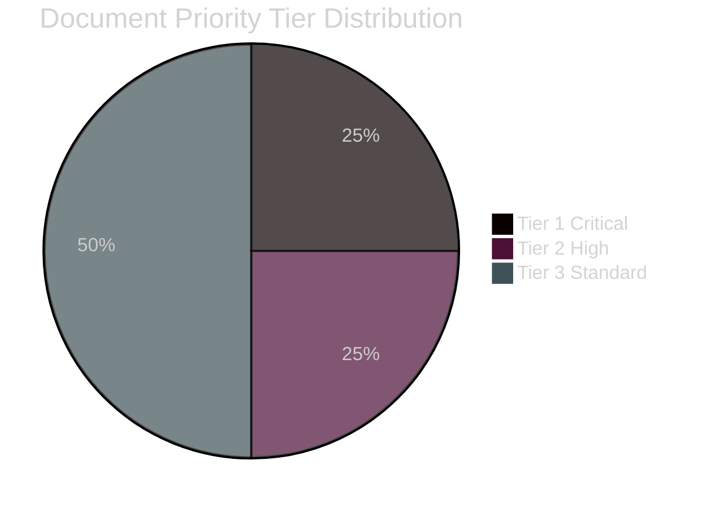

# Classification Results — Monthly Review 2026-04-27

**Author**: James Pether Sörling | **Date**: 2026-04-27
**Classification**: PUBLIC | **GDPR basis**: Art. 9(2)(e) publicly made; Art. 9(2)(g) substantial public interest

## Political Classification (7-Dimension Framework)

| Dok_ID | Ideological | Institutional | Partisan | Procedural | Temporal | Geographic | Impact |
|--------|-------------|---------------|----------|------------|----------|------------|--------|
| HD10448 | Conservative-security vs Energy-transition | Intra-coalition | SD vs KD | Interpellation | 139d pre-election | National-EU | Electoral HIGH |
| HD03253 | Pro-EU regulation | Parliamentary | Bipartisan (M/FiU) | Legislative transposition | Long-term | EU-Sweden | Financial HIGH |
| HD01FiU48 | Fiscal conservative, anti-green | Parliamentary | Tidö bloc | Supplementary budget | Electoral cycle | National | Household MEDIUM-HIGH |
| HD01JuU31 | Security reform audit | Audit/Parliamentary | Non-partisan | Riksrevisionen | Medium-term | National | Institutional HIGH |
| HD01JuU10 | Security conservative | Parliamentary | Tidö + reservations | Legislative | Long-term | National-EU | Rights MEDIUM |
| HD03252 | Security-welfare | Parliamentary | Tidö bloc | Legislative | Short-medium term | National | Rights MEDIUM |
| HD10449-50 | Centre-left opposition | Parliamentary | S | Interpellation | Electoral | National | Accountability MEDIUM |
| HD01SoU25 | Social conservative | Parliamentary | Tidö | Legislative | Medium-term | National | Social MEDIUM |

## Priority Tiers

**Tier 1 — Critical (immediate monitoring)**:
- HD10448 [riksdagen.se]: Intra-coalition fault line; monitor SD congress energy chapter
- HD03253 [riksdagen.se]: Financial sector compliance; monitor Finansinspektionen implementation

**Tier 2 — High (weekly monitoring)**:
- HD01JuU31 [riksdagen.se]: 9 open police reform recommendations
- HD01FiU48 [riksdagen.se]: Fiscal-environmental tension

**Tier 3 — Standard**:
- HD01JuU10, HD03252, HD01SoU25, HD10449–10450 [riksdagen.se]: Monthly monitoring

## Retention and Access

- **Data classification**: PUBLIC (all sourced from riksdagen.se open data API)
- **GDPR basis**: Art. 9(2)(e) publicly made political opinions; Art. 9(2)(g) substantial public interest in democratic transparency
- **Purpose limitation**: Parliamentary monitoring, political intelligence reporting
- **Retention**: Article publication + 2 years (standard analysis window)

