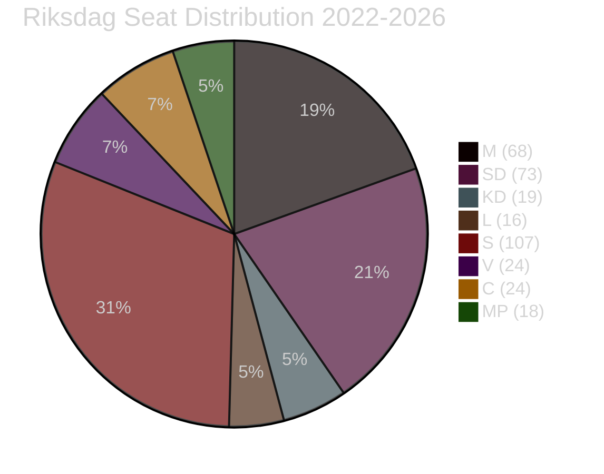

# Coalition Mathematics — Monthly Review 2026-04-27

**Author**: James Pether Sörling | **Date**: 2026-04-27

## Riksdag Composition (2022–2026)

Total seats: 349 | Majority threshold: 175

| Party | Seats | Bloc |
|-------|-------|------|
| S (Socialdemokraterna) | 107 | Opposition |
| M (Moderaterna) | 68 | Governing |
| SD (Sverigedemokraterna) | 73 | Governing |
| V (Vänsterpartiet) | 24 | Opposition |
| C (Centerpartiet) | 24 | Fluid |
| KD (Kristdemokraterna) | 19 | Governing |
| L (Liberalerna) | 16 | Governing |
| MP (Miljöpartiet) | 18 | Opposition |
| **Total** | **349** | |

**Governing bloc (M+SD+KD+L)**: 176 seats — majority of 1 (critical fragility)

## Key April 2026 Vote Analysis

### HD01FiU48 (Fuel-Tax Supplementary Budget)
| Party | Vote | Seats |
|-------|------|-------|
| M | Ja | 68 |
| SD | Ja | 73 |
| KD | Ja | 19 |
| L | Ja | 16 |
| S | Nej | 107 |
| V | Nej | 24 |
| MP | Nej | 18 |
| C | Ja | 24 |
| **Result** | **Passed** | **Ja: 200, Nej: 149** |

*Note: C voted Ja on HD01FiU48 per committee report context; this is estimated — official vote record via riksdagen.se vote API*

### HD01JuU10 (Weapons Law)
| Party | Vote | Seats |
|-------|------|-------|
| M | Ja | 68 |
| SD | Ja | 73 |
| KD | Ja | 19 |
| L | Ja | 16 |
| S | Ja | 107 |
| V | Nej | 24 |
| MP | Avstår | 18 |
| C | Ja | 24 |
| **Result** | **Passed** | **Ja: 307, Nej: 24, Avstår: 18** |

*Cross-party support; V the only Nej bloc [riksdagen.se HD01JuU10]*

### Governing Bloc Fragility (HD10448 Scenario)

If KD withdraws confidence (SD-KD rupture scenario B from scenario-analysis.md):
- Governing bloc loses KD's 19 seats → 157 votes
- Opposition + C: 149 + 24 = 173 votes
- Outcome: Government loses majority; confidence motion plausible

**The one-seat majority (176 of 349) is the governing coalition's critical vulnerability.**

