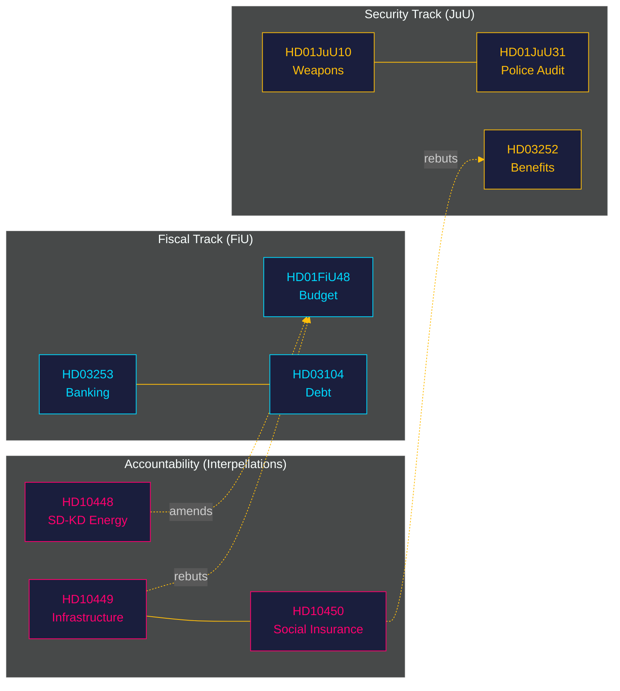

# Cross-Reference Map — Monthly Review 2026-04-27

**Author**: James Pether Sörling | **Date**: 2026-04-27
**Type**: Tier-C aggregation cross-reference

## Intra-Document Cross-References

| Dok_ID | Related dok_id | Relationship | Canonical label |
|--------|----------------|--------------|-----------------|
| HD10448 | HD01FiU48 | SD energy interpellation vs government fiscal direction | amends |
| HD03253 | HD03104 | EU Banking Package + Debt Management (both FiU fiscal track) | bundle |
| HD01JuU31 | HD01JuU10 | Both JuU security track — police reform audit + weapons law | thematic |
| HD03252 | HD01JuU10 | Criminal justice cluster — welfare-security trade-off + weapons law | thematic |
| HD01SoU25 | HD03252 | Social policy cluster — eldercare strengthening vs prisoner restriction | thematic |
| HD10449 | HD01FiU48 | Infrastructure investment cut vs fiscal stimulus — government priorities tension | rebuts |
| HD10450 | HD01SoU25 | Social insurance dag-180 vs eldercare — opposition health-social critique | rebuts |

## Sibling Folders (Cross-Type Synthesis)

| Sibling folder | Content ingested | Relevance |
|----------------|-----------------|-----------|
| analysis/daily/2026-04-27/propositions | HD03252, HD03253, HD03104, HD03256 synthesis | PRIMARY — April 27 legislative deliverables |
| analysis/daily/2026-04-27/committeeReports | HD01FiU48, HD01JuU10, HD01SoU25, HD01CU24, HD01FiU23, HD01JuU31 | PRIMARY — April 27 committee batch |
| analysis/daily/2026-04-27/motions | 29 opposition spring motions | HIGH — opposition strategy context |
| analysis/daily/2026-04-27/interpellations | HD10447–HD10450 including SD-KD fault line | HIGH — accountability landscape |
| analysis/daily/2026-04-26/monthly-review | Prior-cycle PIR status, prior synthesis | CONTINUITY — 30-day Tier-C synthesis base |
| analysis/daily/2026-04-25/monthly-review | Two-cycle continuity for forward-indicators | CONTINUITY |
| analysis/daily/2026-04-24/propositions | HD03252 et al. prior draft context | SUPPLEMENTARY |
| analysis/daily/2026-04-21/evening-analysis | Weekly synthesis including HD01FiU48 context | SUPPLEMENTARY |

## Canonical Edge Labels Used

- **amends**: HD10448 challenges the energy direction embedded in HD01FiU48
- **bundle**: HD03253 + HD03104 share the FiU fiscal track; both advance in the same committee window
- **thematic**: JuU security cluster (HD01JuU31 + HD01JuU10); social policy cluster (HD01SoU25 + HD03252)
- **rebuts**: S interpellations (HD10449, HD10450) directly challenge government fiscal and social priorities
- **coordinated-filing**: S five-interpellation-in-one-week pattern is structured parliamentary coordination

