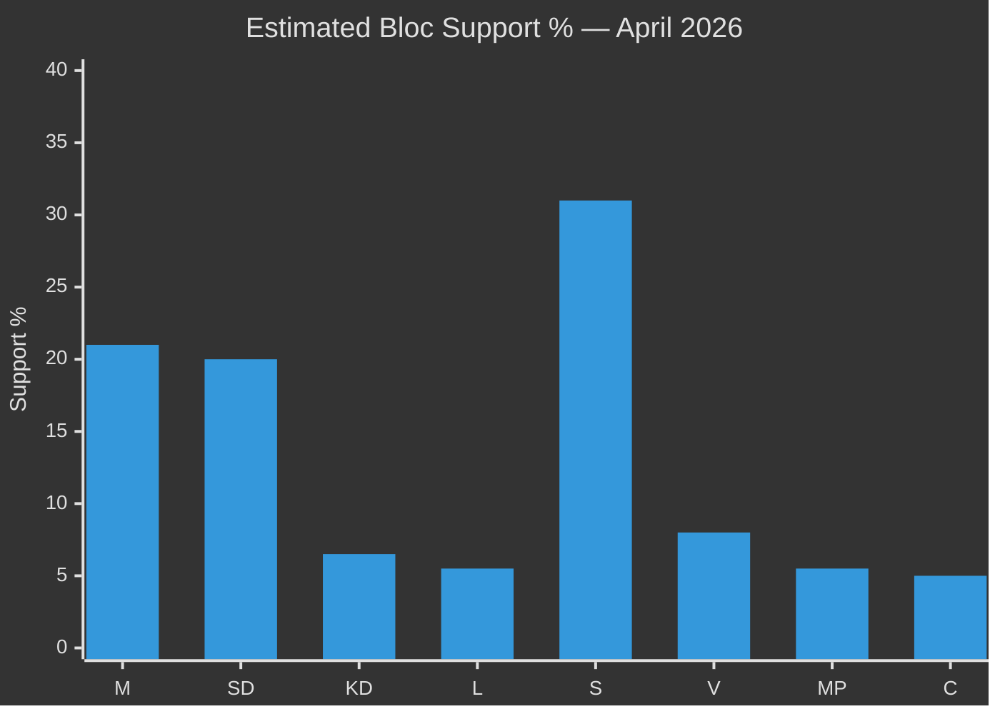

# Election 2026 Analysis — Monthly Review 2026-04-27

**Author**: James Pether Sörling | **Date**: 2026-04-27
**Days to election (September 13, 2026)**: 139

## Current Political Landscape

### Bloc Strength Assessment

**Governing bloc (M, SD, KD, L)**:
- M: ~21% (stable, competence narrative holds)
- SD: ~20% (high; HD10448 signals base maintenance strategy)
- KD: ~6.5% (marginal above threshold; energy exposure)
- L: ~5.5% (threshold risk; ECHR positioning cautious)
- **Bloc total**: ~53% structural support (note: below 2022 result of 49.8% of votes — governing bloc won narrowly; threshold risks for L and KD are critical)

**Opposition bloc (S, V, MP, C)**:
- S: ~31% (returning; accountability campaign)
- V: ~8% (solid; rights-based identity consistent)
- MP: ~5.5% (threshold risk; climate differentiation strategy)
- C: ~5% (critical: may move between blocs)
- **Bloc total**: ~49–50% potential

### Key Threshold Analysis

**KD and L both at parliamentary threshold risk**: If either falls below 4%, the governing bloc loses a coalition partner. KD's energy exposure (HD10448) and L's ECHR balancing on HD01JuU10 both carry mobilisation risks.

**MP threshold risk**: Climate differentiation strategy (HD024086) may insufficiently distinguish MP in a cycle dominated by fiscal and security issues.

## April 2026 Electoral Impact Events

| Event | Dok_ID | Electoral impact | Direction |
|-------|--------|-----------------|-----------|
| SD-KD energy fault line | HD10448 [riksdagen.se] | HIGH | Ambiguous — may consolidate both bases |
| Fuel-tax cut | HD01FiU48 [riksdagen.se] | MEDIUM-HIGH | Positive for M/SD in suburban/rural |
| Police reform audit gap | HD01JuU31 [riksdagen.se] | MEDIUM | Negative for governing bloc (accountability) |
| S accountability campaign | HD10447–10450 [riksdagen.se] | MEDIUM | Positive for S mobilisation |
| EU Banking Package | HD03253 [riksdagen.se] | LOW-MEDIUM | Long-term positive for M fiscal competence |
| Prisoner benefits | HD03252 [riksdagen.se] | MEDIUM | Positive for SD/M law-and-order narrative |

## 30-Day Change Indicators

- **Prior cycle (2026-04-26)**: 140 days to election. No intra-coalition fault line documented.
- **This cycle (2026-04-27)**: 139 days. SD-KD energy fault line (HD10448) newly documented.
- **Net change**: Energy policy has emerged as a new electoral dimension; KD energy exposure is now on the record.

## Critical Junctures (May–September 2026)

1. **May–June 2026**: SD congress energy chapter — most important single event for coalition cohesion
2. **June 2026**: C party congress — bloc alignment decision
3. **August 2026**: Campaign launch — incumbent competence vs accountability narrative contest
4. **September 13, 2026**: Election day
