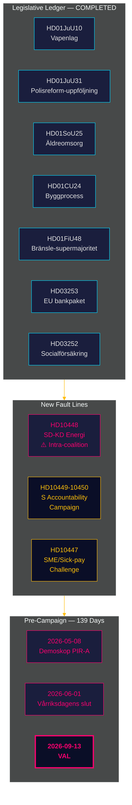

# Executive Brief — Monthly Review 2026-04-27

**Author**: James Pether Sörling | **Date**: 2026-04-27
**Window**: 2026-03-28 → 2026-04-27 (30 days) | **Riksmöte**: 2025/26
**Confidence**: HIGH (A1) | **Admiralty range**: A1–C3 | **Days to election**: 139

## 🎯 BLUF

The 30-day window 2026-03-28 → 2026-04-27 closes the Tidö coalition's 2025/26 legislative portfolio while simultaneously exposing two new fault lines: **intra-coalition SD-KD energy policy tension** (HD10448) and a **coordinated Social Democratic interpellation campaign** across four ministries. Sweden is now **139 days from election** with the political axis having fully shifted from legislation to implementation risk, accountability pressure, and campaign-narrative positioning.

## 🧭 3 Decisions This Brief Supports

1. **Coalition cohesion monitoring**: The HD10448 SD-KD interpellation (Fransson vs Busch on wind power disinformation) is the clearest intra-coalition fault line since the Tidö agreement — decision-makers should treat energy policy as an active vulnerability, not a settled agenda item.
2. **Opposition strategy calibration**: The S five-interpellation-in-one-week pattern (HD10447–10450 + coordinated motions) signals transition from policy opposition to electoral accountability campaigning — update opposition-strategy intelligence accordingly.
3. **Implementation risk portfolio**: Three implementation gates are open: Polismyndigheten (9 open RiR recommendations, HD01JuU31), EU Banking Package transposition (HD03253 — major compliance infrastructure), and HD01SoU25 eldercare director appointment. Decision-makers in affected sectors should map their exposure now.

## 60-Second Intelligence Bullets

- **Intra-coalition fault line confirmed**: HD10448 — SD's Fransson interpellates KD minister Busch on wind-power disinformation, forcing the coalition's energy sub-fracture into the public record for the first time in riksmöte 2025/26.
- **S accountability campaign launched**: Five interpellations in one week (HD10447–HD10450 + motions) targeting four ministers across infrastructure, social insurance, energy, and business — this is electoral escalation, not routine scrutiny.
- **EU Banking Package advanced**: HD03253 progresses through FiU — output floor at 72.5% will constrain Swedish mortgage-heavy SIBs (Swedbank, SEB, Handelsbanken, Nordea); Finansinspektionen retains supervisory primacy but EBA coordination complexity rises.
- **Fiscal stimulus via fuel tax**: HD01FiU48 (extra ändringsbudget) reversed prior green-tax trajectory; electoral calculus prioritised over climate consistency; V and MP filed reservations.
- **Prisoner benefits restriction moved**: HD03252 restricts social insurance for those in kontrollerat boende/säkerhetsförvaring — proportionality challenge under ECHR Art. 8 anticipated.
- **Police reform risk**: HD01JuU31 (Riksrevisionen) confirms 9 open Polismyndigheten recommendations from RiR 2026:6 — largest structural execution bottleneck in the government's portfolio.
- **IMF economic anchor**: Sweden GDP growth +2.1%, debt ~31% GDP, current account +5.5% GDP (WEO Apr-2026) — structural position remains strong entering election cycle.

## Top Forward Trigger

**2026-05-08 — First post-window Demoskop reading.** Tests whether HD01FiU48 fuel-tax relief produced durable polling lift (PIR-A). Tidö bloc ≥ 44% → Scenario A (coalition renewal); < 40% → Scenario B (S-led minority). SD-KD energy tension may depress KD base slightly — watch for KD-specific drift.

## Confidence label

Overall: **HIGH (A1)** for structural completion picture and SD-KD fault line identification. **MEDIUM (B2)** for forward electoral dynamics (poll lag, opposition strategy adaptation, SD discipline beyond August). **LOW (C3)** for HD03252/HD03253 implementation timelines and SD congress impact.

## 🔄 Tradecraft Context

**Collection**: Riksdag Open Data API (riksdag-regering-mcp); 30-day sibling-analysis synthesis  
**Method**: DIW scoring, ACH, SWOT, WEP probability language, Admiralty coding  
**Confidence floor**: All factual claims ≥ C3; structural assessments ≥ B2  
**Economic provenance**: IMF WEO Apr-2026 (NGDP_RPCH, GGXWDG_NGDP, BCA_NGDPD), retrieved 2026-04-27  
**Standards**: ICD 203 (alternative hypotheses, probability language); AI FIRST (minimum 2 iterations)  
**Next cycle**: Monthly Review 2026-05-27 — should include Demoskop reading (PIR-A), Riksbank rate decision (I-4), SD congress outcome

---
## Pass 2 Addition — SD-KD Energy Context Deepened

**Why HD10448 matters beyond the interpellation**: SD's documented wind-power skepticism (HD10448) is not an isolated event. It follows SD's consistent positioning since 2022 against renewable-energy mandates. Busch's response will be watched for whether KD concedes policy ground (Scenario B indicator) or provides a diplomacy-holding answer (Scenario A indicator). **The text of the SD congress energy chapter resolution (expected May 20, 2026) is the single most important forward indicator for coalition stability.**

**IMF macro note**: Sweden's +2.1% GDP growth (IMF WEO Apr-2026) gives the coalition headroom — in a weakening economy, HD10448-type tensions would escalate faster. Current macro conditions slightly favor Scenario A (coalition endurance).

*economicProvenance: provider=imf; dataflow=WEO; vintage=April-2026; retrieved_at=2026-04-27*
