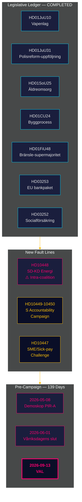

<!-- dir: rtl -->
# موجز استخباراتي — المراجعة الشهرية 2026-04-27

**المؤلف**: James Pether Sörling | **التاريخ**: 2026-04-27
**الفترة**: 2026-03-28 → 2026-04-27 (30 يوماً) | **Riksmöte**: 2025/26
**مستوى الثقة**: HIGH (A1) | **نطاق أدميرالتي**: A1–C3 | **أيام حتى الانتخابات**: 139

## 🎯 ملخص تنفيذي

تُختتم فترة الثلاثين يوماً 2026-03-28 → 2026-04-27 محفظة التشريعات التي أنجزها ائتلاف تيدو خلال دورة البرلمان 2025/26، وتكشف في الوقت ذاته عن خطَّي صدع جديدَين: **توتر داخلي بين SD وKD حول سياسة الطاقة** (HD10448)، و**حملة استجواب اشتراكية ديمقراطية منسقة** تستهدف أربع وزارات. تقف السويد الآن على بُعد **139 يوماً من الانتخابات**، وقد تحوّل المحور السياسي بالكامل من التشريع إلى مخاطر التنفيذ والمساءلة والتموضع الانتخابي.

## 🧭 3 قرارات يدعمها هذا الموجز

1. **رصد تماسك الائتلاف**: يُعدّ الاستجواب HD10448 بين SD وKD (Fransson في مواجهة Busch بشأن التضليل المتعلق بطاقة الرياح) أوضح خط صدع داخلي في الائتلاف منذ اتفاق تيدو — على صانعي القرار التعامل مع سياسة الطاقة بوصفها نقطة ضعف فاعلة لا بنداً محسوماً.
2. **معايرة استراتيجية المعارضة**: يُشير نمط حزب S في تقديم خمسة استجوابات في أسبوع واحد (HD10447–10450 + اقتراحات منسقة) إلى التحوّل من المعارضة السياسية إلى حملة المساءلة الانتخابية — تحديث استخبارات استراتيجية المعارضة وفق ذلك.
3. **محفظة مخاطر التنفيذ**: ثلاثة مسارات تنفيذية مفتوحة: Polismyndigheten (9 توصيات RiR مفتوحة، HD01JuU31)، تحويل حزمة الاتحاد الأوروبي المصرفية (HD03253 — بنية تحتية كبيرة للامتثال)، وتعيين مدير رعاية المسنين HD01SoU25. يجب على صانعي القرار في القطاعات المتأثرة رسم خريطة تعرضهم الآن.

## نقاط الاستخبارات في 60 ثانية

- **خط الصدع الائتلافي الداخلي مؤكد**: HD10448 — يستجوب Fransson من SD وزيرة KD Busch بشأن التضليل المتعلق بطاقة الرياح، مما يُجبر انشقاق الطاقة الائتلافي على الظهور في السجل العام لأول مرة في دورة 2025/26.
- **حملة المساءلة الاشتراكية الديمقراطية مُطلقة**: خمسة استجوابات في أسبوع (HD10447–HD10450 + اقتراحات) موجهة لأربعة وزراء في البنية التحتية والتأمين الاجتماعي والطاقة والاقتصاد — هذا تصعيد انتخابي لا رقابة روتينية.
- **حزمة الاتحاد الأوروبي المصرفية تتقدم**: HD03253 يمر عبر FiU — سيُقيّد الحد الأدنى للناتج البالغ 72.5% البنوك السويدية ذات التعرض المرتفع للرهن العقاري (Swedbank, SEB, Handelsbanken, Nordea)؛ تحتفظ Finansinspektionen بالأولوية الرقابية لكن تتزايد تعقيدات التنسيق مع EBA.
- **تحفيز مالي عبر ضريبة الوقود**: أعاد HD01FiU48 (ميزانية تعديلية إضافية) توجيه مسار الضريبة الخضراء السابق؛ جرى تقديم الحسابات الانتخابية على الاتساق المناخي؛ قدّم V وMP تحفظات.
- **تطبيق قيود استحقاقات السجناء**: يُقيّد HD03252 التأمين الاجتماعي للأشخاص في نظام kontrollerat boende/säkerhetsförvaring — يُتوقع طعن في التناسب بموجب المادة 8 من الاتفاقية الأوروبية لحقوق الإنسان.
- **مخاطر إصلاح الشرطة**: يؤكد HD01JuU31 (Riksrevisionen) وجود 9 توصيات مفتوحة لـ Polismyndigheten من RiR 2026:6 — أكبر عائق تنفيذي هيكلي في محفظة الحكومة.
- **المرساة الاقتصادية لصندوق النقد الدولي**: نمو الناتج المحلي الإجمالي السويدي +2.1%، الدين ~31% من الناتج المحلي الإجمالي، الحساب الجاري +5.5% من الناتج المحلي الإجمالي (WEO Apr-2026) — يظل الوضع الهيكلي قوياً قُبيل الدورة الانتخابية.

## أفضل محفز استشرافي

**2026-05-08 — أول قياس ديموسكوب بعد الفترة.** يختبر ما إذا كان إعفاء ضريبة الوقود HD01FiU48 قد أنتج ارتفاعاً مستداماً في استطلاعات الرأي (PIR-A). كتلة تيدو ≥ 44% → السيناريو أ (تجديد الائتلاف)؛ < 40% → السيناريو ب (أقلية بقيادة S). قد يُثبّط توتر الطاقة بين SD وKD قاعدة KD قليلاً — مراقبة التحولات الخاصة بـ KD.

## تقييم الثقة

إجمالاً: **HIGH (A1)** للصورة الختامية الهيكلية وتحديد خط صدع SD-KD. **MEDIUM (B2)** للديناميكيات الانتخابية المستقبلية (تأخر استطلاعات الرأي، تكيف استراتيجية المعارضة، انضباط SD بعد أغسطس). **LOW (C3)** لجداول تنفيذ HD03252/HD03253 وتأثير مؤتمر SD.

## 🔄 السياق المنهجي

**الجمع**: واجهة برمجة البيانات المفتوحة للريكسداغ (riksdag-regering-mcp)؛ تركيب تحليل 30 يوماً  
**المنهج**: تسجيل DIW، ACH، SWOT، لغة الاحتمالية WEP، ترميز أدميرالتي  
**الحد الأدنى للثقة**: جميع الادعاءات الواقعية ≥ C3؛ التقييمات الهيكلية ≥ B2  
**المصدر الاقتصادي**: IMF WEO Apr-2026 (NGDP_RPCH, GGXWDG_NGDP, BCA_NGDPD)، تاريخ الاسترداد 2026-04-27  
**المعايير**: ICD 203 (الفرضيات البديلة، لغة الاحتمالية)؛ AI FIRST (حدٌّ أدنى من تكرارين)  
**الدورة القادمة**: المراجعة الشهرية 2026-05-27 — ينبغي أن تشمل قياس ديموسكوب (PIR-A)، قرار سعر الفائدة لـ Riksbank (I-4)، نتائج مؤتمر SD

---
## إضافة الجولة الثانية — تعمّق سياق الطاقة SD-KD

**لماذا يعني HD10448 أكثر من مجرد استجواب**: تشكيكية SD الموثقة في طاقة الرياح (HD10448) ليست حدثاً معزولاً. فهي تتبع تموضع SD المتسق منذ 2022 ضد التفويضات المتعلقة بالطاقة المتجددة. ستُرصد استجابة Busch لمعرفة ما إذا كانت KD ستتنازل عن أرضية سياسية (مؤشر السيناريو ب) أم ستقدم إجابة دبلوماسية حابسة للأنفاس (مؤشر السيناريو أ). **نص قرار فصل الطاقة في مؤتمر SD (المتوقع في 20 مايو 2026) هو المؤشر الاستشرافي الأهم بالمطلق لاستقرار الائتلاف.**

**ملاحظة الاقتصاد الكلي لصندوق النقد الدولي**: نمو الناتج المحلي الإجمالي السويدي +2.1% (IMF WEO Apr-2026) يمنح الائتلاف مساحة للمناورة — في اقتصاد ضعيف، ستتصاعد التوترات من نوع HD10448 بشكل أسرع. الظروف الاقتصادية الكلية الراهنة تُرجّح قليلاً السيناريو أ (استمرار الائتلاف).

*economicProvenance: provider=imf; dataflow=WEO; vintage=April-2026; retrieved_at=2026-04-27*

<!-- source-sha: 37f69ff9aa194a3c561fdd15f1b60d4f6b106472 -->
