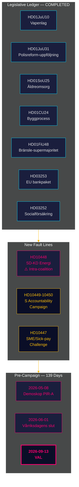

# Efterretningsbriefing — Månedsoversigt 2026-04-27

**Forfatter**: James Pether Sörling | **Dato**: 2026-04-27
**Periode**: 2026-03-28 → 2026-04-27 (30 dage) | **Riksmöte**: 2025/26
**Konfidensgrad**: HIGH (A1) | **Admiralty-interval**: A1–C3 | **Dage til valg**: 139

## 🎯 Kortfattet situationsvurdering

30-dagesperioden 2026-03-28 → 2026-04-27 afslutter Tidø-koalitionens lovgivningsportefølje for riksmöte 2025/26 og eksponerer samtidig to nye brudzoner: **intrakoalitions SD-KD energipolitisk spænding** (HD10448) og en **koordineret socialdemokratisk interpellationskampagne** på tværs af fire ministerier. Sverige er nu **139 dage fra valget** med den politiske akse fuldt skiftet fra lovgivning til implementeringsrisici, ansvarsudkrævning og kampagnenarrativisering.

## 🧭 3 Beslutninger denne briefing understøtter

1. **Koalitionssammenholdsovervågning**: HD10448-interpellationen SD-KD (Fransson mod Busch om vindkraftsinformation) er den tydeligste intrakoalitions brudszone siden Tidø-aftalen — beslutningstagere bør behandle energipolitik som en aktiv sårbarhed, ikke som et afgjort dagsordenspunkt.
2. **Kalibrering af oppositionsstrategi**: S' fem-interpellationer-på-en-uge-mønster (HD10447–10450 + koordinerede motioner) signalerer overgang fra politisk opposition til valgansvarskampagne — opdater oppositionsstrategiintelligens derefter.
3. **Implementeringsrisikoporetefølje**: Tre implementeringsporte er åbne: Polismyndigheten (9 åbne RiR-anbefalinger, HD01JuU31), EU's bankpakkettransponering (HD03253 — større overholdelsesinfrastruktur), og HD01SoU25 ældreomsorgsdirektøransættelse. Beslutningstagere i berørte sektorer bør kortlægge deres eksponering nu.

## 60-sekunders efterretningspunkter

- **Intrakoalitions brudlinje bekræftet**: HD10448 — SD's Fransson interpellerer KD-minister Busch om vindkraftsinformation, og tvinger for første gang i riksmöte 2025/26 koalitionens energi-underfraktion ind i det offentlige referat.
- **S' ansvarskampagne lanceret**: Fem interpellationer på en uge (HD10447–HD10450 + motioner) rettet mod fire ministre på tværs af infrastruktur, socialforsikring, energi og erhvervsliv — dette er valeskalering, ikke rutinekontrol.
- **EU's bankpakke avanceret**: HD03253 avancerer gennem FiU — outputgulv på 72,5% vil begrænse svenske realkrediteksponerede SIFI'er (Swedbank, SEB, Handelsbanken, Nordea); Finansinspektionen bevarer tilsynsprimat, men EBA-koordinationskompleksiteten øges.
- **Finanspolitisk stimulus via brændstofafgift**: HD01FiU48 (ekstra ændringsbudget) vendte den tidligere grønne skattetrajektori; valgkalkule prioriteredes over klimatkonsistens; V og MP indsendte reservationer.
- **Fangydelsesrestriktion gennemført**: HD03252 begrænser socialforsikring for dem i kontrollerat boende/säkerhetsförvaring — proportionalitetsudfordring under ECHR Art. 8 forventes.
- **Politireformrisiko**: HD01JuU31 (Riksrevisionen) bekræfter 9 åbne Polismyndigheten-anbefalinger fra RiR 2026:6 — den største strukturelle gennemførelsesbegrænsning i regeringens portefølje.
- **IMF's økonomiske anker**: Sveriges BNP-vækst +2,1%, gæld ~31% af BNP, betalingsbalance +5,5% af BNP (WEO Apr-2026) — den strukturelle position forbliver stærk op til valgcyklussen.

## Bedste fremadrettede udløser

**2026-05-08 — Første post-periodes Demoskop-måling.** Tester om HD01FiU48 brændstofskattenedsættelsen producerede varig opinionsløft (PIR-A). Tidø-blok ≥ 44% → Scenario A (koalitionsfornyelse); < 40% → Scenario B (S-ledet mindretal). SD-KD's energispænding kan svagt reducere KD-basen — hold øje med KD-specifik drift.

## Konfidensgradering

Samlet: **HIGH (A1)** for det strukturelle afslutningsbillede og SD-KD brudlinje-identifikation. **MEDIUM (B2)** for fremtidige valgdynamikker (opinionsefterslæb, oppositionsstrategitilpasning, SD-disciplin efter august). **LOW (C3)** for HD03252/HD03253 implementeringstidslinjer og SD-kongresindflydelse.

## 🔄 Metodologisk kontekst

**Indsamling**: Riksdagens åbne data-API (riksdag-regering-mcp); 30-dages søskendeanalysesyntese  
**Metode**: DIW-scoring, ACH, SWOT, WEP-sandsynlighedssprog, Admiralty-kodning  
**Konfidensundergræns**: Alle faktuelle påstande ≥ C3; strukturelle vurderinger ≥ B2  
**Økonomisk oprindelse**: IMF WEO Apr-2026 (NGDP_RPCH, GGXWDG_NGDP, BCA_NGDPD), hentet 2026-04-27  
**Standarder**: ICD 203 (alternative hypoteser, sandsynlighedssprog); AI FIRST (minimum 2 iterationer)  
**Næste cyklus**: Månedsoversigt 2026-05-27 — bør inkludere Demoskop-måling (PIR-A), Riksbankens rentebeslutning (I-4), SD-kongresudkom

---
## Tilføjelse fra pas 2 — SD-KD's energikontekst uddybet

**Hvorfor HD10448 betyder mere end interpellationen**: SD's dokumenterede vindkraftsskepsis (HD10448) er ikke en isoleret begivenhed. Det følger SD's konsekvent positionering siden 2022 mod VE-mandater. Buschs svar vil blive fulgt nøje for om KD indrømmer politikplads (Scenario B-indikator) eller giver et diplomatisk-holdende svar (Scenario A-indikator). **Teksten i SD-kongressens energikapitelresolution (forventet 20. maj 2026) er den enkeltstående vigtigste fremadrettede indikator for koalitionsstabilitet.**

**IMF makronotat**: Sveriges +2,1% BNP-vækst (IMF WEO Apr-2026) giver koalitionen råderum — i en svækkende økonomi ville HD10448-typen af spændinger eskalere hurtigere. Nuværende makroforhold favoriserer svagt Scenario A (koalitionens udholdenhed).

*economicProvenance: provider=imf; dataflow=WEO; vintage=April-2026; retrieved_at=2026-04-27*

<!-- source-sha: 37f69ff9aa194a3c561fdd15f1b60d4f6b106472 -->
