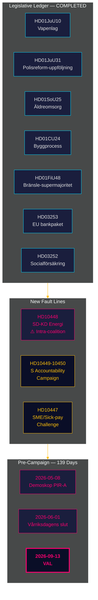

# Nachrichtenbriefing — Monatsrückblick 2026-04-27

**Autor**: James Pether Sörling | **Datum**: 2026-04-27
**Zeitraum**: 2026-03-28 → 2026-04-27 (30 Tage) | **Riksmöte**: 2025/26
**Konfidenzniveau**: HIGH (A1) | **Admiralty-Bereich**: A1–C3 | **Tage bis zur Wahl**: 139

## 🎯 Kurzfassung

Der 30-Tages-Zeitraum 2026-03-28 → 2026-04-27 schließt das Gesetzgebungsportfolio der Tidö-Koalition für Riksmöte 2025/26 und legt gleichzeitig zwei neue Spannungslinien offen: **innerkoalitionäre SD-KD-Spannungen in der Energiepolitik** (HD10448) und eine **koordinierte sozialdemokratische Interpellationskampagne** gegen vier Ministerien. Schweden befindet sich nun **139 Tage vor der Wahl**, wobei die politische Achse vollständig von Gesetzgebung zu Umsetzungsrisiken, Rechenschaftspflicht und Wahlkampfpositionierung verschoben hat.

## 🧭 3 Entscheidungen, die dieses Briefing unterstützt

1. **Überwachung des Koalitionszusammenhalts**: Die HD10448-Interpellation SD-KD (Fransson gegen Busch zu Windkraft-Desinformation) ist die deutlichste innerkoalitionäre Bruchlinie seit dem Tidö-Abkommen — Entscheidungsträger sollten Energiepolitik als aktive Schwachstelle behandeln, nicht als erledigtes Tagesordnungspunkt.
2. **Kalibrierung der Oppositionsstrategie**: Das S-Muster von fünf Interpellationen in einer Woche (HD10447–10450 + koordinierte Motionen) signalisiert den Übergang von politischer Opposition zu Wahlkampf-Rechenschaftspflicht — Oppositionsstrategie-Nachrichtendienst entsprechend aktualisieren.
3. **Umsetzungsrisikoortfolio**: Drei Umsetzungstore sind offen: Polismyndigheten (9 offene RiR-Empfehlungen, HD01JuU31), EU-Bankenpaket-Transposition (HD03253 — bedeutende Compliance-Infrastruktur), und HD01SoU25 Pflegedirektor-Ernennung. Entscheidungsträger in betroffenen Sektoren sollten jetzt ihr Risikoprofil kartieren.

## 60-Sekunden-Nachrichtenpunkte

- **Innerkoalitionäre Bruchlinie bestätigt**: HD10448 — SD's Fransson interpelliert KD-Ministerin Busch zu Windkraft-Desinformation und zwingt zum ersten Mal in Riksmöte 2025/26 die Energiespaltung der Koalition in das öffentliche Protokoll.
- **S-Rechenschaftskampagne gestartet**: Fünf Interpellationen in einer Woche (HD10447–HD10450 + Motionen) gegen vier Minister in Infrastruktur, Sozialversicherung, Energie und Wirtschaft — dies ist Wahleskalation, keine Routinekontrolle.
- **EU-Bankenpaket vorangeschritten**: HD03253 läuft durch FiU — Ausgangspunkt von 72,5% wird hypothekenbelastete schwedische SIBs einschränken (Swedbank, SEB, Handelsbanken, Nordea); Finansinspektionen behält den Aufsichtsprimat, aber die EBA-Koordinationskomplexität steigt.
- **Fiskalpolitischer Stimulus durch Kraftstoffsteuer**: HD01FiU48 (Zusatznachtragshaushalt) kehrte die bisherige grüne Steuertrajektorie um; Wahlkalkül wurde über Klimakonsistenz gestellt; V und MP reichten Vorbehalte ein.
- **Gefängnisleistungsbeschränkung umgesetzt**: HD03252 schränkt Sozialversicherung für Personen in kontrollerat boende/säkerhetsförvaring ein — Verhältnismäßigkeitsherausforderung nach ECHR Art. 8 wird erwartet.
- **Polizeireformrisiko**: HD01JuU31 (Riksrevisionen) bestätigt 9 offene Polismyndigheten-Empfehlungen aus RiR 2026:6 — der größte strukturelle Umsetzungsengpass im Regierungsportfolio.
- **IMF-Wirtschaftsanker**: Schwedens BIP-Wachstum +2,1%, Schulden ~31% des BIP, Leistungsbilanz +5,5% des BIP (WEO Apr-2026) — die strukturelle Position bleibt stark vor dem Wahlzyklus.

## Bester Vorwärtsauslöser

**2026-05-08 — Erste Demoskop-Messung nach dem Zeitraum.** Testet, ob die HD01FiU48-Kraftstoffsteuererleichterung nachhaltige Umfragegewinne erbracht hat (PIR-A). Tidö-Block ≥ 44% → Szenario A (Koalitionserneuerung); < 40% → Szenario B (S-geführte Minderheit). SD-KD-Energiespannung könnte die KD-Basis leicht dämpfen — auf KD-spezifische Drift achten.

## Konfidenzbewertung

Gesamt: **HIGH (A1)** für das strukturelle Abschlussbild und die SD-KD-Bruchlinie-Identifizierung. **MEDIUM (B2)** für künftige Wahldynamik (Meinungsumfrageverzögerung, Oppositionsstrategieanpassung, SD-Disziplin nach August). **LOW (C3)** für HD03252/HD03253-Umsetzungszeitpläne und SD-Parteitagseinfluss.

## 🔄 Methodologischer Kontext

**Erfassung**: Riksdag Open Data API (riksdag-regering-mcp); 30-Tages-Geschwisteranalyse-Synthese  
**Methode**: DIW-Bewertung, ACH, SWOT, WEP-Wahrscheinlichkeitssprache, Admiralty-Kodierung  
**Konfidenzuntergrenze**: Alle Tatsachenbehauptungen ≥ C3; strukturelle Einschätzungen ≥ B2  
**Wirtschaftliche Herkunft**: IMF WEO Apr-2026 (NGDP_RPCH, GGXWDG_NGDP, BCA_NGDPD), abgerufen 2026-04-27  
**Standards**: ICD 203 (alternative Hypothesen, Wahrscheinlichkeitssprache); AI FIRST (mindestens 2 Iterationen)  
**Nächster Zyklus**: Monatsrückblick 2026-05-27 — sollte Demoskop-Messung (PIR-A), Riksbank-Zinsentscheidung (I-4), SD-Parteitagsergebnis einschließen

---
## Ergänzung aus Pass 2 — SD-KD-Energiekontext vertieft

**Warum HD10448 mehr bedeutet als die Interpellation**: SD's dokumentierte Windkraftskepsis (HD10448) ist kein isoliertes Ereignis. Es folgt SD's konsequenter Positionierung seit 2022 gegen erneuerbare Energiemandate. Buschs Antwort wird genau daraufhin beobachtet, ob KD politisches Terrain einräumt (Szenario-B-Indikator) oder eine diplomatisch-haltende Antwort gibt (Szenario-A-Indikator). **Der Text der SD-Parteitagsresolution zum Energiekapitel (erwartet am 20. Mai 2026) ist der mit Abstand wichtigste Vorlaufindikator für die Koalitionsstabilität.**

**IMF-Makrohinweis**: Schwedens +2,1% BIP-Wachstum (IMF WEO Apr-2026) gibt der Koalition Spielraum — in einer schwächelnden Wirtschaft würden HD10448-Spannungen schneller eskalieren. Die aktuellen Makrobedingungen begünstigen leicht Szenario A (Koalitionsbestand).

*economicProvenance: provider=imf; dataflow=WEO; vintage=April-2026; retrieved_at=2026-04-27*

<!-- source-sha: 37f69ff9aa194a3c561fdd15f1b60d4f6b106472 -->
