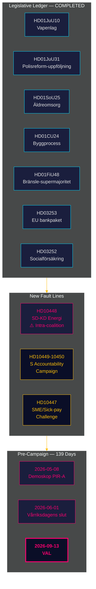

# Informe de inteligencia — Revisión mensual 2026-04-27

**Autor**: James Pether Sörling | **Fecha**: 2026-04-27
**Período**: 2026-03-28 → 2026-04-27 (30 días) | **Riksmöte**: 2025/26
**Nivel de confianza**: HIGH (A1) | **Rango Admiralty**: A1–C3 | **Días para las elecciones**: 139

## 🎯 Resumen ejecutivo operacional

El período de 30 días 2026-03-28 → 2026-04-27 cierra el portafolio legislativo de la coalición Tidö para el Riksmöte 2025/26 y expone simultáneamente dos nuevas líneas de fractura: **tensión intracoalición SD-KD en política energética** (HD10448) y una **campaña de interpelaciones socialdemócrata coordinada** dirigida a cuatro ministerios. Suecia se encuentra ahora a **139 días de las elecciones**, con el eje político completamente desplazado de la legislación hacia riesgos de implementación, presión de rendición de cuentas y posicionamiento narrativo electoral.

## 🧭 3 Decisiones que apoya este informe

1. **Monitoreo de la cohesión de la coalición**: La interpelación HD10448 SD-KD (Fransson frente a Busch sobre desinformación eólica) es la línea de fractura intracoalición más clara desde el acuerdo Tidö — los responsables de la toma de decisiones deben tratar la política energética como una vulnerabilidad activa, no como un punto de agenda resuelto.
2. **Calibración de la estrategia de oposición**: El patrón del S de cinco interpelaciones en una semana (HD10447–10450 + mociones coordinadas) señala la transición de la oposición política a la campaña de responsabilidad electoral — actualizar la inteligencia sobre estrategia de oposición en consecuencia.
3. **Portafolio de riesgos de implementación**: Tres puertas de implementación están abiertas: Polismyndigheten (9 recomendaciones RiR abiertas, HD01JuU31), transposición del paquete bancario europeo (HD03253 — infraestructura de cumplimiento importante), y nombramiento del director de atención a mayores HD01SoU25. Los responsables en los sectores afectados deben mapear su exposición ahora.

## Puntos de inteligencia en 60 segundos

- **Línea de fractura intracoalición confirmada**: HD10448 — Fransson del SD interpela a la ministra KD Busch sobre desinformación eólica, forzando por primera vez en el Riksmöte 2025/26 la fractura energética de la coalición hacia el registro público.
- **Campaña de responsabilidad del S lanzada**: Cinco interpelaciones en una semana (HD10447–HD10450 + mociones) dirigidas a cuatro ministros en infraestructura, seguro social, energía y economía — se trata de una escalada electoral, no de un control rutinario.
- **Paquete bancario europeo avanzado**: HD03253 avanza por el FiU — el suelo de producción del 72,5% limitará a los bancos sistémicos suecos con alta exposición hipotecaria (Swedbank, SEB, Handelsbanken, Nordea); Finansinspektionen mantiene la primacía supervisora pero la complejidad de coordinación EBA aumenta.
- **Estímulo fiscal mediante impuesto al combustible**: HD01FiU48 (presupuesto modificativo adicional) invirtió la trayectoria fiscal verde anterior; el cálculo electoral se priorizó sobre la coherencia climática; V y MP presentaron reservas.
- **Restricción de beneficios penitenciarios implementada**: HD03252 restringe el seguro social para quienes están en kontrollerat boende/säkerhetsförvaring — se espera un desafío de proporcionalidad bajo el artículo 8 del CEDH.
- **Riesgo de reforma policial**: HD01JuU31 (Riksrevisionen) confirma 9 recomendaciones abiertas de Polismyndigheten del RiR 2026:6 — el mayor cuello de botella estructural de ejecución en el portafolio gubernamental.
- **Ancla económica del FMI**: Crecimiento del PIB sueco +2,1%, deuda ~31% del PIB, balanza por cuenta corriente +5,5% del PIB (WEO Apr-2026) — la posición estructural se mantiene sólida de cara al ciclo electoral.

## Mejor detonante prospectivo

**2026-05-08 — Primera medición Demoskop tras el período.** Prueba si la reducción del impuesto al combustible HD01FiU48 generó ganancia sostenida en encuestas (PIR-A). Bloque Tidö ≥ 44% → Escenario A (renovación de la coalición); < 40% → Escenario B (minoría liderada por S). La tensión energética SD-KD podría deprimir ligeramente la base de KD — vigilar la deriva específica de KD.

## Evaluación de la confianza

Global: **HIGH (A1)** para el panorama estructural de cierre e identificación de la línea de fractura SD-KD. **MEDIUM (B2)** para la dinámica electoral futura (retraso en encuestas, adaptación estratégica de la oposición, disciplina del SD tras agosto). **LOW (C3)** para los plazos de implementación de HD03252/HD03253 e impacto del congreso del SD.

## 🔄 Contexto metodológico

**Recopilación**: API de datos abiertos del Riksdag (riksdag-regering-mcp); síntesis de análisis paralelo de 30 días  
**Método**: Puntuación DIW, ACH, SWOT, lenguaje de probabilidad WEP, codificación Admiralty  
**Umbral de confianza**: Todas las afirmaciones factuales ≥ C3; evaluaciones estructurales ≥ B2  
**Procedencia económica**: IMF WEO Apr-2026 (NGDP_RPCH, GGXWDG_NGDP, BCA_NGDPD), recuperado el 2026-04-27  
**Normas**: ICD 203 (hipótesis alternativas, lenguaje de probabilidad); AI FIRST (mínimo 2 iteraciones)  
**Próximo ciclo**: Revisión mensual 2026-05-27 — debe incluir medición Demoskop (PIR-A), decisión de tasas del Riksbank (I-4), resultado del congreso del SD

---
## Adición del paso 2 — Contexto energético SD-KD profundizado

**Por qué HD10448 importa más allá de la interpelación**: El escepticismo documentado del SD hacia la energía eólica (HD10448) no es un evento aislado. Sigue el posicionamiento consistente del SD desde 2022 contra los mandatos de energías renovables. La respuesta de Busch será vigilada para ver si KD cede terreno político (indicador del Escenario B) o da una respuesta diplomáticamente sostenida (indicador del Escenario A). **El texto de la resolución del capítulo energético del congreso SD (esperado el 20 de mayo de 2026) es el indicador anticipado más importante para la estabilidad de la coalición.**

**Nota macro del FMI**: El crecimiento del PIB sueco de +2,1% (IMF WEO Apr-2026) da margen de maniobra a la coalición — en una economía debilitada, las tensiones tipo HD10448 escalarían más rápidamente. Las condiciones macro actuales favorecen ligeramente el Escenario A (perduración de la coalición).

*economicProvenance: provider=imf; dataflow=WEO; vintage=April-2026; retrieved_at=2026-04-27*

<!-- source-sha: 37f69ff9aa194a3c561fdd15f1b60d4f6b106472 -->
