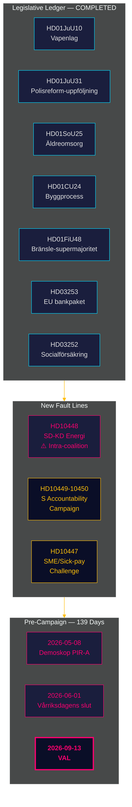

# Tiedustelutiivistelmä — Kuukausikatsaus 2026-04-27

**Tekijä**: James Pether Sörling | **Päiväys**: 2026-04-27
**Ajanjakso**: 2026-03-28 → 2026-04-27 (30 päivää) | **Riksmöte**: 2025/26
**Luottamustaso**: HIGH (A1) | **Admiralty-väli**: A1–C3 | **Päiviä vaaleihin**: 139

## 🎯 Lyhyt tilannearvio

30 päivän ajanjakso 2026-03-28 → 2026-04-27 päättää Tidö-koalition lainsäädäntösalkun riksmötelle 2025/26 ja paljastaa samalla kaksi uutta jännitystä: **koalition sisäinen SD-KD energiapolitiikan kiista** (HD10448) ja **koordinoitu sosiaalidemokraattinen kysymyskampanja** neljää ministeriötä vastaan. Ruotsi on nyt **139 päivää vaaleista**, poliittisen akselin siirtyneen täysin lainsäädännöstä toimeenpanoriskeihin, vastuullisuuspaineisiin ja vaalikampanjanarratiivin muokkaukseen.

## 🧭 3 Päätöstä, joita tämä tiivistelmä tukee

1. **Koalitiokokouman seuranta**: HD10448-kysymys SD-KD (Fransson vs. Busch tuulivoimadisinformaatiosta) on selkein koalition sisäinen rajalinja Tidö-sopimuksen jälkeen — päätöksentekijöiden tulee käsitellä energiapolitiikkaa aktiivisena haavoittuvuutena, ei ratkaistuneena asiana.
2. **Oppositiostrategian kalibrointi**: S:n viisi-kysymystä-viikossa-malli (HD10447–10450 + koordinoidut aloitteet) viestii siirtymisestä poliittisesta oppositiosta vaalivastuukampanjaan — päivitä oppositiostrategiatieto vastaavasti.
3. **Toimeenpanoriskisalkku**: Kolme toimeenpanoaluetta on auki: Polismyndigheten (9 avointa RiR-suositusta, HD01JuU31), EU:n pankkipaketin transponointi (HD03253 — merkittävä vaatimustenmukaisuusinfrastruktuuri), ja HD01SoU25 vanhustenhuollon johtajan nimitys. Asianomaisilla toimialoilla työskentelevien päätöksentekijöiden tulee kartoittaa altistumisensa nyt.

## 60 sekunnin tiedustelutiivistelmä

- **Koalition sisäinen rajalinja vahvistettu**: HD10448 — SD:n Fransson kyselee KD-ministeri Buschilta tuulivoimadisinformaatiosta, pakottaen ensimmäistä kertaa riksmöten 2025/26 aikana koalition energiakiistan julkiseen pöytäkirjaan.
- **S:n vastuukampanja käynnistetty**: Viisi kysymystä viikossa (HD10447–HD10450 + aloitteet) neljää ministeriä vastaan infrastruktuurin, sosiaalivakuutuksen, energian ja elinkeinoelämän aloilla — kyseessä on vaaliuhka, ei rutiinitarkastelu.
- **EU:n pankkipaketti edistynyt**: HD03253 etenee FiU:ssa — 72,5%:n tuotospohjainen lattia rajoittaa ruotsalaisia asuntolainapainotteisia järjestelmällisesti merkittäviä pankkeja (Swedbank, SEB, Handelsbanken, Nordea); Finansinspektionen säilyttää valvontaprioriteettinsa, mutta EBA-koordinaation monimutkaisuus kasvaa.
- **Finanssipoliittinen elvytys polttoaineveron kautta**: HD01FiU48 (lisämuutosbudjetti) käänsi aiemman vihreiden verosuunnan; vaalilogiikka priorisoitiin ilmastojohdonmukaisuuden edelle; V ja MP jättivät varaumat.
- **Vankilaetuuksien rajoitus toteutettu**: HD03252 rajoittaa sosiaalivakuutusta henkilöille kontrollerat boende/säkerhetsförvaring-olosuhteissa — suhteellisuushaaste ECHR Art. 8:n mukaan on odotettavissa.
- **Poliisiuudistusriski**: HD01JuU31 (Riksrevisionen) vahvistaa 9 avointa Polismyndigheten-suositusta RiR 2026:6:sta — hallituksen salkun suurin rakenteellinen toimeenpanoeste.
- **IMF:n taloudellinen ankkuri**: Ruotsin BKT-kasvu +2,1%, velka ~31% BKT:sta, vaihtotase +5,5% BKT:sta (WEO Apr-2026) — rakenteellinen asema pysyy vahvana vaalikiertoon mentäessä.

## Paras ennakoiva laukaisin

**2026-05-08 — Ensimmäinen jakson jälkeinen Demoskop-mittaus.** Testaa, tuottiko HD01FiU48 polttoaineverohelpotus pysyvää kannatuskasvua (PIR-A). Tidö-blokki ≥ 44% → Skenaario A (koalition uusinta); < 40% → Skenaario B (S:n johtama vähemmistö). SD-KD:n energiajännite voi hieman vähentää KD:n kannatuspohjaa — seuraa KD-kohtaista kehitystä.

## Luottamusarviointi

Kokonaisuudessaan: **HIGH (A1)** rakenteellisesta loppukuvasta ja SD-KD-rajalinjan tunnistamisesta. **MEDIUM (B2)** tulevasta validynamiikasta (kannatusviive, oppositiostrategian sopeutuminen, SD:n kuri elokuun jälkeen). **LOW (C3)** HD03252/HD03253 toimeenpanoaikajanoille ja SD-puoluekokouksen vaikutukselle.

## 🔄 Menetelmäkonteksti

**Keruu**: Riksdagenin avoin data-API (riksdag-regering-mcp); 30 päivän sisaranalyysisynteesi  
**Menetelmä**: DIW-pisteytyss, ACH, SWOT, WEP-todennäköisyyskieli, Admiralty-koodaus  
**Luottamuksen alaraja**: Kaikki faktuaaliset väitteet ≥ C3; rakenteelliset arviot ≥ B2  
**Taloudellinen alkuperä**: IMF WEO Apr-2026 (NGDP_RPCH, GGXWDG_NGDP, BCA_NGDPD), haettu 2026-04-27  
**Standardit**: ICD 203 (vaihtoehtoiset hypoteesit, todennäköisyyskieli); AI FIRST (vähintään 2 kierrosta)  
**Seuraava sykli**: Kuukausikatsaus 2026-05-27 — tulisi sisältää Demoskop-mittaus (PIR-A), Riksbankenin korkopäätös (I-4), SD:n puoluekokouksen tulos

---
## Lisäys kierros 2:sta — SD-KD:n energiakonteksti syvennetty

**Miksi HD10448 merkitsee enemmän kuin kysymys**: SD:n dokumentoitu tuulivoimaskeptisyys (HD10448) ei ole yksittäinen tapahtuma. Se seuraa SD:n johdonmukaista asemoitumista vuodesta 2022 uusiutuvan energian mandaatteja vastaan. Buschin vastausta seurataan tarkasti: myöntääkö KD poliittista tilaa (Skenaario B -indikaattori) vai antaako se diplomaattisesti pidättyvän vastauksen (Skenaario A -indikaattori). **SD:n puoluekokouksen energialuvun resoluution teksti (odotetaan 20. toukokuuta 2026) on yksittäisesti tärkein ennakoiva indikaattori koalition vakaudelle.**

**IMF makrohavainto**: Ruotsin +2,1% BKT-kasvu (IMF WEO Apr-2026) antaa koalitiolle liikkumavaraa — heikkenevässä taloudessa HD10448-tyyppiset jännitteet kärjistyisivät nopeammin. Nykyiset makroehdot suosivat hieman Skenaario A:ta (koalition kestävyys).

*economicProvenance: provider=imf; dataflow=WEO; vintage=April-2026; retrieved_at=2026-04-27*

<!-- source-sha: 37f69ff9aa194a3c561fdd15f1b60d4f6b106472 -->
