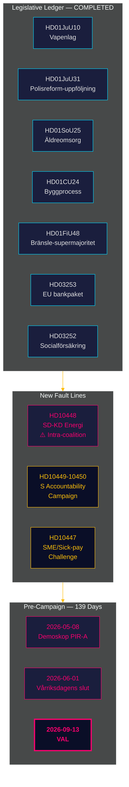

# Note de renseignement — Revue mensuelle 2026-04-27

**Auteur**: James Pether Sörling | **Date**: 2026-04-27
**Période**: 2026-03-28 → 2026-04-27 (30 jours) | **Riksmöte**: 2025/26
**Niveau de confiance**: HIGH (A1) | **Plage Admiralty**: A1–C3 | **Jours avant les élections**: 139

## 🎯 Résumé opérationnel

La période de 30 jours 2026-03-28 → 2026-04-27 clôture le portefeuille législatif de la coalition Tidö pour le Riksmöte 2025/26 tout en exposant deux nouvelles lignes de fracture : **tensions intracoalition SD-KD sur la politique énergétique** (HD10448) et une **campagne d'interpellations socialiste coordonnée** visant quatre ministères. La Suède se trouve maintenant à **139 jours des élections**, l'axe politique ayant pleinement basculé de la législation vers la gestion des risques d'implémentation, les pressions de responsabilité et le positionnement narratif électoral.

## 🧭 3 Décisions que cette note soutient

1. **Surveillance de la cohésion de la coalition** : L'interpellation HD10448 SD-KD (Fransson contre Busch sur la désinformation éolienne) est la ligne de fracture intracoalition la plus claire depuis l'accord Tidö — les décideurs doivent traiter la politique énergétique comme une vulnérabilité active, et non comme un point d'agenda réglé.
2. **Calibrage de la stratégie de l'opposition** : Le schéma des cinq interpellations en une semaine du S (HD10447–10450 + motions coordonnées) signale la transition d'une opposition politique vers une campagne de responsabilité électorale — mettre à jour le renseignement sur la stratégie d'opposition en conséquence.
3. **Portefeuille de risques d'implémentation** : Trois portes d'implémentation restent ouvertes : Polismyndigheten (9 recommandations RiR ouvertes, HD01JuU31), transposition du paquet bancaire européen (HD03253 — infrastructure de conformité importante), et nomination du directeur de services aux personnes âgées HD01SoU25. Les décideurs des secteurs concernés doivent cartographier leur exposition dès maintenant.

## Points de renseignement en 60 secondes

- **Ligne de fracture intracoalition confirmée** : HD10448 — Fransson du SD interpelle la ministre KD Busch sur la désinformation éolienne, forçant pour la première fois lors du Riksmöte 2025/26 la fracture énergétique de la coalition dans le registre public.
- **Campagne de responsabilité du S lancée** : Cinq interpellations en une semaine (HD10447–HD10450 + motions) ciblant quatre ministres en infrastructure, assurance sociale, énergie et économie — il s'agit d'une escalade électorale, non d'un contrôle de routine.
- **Paquet bancaire européen avancé** : HD03253 progresse à travers le FiU — le plancher de production de 72,5% limitera les SIBs suédois fortement exposés aux prêts hypothécaires (Swedbank, SEB, Handelsbanken, Nordea) ; la Finansinspektionen maintient la primauté de supervision mais la complexité de coordination EBA augmente.
- **Stimulus budgétaire par taxe sur le carburant** : HD01FiU48 (budget rectificatif supplémentaire) a inversé la trajectoire fiscale verte précédente ; le calcul électoral a été prioritaire sur la cohérence climatique ; V et MP ont déposé des réserves.
- **Restriction des prestations pénitentiaires mise en œuvre** : HD03252 restreint l'assurance sociale pour ceux en kontrollerat boende/säkerhetsförvaring — défi de proportionnalité au titre de l'article 8 ECHR attendu.
- **Risque de réforme policière** : HD01JuU31 (Riksrevisionen) confirme 9 recommandations Polismyndigheten ouvertes issues de RiR 2026:6 — le plus grand goulot d'étranglement structurel d'exécution dans le portefeuille gouvernemental.
- **Ancre économique du FMI** : Croissance du PIB suédois +2,1%, dette ~31% du PIB, solde courant +5,5% du PIB (WEO Apr-2026) — la position structurelle demeure solide à l'approche du cycle électoral.

## Meilleur déclencheur prospectif

**2026-05-08 — Première mesure Demoskop post-période.** Teste si l'allègement de la taxe sur le carburant HD01FiU48 a produit une progression durable dans les sondages (PIR-A). Bloc Tidö ≥ 44% → Scénario A (renouvellement de la coalition) ; < 40% → Scénario B (minorité menée par S). La tension énergétique SD-KD pourrait légèrement déprimer la base KD — surveiller la dérive spécifique à KD.

## Évaluation de la confiance

Global : **HIGH (A1)** pour le tableau de clôture structurel et l'identification de la ligne de fracture SD-KD. **MEDIUM (B2)** pour la dynamique électorale future (décalage des sondages, adaptation stratégique de l'opposition, discipline du SD après août). **LOW (C3)** pour les délais d'implémentation HD03252/HD03253 et l'impact du congrès SD.

## 🔄 Contexte méthodologique

**Collecte** : API de données ouvertes du Riksdag (riksdag-regering-mcp) ; synthèse d'analyse sur 30 jours  
**Méthode** : Scoring DIW, ACH, SWOT, langage de probabilité WEP, codage Admiralty  
**Seuil de confiance** : Toutes les affirmations factuelles ≥ C3 ; évaluations structurelles ≥ B2  
**Provenance économique** : IMF WEO Apr-2026 (NGDP_RPCH, GGXWDG_NGDP, BCA_NGDPD), récupéré le 2026-04-27  
**Normes** : ICD 203 (hypothèses alternatives, langage de probabilité) ; AI FIRST (minimum 2 itérations)  
**Prochain cycle** : Revue mensuelle 2026-05-27 — devrait inclure la mesure Demoskop (PIR-A), la décision de taux de la Riksbank (I-4), le résultat du congrès SD

---
## Ajout du passage 2 — Contexte énergétique SD-KD approfondi

**Pourquoi HD10448 compte au-delà de l'interpellation** : Le scepticisme documenté du SD envers l'éolien (HD10448) n'est pas un événement isolé. Il suit le positionnement constant du SD depuis 2022 contre les mandats d'énergie renouvelable. La réponse de Busch sera surveillée pour savoir si KD concède du terrain politique (indicateur du Scénario B) ou donne une réponse diplomatique de maintien (indicateur du Scénario A). **Le texte de la résolution du chapitre énergétique du congrès SD (attendu le 20 mai 2026) est l'indicateur avancé le plus important pour la stabilité de la coalition.**

**Note macro du FMI** : La croissance du PIB suédois de +2,1% (IMF WEO Apr-2026) donne de la marge de manœuvre à la coalition — dans une économie en affaiblissement, les tensions de type HD10448 s'escaladeraient plus rapidement. Les conditions macro actuelles favorisent légèrement le Scénario A (pérennité de la coalition).

*economicProvenance: provider=imf; dataflow=WEO; vintage=April-2026; retrieved_at=2026-04-27*

<!-- source-sha: 37f69ff9aa194a3c561fdd15f1b60d4f6b106472 -->
