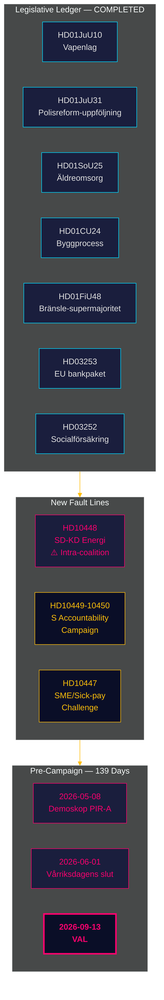

<!-- dir: rtl -->
# תדריך מודיעין — סקירה חודשית 2026-04-27

**מחבר**: James Pether Sörling | **תאריך**: 2026-04-27
**תקופה**: 2026-03-28 → 2026-04-27 (30 ימים) | **Riksmöte**: 2025/26
**רמת ביטחון**: HIGH (A1) | **טווח אדמירלטי**: A1–C3 | **ימים לבחירות**: 139

## 🎯 סיכום מבצעי

תקופת 30 הימים 2026-03-28 → 2026-04-27 סוגרת את תיק החקיקה של קואליציית תידו לדורת הריקסמוטה 2025/26, ובמקביל חושפת שני קווי שבר חדשים: **מתח פנים-קואליציוני בין SD ל-KD בנושא מדיניות האנרגיה** (HD10448) ו**מסע מדוקדק של שאלות פרלמנטריות סוציאל-דמוקרטיות** לעבר ארבעה משרדים. שבדיה נמצאת כעת במרחק **139 ימים מהבחירות**, כשהציר הפוליטי עבר לחלוטין מחקיקה לסיכוני יישום, לחץ אחריות ופוזיציונינג נרטיבי בחירותי.

## 🧭 3 החלטות שתדריך זה תומך בהן

1. **ניטור לכידות הקואליציה**: שאלת HD10448 בין SD ל-KD (Fransson מול Busch בנושא דיסאינפורמציה בתחום טורבינות הרוח) היא קו השבר הפנים-קואליציוני הברור ביותר מאז הסכם תידו — על מקבלי ההחלטות לראות במדיניות האנרגיה נקודת תורפה פעילה, לא נושא שסגור.
2. **כיול אסטרטגיית האופוזיציה**: הדפוס של חמש שאלות פרלמנטריות בשבוע אחד של S (HD10447–10450 + הצעות מתואמות) מסמן מעבר מאופוזיציה פוליטית למסע אחריות בחירותי — לעדכן את מודיעין אסטרטגיית האופוזיציה בהתאם.
3. **תיק סיכוני יישום**: שלושה שערי יישום פתוחים: Polismyndigheten (9 המלצות RiR פתוחות, HD01JuU31), טרנספוזיציה של חבילת הבנקאות של האיחוד האירופי (HD03253 — תשתית ציות משמעותית), ומינוי מנהל שירותי קשישים HD01SoU25. על מקבלי החלטות במגזרים הנוגעים בדבר למפות את חשיפתם עכשיו.

## נקודות מודיעין ב-60 שניות

- **קו שבר פנים-קואליציוני מאושר**: HD10448 — Fransson מ-SD מפנה שאלה לשרת KD Busch בנושא דיסאינפורמציה בתחום טורבינות הרוח, ומכריח לראשונה בריקסמוטה 2025/26 את הפיצול באנרגיה לצאת לתיעוד הציבורי.
- **מסע האחריות של S הושק**: חמש שאלות פרלמנטריות בשבוע (HD10447–HD10450 + הצעות) המכוונות לארבעה שרים בתחומי תשתיות, ביטוח סוציאלי, אנרגיה וכלכלה — זוהי הסלמה בחירותית, לא ביקורת שגרתית.
- **חבילת הבנקאות האירופית מתקדמת**: HD03253 מתקדם דרך ה-FiU — רצפת תפוקה של 72.5% תגביל בנקים שיטתיים שוודיים ממונפי משכנתאות (Swedbank, SEB, Handelsbanken, Nordea); Finansinspektionen שומרת על עדיפות הפיקוח אך מורכבות הקואורדינציה עם EBA גדלה.
- **גירוי פיסקלי דרך מס דלק**: HD01FiU48 (תקציב שינוי נוסף) היפך את מסלול המס הירוק הקודם; החשבון הבחירותי הוקדם לפני העקביות האקלימית; V ו-MP הגישו הסתייגויות.
- **הגבלת קצבאות אסירים יושמה**: HD03252 מגביל ביטוח סוציאלי לנמצאים ב-kontrollerat boende/säkerhetsförvaring — אתגר מידתיות לפי סעיף 8 ל-ECHR צפוי.
- **סיכון רפורמת המשטרה**: HD01JuU31 (Riksrevisionen) מאשר 9 המלצות פתוחות של Polismyndigheten מ-RiR 2026:6 — הצוואר הבקבוק המבני הגדול ביותר בתיק הממשלה.
- **עוגן כלכלי של קרן המטבע**: צמיחת התמ"ג השוודי +2.1%, חוב ~31% מהתמ"ג, חשבון שוטף +5.5% מהתמ"ג (WEO Apr-2026) — המצב המבני נשאר חזק לקראת מחזור הבחירות.

## הטריגר הצופה הטוב ביותר

**2026-05-08 — סקר הדמוסקופ הראשון לאחר התקופה.** בודק האם הקלת מס הדלק HD01FiU48 ייצרה עלייה מתמשכת בסקרים (PIR-A). בלוק תידו ≥ 44% → תרחיש א (חידוש הקואליציה); < 40% → תרחיש ב (מיעוט בראשות S). המתח של SD-KD באנרגיה עשוי לדכא מעט את בסיס KD — לעקוב אחר סטייה ספציפית ל-KD.

## הערכת ביטחון

בסך הכול: **HIGH (A1)** לתמונת הסגירה המבנית וזיהוי קו השבר SD-KD. **MEDIUM (B2)** לדינמיקות בחירות עתידיות (פיגור סקרים, הסתגלות אסטרטגיית אופוזיציה, משמעת SD לאחר אוגוסט). **LOW (C3)** לציר הזמן של יישום HD03252/HD03253 והשפעת ועידת SD.

## 🔄 הקשר מתודולוגי

**איסוף**: ממשק API פתוח של הריקסדאג (riksdag-regering-mcp); סינתזת ניתוח 30 ימים  
**שיטה**: ניקוד DIW, ACH, SWOT, שפת הסתברות WEP, קידוד אדמירלטי  
**רצפת ביטחון**: כל הטענות העובדתיות ≥ C3; הערכות מבניות ≥ B2  
**מקור כלכלי**: IMF WEO Apr-2026 (NGDP_RPCH, GGXWDG_NGDP, BCA_NGDPD), אוחזר ב-2026-04-27  
**תקנים**: ICD 203 (השערות חלופיות, שפת הסתברות); AI FIRST (מינימום 2 איטרציות)  
**מחזור הבא**: סקירה חודשית 2026-05-27 — צריכה לכלול מדידת דמוסקופ (PIR-A), החלטת הריבית של Riksbank (I-4), תוצאות ועידת SD

---
## תוספת ממעבר 2 — הקשר האנרגיה של SD-KD הועמק

**מדוע HD10448 חשוב מעבר לשאלה הפרלמנטרית**: הספקנות המתועדת של SD כלפי טורבינות הרוח (HD10448) אינה אירוע מבודד. זאת מיקום עקבי של SD מאז 2022 נגד מנדטים לאנרגיה מתחדשת. תשובת Busch תעקב מקרוב: האם KD תוותר על שטח פוליטי (מחוון תרחיש ב) או תספק תשובה דיפלומטית-מחזיקה (מחוון תרחיש א). **נוסח ההחלטה של פרק האנרגיה בוועידת SD (צפוי ב-20 במאי 2026) הוא המדד הצופה החשוב ביותר ליציבות הקואליציה.**

**הערת מאקרו של קרן המטבע**: צמיחת התמ"ג השוודית +2.1% (IMF WEO Apr-2026) מעניקה לקואליציה מרחב תמרון — בכלכלה מתדרדרת, המתחים מסוג HD10448 היו מסלימים מהר יותר. התנאים המאקרו-כלכליים הנוכחיים מעדיפים במעט את תרחיש א (עמידות הקואליציה).

*economicProvenance: provider=imf; dataflow=WEO; vintage=April-2026; retrieved_at=2026-04-27*

<!-- source-sha: 37f69ff9aa194a3c561fdd15f1b60d4f6b106472 -->
