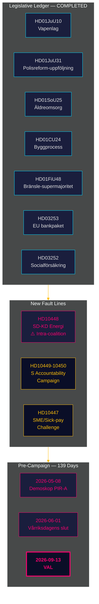

# インテリジェンス概要 — 月次レビュー 2026-04-27

**著者**: James Pether Sörling | **日付**: 2026-04-27
**対象期間**: 2026-03-28 → 2026-04-27（30日間）| **Riksmöte**: 2025/26
**信頼度**: HIGH (A1) | **提督評価**: A1–C3 | **選挙まで**: 139日

## 🎯 結論優先の要約

2026-03-28から2026-04-27までの30日間は、ティドー連立の2025/26リクスモーテの立法帳簿を締め、同時に2つの新たな断層を明らかにした：**エネルギー政策に関するSD対KDの連立内部の緊張**（HD10448）と**四省庁を標的とした社会民主党（S）による国会質問キャンペーン**。スウェーデンは現在**選挙まで139日**の地点にあり、政治の焦点は立法から実施リスク・説明責任の圧力・選挙ナラティブの構築へと完全にシフトしている。

## 🧭 この概要が支援する3つの意思決定

1. **連立結束の監視**: HD10448でのSD対KD（Franssonによる風力タービン偽情報に関するBuschへの質問）は、ティドー協定以来最も明確な連立内部の断層線であり、意思決定者はエネルギー政策を解決済みの問題ではなく、活発な脆弱性として扱うべきである。
2. **野党戦略の調整**: S党による1週間での5件の国会質問パターン（HD10447–10450と協調提案）は、政策批判から選挙説明責任キャンペーンへの転換を示す — 野党戦略インテリジェンスを相応に更新すること。
3. **実施リスクファイル**: 3つの未解決実施ゲート：Polismyndigheten（9件のRiR推薦未解決、HD01JuU31）、EUバンキングパッケージの転換（HD03253 — 重要なコンプライアンスインフラ）、HD01SoU25の高齢者ケア管理者任命。関係セクターの意思決定者は今すぐ露出をマッピングすること。

## 60秒のインテリジェンス要点

- **連立内部断層線確認済み**: HD10448 — SDのFranssonがKD大臣Buschに風力タービン偽情報について質問し、2025/26リクスモーテで初めてエネルギー分裂が公式記録に残る。
- **S党の説明責任キャンペーン開始**: 1週間で5件の質問（HD10447–HD10450+提案）が4大臣（インフラ・社会保険・エネルギー・経済）を標的 — これは通常の批判ではなく選挙エスカレーションである。
- **EUバンキングパッケージ前進**: HD03253がFiUを通過中 — 72.5%のアウトプットフロアが住宅ローン主導のスウェーデン系統的銀行（Swedbank、SEB、Handelsbanken、Nordea）を制約；Finansinspektionenが監督優先権を維持するが、EBAとの調整複雑性が増大。
- **燃料税による財政刺激**: HD01FiU48（補正予算）が以前の環境税軌道を逆転；選挙上の配慮が気候一貫性より優先；VとMPが反対意見を提出。
- **受刑者給付制限実施済み**: HD03252が kontrollerát boende/säkerhetsförvaring収容者の社会保険を制限 — ECHR第8条によるプロポーショナリティ異議が予想される。
- **警察改革リスク**: HD01JuU31（Riksrevisionen）がRiR 2026:6からPolismundigheten9件の未解決推薦を確認 — 政府ポートフォリオ最大の構造的ボトルネック。
- **IMFマクロ基盤**: スウェーデンGDP成長率+2.1%、債務～31%GDP、経常収支+5.5%GDP（WEO Apr-2026）— 構造的見通しは選挙サイクルに向けて堅固。

## 最良の先行指標

**2026-05-08 — 対象期間後初のデモスコップ世論調査**。燃料税軽減HD01FiU48が持続的な支持率上昇をもたらしたかを検証（PIR-A）。ティドーブロック≥44% → シナリオA（連立更新）；<40% → シナリオB（S主導の少数政権）。SD-KDエネルギー緊張がKDの支持基盤をわずかに抑制する可能性 — KD固有の偏差を追跡すること。

## 信頼度評価

総合: 構造的帳簿の締めとSD-KD断層線の特定については**HIGH (A1)**。将来の選挙ダイナミクス（世論調査遅延・野党戦略適応・8月以降のSD規律）については**MEDIUM (B2)**。HD03252/HD03253実施タイムラインとSD党大会影響については**LOW (C3)**。

## 🔄 方法論的文脈

**収集**: Riksdag公開API（riksdag-regering-mcp）；30日間分析合成  
**方法**: DIWスコアリング、ACH、SWOT、WEP確率言語、提督コーディング  
**信頼度基準**: すべての事実的主張≥C3；構造的評価≥B2  
**経済源**: IMF WEO Apr-2026（NGDP_RPCH、GGXWDG_NGDP、BCA_NGDPD）、2026-04-27取得  
**標準**: ICD 203（代替仮説、確率言語）；AI FIRST（最低2回の反復）  
**次回サイクル**: 月次レビュー2026-05-27 — デモスコップ測定（PIR-A）、Riksbankの金利決定（I-4）、SD党大会結果を含める必要あり

---
## パス2補足 — SD-KDエネルギー文脈の深化

**HD10448が単なる国会質問を超えて重要な理由**: SDによる風力タービン懐疑論の記録（HD10448）は孤立した出来事ではない。これは2022年以来の再生可能エネルギー義務に対するSDの一貫した立場である。Buschの回答は注視される：KDが政治的地歩を譲るか（シナリオBの指標）、あるいは外交的な現状維持の回答をするか（シナリオAの指標）。**SD党大会エネルギー章の決議文言（2026年5月20日予定）は、連立安定性の最も重要な先行指標となる。**

**IMFマクロ注記**: スウェーデンGDP成長率+2.1%（IMF WEO Apr-2026）は連立に操作の余地を与えている — 経済が悪化した場合、HD10448のような緊張はより速くエスカレートしていただろう。現在のマクロ経済状況はシナリオA（連立の回復力）をわずかに支持している。

*economicProvenance: provider=imf; dataflow=WEO; vintage=April-2026; retrieved_at=2026-04-27*

<!-- source-sha: 37f69ff9aa194a3c561fdd15f1b60d4f6b106472 -->
