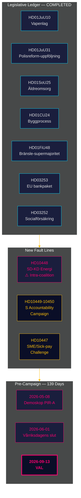

# 인텔리전스 개요 — 월간 리뷰 2026-04-27

**저자**: James Pether Sörling | **날짜**: 2026-04-27
**대상 기간**: 2026-03-28 → 2026-04-27（30일）| **Riksmöte**: 2025/26
**신뢰도**: HIGH (A1) | **제독 코드**: A1–C3 | **선거까지**: 139일

## 🎯 결론 우선 요약

2026-03-28부터 2026-04-27까지 30일 동안은 티도 연립의 2025/26 릭스모테 입법 원장을 마감하면서 두 가지 새로운 단층선을 드러냈다: **에너지 정책에 관한 SD 대 KD의 연립 내부 긴장**(HD10448)과 **4개 부처를 겨냥한 사회민주당(S)의 집중적인 질문 캠페인**. 스웨덴은 현재 **선거까지 139일** 지점에 있으며, 정치의 초점은 입법에서 이행 위험, 책임 압박, 선거 서사 구축으로 완전히 이동했다.

## 🧭 이 개요가 지원하는 3가지 의사결정

1. **연립 결속 모니터링**: HD10448에서의 SD 대 KD(Fransson이 풍력 터빈 허위정보 문제로 Busch에게 질문)는 티도 협정 이래 가장 명확한 연립 내부 단층선이다 — 의사결정자들은 에너지 정책을 해결된 문제가 아닌 현재 진행 중인 취약점으로 취급해야 한다.
2. **야당 전략 조정**: S당이 1주일 만에 5건의 국회 질문(HD10447–10450과 협조 제안)을 제출한 패턴은 정책 비판에서 선거 책임 캠페인으로의 전환을 시사한다 — 야당 전략 인텔리전스를 그에 맞게 업데이트할 것.
3. **이행 위험 파일**: 3개의 미해결 이행 관문: Polismyndigheten(9개의 미해결 RiR 권고, HD01JuU31), EU 은행 패키지 전환(HD03253 — 중요한 컴플라이언스 인프라), HD01SoU25 노인 돌봄 관리자 임명. 관련 부문 의사결정자들은 지금 당장 노출을 파악해야 한다.

## 60초 인텔리전스 핵심

- **연립 내부 단층선 확인**: HD10448 — SD의 Fransson이 KD 장관 Busch에게 풍력 터빈 허위정보에 대해 질문하여, 2025/26 릭스모테에서 처음으로 에너지 분열이 공식 기록에 남게 됨.
- **S당 책임 캠페인 시작**: 1주일간 5건의 질문(HD10447–HD10450+제안)이 4명의 장관(인프라·사회보험·에너지·경제)을 표적으로 — 이는 일상적인 비판이 아닌 선거 에스컬레이션이다.
- **EU 은행 패키지 진행 중**: HD03253이 FiU 통과 중 — 72.5% 산출 기준이 주택담보대출 중심의 스웨덴 시스템 은행(Swedbank, SEB, Handelsbanken, Nordea)을 제약; Finansinspektionen이 감독 우선권 유지하나 EBA와의 조정 복잡성 증가.
- **연료세를 통한 재정 자극**: HD01FiU48(추가 예산)이 이전의 녹색세 궤도를 역전; 선거 고려사항이 기후 일관성보다 우선; V와 MP가 반대 의견 제출.
- **수감자 급여 제한 시행**: HD03252가 kontrollerát boende/säkerhetsförvaring 수용자에 대한 사회보험을 제한 — ECHR 제8조 비례성 이의제기 예상.
- **경찰 개혁 위험**: HD01JuU31(Riksrevisionen)이 RiR 2026:6에서 Polismundigheten의 9개 미해결 권고를 확인 — 정부 포트폴리오의 가장 큰 구조적 병목.
- **IMF 거시 토대**: 스웨덴 GDP 성장 +2.1%, 부채 ~31% GDP, 경상수지 +5.5% GDP(WEO Apr-2026) — 구조적 전망은 선거 사이클에 향해 견고.

## 최상의 선행 지표

**2026-05-08 — 대상 기간 이후 첫 데모스코프 여론조사**. 연료세 완화 HD01FiU48이 지속적인 지지율 상승을 가져왔는지 검증(PIR-A). 티도 블록 ≥44% → 시나리오 A(연립 갱신); <40% → 시나리오 B(S 주도 소수 정권). SD-KD 에너지 긴장이 KD 지지 기반을 소폭 억제할 가능성 — KD 고유 편차를 추적할 것.

## 신뢰도 평가

전반: 구조적 원장 마감과 SD-KD 단층선 파악에 대해 **HIGH (A1)**. 향후 선거 역학(여론조사 지연·야당 전략 적응·8월 이후 SD 규율)에 대해 **MEDIUM (B2)**. HD03252/HD03253 이행 타임라인과 SD 당대회 영향에 대해 **LOW (C3)**.

## 🔄 방법론적 맥락

**수집**: 릭스다그 공개 API(riksdag-regering-mcp); 30일 분석 합성  
**방법**: DIW 스코어링, ACH, SWOT, WEP 확률 언어, 제독 코딩  
**신뢰도 기준**: 모든 사실적 주장 ≥C3; 구조적 평가 ≥B2  
**경제 출처**: IMF WEO Apr-2026(NGDP_RPCH, GGXWDG_NGDP, BCA_NGDPD), 2026-04-27 취득  
**표준**: ICD 203(대안 가설, 확률 언어); AI FIRST(최소 2회 반복)  
**다음 사이클**: 월간 리뷰 2026-05-27 — 데모스코프 측정(PIR-A), Riksbank 금리 결정(I-4), SD 당대회 결과 포함 필요

---
## 패스 2 추가 — SD-KD 에너지 맥락 심화

**HD10448이 단순한 국회 질문을 넘어 중요한 이유**: 풍력 터빈에 대한 SD의 기록된 회의주의(HD10448)는 고립된 사건이 아니다. 이는 2022년 이래 재생에너지 의무에 반대하는 SD의 일관된 입장이다. Busch의 답변이 주목된다: KD가 정치적 지반을 양보하는지(시나리오 B의 지표) 아니면 외교적인 현상 유지 답변을 하는지(시나리오 A의 지표). **SD 당대회 에너지 장의 결의 문구(2026년 5월 20일 예정)가 연립 안정성의 가장 중요한 선행 지표가 될 것이다.**

**IMF 거시 주석**: 스웨덴 GDP 성장 +2.1%(IMF WEO Apr-2026)는 연립에 조작 여지를 부여한다 — 경제가 악화되었다면 HD10448 같은 긴장은 더 빨리 에스컬레이션되었을 것이다. 현재의 거시경제 상황은 시나리오 A(연립 회복력)를 소폭 지지한다.

*economicProvenance: provider=imf; dataflow=WEO; vintage=April-2026; retrieved_at=2026-04-27*

<!-- source-sha: 37f69ff9aa194a3c561fdd15f1b60d4f6b106472 -->
