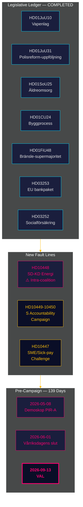

# Inlichtingenbriefing — Maandelijkse evaluatie 2026-04-27

**Auteur**: James Pether Sörling | **Datum**: 2026-04-27
**Periode**: 2026-03-28 → 2026-04-27 (30 dagen) | **Riksmöte**: 2025/26
**Betrouwbaarheidsniveau**: HIGH (A1) | **Admiralty-bereik**: A1–C3 | **Dagen tot verkiezingen**: 139

## 🎯 Operationele samenvatting

De 30-dagenperiode 2026-03-28 → 2026-04-27 sluit het wetgevingsportfolio van de Tidö-coalitie voor Riksmöte 2025/26 terwijl twee nieuwe breuklijnen zichtbaar worden: **intracoalitie SD-KD-spanning over energiebeleid** (HD10448) en een **gecoördineerde sociaaldemocratische interpellationscampagne** gericht op vier ministeries. Zweden bevindt zich nu op **139 dagen van de verkiezingen**, met de politieke as volledig verschoven van wetgeving naar implementatierisico's, verantwoording en electorale narratieve positionering.

## 🧭 3 Beslissingen die deze briefing ondersteunen

1. **Bewaking van coalitiecohesie**: De HD10448-interpellatie SD-KD (Fransson tegen Busch over windenergie-desinformatie) is de duidelijkste intracoalitie breukijn sinds het Tidö-akkoord — besluitvormers moeten energiebeleid als een actieve kwetsbaarheid behandelen, niet als een afgehandeld agendapunt.
2. **Kalibratie van de oppositiestrategie**: Het patroon van vijf interpellaties in één week van de S (HD10447–10450 + gecoördineerde moties) signaleert de transitie van politieke oppositie naar electorale verantwoordingscampagne — oppositiestrategie-inlichtingen dienovereenkomstig bijwerken.
3. **Implementatierisicoortfolio**: Drie implementatiepoorten staan open: Polismyndigheten (9 open RiR-aanbevelingen, HD01JuU31), EU-bankenpakket-transpositi (HD03253 — aanzienlijke compliance-infrastructuur), en HD01SoU25 benoeming directeur ouderenzorg. Besluitvormers in betrokken sectoren moeten hun blootstelling nu in kaart brengen.

## 60-seconden inlichtingenpunten

- **Intracoalitie breukijn bevestigd**: HD10448 — SD's Fransson interpelleert KD-minister Busch over windenergie-desinformatie en dwingt voor het eerst in Riksmöte 2025/26 de energiesplitsing van de coalitie in het openbare protocol.
- **S-verantwoordingscampagne gelanceerd**: Vijf interpellaties in één week (HD10447–HD10450 + moties) gericht op vier ministers in infrastructuur, sociale verzekering, energie en economie — dit is electorale escalatie, geen routinecontrole.
- **EU-bankenpakket gevorderd**: HD03253 gaat door het FiU — outputbodem van 72,5% zal zwaar op hypotheekleningen gerichte Zweedse SIB's beperken (Swedbank, SEB, Handelsbanken, Nordea); Finansinspektionen behoudt het toezichtsprimaat maar de EBA-coördinatiecomplexiteit neemt toe.
- **Fiscale stimulans via brandstofbelasting**: HD01FiU48 (aanvullende wijzigingsbegroting) keerde de eerdere groene belastingtrajectorie; electorale calculus werd geprioriteerd boven klimaatconsistentie; V en MP dienden voorbehouden in.
- **Beperking gevangenisuitkeringen doorgevoerd**: HD03252 beperkt sociale verzekering voor personen in kontrollerat boende/säkerhetsförvaring — proportionaliteitsuitdaging onder ECHR Art. 8 wordt verwacht.
- **Politiehervormingrisk**: HD01JuU31 (Riksrevisionen) bevestigt 9 open aanbevelingen van Polismyndigheten uit RiR 2026:6 — het grootste structurele uitvoeringsbottleneck in het overheidsportfolio.
- **IMF-economisch anker**: Zweedse bbp-groei +2,1%, schuld ~31% van het bbp, lopende rekening +5,5% van het bbp (WEO Apr-2026) — de structurele positie blijft sterk in aanloop naar de verkiezingscyclus.

## Beste vooruitblikkende trigger

**2026-05-08 — Eerste Demoskop-meting na de periode.** Test of de brandstofbelastingverlaging HD01FiU48 een duurzame opiniestijging heeft opgeleverd (PIR-A). Tidö-blok ≥ 44% → Scenario A (coalitiehernieuwing); < 40% → Scenario B (S-geleide minderheid). SD-KD-energiespanning kan de KD-basis licht verlagen — let op KD-specifieke drift.

## Betrouwbaarheidsbeoordeling

Algeheel: **HIGH (A1)** voor het structurele afsluitingsbeeld en SD-KD breukijn-identificatie. **MEDIUM (B2)** voor toekomstige electorale dynamiek (opiniepeilingvertraging, aanpassing oppositiestrategie, SD-discipline na augustus). **LOW (C3)** voor HD03252/HD03253 implementatietijdlijnen en invloed van het SD-congres.

## 🔄 Methodologische context

**Verzameling**: Open data-API van de Riksdag (riksdag-regering-mcp); 30-daagse zusteranalyse-synthese  
**Methode**: DIW-scoring, ACH, SWOT, WEP-kansontaal, Admiralty-codering  
**Betrouwbaarheidsondergrens**: Alle feitelijke beweringen ≥ C3; structurele beoordelingen ≥ B2  
**Economische herkomst**: IMF WEO Apr-2026 (NGDP_RPCH, GGXWDG_NGDP, BCA_NGDPD), opgehaald op 2026-04-27  
**Normen**: ICD 203 (alternatieve hypothesen, kansontaal); AI FIRST (minimaal 2 iteraties)  
**Volgende cyclus**: Maandelijkse evaluatie 2026-05-27 — moet Demoskop-meting (PIR-A), rentebesluit Riksbank (I-4), SD-congresuitslag bevatten

---
## Toevoeging uit doorgang 2 — SD-KD energiecontext uitgediept

**Waarom HD10448 meer betekent dan de interpellatie**: SD's gedocumenteerde windenergieskepsis (HD10448) is geen geïsoleerde gebeurtenis. Het volgt SD's consistente positionering sinds 2022 tegen hernieuwbare energiemandaten. Buschs antwoord zal nauwlettend worden gevolgd voor de vraag of KD politiek terrein toegeeft (Scenario B-indicator) of een diplomatisch-houdend antwoord geeft (Scenario A-indicator). **De tekst van de resolutie van het energiehoofdstuk van het SD-congres (verwacht op 20 mei 2026) is de veruit belangrijkste vooruitblikkende indicator voor de coalitie-stabiliteit.**

**IMF macro-noot**: Zweden's +2,1% bbp-groei (IMF WEO Apr-2026) geeft de coalitie speelruimte — in een verzwakkende economie zouden HD10448-type spanningen sneller escaleren. De huidige macro-omstandigheden begunstigen licht Scenario A (bestendigheid van de coalitie).

*economicProvenance: provider=imf; dataflow=WEO; vintage=April-2026; retrieved_at=2026-04-27*

<!-- source-sha: 37f69ff9aa194a3c561fdd15f1b60d4f6b106472 -->
