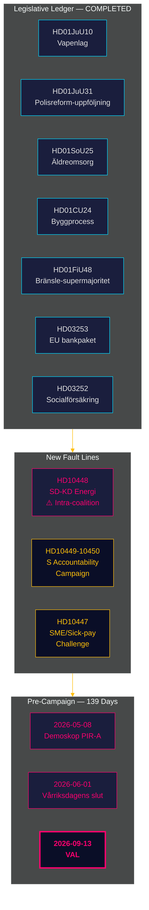

# Etterretningsbriefing — Månedsoversikt 2026-04-27

**Forfatter**: James Pether Sörling | **Dato**: 2026-04-27
**Periode**: 2026-03-28 → 2026-04-27 (30 dager) | **Riksmöte**: 2025/26
**Konfidensnivå**: HIGH (A1) | **Admiralty-intervall**: A1–C3 | **Dager til valg**: 139

## 🎯 Kortfattet situasjonsvurdering

30-dagersperioden 2026-03-28 → 2026-04-27 avslutter Tidø-koalisjonens lovgivningsportefølje for riksmöte 2025/26 og eksponerer samtidig to nye bruddlinjer: **intrakoalisjons SD-KD energipolitisk spenning** (HD10448) og en **koordinert sosialdemokratisk interpellasjonskampanje** rettet mot fire departementer. Sverige er nå **139 dager fra valget** med den politiske aksen fullstendig skiftet fra lovgivning til implementeringsrisikoer, ansvarsutkrevning og valgkampposisjonering.

## 🧭 3 Beslutninger denne briefingen støtter

1. **Koalisjonssammenholdovervåking**: HD10448-interpellasjonen SD-KD (Fransson mot Busch om vindkraftsinformasjon) er den tydeligste intrakoalisjons bruddlinjen siden Tidø-avtalen — beslutningstakere bør behandle energipolitikk som en aktiv sårbarhet, ikke som et avgjort dagsordenspunkt.
2. **Kalibrering av opposisjonsstrategi**: S' fem-interpellasjoner-på-en-uke-mønster (HD10447–10450 + koordinerte motioner) signaliserer overgang fra politisk opposisjon til valgansvarskampanje — oppdater opposisjonsstrategietterforskning deretter.
3. **Implementeringsrisikoporetefølje**: Tre implementeringsporter er åpne: Polismyndigheten (9 åpne RiR-anbefalinger, HD01JuU31), EU-bankpakketetransponeringen (HD03253 — større etterlevelsesinfrastruktur), og HD01SoU25 eldreomsorgsdirekturoppnevning. Beslutningstakere i berørte sektorer bør kartlegge sin eksponering nå.

## 60-sekunders etterretningspunkter

- **Intrakoalisjons bruddlinje bekreftet**: HD10448 — SD's Fransson interpellerer KD-minister Busch om vindkraftsinformasjon, og tvinger for første gang i riksmöte 2025/26 koalisjonens energi-underfraktur inn i den offentlige protokollen.
- **S' ansvarskampanje lansert**: Fem interpellasjoner på en uke (HD10447–HD10450 + motioner) rettet mot fire ministre innen infrastruktur, trygd, energi og næringsliv — dette er valeskalering, ikke rutinekontroll.
- **EU-bankpakken avansert**: HD03253 avanserer gjennom FiU — utgangsgulv på 72,5% vil begrense svenske boliglåntunge SIFI-er (Swedbank, SEB, Handelsbanken, Nordea); Finansinspektionen beholder tilsynsprimat men EBA-koordinasjonskompleksiteten økes.
- **Finanspolitisk stimulans via drivstoffavgift**: HD01FiU48 (ekstra endringsbudsjett) snudde den tidligere grønne skattebanen; valgkalkyle ble prioritert over klimatkonsistens; V og MP innsendte reservasjoner.
- **Fengselsytelsesrestriksjon gjennomført**: HD03252 begrenser trygdeytelser for dem i kontrollerat boende/säkerhetsförvaring — proporsjonalitetsutfordring under ECHR Art. 8 forventes.
- **Politireformrisiko**: HD01JuU31 (Riksrevisionen) bekrefter 9 åpne Polismyndigheten-anbefalinger fra RiR 2026:6 — den største strukturelle gjennomføringsbegrensningen i regjeringens portefølje.
- **IMFs økonomiske anker**: Sveriges BNP-vekst +2,1%, gjeld ~31% av BNP, driftsbalanse +5,5% av BNP (WEO Apr-2026) — den strukturelle posisjonen forblir sterk inn i valgperioden.

## Beste fremadrettede utløser

**2026-05-08 — Første post-periode Demoskop-måling.** Tester om HD01FiU48 drivstoffskattereduksjonen ga varig opinionsløft (PIR-A). Tidø-blokk ≥ 44% → Scenario A (koalisjonsfornyelse); < 40% → Scenario B (S-ledet mindretall). SD-KD's energispenning kan svakt redusere KD-basen — følg med på KD-spesifikk drift.

## Konfidensvurdering

Samlet: **HIGH (A1)** for det strukturelle avslutningsbildet og SD-KD bruddlinje-identifikasjon. **MEDIUM (B2)** for fremtidige valgdynamikker (opinionsetterstøy, opposisjonsstrategitilpasning, SD-disiplin etter august). **LOW (C3)** for HD03252/HD03253 implementeringstidslinjer og SD-kongressinnflytelse.

## 🔄 Metodologisk kontekst

**Innsamling**: Riksdagens åpne data-API (riksdag-regering-mcp); 30-dagers søskendeanalysesyntese  
**Metode**: DIW-scoring, ACH, SWOT, WEP-sannsynlighetsspråk, Admiralty-koding  
**Konfidensundergense**: Alle faktapåstander ≥ C3; strukturelle vurderinger ≥ B2  
**Økonomisk opprinnelse**: IMF WEO Apr-2026 (NGDP_RPCH, GGXWDG_NGDP, BCA_NGDPD), hentet 2026-04-27  
**Standarder**: ICD 203 (alternative hypoteser, sannsynlighetsspråk); AI FIRST (minimum 2 iterasjoner)  
**Neste syklus**: Månedsoversikt 2026-05-27 — bør inkludere Demoskop-måling (PIR-A), Riksbankens rentebeslutning (I-4), SD-kongress-utfall

---
## Tillegg fra pass 2 — SD-KD energikontekst utdypet

**Hvorfor HD10448 betyr mer enn interpellasjonen**: SD's dokumenterte vindkraftsskepsis (HD10448) er ikke en isolert hendelse. Det følger SD's konsekvent posisjonering siden 2022 mot fornybarenergimandat. Buschs svar vil bli fulgt nøye for om KD innrømmer politikkplass (Scenario B-indikator) eller gir et diplomatisk holdningssvar (Scenario A-indikator). **Teksten i SD-kongressens energikapittelresolusjonen (forventet 20. mai 2026) er den enkeltvis viktigste fremadrettede indikatoren for koalisjonsstabilitet.**

**IMF makroanmerkelse**: Sveriges +2,1% BNP-vekst (IMF WEO Apr-2026) gir koalisjonen handlingsrom — i en svakere økonomi ville HD10448-typen spenninger eskalere raskere. Nåværende makroforhold favoriserer svakt Scenario A (koalisjonens utholdenhet).

*economicProvenance: provider=imf; dataflow=WEO; vintage=April-2026; retrieved_at=2026-04-27*

<!-- source-sha: 37f69ff9aa194a3c561fdd15f1b60d4f6b106472 -->
