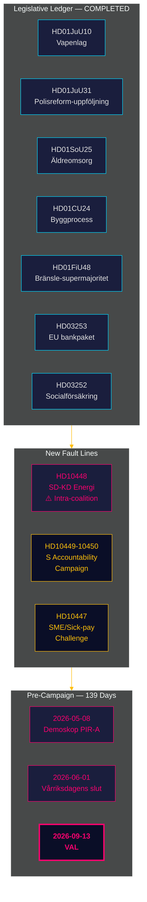

# Underrättelsebriefing — Månadsöversikt 2026-04-27

**Författare**: James Pether Sörling | **Datum**: 2026-04-27
**Period**: 2026-03-28 → 2026-04-27 (30 dagar) | **Riksmöte**: 2025/26
**Konfidensgrad**: HIGH (A1) | **Admiralty-intervall**: A1–C3 | **Dagar till val**: 139

## 🎯 Kortfattad lägesbedömning

30-dagarsperioden 2026-03-28 → 2026-04-27 avslutar Tidökoalitionens lagstiftningsportfölj för riksmöte 2025/26 och exponerar samtidigt två nya spänningslinjer: **inre koalitionsspänning SD-KD i energipolitiken** (HD10448) och en **samordnad socialdemokratisk interpellationskampanj** riktad mot fyra ministerier. Sverige befinner sig nu **139 dagar från valet** med den politiska axeln fullständigt förskjuten från lagstiftning till implementeringsrisker, ansvarsgranskning och kampanjnarrativpositionering.

## 🧭 3 Beslut som denna briefing stödjer

1. **Koalitionskohesionsövervakning**: HD10448-interpellationen SD-KD (Fransson mot Busch om vindkraftsinformation) är den tydligaste inre koalitionssprickan sedan Tidöavtalet — beslutsfattare bör behandla energipolitiken som en aktiv sårbarhet, inte som en avgjord dagordningspunkt.
2. **Kalibrering av oppositionsstrategi**: S:s fem-interpellationer-på-en-vecka-mönster (HD10447–10450 + koordinerade motioner) signalerar övergång från policyopposition till valansvarskampanj — uppdatera oppositionsstrategiintelligens därefter.
3. **Implementeringsriskportfölj**: Tre implementeringsportar är öppna: Polismyndigheten (9 öppna RiR-rekommendationer, HD01JuU31), EU:s bankpakettransponering (HD03253 — stor efterlevnadsinfrastruktur), och HD01SoU25 äldreomsorgsföreståndartillsättning. Beslutsfattare i berörda sektorer bör kartlägga sin exponering nu.

## 60-sekunders underrättelseläge

- **Inre koalitionsspänningslinje bekräftad**: HD10448 — SD:s Fransson interpellerar KD-minister Busch om vindkraftsinformation, vilket för första gången under riksmöte 2025/26 tvingar in koalitionens energi-underbristning i det offentliga protokollet.
- **S:s ansvarskampanj lanserad**: Fem interpellationer på en vecka (HD10447–HD10450 + motioner) riktade mot fyra ministrar inom infrastruktur, socialförsäkring, energi och näringsliv — detta är valupptrappning, inte rutingranskning.
- **EU:s bankpaket avancerat**: HD03253 avancerar genom FiU — utdatagolv på 72,5% kommer att begränsa svenska bolångtunga SIB:er (Swedbank, SEB, Handelsbanken, Nordea); Finansinspektionen behåller tillsynsprimat men EBA-koordinationskomplexiteten ökar.
- **Finanspolitisk stimulus via drivmedelsskatt**: HD01FiU48 (extra ändringsbudget) vände den tidigare gröna skattetrajektorin; valkalkyl prioriterades över klimatkonsistens; V och MP lämnade reservationer.
- **Begränsning av fångelsebidrag genomförd**: HD03252 begränsar socialförsäkring för de i kontrollerat boende/säkerhetsförvaring — proportionalitetsutmaning enligt ECHR Art. 8 förväntas.
- **Polisreformrisk**: HD01JuU31 (Riksrevisionen) bekräftar 9 öppna Polismyndigheten-rekommendationer från RiR 2026:6 — det största strukturella genomförandehindret i regeringens portfölj.
- **IMF:s ekonomiska ankare**: Sveriges BNP-tillväxt +2,1%, skuld ~31% av BNP, bytesbalans +5,5% av BNP (WEO Apr-2026) — den strukturella positionen förblir stark inför valcykeln.

## Bästa framåtblickande utlösare

**2026-05-08 — Första post-period Demoskop-mätning.** Testar om HD01FiU48 drivmedelsskattelättnaden gav varaktigt opinionslyft (PIR-A). Tidöblocket ≥ 44% → Scenario A (koalitionsförnyelse); < 40% → Scenario B (S-ledd minoritet). SD-KD:s energispänning kan minska KD-basen något — bevaka KD-specifik drift.

## Konfidensgradering

Övergripande: **HIGH (A1)** för strukturell avslutningsbild och identifiering av SD-KD-spänningslinje. **MEDIUM (B2)** för framtida valdynamik (opinionsefterläsning, oppositionsstrategianpassning, SD-disciplin efter augusti). **LOW (C3)** för HD03252/HD03253 implementeringstidslinjer och SD-kongresspåverkan.

## 🔄 Metodologisk kontext

**Insamling**: Riksdagens öppna data-API (riksdag-regering-mcp); 30-dagars syskonanalyssyntes  
**Metod**: DIW-poängsättning, ACH, SWOT, WEP-sannolikhetsspråk, Admiralty-kodning  
**Konfidensundergräns**: Alla faktauppgifter ≥ C3; strukturella bedömningar ≥ B2  
**Ekonomiskt ursprung**: IMF WEO Apr-2026 (NGDP_RPCH, GGXWDG_NGDP, BCA_NGDPD), hämtat 2026-04-27  
**Standarder**: ICD 203 (alternativa hypoteser, sannolikhetsspråk); AI FIRST (minst 2 iterationer)  
**Nästa cykel**: Månadsöversikt 2026-05-27 — bör inkludera Demoskop-mätning (PIR-A), Riksbankens räntebeslut (I-4), SD-kongressutfall

---
## Tillägg från pass 2 — SD-KD:s energikontext fördjupad

**Varför HD10448 är viktigare än enbart interpellationen**: SD:s dokumenterade vindkraftsskepsis (HD10448) är inte en isolerad händelse. Det följer SD:s konsekventa positionering sedan 2022 mot förnybara energimandat. Buschs svar kommer att bevakas för om KD medger policyutrymme (Scenario B-indikator) eller ger ett diplomatiskt hållsvar (Scenario A-indikator). **Texten i SD-kongressens energikapitelresolution (förväntad 20 maj 2026) är den enskilt viktigaste framåtblickande indikatorn för koalitionsstabilitet.**

**IMF makronotering**: Sveriges +2,1% BNP-tillväxt (IMF WEO Apr-2026) ger koalitionen handlingsutrymme — i en försvagande ekonomi skulle HD10448-typen av spänningar eskalera snabbare. Nuvarande makroförhållanden gynnar något Scenario A (koalitionens uthållighet).

*economicProvenance: provider=imf; dataflow=WEO; vintage=April-2026; retrieved_at=2026-04-27*

<!-- source-sha: 37f69ff9aa194a3c561fdd15f1b60d4f6b106472 -->
