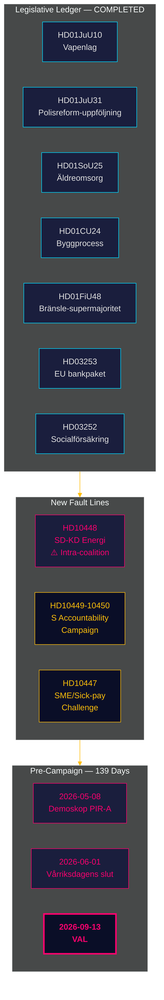

# 情报概要 — 月度回顾 2026-04-27

**作者**: James Pether Sörling | **日期**: 2026-04-27
**报告期**: 2026-03-28 → 2026-04-27（30天）| **Riksmöte**: 2025/26
**置信度**: HIGH (A1) | **海军准将评级**: A1–C3 | **距选举**: 139天

## 🎯 结论优先摘要

2026-03-28至2026-04-27这30天关闭了蒂多联合政府2025/26届议会立法账簿，同时揭示了两条新断层线：**能源政策上SD对KD的联盟内部紧张**（HD10448）以及**社会民主党（S）针对四个部门发起的集中质询攻势**。瑞典目前处于**距选举139天**的节点，政治重心已完全从立法转向执行风险、问责压力和选举叙事构建。

## 🧭 本概要支持的3项决策

1. **监测联盟凝聚力**: HD10448中的SD对KD（Fransson就风力涡轮机虚假信息质询Busch）是自蒂多协议以来最明显的联盟内部断层——决策者应将能源政策视为持续存在的脆弱点，而非已解决的议题。
2. **校准反对党策略**: S党一周内提出5项质询（HD10447–10450及协调动议）的模式表明从政策批评转向选举问责运动——相应更新反对党策略情报。
3. **执行风险档案**: 三个未解决的执行关口：Polismyndigheten（9项未结RiR建议，HD01JuU31）、欧盟银行套餐转化（HD03253——关键合规基础设施）、HD01SoU25养老护理主任任命。相关行业决策者应立即评估暴露程度。

## 60秒情报要点

- **联盟内部断层线已确认**: HD10448 — SD的Fransson向KD部长Busch质询风力涡轮机虚假信息，2025/26届议会首次将能源分歧载入公开记录。
- **S党问责运动启动**: 一周5项质询（HD10447–HD10450+动议）针对4位部长（基础设施、社会保险、能源、经济）——这是选举升级，非常规批评。
- **欧盟银行套餐推进中**: HD03253通过FiU审查 — 72.5%产出底线将约束以住房抵押贷款为主的瑞典系统性银行（Swedbank、SEB、Handelsbanken、Nordea）；Finansinspektionen保留监管优先权，但与EBA的协调复杂性增加。
- **燃油税财政刺激**: HD01FiU48（追加预算）逆转了此前的绿色税收轨迹；选举考量优先于气候一致性；V和MP提出保留意见。
- **囚犯福利限制已实施**: HD03252限制kontrollerát boende/säkerhetsförvaring收押人员的社会保险 — 预计将面临《欧洲人权公约》第8条比例原则挑战。
- **警察改革风险**: HD01JuU31（Riksrevisionen）确认RiR 2026:6中Polismundigheten的9项未结建议 — 政府工作组合中最大的结构性瓶颈。
- **国际货币基金宏观基础**: 瑞典GDP增长+2.1%，债务约31%GDP，经常账户+5.5%GDP（WEO Apr-2026）——结构性前景向选举周期保持稳健。

## 最佳前瞻指标

**2026-05-08 — 报告期后首次Demoskop民调**。检验燃油税减免HD01FiU48是否带来持续的民调提升（PIR-A）。蒂多集团≥44% → 情景A（联盟续期）；<40% → 情景B（S主导少数政府）。SD-KD能源紧张可能小幅压低KD支持基础——追踪KD特有的偏差。

## 置信度评估

总体：结构性账簿关闭和SD-KD断层线识别**HIGH (A1)**。未来选举动态（民调滞后、反对党策略适应、8月后SD纪律）**MEDIUM (B2)**。HD03252/HD03253执行时间线和SD党代会影响**LOW (C3)**。

## 🔄 方法论背景

**收集**: 瑞典议会公开API（riksdag-regering-mcp）；30天分析综合  
**方法**: DIW评分、ACH、SWOT、WEP概率语言、海军准将编码  
**置信度基准**: 所有事实性主张≥C3；结构性评估≥B2  
**经济来源**: IMF WEO Apr-2026（NGDP_RPCH、GGXWDG_NGDP、BCA_NGDPD），2026-04-27获取  
**标准**: ICD 203（替代假设、概率语言）；AI FIRST（最少2次迭代）  
**下一周期**: 月度回顾2026-05-27 — 需纳入Demoskop测量（PIR-A）、Riksbank利率决定（I-4）、SD党代会结果

---
## 第二遍补充 — SD-KD能源背景深化

**HD10448为何超越单纯质询的重要性**: SD对风力涡轮机的有记录怀疑论（HD10448）并非孤立事件。这是SD自2022年以来反对可再生能源强制配额的一贯立场。Busch的回应将受到密切关注：KD是否让步政治阵地（情景B指标），抑或给出外交性的维持现状回应（情景A指标）。**SD党代会能源章节的决议措辞（预计2026年5月20日）将成为联盟稳定性最重要的前瞻指标。**

**国际货币基金宏观注记**: 瑞典GDP增长+2.1%（IMF WEO Apr-2026）为联合政府提供了操作空间——若经济恶化，HD10448类的紧张局面会更快升级。当前宏观经济状况略微支持情景A（联盟韧性）。

*economicProvenance: provider=imf; dataflow=WEO; vintage=April-2026; retrieved_at=2026-04-27*

<!-- source-sha: 37f69ff9aa194a3c561fdd15f1b60d4f6b106472 -->
