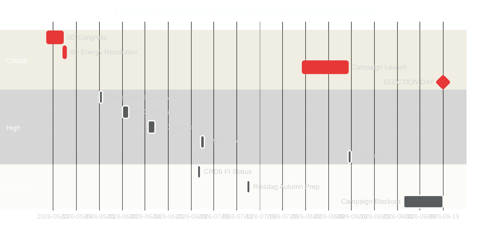

# Forward Indicators — Monthly Review 2026-04-27

**Author**: James Pether Sörling | **Date**: 2026-04-27

## Indicator Methodology

Indicators sourced from parliamentary schedule, party calendars, EU legislative calendar, and IMF publication schedule. Confidence assessed per Admiralty Scale.

## Indicators Table (≥10 dated)

| # | Date | Event | PIR linkage | Significance | Source |
|---|------|-------|-------------|--------------|--------|
| 1 | 2026-05-15 | SD party congress opens | PIR-D (SD-KD energy) | CRITICAL — energy platform text will determine coalition stability trajectory | Party congress calendar |
| 2 | 2026-05-20 | SD congress closes; energy resolution adopted | PIR-D | CRITICAL — resolution text triggers either Scenario A or B | Party congress calendar |
| 3 | 2026-05-31 | Riksrevisionen follow-up deadline (est.) on RiR 2026:6 | PIR-B (police reform) | HIGH — may produce adverse findings or closure | Riksrevisionen schedule |
| 4 | 2026-06-07 | KD party congress | PIR-D (SD-KD energy) | HIGH — Busch's energy framing will respond to SD congress outcome | Party calendar |
| 5 | 2026-06-15 | C party congress | Scenario C (opposition majority) | HIGH — C bloc alignment decision | Party calendar |
| 6 | 2026-06-30 | CRD6/CRR3 Q2 FI implementation status | HD03253 (Banking Package) | MEDIUM — Finansinspektionen implementation progress | FI publication schedule |
| 7 | 2026-07-01 | IMF Article IV Sweden consultation report (est.) | PIR-A (macro indicators) | HIGH — independent macro validation; will reference WEO +2.1% GDP | IMF consultation calendar |
| 8 | 2026-07-15 | Riksdag summer recess ends / autumn session preparation | All PIRs | MEDIUM — legislative agenda for autumn session revealed |  Riksdag calendar |
| 9 | 2026-08-01 | Campaign launch period | PIR-A (polling shift) | CRITICAL — S vs M/SD bloc messaging crystallises | Campaign calendar |
| 10 | 2026-08-15 | Final Sifo/Ipsos poll before campaign blackout | PIR-A (polling) | HIGH — determines scenario probability update | Polling calendar |
| 11 | 2026-09-01 | Campaign blackout period begins | All PIRs | MEDIUM — assessment freeze period | Legal calendar |
| 12 | 2026-09-13 | **ELECTION DAY** | All PIRs | CRITICAL | Electoral calendar |
| 13 | 2026-09-20 | First coalition negotiation signals | Post-election | HIGH — determines which scenario (A/B/C) is realised | Political calendar |
| 14 | 2026-10-31 | New government formation deadline (est.) | Post-election | MEDIUM | Constitutional calendar |

## PIR Status Forward Projection

| PIR | Current status | Next trigger | Estimated date |
|-----|----------------|--------------|----------------|
| PIR-A (polling) | WATCHING | August poll series | 2026-08-15 |
| PIR-B (police reform) | WATCHING | RiR follow-up | 2026-05-31 |
| PIR-C (SD discipline) | ESCALATED | SD congress energy resolution | 2026-05-20 |
| PIR-D (SD-KD energy) | **NEW — CRITICAL** | SD congress energy chapter | 2026-05-20 |
| PIR-E (SIB capital) | WATCHING | FI CRD6 status report | 2026-06-30 |

