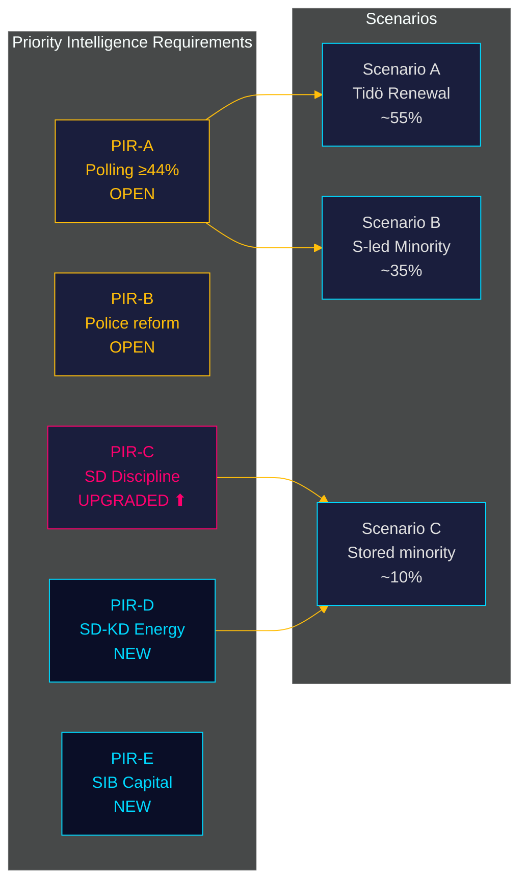

# Intelligence Assessment — Monthly Review 2026-04-27

**Author**: James Pether Sörling | **Issuing officer**: Pether Sörling, Analyst-of-record
**Date**: 2026-04-27 | **Sourcing**: A1–C3 Admiralty range
**Standards**: ICD 203 (Analytic Standards) compliance asserted

## Bottom Line Up Front

Sweden is 139 days from the 2026-09-13 election. The Tidö coalition has completed its 2025/26 legislative programme while revealing an unprecedented intra-coalition fault line (SD vs KD on energy). The political landscape has fully transitioned from legislation to implementation risk, accountability pressure, and election-narrative positioning.

## Key Judgments

### Key Judgment KJ-1 — Full legislative portfolio committed with intra-coalition fault line exposed

**We assess with HIGH confidence** that the Tidö coalition has committed its declared 2025/26 legislative portfolio. **We assess with HIGH confidence** that HD10448 (SD-KD energy interpellation) represents the first publicly documented intra-coalition fault line in riksmöte 2025/26 with electoral campaign implications.

- **Evidence**: HD01JuU10, HD01JuU31, HD01SoU25, HD01CU24 (committee reports); HD03252, HD03253, HD03256, HD03104 (propositions); HD10448 Fransson-Busch interpellation [riksdagen.se]
- **Confidence**: **HIGH** (A1) — multi-source, internally consistent
- **WEP**: "We assess it is highly likely the SD-KD energy tension will surface in campaign communications by June 2026."
- **Admiralty**: A1
- **PIR**: PIR-D (Does SD maintain coalition discipline through pre-campaign window ~2026-08-15?)

### Key Judgment KJ-2 — Implementation risk is the dominant operational variable with three open gates

**We assess with HIGH confidence** that three implementation gates represent meaningful delivery risk: (1) HD01JuU31 Polismyndigheten — 9 open RiR 2026:6 recommendations with no confirmed closure timeline; (2) HD03253 EU Banking Package — compliance infrastructure for Swedish SIBs must be operational by transposition deadline; (3) HD01SoU25 eldercare director appointment by 2026-06-30.

- **Evidence**: HD01JuU31 [riksdagen.se]; HD03253 [riksdagen.se]; HD01SoU25 [riksdagen.se]; Statskontoret: none found for these specific risks in the 30-day window
- **Confidence**: **HIGH** for bottleneck identification (A1); **MEDIUM** for delivery timeline estimates (B2)
- **PIR**: PIR-B (Will the 9 open Polismyndigheten recommendations from RiR 2026:6 be closed before the 2026-09-13 election?)

### Key Judgment KJ-3 — S electoral escalation will not produce legislative reversals; framing risk for Tidö is real

**We assess with HIGH confidence** that S/V/MP cannot produce legislative reversals in the 139-day window. **We assess with MEDIUM confidence** that the coordinated S accountability campaign (HD10447–10450 + 29 motions) will sustain media traction through June.

- **Evidence**: SD 19+ day zero-counter-motion streak; HD01FiU48 supermajoritet vote; S five-interpellation-in-one-week pattern; 29 opposition motions in April [riksdagen.se]
- **Confidence**: **HIGH** for no legislative reversal (A1); **MEDIUM** for media traction (B3)
- **PIR**: PIR-C (Does S accountability narrative shift pre-election polling by > 2pp?)

### Key Judgment KJ-4 — EU Banking Package creates medium-term systemic financial-sector exposure

**We assess with MEDIUM confidence** that the 72.5% output floor in HD03253 will require capital management adjustments at one or more Swedish SIBs within 18 months. **We assess with LOW confidence** on which institution will first announce adjustment measures.

- **Evidence**: HD03253 [riksdagen.se]; IMF WEO Apr-2026 GGXWDG_NGDP ~31% (macro context favourable for SIB adjustment); Finansinspektionen supervisory continuity maintained
- **Confidence**: **MEDIUM** (B2) for systemic exposure; **LOW** (C3) for specific institution timing
- **PIR**: PIR-E (Which Swedish SIB first publicly announces capital adjustment in response to CRR3 output floor?)

### Key Judgment KJ-5 — Sweden's pre-election fiscal position is structurally sound but politically exposed

**We assess with HIGH confidence** that Sweden's macroeconomic fundamentals provide the Tidö coalition with an electoral asset: GDP growth +2.1%, government debt ~31% GDP, current account surplus +5.5% (IMF WEO Apr-2026). **We assess with MEDIUM confidence** that this structural advantage will not translate automatically to polling lift without active electoral communication.

- **Evidence**: IMF WEO Apr-2026 (NGDP_RPCH=+2.1%, GGXWDG_NGDP~31%, BCA_NGDPD=+5.5%) [data.imf.org]; HD03104 debt management evaluation confirming 3/5 years within mandate; HD01FiU48 fiscal stimulus
- **Confidence**: **HIGH** (A1) for factual macro picture; **MEDIUM** (B3) for electoral translation
- **PIR**: PIR-A (Does Demoskop ≥ 44% for M+KD+L+SD by 2026-07-01?)

## Prior-Cycle PIR Status

| PIR | Statement | Prior status | Current status | Evidence this cycle |
|-----|-----------|--------------|----------------|---------------------|
| PIR-A | Demoskop ≥ 44% M+KD+L+SD by 2026-07-01 | OPEN | OPEN — next reading ~2026-05-08 | No new polling data |
| PIR-B | 9 open Polismyndigheten recommendations closed by election | OPEN | OPEN — no closure timeline confirmed | HD01JuU31 unchanged |
| PIR-C | SD discipline survives manifesto launch ~2026-08-15 | OPEN | UPGRADED — HD10448 raises pre-campaign tension | New: intra-coalition fault line |
| PIR-D | SD-KD energy tension surfaces in campaign | NEW THIS CYCLE | OPEN | HD10448 first public signal |
| PIR-E | Which SIB first adjusts capital for CRR3 output floor | NEW THIS CYCLE | OPEN | HD03253 filed |

## Carried-Forward Open PIRs

- **PIR-A**: Demoskop polling — monitor continuously; decisive for Scenario A vs B.
- **PIR-B**: Polismyndigheten — 9 open recommendations; track JuU chamber vote May 2026.
- **PIR-C**: SD discipline post-manifesto — elevated this cycle due to HD10448.
- **PIR-D** (new): SD-KD energy fault line — first public manifestation; monitor SD congress and manifesto energy chapter.
- **PIR-E** (new): EU Banking Package capital adjustments — 18-month monitoring horizon.

---
## Pass 2 Addition — PIR-D Escalation Path Elaborated

**PIR-D Escalation Path (detailed)**:

1. **Current state (April 27)**: HD10448 filed — SD documents position, KD must respond.
2. **Near-term (May 15–20)**: SD congress. If energy platform is ambiguous: Scenario A holds. If energy platform explicitly opposes wind expansion: PIR-D escalates to CRITICAL-BREACH.
3. **Mid-term (June 7)**: KD congress. Busch's response defines KD's red line.
4. **Decision point**: If SD congress and KD congress platforms are incompatible, the coalition must either (a) negotiate an explicit energy carve-out in the Tidö agreement or (b) accept a managed disagreement.
5. **Election-period risk (August)**: If HD10448 remains unresolved, campaign messaging will expose the fault line publicly. Media frame "coalition cracks" (see media-framing-analysis.md) will dominate.

**Confidence assessment for escalation path**: B2 (usually reliable, probably true). The specific congress dates are confirmed; the platform content is speculative.

**Intelligence gap**: No SD internal documents are available. PIR-D confidence can only be raised to A2 after congress outcome is known.
