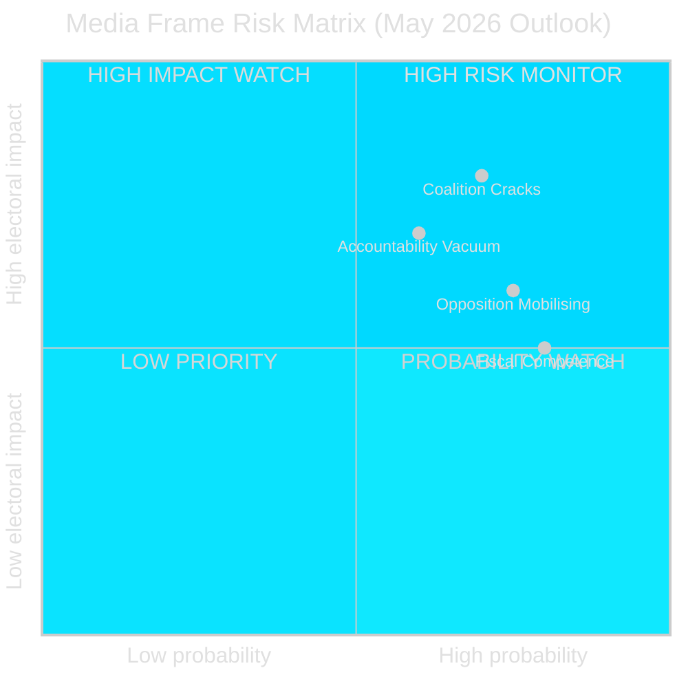

# Media Framing Analysis — Monthly Review 2026-04-27

**Author**: James Pether Sörling | **Date**: 2026-04-27

## Anticipated Dominant Frames

Based on the April 2026 parliamentary record, the following media frames are expected to dominate Swedish political coverage through May 2026:

## Frame 1 — "Coalition Cracks" (SD-KD Energy)

**Trigger event**: HD10448 [riksdagen.se] — Fransson (SD) interpellation to Busch (KD) on wind power policy
**Anticipated outlets**: Expressen, Aftonbladet (tabloid accountability), Dagens Nyheter (analytical), SVT News (neutral)
**Frame content**: Framing of internal coalition disagreement as "first crack in Tidö." SD described as prioritising voter base over coalition discipline. KD described as defending energy transition portfolio.
**Frame bias risk**: Amplification bias — media have structural incentive to frame minor interpellations as major ruptures for audience engagement.
**Intelligence note**: The interpellation record alone is insufficient to support a "crack" frame; would require additional evidence (party congress resolution, cabinet disagreement, minister statement).

## Frame 2 — "Fiscal Competence" (FiU48 + HD03253)

**Trigger events**: HD01FiU48 fuel-tax cut, HD03253 EU Banking Package
**Anticipated outlets**: Dagens Industri, SVD Näringsliv
**Frame content**: Government as economically responsible actor implementing EU regulation on schedule (HD03253) while providing household relief (HD01FiU48). IMF WEO Apr-2026 Sweden +2.1% GDP growth likely cited.
**Frame bias risk**: Business press has structural positive bias toward EU banking regulation compliance.

## Frame 3 — "Accountability Vacuum" (Police Reform)

**Trigger event**: HD01JuU31 [riksdagen.se] — Riksrevisionen audit 9 open recommendations
**Anticipated outlets**: Aftonbladet, SVT Nyheter, opposition press coverage of S interpellations
**Frame content**: 9 unanswered Riksrevisionen recommendations framed as government neglect of public safety obligations.
**Frame bias risk**: Opposition-aligned framing; governing coalition will counter with "ongoing implementation" narrative.

## Frame 4 — "Opposition Mobilising" (S Campaign)

**Trigger events**: HD10447–HD10450 five-interpellation cluster [riksdagen.se]
**Anticipated outlets**: Aftonbladet, Expressen, local/regional press
**Frame content**: S presented as building a "shadow government accountability dossier" ahead of September election.
**Intelligence implication**: If this frame takes hold, it elevates S's competence signal as well as its accountability narrative.

## Framing Risk Matrix

## Counter-Narrative Intelligence

Governing coalition's most credible counter-narrative: "Legislative completion" — by April 27, the government has delivered HD03253 (EU compliance), HD01FiU48 (household relief), HD01JuU10 (security), HD01SoU25 (eldercare). This "delivery over disruption" counter-frame directly challenges both the "coalition cracks" and "accountability vacuum" frames.
