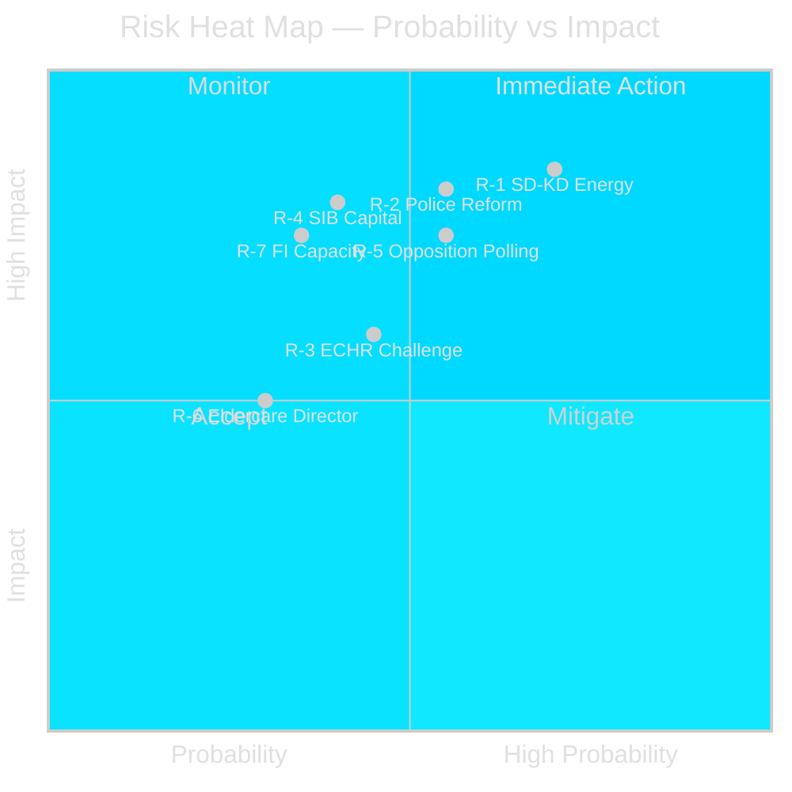

# Risk Assessment — Monthly Review 2026-04-27

**Author**: James Pether Sörling | **Date**: 2026-04-27
**Method**: STRIDE-aligned political risk, Admiralty coded

## Risk Register

| Risk ID | Description | Probability | Impact | Risk Score | Evidence | Admiralty |
|---------|-------------|-------------|--------|------------|----------|-----------|
| R-1 | SD-KD energy fault line escalates to campaign break | HIGH | HIGH | 8/10 | HD10448 [riksdagen.se] — first intra-coalition energy interpellation | B2 |
| R-2 | Polismyndigheten 9 open recommendations become election liability | MEDIUM | HIGH | 7/10 | HD01JuU31 [riksdagen.se] — RiR 2026:6, no closure timeline confirmed | A2 |
| R-3 | ECHR Art. 8 challenge blocks HD03252 implementation | MEDIUM | MEDIUM | 5/10 | HD03252 [riksdagen.se] — ECHR proportionality challenge anticipated | B2 |
| R-4 | Swedish SIB capital stress from CRR3 output floor | LOW-MEDIUM | HIGH | 6/10 | HD03253 [riksdagen.se]; IMF WEO Apr-2026 macro context | B2 |
| R-5 | S framing campaign shifts pre-election polling > 2pp | MEDIUM | HIGH | 6/10 | HD10447–HD10450 [riksdagen.se]; 29 opposition motions | B3 |
| R-6 | HD01SoU25 eldercare director appointment delayed | LOW | MEDIUM | 4/10 | HD01SoU25 [riksdagen.se] — appointment required by 2026-06-30 | C3 |
| R-7 | EU Banking Package compliance infrastructure underdelivered | LOW | HIGH | 5/10 | HD03253 [riksdagen.se]; Finansinspektionen coordination with EBA required | C3 |

## Institutional Risk (Implementation)

**Polismyndigheten** (R-2): HD01JuU31 [riksdagen.se] identifies 9 open Riksrevisionen recommendations from RiR 2026:6 with no public closure timeline. The institution is the government's flagship security-reform vehicle. Failure to close before election creates a direct narrative vulnerability. **Statskontoret relevance**: none found for this specific risk in the 30-day window.

**Finansinspektionen** (R-4/R-7): HD03253 [riksdagen.se] requires Finansinspektionen to coordinate with the EBA under the new CRD6 framework. Capacity for expanded international coordination is the key risk. **Statskontoret relevance**: none found for this specific risk in the 30-day window.

## Risk Heat Map

