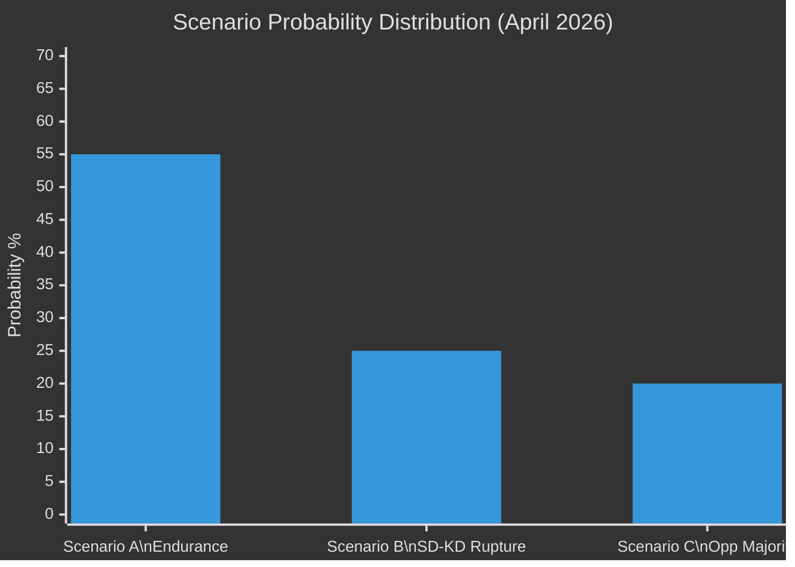

# Scenario Analysis — Monthly Review 2026-04-27

**Author**: James Pether Sörling | **Date**: 2026-04-27

## Scenario Framework

Base window: 2026-04-27 → 2026-09-13 (election day). Days remaining: 139.

## Scenario A — Coalition Endurance (Probability: 55%)

**Narrative**: Tidö coalition holds through to election. SD-KD energy tensions (HD10448) are managed diplomatically. Police reform audit (HD01JuU31) produces no new embarrassments. Fiscal consolidation track (HD01FiU48, HD03104) is politically marketed as competence.

**Preconditions**:
- SD party congress adopts a sufficiently ambiguous energy chapter (neither endorsing nor rejecting wind fully)
- Riksrevisionen makes no new adverse rulings on police performance
- Global markets remain stable (IMF WEO Apr-2026: SWE GDP +2.1% holds)

**Outcome**: M-led bloc enters election in a position to seek a second term. Current polls suggest ~48% bloc support.

**Key indicators to watch**: SD congress energy resolution text (June 2026); Riksrevisionen follow-up RiR 2026:6

## Scenario B — SD-KD Rupture (Probability: 25%)

**Narrative**: HD10448 escalates. SD formally tables an energy policy amendment incompatible with KD's green-transition position. Coalition negotiations on the 2027 budget framework break down. Government loses a confidence vote or calls a snap election.

**Preconditions**:
- SD congress adopts explicit anti-wind resolution
- KD refuses to dilute energy transition target in 2027 budget framework
- V or S successfully sponsors a motion-of-censure framing

**Outcome**: Early election autumn 2026 (before September 13). S + MP + C + L majority government possible in a non-SD parliament configuration.

**Key indicators**: SD energy platform draft leak (May 2026); coalition working group minutes; PM Kristersson press statements

## Scenario C — Opposition Structural Majority (Probability: 20%)

**Narrative**: Current polling understates S + V + MP recovery. C continues drifting from coalition. September 13 produces a left-green structural majority without coalition rupture triggering an early election.

**Preconditions**:
- S holds 30%+ sustained
- C drops below parliamentary threshold or swings left on bloc
- SD voter mobilisation underperforms 2022

**Outcome**: S-led government (S + MP + possibly C minority-support). New energy framework, police reform renewed, HD03252 prisoner-benefits revisited.

**Key indicators**: C party congress (June); S campaign poll tracking; SD mobilisation numbers

## Scenario Implications Matrix

| Dimension | Scenario A | Scenario B | Scenario C |
|-----------|------------|------------|------------|
| Energy policy | No change 2026 | Emergency framework | Green acceleration |
| Police reform | Incremental | Uncertain | Renewed mandate |
| Banking (HD03253) | Stable implementation | Uncertainty | Stable |
| Fiscal | Consolidation | Disruption | Expansion |
| SIB capital req. | On schedule | Delay risk | On schedule |
