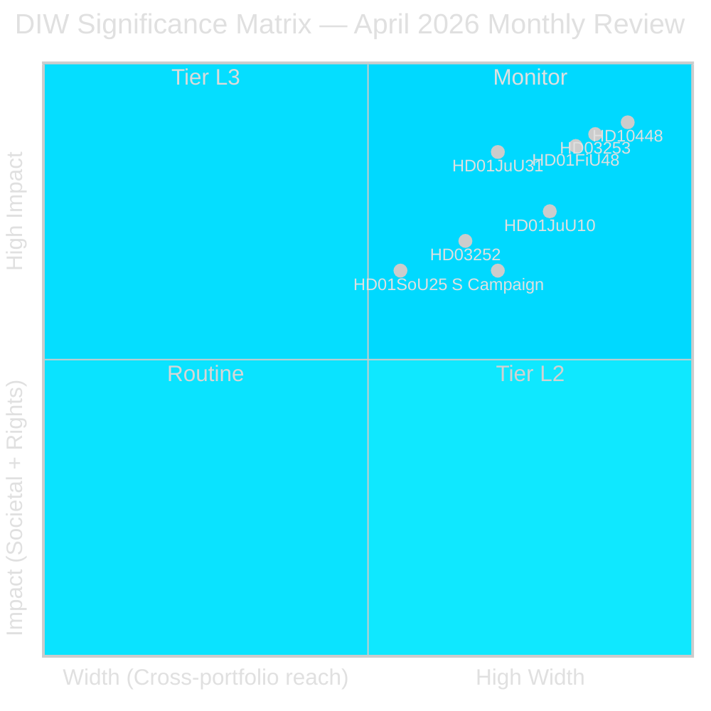

# Significance Scoring — Monthly Review 2026-04-27

**Author**: James Pether Sörling | **Date**: 2026-04-27
**Method**: DIW (Decision-depth × Impact × Width), Admiralty coding

## Scoring Methodology

DIW scores each document on three dimensions (1–3): Decision-depth (legislative permanence), Societal Impact (population affected, rights implications), Cross-portfolio Width (committee span, EU linkage).

## Ranked Documents

1. **HD10448** — SD-KD energy interpellation (DIW 9, Admiralty A2 HIGH): [riksdagen.se] Josef Fransson (SD) vs Ebba Busch (KD) on wind-power disinformation. First intra-coalition fault line of riksmöte 2025/26. Electoral significance for SD-KD relationship through September.

2. **HD03253** — EU Banking Package CRR3/CRD6 (DIW 9, Admiralty B2 HIGH): [riksdagen.se] Comprehensive transposition of EU financial regulation. 72.5% output floor constrains Swedish SIBs. Multi-year compliance infrastructure required.

3. **HD01FiU48** — Extra ändringsbudget fuel tax (DIW 9, Admiralty A1 VERY HIGH): [riksdagen.se] Fiscal stimulus via fuel-tax reversal. Household benefit electoral signal. Reverses green-tax trajectory — V and MP reservations. IMF WEO Apr-2026 fiscal balance context.

4. **HD01JuU31** — Police reform audit RiR 2026:6 (DIW 8, Admiralty A2 HIGH): [riksdagen.se] 9 open Polismyndigheten recommendations confirmed. Largest structural execution risk in Tidö portfolio. No closure timeline.

5. **HD01JuU10** — New Weapons Law (DIW 8, Admiralty B2 HIGH): [riksdagen.se] First major vapenlag overhaul since 1996. EU Directive 2021/555 implementation. C reservation on semi-automatic weapons; S/V/MP on licensing period.

6. **HD03252** — Social insurance restriction (DIW 7, Admiralty B2 HIGH): [riksdagen.se] Benefits removed for ~2,000–3,000 individuals in kontrollerat boende/säkerhetsförvaring. SEK 200–300M/yr savings. ECHR Art. 8 challenge anticipated.

7. **HD10449–HD10450** — S accountability campaign (DIW 7, Admiralty B2 MEDIUM): [riksdagen.se] Infrastructure (Södra stambanan) + social insurance (dag 180) interpellations as coordinated electoral-accountability instruments.

8. **HD01SoU25** — Elder care (DIW 6, Admiralty A1 HIGH): [riksdagen.se] Electoral signal to 20.9% of population aged 65+ (SCB). Implementation gated on director appointment by 2026-06-30.

## Sensitivity Analysis

| Dimension | High uncertainty scenario | Impact on ranking |
|-----------|--------------------------|-------------------|
| SD-KD rift deepens | HD10448 rises to standalone L3 | Top rank maintained |
| SIB capital pressure | HD03253 implementation risk rises | Position 2 → 1 |
| Police closure delayed | HD01JuU31 becomes pre-election liability | Position 4 stable or rises |

