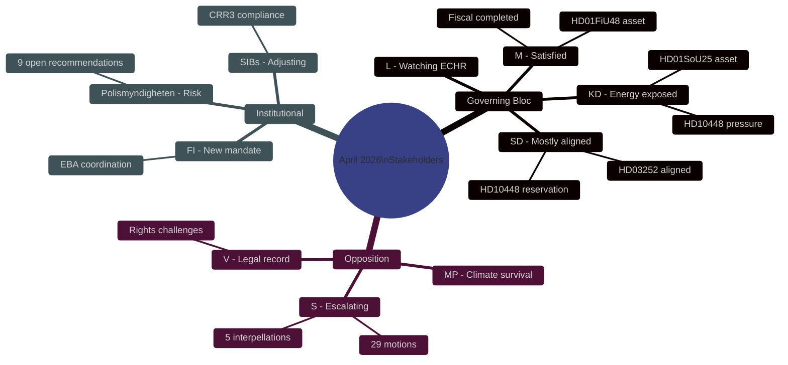

# Stakeholder Perspectives — Monthly Review 2026-04-27

**Author**: James Pether Sörling | **Date**: 2026-04-27

## Governing Coalition

### Moderaterna (M)
**Position**: Primarily satisfied — legislative portfolio completed, fiscal position strong.
**Interest**: HD01FiU48 (fuel-tax) as campaign asset for suburban and rural voters. HD01SoU25 eldercare as M-KD joint signal. HD03104 debt management as fiscal competence narrative.
**Evidence**: HD01FiU48, HD01SoU25 [riksdagen.se]; IMF WEO Apr-2026 macro indicators
**Risk exposure**: Police reform gap (HD01JuU31) creates accountability surface.

### Sverigedemokraterna (SD)
**Position**: Mostly aligned but exposing energy policy reservation via HD10448.
**Interest**: HD10448 [riksdagen.se] — Fransson documents SD's wind-energy skepticism for the campaign record without formally breaking coalition discipline. HD03252 (prisoner benefits restriction) aligns with SD core electorate.
**Tension**: Energy policy (coal/gas vs wind) with KD; coalition discipline vs voter-base differentiation.

### Kristdemokraterna (KD)
**Position**: Vulnerable on energy — HD10448 puts Busch in an uncomfortable position between coalition loyalty and policy defense.
**Interest**: HD01SoU25 eldercare as KD core signal. Energy policy modernisation (Busch's agenda) under SD pressure.
**Evidence**: HD10448, HD01SoU25 [riksdagen.se]

### Liberalerna (L)
**Position**: Aligned on security (HD01JuU10) and fiscal (HD01FiU48). Watching HD03252 ECHR risk.
**Interest**: HD01JuU10 weapons law balancing rights and security — L traditionally cautious on ECHR margins.

## Opposition

### Socialdemokraterna (S)
**Position**: Escalating accountability campaign transitioning from policy opposition to electoral mobilisation.
**Strategy**: Five-interpellation-in-one-week pattern (HD10447–10450) documents failures across four ministries. 29 motions create policy-alternatives archive for the campaign.
**Evidence**: HD10447–HD10450 [riksdagen.se]; 29 motions archive [riksdagen.se]

### Vänsterpartiet (V)
**Position**: Rights-based legal opposition — creating a judicial record, not expecting parliamentary wins.
**Strategy**: HD024090 (EU law challenge to deportation); HD024092 (fuel-tax opposition); motion cluster of 11+ documents [riksdagen.se]
**Evidence**: HD024090, HD024092 [riksdagen.se]

### Miljöpartiet (MP)
**Position**: Climate differentiation as electoral survival strategy.
**Strategy**: HD024086, HD024075 create climate-integrated policy alternatives in housing and environment.
**Evidence**: HD024086 [riksdagen.se]; HD01FiU48 reservations by V and MP

## Institutional Actors

### Polismyndigheten
**Status**: Under audit scrutiny — 9 open Riksrevisionen recommendations from RiR 2026:6 (HD01JuU31 [riksdagen.se]).
**Implementation risk**: No confirmed closure timeline creates ongoing political liability for the government.

### Finansinspektionen
**Status**: New coordination mandate under CRD6 (HD03253 [riksdagen.se]). EBA relationship becomes more complex post-Banking Package.

### Swedish SIBs (Swedbank, SEB, Handelsbanken, Nordea)
**Status**: Monitoring CRR3 output floor at 72.5% (HD03253 [riksdagen.se]). Capital management planning underway.

