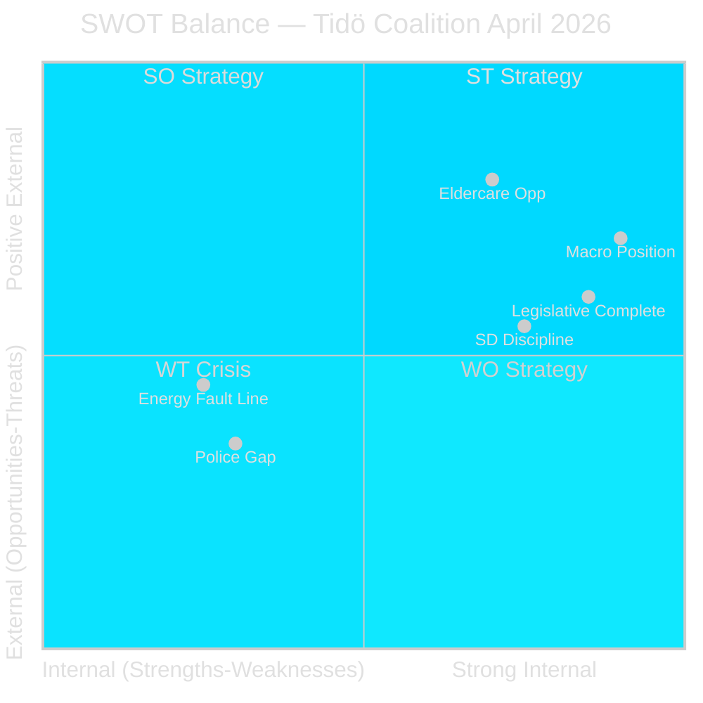

# SWOT Analysis — Monthly Review 2026-04-27

**Author**: James Pether Sörling | **Date**: 2026-04-27
**Method**: Political SWOT with TOWS matrix | **Scope**: 30-day window April 2026

## Strengths

| Factor | Evidence (dok_id / URL) | Admiralty |
|--------|------------------------|-----------|
| Strong macroeconomic position | IMF WEO Apr-2026: NGDP_RPCH +2.1%, GGXWDG_NGDP ~31% GDP, BCA_NGDPD +5.5% — structural strength entering election | A1 |
| Legislative portfolio complete | HD01JuU10, HD01JuU31, HD01SoU25, HD01FiU48 [riksdagen.se] — all declared 2025/26 deliverables committed | A1 |
| SD coalition discipline | 19+ consecutive sitting days zero counter-motions; HD01FiU48 passed with supermajoritet cooperation | A2 |
| Fiscal credibility | HD03104 [riksdagen.se] — debt management met targets in 3/5 years; Riksgälden risk-adjusted benchmarks maintained | A1 |
| Security reform delivered | HD01JuU10 [riksdagen.se] — 30-year weapons law modernisation; HD03252 [riksdagen.se] welfare-security coherence | B2 |

## Weaknesses

| Factor | Evidence (dok_id / URL) | Admiralty |
|--------|------------------------|-----------|
| Intra-coalition energy fault line | HD10448 [riksdagen.se] — SD's Fransson interpellates KD minister Busch; first public intra-coalition disagreement on energy | A1 |
| Police reform execution gap | HD01JuU31 [riksdagen.se] — 9 open Polismyndigheten recommendations from RiR 2026:6; no confirmed closure timeline | A1 |
| Environmental policy reversal | HD01FiU48 [riksdagen.se] — fuel-tax cut reverses green-tax trajectory; V/MP reservations document the inconsistency | A1 |
| HD03252 legal vulnerability | HD03252 [riksdagen.se] — ECHR Art. 8 proportionality challenge anticipated; Lagrådet review decisive | B2 |
| EU Banking compliance burden | HD03253 [riksdagen.se] — major infrastructure required at Finansinspektionen and Swedish SIBs for output-floor compliance | B2 |

## Opportunities

| Factor | Evidence (dok_id / URL) | Admiralty |
|--------|------------------------|-----------|
| Electoral advantage from fiscal position | IMF WEO Apr-2026 [data.imf.org]; HD01FiU48 fuel-tax relief as campaign asset; GDP +2.1% narrative | B2 |
| HD01SoU25 eldercare as demographic win | HD01SoU25 [riksdagen.se] — 20.9% population 65+ (SCB); eldercare strengthening as M-KD electoral signal | B2 |
| HD03253 banking reform as competence signal | HD03253 [riksdagen.se] — EU Banking Package transposition as pro-European, competent-governance narrative | C3 |
| Opposition overreach risk | S five-interpellation week may be perceived as electoral opportunism rather than policy substance | C3 |

## Threats

| Factor | Evidence (dok_id / URL) | Admiralty |
|--------|------------------------|-----------|
| SD-KD energy rift escalation | HD10448 [riksdagen.se] — if energy becomes a campaign issue, the rift could fragment coalition base | B2 |
| Police reform failure pre-election | HD01JuU31 [riksdagen.se] — RiR 2026:6 9 open recommendations becoming visible electoral liability | B2 |
| Opposition framing traction | HD10447–HD10450 [riksdagen.se] coordinated S accountability campaign; 29 motions as policy-alternatives archive | B3 |
| Macroeconomic external shock | IMF WEO Apr-2026 [data.imf.org] — Sweden's current account +5.5% exposes to global trade disruption if external conditions deteriorate | C3 |

## TOWS Matrix

| | S (Strengths) | W (Weaknesses) |
|---|---|---|
| **O (Opportunities)** | **SO**: Use strong GDP/fiscal position to anchor electoral message; leverage HD01SoU25 eldercare as M-KD signal | **WO**: Address Polismyndigheten execution gap before summer; neutralise HD10448 by clarifying coalition energy policy position |
| **T (Threats)** | **ST**: Pre-empt SD-KD rift escalation with joint energy-policy communication before July; use fiscal strength to absorb policy adjustment | **WT**: Emergency scenario: if HD01JuU31 becomes campaign liability + SD defects on energy, coalition faces multi-front vulnerability |

