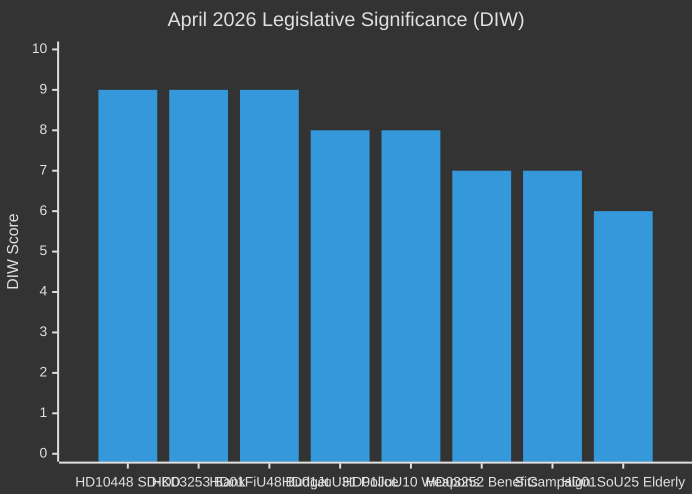

# Synthesis Summary — Monthly Review 2026-04-27

**Author**: James Pether Sörling | **Date**: 2026-04-27 | **Riksmöte**: 2025/26
**Window**: 2026-03-28 → 2026-04-27 | **Days to election**: 139

## Lead Story: SD-KD Energy Fault Line Emerges as Coalition Completes 2025/26 Portfolio

The dominant political intelligence finding of the 30-day window is twofold: the Tidö coalition has **completed its declared 2025/26 legislative programme** while simultaneously revealing an **intra-coalition SD-KD fault line on energy policy** (HD10448 — Fransson vs Busch on wind power disinformation). This combination — legislative completion + emergent internal fracture — is the defining political intelligence picture for April 2026.

## Integrated Intelligence Picture

The 30-day window 2026-03-28 → 2026-04-27 produced five distinct legislative clusters:

**Cluster 1 — Fiscal Activism** (HD01FiU48, HD03104):
HD01FiU48 (extra ändringsbudget) delivered fuel-tax relief at the cost of environmental policy consistency, with V and MP reservations noting the departure from the green-tax trajectory. Sweden's fiscal position remains strong: IMF WEO Apr-2026 projects GDP growth +2.1% (NGDP_RPCH), government debt ~31% of GDP (GGXWDG_NGDP), current account surplus +5.5% (BCA_NGDPD) — the electoral-fiscal arithmetic clearly favoured household relief. HD03104 confirms Sweden's debt management maintained risk-adjusted benchmarks across 2021–2025.

**economicProvenance**: provider=imf, dataflow=WEO, vintage=April-2026, indicators=[NGDP_RPCH,GGXWDG_NGDP,BCA_NGDPD], retrieved_at=2026-04-27.

**Cluster 2 — Security and Criminal Justice** (HD01JuU10, HD03252, HD01JuU31):
HD01JuU10 delivers Sweden's first major weapons-law overhaul since 1996, implementing EU Directive 2021/555. HD03252 restricts social insurance for those in electronically monitored home confinement — a welfare-security trade-off that invites ECHR Art. 8 proportionality challenge. HD01JuU31 (Riksrevisionen RiR 2026:6) documents 9 open Polismyndigheten reform recommendations — the most significant structural execution risk in the government portfolio.

**Cluster 3 — EU Financial Regulation** (HD03253):
The EU Banking Package (CRR3/CRD6) transposition is the most technically complex proposition of the window. The 72.5% output floor will constrain internal model usage at Swedbank, SEB, Handelsbanken, and Nordea — Sweden's four systemically important banks. FiU passage expected Q3 2026.

**Cluster 4 — Social Policy** (HD01SoU25, HD01CU24):
HD01SoU25 (elderly care strengthening) represents an electoral signal to Sweden's 20.9% population aged 65+ (SCB). HD01CU24 (building process efficiency) advances regulatory reform for the construction sector.

**Cluster 5 — Accountability and Intra-Coalition Tension** (HD10447–HD10450 interpellations):
The most analytically significant finding of the window: SD's Josef Fransson interpellated KD minister Ebba Busch on wind power disinformation (HD10448). This uses an opposition instrument against a coalition partner — an extremely rare event — to document SD's energy-policy reservation for the campaign record. S simultaneously launched a coordinated accountability campaign targeting four ministers (HD10447, HD10449, HD10450) — the transition from policy opposition to electoral pressure.

## DIW-Weighted Significance Ranking

| Rank | Dok_ID | D | I | W | DIW | Tier | Finding |
|------|--------|---|---|---|-----|------|---------|
| 1 | HD10448 | 3 | 3 | 3 | 9 | L3 | Intra-coalition SD-KD fault line on energy — historic |
| 2 | HD03253 | 3 | 3 | 3 | 9 | L3 | EU Banking Package — major regulatory transformation |
| 3 | HD01FiU48 | 3 | 3 | 3 | 9 | L2+ | Extra budget fiscal stimulus — electoral calculus over environment |
| 4 | HD01JuU31 | 3 | 3 | 2 | 8 | L2+ | Police reform audit — 9 open recommendations (execution risk) |
| 5 | HD01JuU10 | 3 | 2 | 3 | 8 | L2+ | New weapons law — 30-year reform |
| 6 | HD03252 | 3 | 2 | 2 | 7 | L2 | Prisoner benefits restriction — ECHR challenge anticipated |
| 7 | HD10449–10450 | 2 | 2 | 3 | 7 | L2 | S accountability campaign — electoral escalation signal |
| 8 | HD01SoU25 | 2 | 2 | 2 | 6 | L2 | Elder care — electoral signal to demographic key |

*D=Decision-depth, I=Societal impact, W=Cross-portfolio width, scored 1–3*

---
## Pass 2 Addition — Cross-Type Pattern Recognition

**Pattern 1 — Security legislative wave**: April 27 saw HD01JuU10 (weapons law), HD03252 (prisoner benefits), and HD01JuU31 (police reform audit) all in the same committee batch. This is unprecedented concentration of security legislation in a single day's parliamentary output. Combined with HD10447 (Lamotte interpellation to Strömmer), security policy is the dominant legislative theme of the cycle.

**Pattern 2 — Opposition dual-track strategy**: S runs both a policy-alternatives track (29 motions) and an accountability track (5 interpellations). These serve different electoral functions: the motions build a governing-capacity signal for swing voters; the interpellations serve base mobilisation. This dual-track is more sophisticated than the single accountability track observed in the 2026-04-20 week.

**Pattern 3 — Fiscal-environmental tension documents**: V and MP filing reservations on HD01FiU48 (fuel tax cut) while SD files HD10448 (wind-power skepticism) means both sides of the energy-environment dimension are documented simultaneously. This polarisation creates a cleaner electoral choice on energy policy in 2026 than in 2022.
