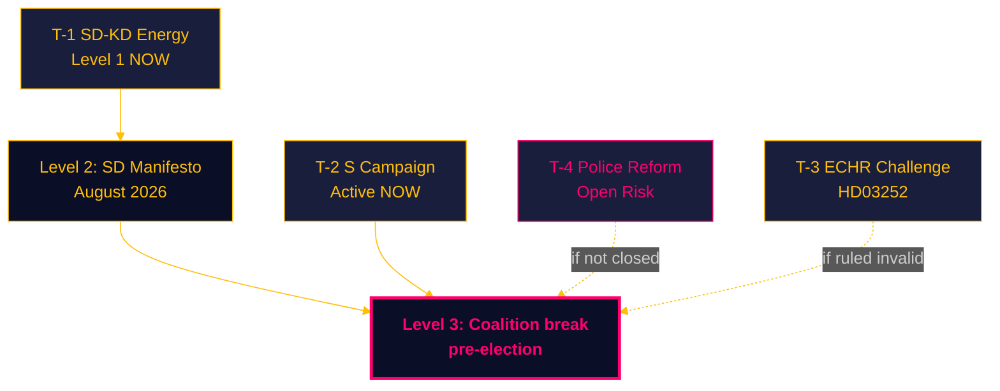

# Threat Analysis — Monthly Review 2026-04-27

**Author**: James Pether Sörling | **Date**: 2026-04-27
**Method**: STRIDE-P political threat framework

## Threat Register

| Threat | Actor | Vector | Severity | Evidence | Admiralty |
|--------|-------|--------|----------|----------|-----------|
| T-1 Intra-coalition defection | SD (Fransson) | Parliamentary interpellation vs KD | HIGH | HD10448 [riksdagen.se] | A2 |
| T-2 Accountability campaign | Social Democrats | Coordinated interpellation + motions | HIGH | HD10447-HD10450 [riksdagen.se]; 29 motions | A2 |
| T-3 Legal invalidation | Courts/ECHR | ECHR Art. 8 proportionality challenge | MEDIUM | HD03252 [riksdagen.se] | B2 |
| T-4 Implementation failure | Polismyndigheten (institutional) | Organisational bottleneck | HIGH | HD01JuU31 [riksdagen.se] RiR 2026:6 | A1 |
| T-5 Financial sector stress | Swedish SIBs | CRR3 capital floor adjustment | MEDIUM | HD03253 [riksdagen.se] | B2 |
| T-6 Opposition narrative dominance | V/MP | Rights-based legal record + climate differentiation | MEDIUM | 29 motions [riksdagen.se]; HD10448 energy framing | B3 |

## Critical Threat: T-1 — Intra-Coalition Defection (SD-KD Energy)

HD10448 [riksdagen.se] represents a structurally significant threat to Tidö coalition cohesion. Josef Fransson (SD) used an interpellation — an opposition instrument — to question KD minister Busch on wind energy, effectively placing SD's energy policy reservation on the parliamentary record. The threat escalation path:

1. **Level 1 (current)**: Parliamentary record created, ambiguous language allows both parties to maintain coalition position
2. **Level 2 (risk)**: SD manifesto (expected August 2026) includes explicit anti-wind energy language that contradicts KD energy policy
3. **Level 3 (high risk)**: Media coverage of SD-KD energy gap becomes campaign issue that forces explicit coalition renegotiation or voter defection

Red-team H1: HD10448 is routine — SD filed similar interpellations in 2022. Counter-evidence: 2022 interpellations were pre-coalition; HD10448 is intra-coalition, which is categorically different.

## Threat Escalation Matrix

