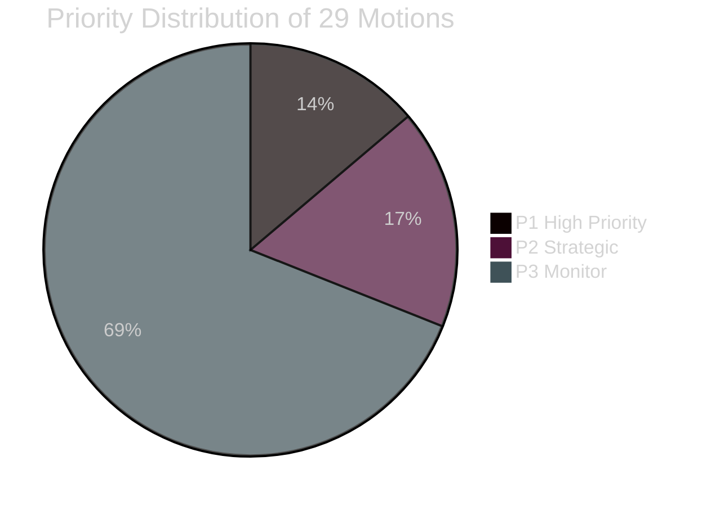

# Political Classification Results — Opposition Motions 2026-04-07/17

**Author**: James Pether Sörling  
**Method**: 7-dimension political classification

---

## Classification by Policy Domain

| dok_id | Policy Area | Ideological Position | Urgency | Scope | Controversy | Priority | Access |
|--------|------------|---------------------|---------|-------|-------------|----------|--------|
| HD024090 | Civil/Immigration law | Left-liberal (rights) | HIGH | National | HIGH | P1 | OPEN |
| HD024092 | Fiscal/Energy | Left-redistributive | HIGH | National | HIGH | P1 | OPEN |
| HD024082 | Fiscal | Left-redistributive | HIGH | National | HIGH | P1 | OPEN |
| HD024076 | Immigration/Asylum | Centre-left humanitarian | HIGH | National | HIGH | P1 | OPEN |
| HD024086 | Housing/Integration | Green-left | MEDIUM | National | HIGH | P2 | OPEN |
| HD024093 | Security/Cyber | Cross-party | MEDIUM | National | LOW | P2 | OPEN |
| HD024073 | Justice/Youth | Centre-left | MEDIUM | National | LOW | P2 | OPEN |
| HD024091 | Defence/Export | Cross-party | MEDIUM | National/EU | MEDIUM | P2 | OPEN |
| HD024078 | Civil/Victim Rights | Centre-left | LOW | National | LOW | P3 | OPEN |
| HD024081 | Health/Municipal | Centre-left | MEDIUM | National/Local | LOW | P3 | OPEN |

## GDPR Classification

All 29 motions are publicly filed parliamentary documents. Any named MPs cited represent public officials in their official capacity. GDPR Art. 9(2)(e) (publicly made political opinions) and 9(2)(g) (substantial public interest) apply. Data minimisation applied — no private personal data processed.

## Retention and Access

- **Retention**: Public parliamentary record (indefinite under Offentlighetsprincipen)
- **Access level**: OPEN — all source documents available on riksdagen.se
- **DPIA required**: No — public-source political analysis of publicly filed documents

## Priority Tiers

- **P1 (High Priority)**: HD024090, HD024082, HD024092, HD024076 — immediate committee deliberation, election-year salience, constitutional/legal challenges
- **P2 (Strategic)**: HD024086, HD024093, HD024073, HD024091, HD024098 — secondary policy significance
- **P3 (Monitor)**: Remaining 20 motions — surface-level tracking

style HD024090 fill:#ff006e,color:#fff
