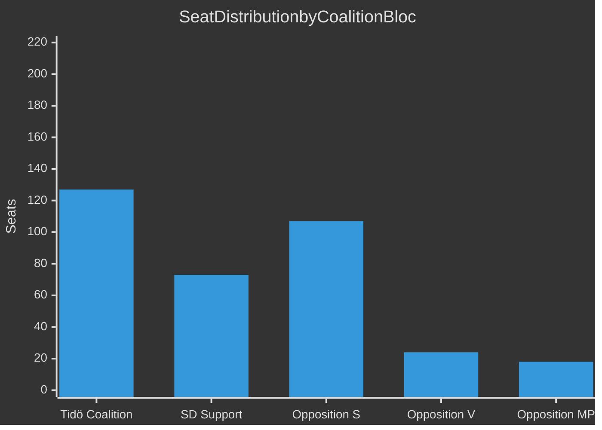

# Coalition Mathematics — Swedish Riksdag Spring 2026

**Author**: James Pether Sörling

---

## Current Seat Map (May 2026)

| Party | Seats | Coalition | Vote on Prop 235 (deportation) | Vote on Prop 236 (budget) |
|-------|-------|-----------|-------------------------------|--------------------------|
| S | 107 | Opposition | Nej (likely) | Nej |
| SD | 73 | Tidö support | Ja | Ja |
| M | 68 | Tidö coalition | Ja | Ja |
| C | 24 | Tidö coalition | Ja | Ja |
| V | 24 | Opposition | Nej (HD024090) | Nej (HD024092) |
| KD | 19 | Tidö coalition | Ja (possible reservation) | Ja |
| MP | 18 | Opposition | Nej (HD024086 aligned) | Nej |
| L | 16 | Tidö coalition | Ja | Ja |
| **Total** | **349** | | | |

## Pivotal Vote Analysis — Prop. 2025/26:235 (Deportation)

| Scenario | Ja | Nej | Outcome |
|----------|-----|-----|---------|
| Baseline (all coalition + SD) | 200 | 149 | Government wins |
| KD abstains (rule-of-law concern) | 181 | 149, 19 Avstår | Government wins |
| KD + L vote Nej | 165 | 165 | **TIE — casting vote** |
| S switches to Ja | 200+107=307 | 42 | Landslide |

## Sainte-Laguë Scenarios (Post-2026)

*If current polling is accurate*:
- Tidö bloc holds 49% → ~171 seats → minority government possible
- Red-Green bloc: 45% → ~157 seats — insufficient for majority alone
- SD remains largest single party → continues to dominate coalition negotiations

## Analysis Note

Opposition motions HD024090, HD024092 (riksdagen.se) cannot change these mathematics. Their significance is electoral and legal, not parliamentary.

style Tidö fill:#00d9ff,color:#000
